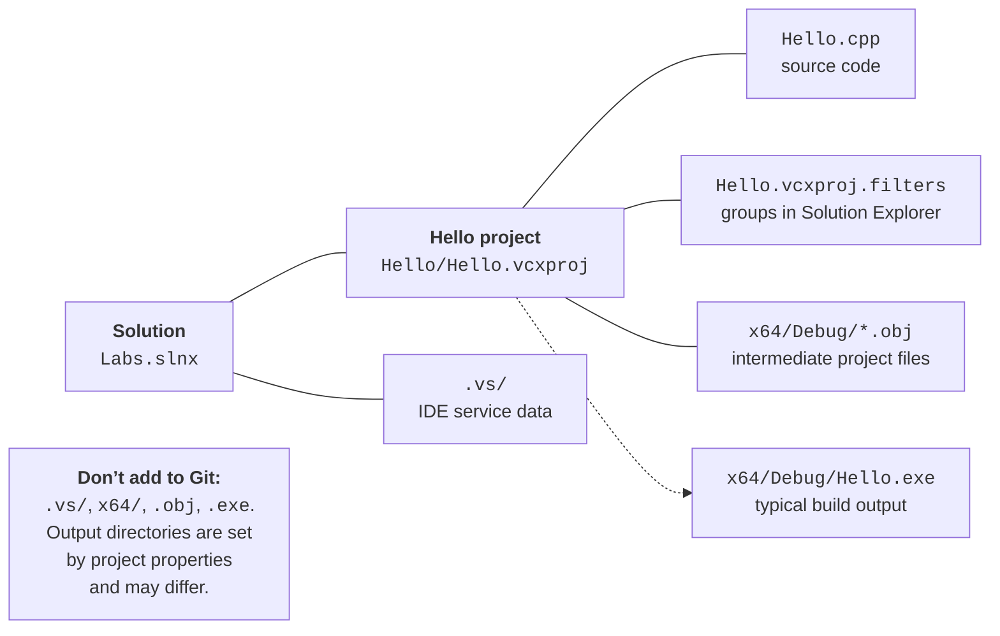
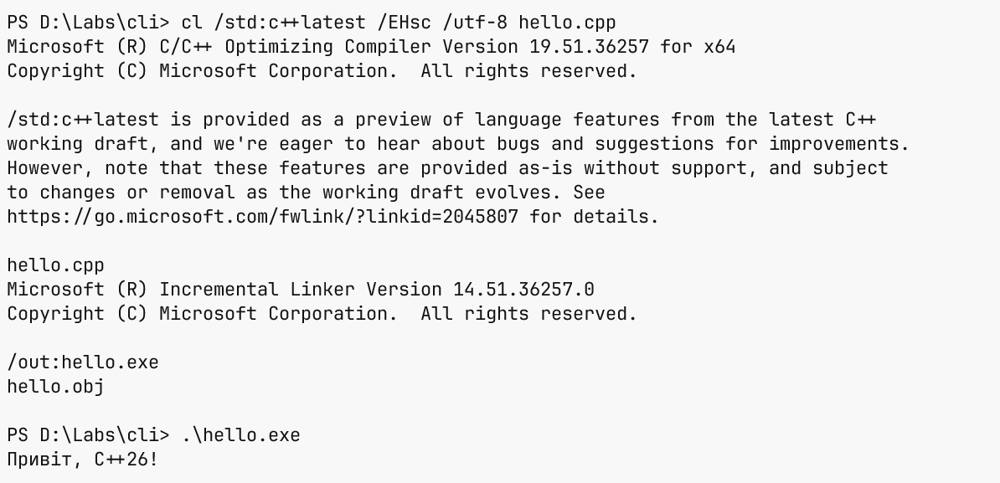

# Building and debugging

## Solution, project, and files on disk

A **solution** groups projects; a **project** defines the list of
source files and the rules for producing the result. For example, the `Labs` solution
can contain `Hello` and future lab projects. A solution has a `.slnx`
or `.sln` file, depending on the storage format. The `.vcxproj` file stores the settings
of a C++ project, and `.vcxproj.filters` stores the logical grouping of files in
*Solution Explorer*. The *Source Files* folder in the IDE is not necessarily a separate
folder on disk (Fig. 1.13).



Figure 1.13. The solution, source files, and generated files {.caption}

The `.vs` folder contains local IDE service data. Directories such as
`x64/Debug` and `x64/Release` contain build outputs; the exact paths are set by
the *Output Directory* and *Intermediate Directory* properties. An object file
`.obj` can be in a different folder than the finished `.exe`. Don’t move them manually
to “fix” the project: after the next build, the system will use the
configured directories again. Keep the source `.cpp` files, the project, and the solution in Git,
and ignore the generated outputs and `.vs`.

### Example 2. A business card with alignment

In this example, the data is set in the code; no keyboard input is needed.
Create a separate console project or replace the contents of the existing file.
Keep only one `main` function in a single executable project.

```cpp
#include <print>

int main()
{
    std::println("+------------------------------+");
    std::println("| {:<28} |", "Student: Olena Koval");
    std::println("| {:<28} |", "Group: KN-24");
    std::println("| {:<28} |", "Course: C++26");
    std::println("+------------------------------+");
    return 0;
}
```

`{}` is a placeholder for the next argument. After a colon, you can
specify formatting rules: `<` aligns to the left, and `28` sets the minimum
field width. The space before and after the field creates padding from the border. The width
doesn’t truncate longer text: if a name doesn’t fit, widen the border.
The output for the given data:

```text
+------------------------------+
| Student: Olena Koval         |
| Group: KN-24                 |
| Course: C++26                |
+------------------------------+
```

The number of fields and the argument types must match the format.
To print a curly brace itself, double it in the format string: <code v-pre></code>.
Use a monospace font for aligning tables. Complex Unicode
characters can have a special display width, so check what the border actually
looks like in the terminal rather than just counting UTF-8 bytes.

### Example 3. Room area and renovation cost

Suppose the room is 5 m long and 4 m wide, and finishing one
square meter costs 250 UAH. The program calculates the area, the perimeter, and the cost
of finishing the floor. The values are set in the code, so all runs with the same
data give the same result.

```cpp
#include <print>

int main()
{
    const double length = 5.0;
    const double width = 4.0;
    const double price = 250.0;
    const double area = length * width;
    const double perimeter = 2.0 * (length + width);
    const double total = area * price;

    std::println("Area: {:.2f} m²", area);
    std::println("Perimeter: {:.2f} m", perimeter);
    std::println("Cost: {:.2f} UAH", total);
    return 0;
}
```

`double` stores numbers with a fractional part; `const` prevents changing
the value after its initial assignment. The names `length`, `width`, and `price`
make the formula clearer than a set of numbers. The `*` operator means multiplication,
and parentheses set the order of evaluation. `{:.2f}` prints a number in fixed-point
format with two digits after the decimal point. This changes how the result is presented, not
the precision of all the preceding calculations.

```text
Area: 20.00 m²
Perimeter: 18.00 m
Cost: 5000.00 UAH
```

`double` is convenient for classroom geometry. For exact money accounting,
you need to define separately how amounts are represented and how they are rounded: most
decimal fractions can’t be represented exactly as a binary floating-point number.
The integer values given here don’t demonstrate all such errors. Changing the output
to three decimal places doesn’t by itself make a financial algorithm exact.

::: tip Self-check
Change the width to 3.5 m. First calculate the result by hand, then
rebuild the program. Explain which lines of the output should change.
If the output stays the same, check that the file was saved and look at the build log.
:::

## Errors, warnings, and debugging

A **compilation error** means the compiler can’t accept the program.
For example, writing `std::printn` instead of `std::println` contains an unknown
member name of the `std` namespace (typical diagnostic C2039). C2065 reports
an undeclared identifier, and C2143 reports a syntax error such as
a missing character. The line number often shows where the error was noticed,
not where its real cause is. A missing `;` can show up on the next line.


Figure 1.14. Compiler messages in the Error List window {.caption}

A **linker error** occurs after compilation. For example, a function
is declared and called, but its definition didn’t make it into the build. MSVC may
report LNK2019 (*unresolved external symbol*). Adding a semicolon
won’t solve the problem of a missing implementation. Check whether the required `.cpp`
belongs to the project, whether it is excluded from the build, and whether the name is spelled correctly.

A **warning** doesn’t always stop the build, but it points to
a possible defect. Don’t turn off `/W4` just to get an empty list:
read the message and fix the cause. **IntelliSense** hints while
you edit are useful, but the final evidence is the result of an actual
build. In *Error List*, you can select the *Build* source, and in *Output*,
you can view the full log, including the command and paths.

A practical order for fixing errors: save the file, run the build,
read the first meaningful error, open its line by double-clicking,
also check the preceding lines, make one clear change, and rebuild.
Dozens of messages are often the consequence of a single missing bracket. If the IDE
offers to run the last successful build after a failed build, decline:
its result doesn’t test the text you just changed.

A **logic error** doesn’t break the syntax but gives a wrong answer.
For example, `length + width` instead of `length * width` compiles fine
but doesn’t calculate the area. Set a breakpoint (**F9**) before the output of
Example 3, start with **F5**, and look at `area` in *Locals*. **F10** executes
the next line, **F5** continues, and **Shift+F5** stops debugging.
A manual calculation for simple data is an independent check of the formula.

## Building from the command line

The IDE hides many details, but it calls separate tools. **Developer
PowerShell for VS 2026** sets up environment variables so that
`cl.exe`, the linker, headers, and libraries can be found. Open it through the menu
*Tools → Command Line → Developer PowerShell* or the corresponding shortcut.
A regular PowerShell without this setup may not know the `cl` command.
Documentation: <https://learn.microsoft.com/cpp/build/building-on-the-command-line>.

### Example 4. The same program without an IDE project

Create the folder `D:\Labs\cli` and save in it the file `hello.cpp` with the complete
code of Example 1, including `#include <print>`. Go to this folder
and run the commands. The form with the header is used here;
`import std;` requires a separate module build, described in the documentation.

```powershell
Set-Location D:\Labs\cli
cl /std:c++latest /EHsc /utf-8 /W4 /permissive- hello.cpp
.\hello.exe
$LASTEXITCODE
```

`cl` without `/c` also performs linking. Switches start with `/`, and the last
argument is the source file. Running `.\hello.exe` means the file from the current
folder; PowerShell is not required to look for executables here without an explicit
prefix. After the compiler messages, the program output and the exit code:

```text
Hello, C++26!
0
```



Figure 1.15. Compiling and running in Developer PowerShell {.caption}

Check `$LASTEXITCODE` right after the external command you care about:
the next call may change the value. If `cl` failed,
don’t run the `hello.exe` left over from a previous build. For the lab
work, save the command in a README together with the compiler version shown
in its banner. Don’t copy someone else’s version number as the result of your own
check. The command line and the IDE must use consistent switches.
