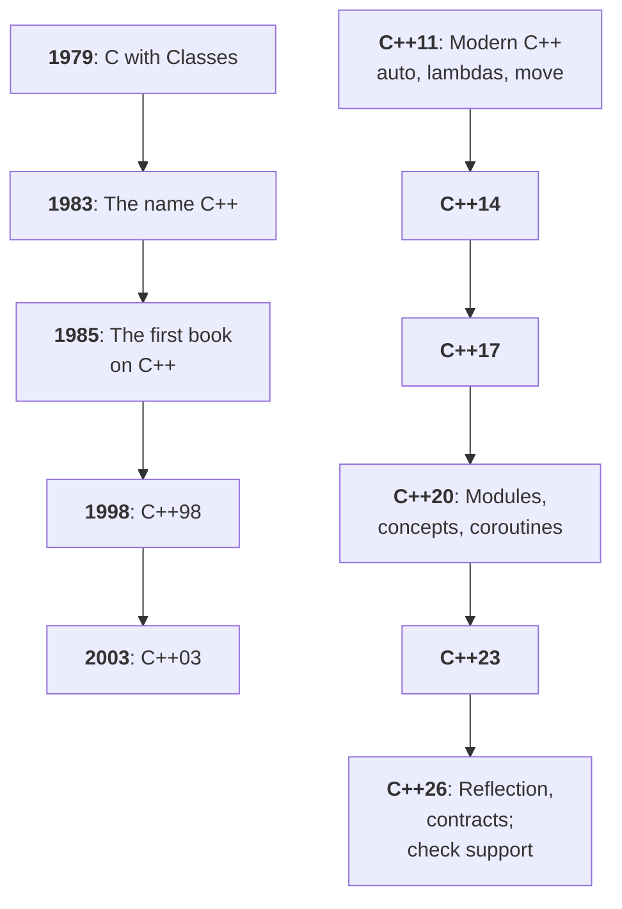
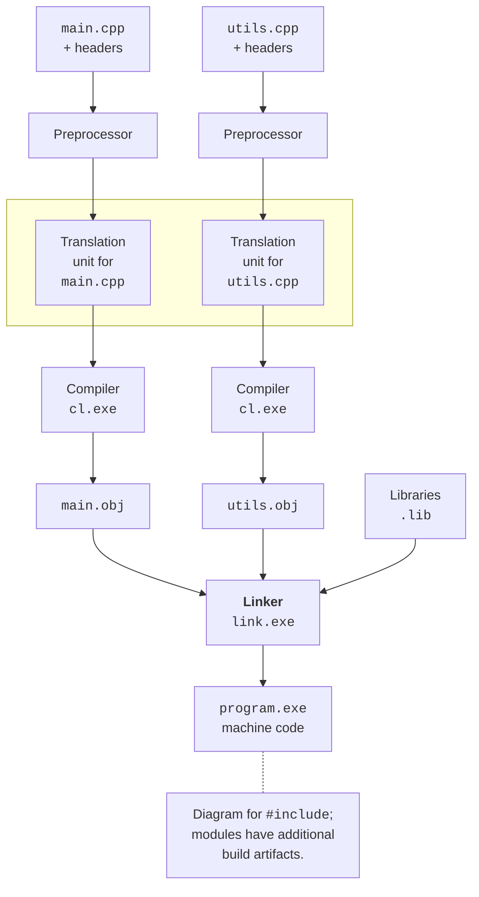

# The C++ language and its standards

## The C++ language: purpose and history

**C++** (pronounced “see plus plus”) is a general-purpose programming language
with static typing. A **type** defines which values an object can store and which
operations are allowed on it. The compiler checks a large part of these rules before
the program runs. For example, you can multiply a number by another number, but the
text name of a room is not a numeric length. Your code needs to express such
differences.

Bjarne Stroustrup started working on *C with Classes* in 1979. He combined
the ability to work close to the hardware, typical of C, with classes for describing
complex systems. The name C++ appeared in 1983; in 1985 the first
edition of the book *The C++ Programming Language* was published. The `++` sign in the
language means incrementing a value by one. The history and the author’s materials are
available at <https://www.stroustrup.com/>, and the evolution of the standards is shown in Fig. 1.1.

Figure 1.1. Milestones of C++ and its standards {.caption}

C++ supports several ways of organizing a program. **Procedural programming**
breaks a problem into functions; **object-oriented** programming combines data and operations
into classes; **generic** programming lets you write algorithms for different types. That is why
your first program can consist of just the `main` function: you don’t need to declare
your own class for every console example. The course moves on to classes after
you have mastered variables, functions, references, and memory management.

The language is used in system software, game engines,
embedded devices, image processing, and high-performance computing.
What these tasks have in common is the need to control memory and time costs. At the same time,
speed doesn’t come automatically from the choice of language: a poor algorithm stays slow.
Controlling resources takes discipline, checks, and the use of libraries.

Table 1.1. C++ compared with other languages {.caption}

| Language | A difference that matters at the start of learning |
| --- | --- |
| C | Shares its syntactic origins with C++, but is a separate language. Not every C program is a valid C++ program. |
| C++ | A regular build produces machine code for the chosen platform. Object lifetime and resource ownership are part of the design. |
| C# | Applications often run on .NET with a garbage collector; ahead-of-time compilation with Native AOT also exists. |
| Java | The typical path involves bytecode and the JVM; syntactic similarity doesn’t mean the same memory rules or libraries. |

Source code can be portable if it doesn’t depend on the specifics of the
operating system. A finished Windows `.exe` file does not become a Linux application
when you copy it: you need a suitable compiler, libraries, and a new build.
The same code can also reveal errors on another compiler if it
relied on a nonstandard extension. In this course, the main tested platform
is Windows 11, Visual Studio 2026, and MSVC for x64.

## Language standards and compiler support

A **standard** describes the rules of the language and the standard library. C++ is developed by
the ISO/IEC JTC1/SC22/WG21 committee. A standard is not a program that you install:
its rules are implemented by compilers and libraries. **MSVC** ships with
Microsoft tools; **GCC** and **Clang** are other implementations. Their version numbers
don’t match the year in the name of a C++ standard.

The first international standard was C++98; C++03 refined it. C++11 brought
a major update of the language, and subsequent editions appear roughly every three years.
Table 1.2 gives a brief overview. The name of a standard refers to an edition,
not to the earliest date when all its features appeared in every product.

Table 1.2. Editions of the C++ standard {.caption}

| Edition | Example features |
| --- | --- |
| C++98/03 | Classes, templates, standard library containers and algorithms. |
| C++11 | `auto`, lambda expressions, move semantics, smart pointers. |
| C++14/17 | Refinements of C++11, structured bindings, `std::optional`, filesystem paths. |
| C++20 | Concepts, ranges, coroutines, modules, `std::format`. |
| C++23 | `std::print`, `std::println`, `std::expected`, the `std` library module. |
| C++26 | The next edition; the availability of each feature is checked against the implementation and the specific compiler version. |

The course targets **C++26**, but this is not a promise that MSVC fully implements all of its
features. At the time of checking, the standardization status page
<https://isocpp.org/std/status> described C++26 as
an edition in progress; we don’t assume a final ISO publication date here.
Approval of the technical content, ISO publication, and the release of support in MSVC are
different events. In particular, `std::println` belongs to **C++23**, even though it is used
in our C++26 course. You don’t need to enable contracts or reflection for this topic.

The `/std:c++latest` switch selects newly implemented features, including features of
the draft of the next standard. After a tools update, the contents of this mode may
change. For reproducible work, record the Visual Studio version, the MSVC
number from the `cl` output, and the build options. Microsoft publishes the conformance
table here: <https://learn.microsoft.com/cpp/overview/visual-cpp-language-conformance>.

::: tip Standard and implementation
If the compiler doesn’t recognize a header or a construct, first check
the toolset version and the selected standard. Changing C++23 to C++26 in
a program’s message doesn’t add support for new features.
:::

## How source code becomes a program

A developer stores **source code** in a `.cpp` file. To
run it, the text must be turned into machine instructions. A **build**
consists of several stages that the IDE runs automatically (Fig. 1.2).
It is important to tell them apart: a message about an unknown name and one about a missing
function definition occur at different stages and have different causes.

Figure 1.2. From source files to an executable program {.caption}

1. The **preprocessor** processes directives such as
  `#include <print>`. Headers provide declarations and other required parts
  of a library. This is not downloading a file from the internet at run time.
1. The **compiler** analyzes the resulting text, checks types, and creates
  an object file `.obj`. One `.cpp` file with the contents of its included headers after
  preprocessing forms a **translation unit**.
1. The **linker** combines the object files and the required libraries,
  resolves references between them, and creates the executable file `.exe`.
1. The operating system loads the executable file, and the startup code of the runtime
  environment calls the `main` function.

A `.h` or `.hpp` file usually contains declarations that several
source files use. A header should not be treated as a separate program. For example,
two `.cpp` files can include a common header and be compiled separately,
after which their `.obj` files are combined. An error in one header can
cause diagnostics in several translation units at once.

A regular native C++ program doesn’t need a JVM or CLR to execute
machine code. However, it may need Windows dynamic libraries
and the Visual C++ Runtime. So “machine code” doesn’t mean “a single file with no
dependencies.” A Debug build is not used as a way to distribute
a finished product; the installation requirements of a Release program are checked separately.
