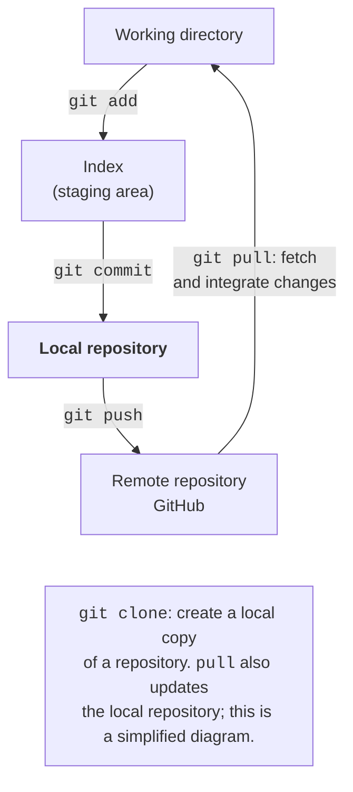
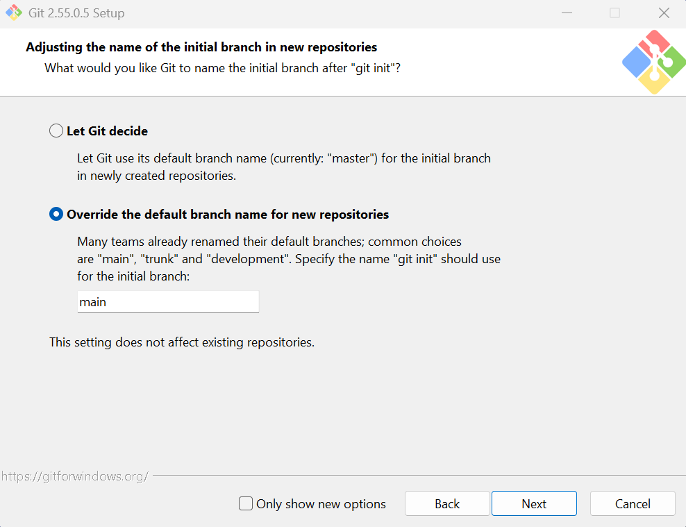
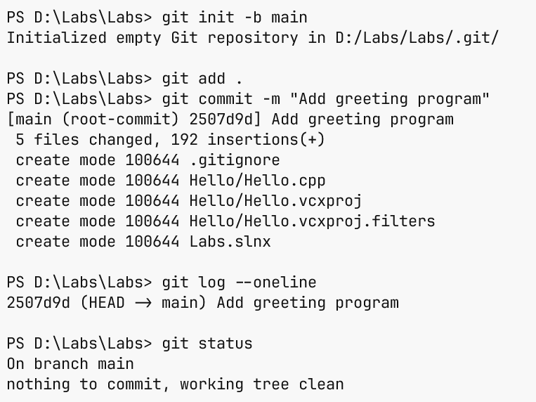

# Git version control

## Git version control

A **version control system** stores the history of changes. **Git**
(<https://git-scm.com/>) works with a local repository: you don’t need the internet to create
a commit. **GitHub** is a repository hosting service;
it is not another name for Git. A local history is enough to get started, and a remote
repository helps you hand in work and collaborate.

A **commit** stores the staged state of files and metadata: the author,
the message, and the link to the previous history. The **index** (*staging area*)
lets you choose changes for the next commit. Saving a file in the editor,
adding it to the index, and creating a commit are three separate actions
(Fig. 1.16). If you change a file after `git add`, you need to add it
again so that the new change is also included in the commit.



Figure 1.16. The working directory, the index, and Git repositories {.caption}

### Installation and initial setup

Download Git for Windows from <https://git-scm.com/downloads/win>.
The installer lets you choose the message editor and the initial branch name
(Fig. 1.17). In this course, we use `main`. After installation, open
a new terminal and run `git --version`. If the command is not found,
check the installation and `PATH` rather than changing your C++ source code.



Figure 1.17. Initial Git for Windows options {.caption}

Set the author’s name and email once. Replace the sample values shown
with your own or with the privacy address the service provides. They go
into the commit history; this is not a password or a way to sign in to GitHub.

```powershell
git config --global user.name "Student Name"
git config --global user.email "student@example.com"
git config --global init.defaultBranch main
```

`--global` applies the setting to the current user of the computer. On a shared
workstation, it makes sense to configure it inside the repository without `--global`
so that you don’t sign other people’s work with your name. You can check a specific
value with the `git config user.name` command.

### The .gitignore file and the first commit

In the solution root, create `.gitignore` before the first `git add`. For a simple
classroom solution, these rules are enough:

```text
.vs/
x64/
Debug/
Release/
*.obj
*.exe
*.pdb
*.ilk
*.user
```

The `.gitignore` file is also stored in Git. It defines which **untracked**
files are not offered for adding. If a file has already been committed, a new
rule doesn’t remove it from the history. The `.cpp`, `.h`, `.vcxproj`,
`.vcxproj.filters`, `.slnx`, or `.sln` files are required source materials.
For Example 4 with a standalone `.cpp`, the same rules will exclude the outputs of `cl`.

Go to the root of your solution, where `.gitignore` should be. Don’t create
a repository in every service subfolder. Run:

```powershell
git init -b main
git status
git add .
git diff --cached
git commit -m "Add greeting program"
git log --oneline
git status
```

`git status` shows the current state, `git add .` stages changes from the current folder,
and `git diff --cached` lets you review the staged difference before
committing. `git log --oneline` shows a compact history. A commit identifier
depends on its contents and metadata, so it doesn’t have to match someone else’s
screenshot. After a successful commit and with no new changes, Git reports
`nothing to commit, working tree clean`.



Figure 1.18. The first commit in the terminal {.caption}

Change the greeting text, save the file, and run `git diff`.
The command shows changes that are not yet staged. After checking them, add the file and
create a new commit with a meaningful message. One commit should correspond to
one clear change, for example “Add formatted student card”.
A message like “work” or “123” doesn’t help anyone understand the history.

### Working with Git in Visual Studio

For a new solution without a repository, select *Git → Create Git Repository…*
(Fig. 1.19), and check the local path and the Visual Studio ignore template.
You can create a local repository without publishing it. If you have already run
`git init` in this folder, open the existing repository rather than creating a nested one.
Publishing to GitHub is a separate decision of the user.


Figure 1.19. Creating a local repository in the IDE {.caption}

The *Git Changes* window shows the changed files and the message box
(Fig. 1.20). Review the difference before committing. The *Commit All* action may
include all changes, so for selected files, stage exactly those files first.
After the commit, change just one line and compare the new state with the previous one:
this clearly shows how a history differs from copies like `final2.cpp`.


Figure 1.20. Reviewing changes before a commit {.caption}

Through *Git → View Branch History*, open the history in *Git Repository*
(Fig. 1.21). Select a commit, read the message, and look at
the differences. Don’t confuse viewing an old state with removing new work.
Before commands that discard changes, check `git status`; uncommitted
text that has been discarded may be lost. For this topic, it is enough
to be able to read the history and explain each of your own commits.


Figure 1.21. Commit history and file differences {.caption}

### Remote repository

To publish your work voluntarily, create an empty repository on GitHub,
choose its visibility, and copy its address. After checking the list of files,
add the address as `origin` and push the branch. In the example below, `USER`
and `REPOSITORY` are placeholders for your own values, not a ready-made destination:

```powershell
git remote add origin https://github.com/USER/REPOSITORY.git
git push -u origin main
```

`push` transfers commits, not any unsaved editor text.
The `-u` option links the local branch to the remote one. Authenticate
using a method GitHub supports; don’t paste a password or token into a `.cpp` file,
a README, or the address in a command. `git clone` creates a local copy of an existing
repository, and `git pull` fetches and integrates remote changes. If the server
rejected a `push`, read the reason first; forcibly rewriting
history is not a universal fix.

### A small experiment in a branch

A **branch** is a movable reference to a commit. It lets you develop
a separate change without immediately moving the main `main` branch. Before switching,
save your current work with a commit and make sure `git status` is clean.
To add a new line to the business card, you can run the following cycle:

```powershell
git switch -c card-details
# Edit Hello.cpp, build and run the program.
git add Hello.cpp
git commit -m "Add card details"
git switch main
git merge card-details
git tag v1.0
```

The path in `git add` must match the location of the file in your solution.
`switch -c` creates a branch and switches to it; `merge` integrates its history
into the current branch. If `main` hasn’t changed, Git often simply moves
its pointer forward (*fast-forward*). If both branches changed the same
lines, a conflict may occur: you need to read it and resolve it before
completing the merge. For your first exercise, make an independent simple change.
A **tag** `v1.0` marks a selected, verified commit and doesn’t move
automatically with new commits. A regular `push` of a branch doesn’t publish
all local tags. See the command details at
<https://git-scm.com/docs/git-switch> and
<https://git-scm.com/docs/git-merge>.

To discard an **uncommitted** change to one file, first review
`git diff -- Hello.cpp`. If you really don’t need to keep this change,
`git restore -- Hello.cpp` restores the working file from the index.
This discards work not saved in Git; the command doesn’t create a backup copy.
To undo a commit that has already been published, use a different approach:
a new commit with the opposite change, not erasing shared history.

### How to record the tool version in your report

Besides the `cl` banner, MSVC provides predefined macros. `_MSC_VER`
indicates the major and minor versions of the compiler, and `_MSVC_LANG` holds the value
for the selected standard mode. In MSVC, the standard `__cplusplus` reflects
the actual mode if you add `/Zc:__cplusplus`; without this switch, its
value may keep the historical `199711L`. That is why a single
line with `__cplusplus` isn’t enough to draw conclusions about the installed MSVC.
Documentation: <https://learn.microsoft.com/cpp/preprocessor/predefined-macros>.

In a program with `<print>`, you can add
`std::println("MSVC: {}", _MSC_VER);` inside `main`, and similar lines for other macros.
Record the actual values after building with `/Zc:__cplusplus` in the README.
A numeric macro doesn’t replace checking a specific feature: the completeness of
library support is determined from the documentation and by compiling an example.

## Common beginner problems

Table 1.3. Diagnosing your first program and repository {.caption}

| Symptom | What to check |
| --- | --- |
| No C++ template | The Desktop development with C++ workload in the Installer and the language filter in the new project window. |
| `cl` not found | Open Developer PowerShell after installing MSVC; check which toolset is active. |
| `<print>` not found | The library and toolset version. Update MSVC; check the standard in the configuration you need. |
| The `std` module not found | The ISO C++23 modules build option and the standard; for a simple CLI example, use the `<print>` header. |
| Old text is printed after a change | Whether the file is saved, whether the build succeeded, the startup project, and the path to the executable. |
| Two `main` functions | Put the examples in separate projects or replace the code of one file; don’t link all the examples together. |
| Ukrainian text is garbled | The file’s UTF-8 encoding, `/utf-8`, the font, and how you view the output; don’t mix narrow and wide APIs at random. |
| Git asks for the author’s name | Set `user.name` and `user.email`; this is separate from signing in to GitHub. |
| `.exe` and `.obj` files end up in Git | The `.gitignore` rules and whether the build outputs were already added to tracking. |
