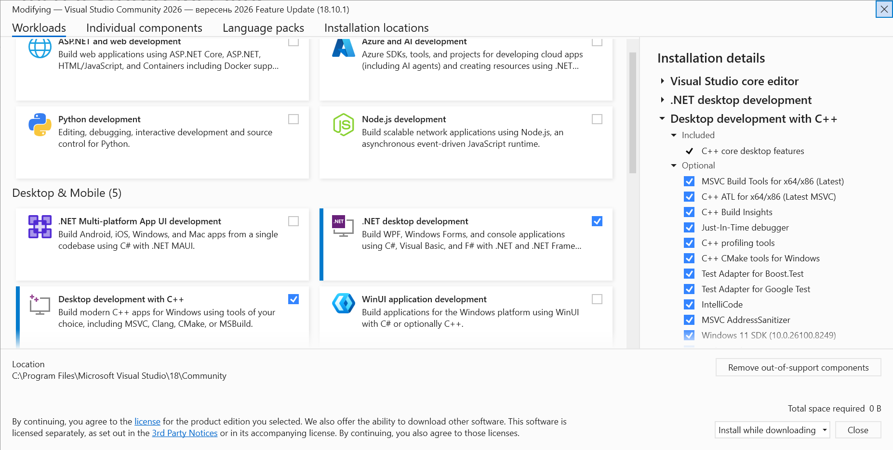
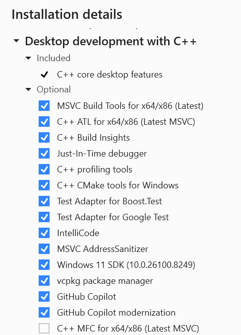
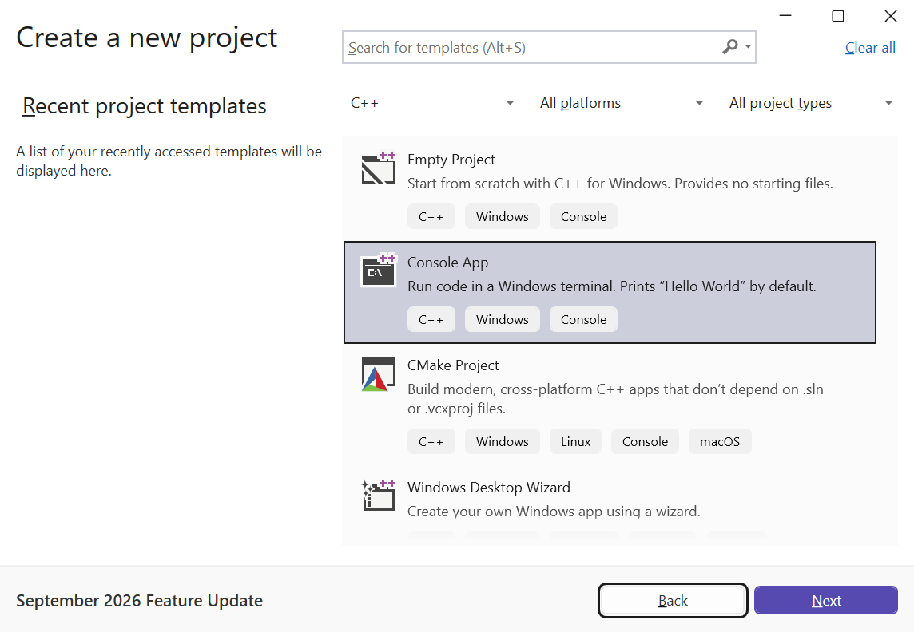
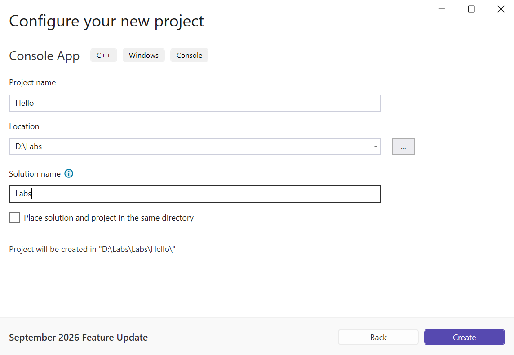

# Visual Studio and your first project

## Installing Visual Studio 2026

An **integrated development environment** (IDE)
combines an editor, build tools, a debugger, and Git integration. In this course, it is
**Visual Studio 2026**: <https://visualstudio.microsoft.com/downloads/>.
The Community, Professional, and Enterprise editions have different licensing terms
and feature sets. Community is enough for the course exercises; your right
to use it is defined by the current terms at
<https://visualstudio.microsoft.com/license-terms/>.
Classroom training is among the permitted scenarios, but the fact that
Community is free doesn’t mean unlimited use by any organization.


Figure 1.3. Downloading Visual Studio {.caption}

For the course materials, we choose Windows 11 x64. According to the verified Microsoft
requirements, the minimum is 4 GB of RAM, and 16 GB is recommended for typical professional
solutions. A typical installation takes 20–50 GB; the actual
size depends on the components. The minimum resolution is 1366×768
at 100% scaling. An SSD speeds up the work. The requirements page:
<https://learn.microsoft.com/visualstudio/releases/2026/vs-system-requirements>.
Before installing, check the available space and support for your specific OS version.

Run the installer downloaded from the official website. A **workload**
is a set of components for a particular kind of development. On the
*Workloads* tab, select *Desktop development with C++* (Fig. 1.4).
Without this workload, having Visual Studio installed doesn’t yet mean you have
a C++ compiler. Detailed instructions:
<https://learn.microsoft.com/cpp/build/vscpp-step-0-installation>.



Figure 1.4. Selecting the workload for C++ desktop development {.caption}

In the right-hand *Installation details* pane, check the MSVC tools for x64/x86 and
the Windows SDK. An **SDK** (*Software Development Kit*) contains headers, libraries,
and tools for working with the platform. CMake tools are needed for CMake projects,
AddressSanitizer finds some memory errors, and vcpkg helps you
manage third-party libraries. For your first program, the main ones are MSVC and the SDK;
we’ll use the other tools as needed. The exact version suffixes of the components
depend on the Installer update, so choose the current components of
your installed Visual Studio rather than looking for an outdated number from someone else’s screenshot.



Figure 1.5. C++ environment components {.caption}

On the *Language packs* tab, select *English* (Fig. 1.6) so that the menu names
match the materials. Click *Install* and wait for it to finish.
You can change the set of installed components through
*Tools → Get Tools and Features…* and the *Modify* button in the Installer.
We’ll install command-line Git separately from the official website: don’t
assume that every IDE installation option automatically adds `git` to `PATH`.


Figure 1.6. Selecting the English language pack {.caption}

## Your first console project

A **console application** works with text input and output. It
is convenient for learning: you can focus on the program’s behavior without creating
a graphical interface. On the Visual Studio start screen, select
*Create a new project* (Fig. 1.7). You open an existing solution through
*Open a project or solution*, and you copy a repository from a server through
*Clone a repository*. These are different starting actions.


Figure 1.7. The Visual Studio start window {.caption}

In the template list, set the language filter to *C++* and select *Console App*
with the C++, Windows, Console tags (Fig. 1.8). A template with a similar
name for C# creates a different type of project. Click *Next*. If the template you need
is missing, go back to the Installer and check the C++ workload.



Figure 1.8. The C++ console app template {.caption}

In *Configure your new project*, set *Project name* to `Hello`,
*Location* to `D:\Labs`, and *Solution name* to `Labs` (Fig. 1.9). You can use
another writable folder; remember its full path. The project name
is not the greeting text: it determines the names of the service files and usually
of the executable file. Click *Create*.



Figure 1.9. Project name and solution location {.caption}

In the main window, the editor shows `Hello.cpp`, and *Solution Explorer* shows
the solution structure (Fig. 1.10). The *Output* window contains the build log,
and *Error List* contains the list of diagnostic messages. The toolbar at the top determines
the configuration, the platform, and the startup project. An open editor tab by itself
doesn’t change the startup project if the solution contains several.


Figure 1.10. The editor and the structure of the Hello project {.caption}

### Setting the standard and diagnostics

Open the properties of the **project**, not the solution: in *Solution Explorer*,
right-click `Hello` and select *Properties*. At the top, select
*Configuration: All Configurations*, *Platform: x64*. Under
*Configuration Properties → General*, find *C++ Language Standard*
and set the `/std:c++latest` mode (Fig. 1.11). This is where
the property is located in Visual Studio 2026 18.10.1; in other versions it may be
on the *C/C++ → Language* page. Go by the property name and the switch
that ends up on the compiler command line.


Figure 1.11. Selecting the C++ standard mode {.caption}

Under *C/C++ → General*, select *Warning Level* `/W4`. Under
*C/C++ → Language*, set *Conformance mode* to `/permissive-`.
Under *C/C++ → Command Line → Additional Options*, add `/utf-8`.
These switches mean, respectively, more detailed warnings, stricter conformance to the
standard, and UTF-8 for source code and ordinary string literals.
For exception handling, this course uses `/EHsc`; this option
is usually already set in the console project template.

**Debug** contains information useful for debugging and, with the default
settings, disables optimization. **Release** usually optimizes the code.
These are sets of options, not different languages. The **x64** platform defines the target
architecture of a 64-bit process. If you configure only Debug, Release may
keep a different standard; that is exactly why we selected
*All Configurations* at the start. After changing the options, click *Apply* and *OK*.

## The structure of your first program

Replace the initial contents of `Hello.cpp` with the complete program below. This is Example 1,
“Hello, C++26!”. Save the file in UTF-8 and run
*Build → Build Solution* or press **Ctrl+Shift+B**.

```cpp
#include <print>

int main()
{
    std::println("Hello, C++26!");
    return 0;
}
```

The `#include <print>` directive provides standard library facilities for
formatted output. Angle brackets mean the header is searched for in the
configured system directories. You don’t put a semicolon after an `#include`
directive. The `main` function is the entry point of the program; `int` specifies the type
of its result, and the empty parentheses mean it has no parameters
in this form. Curly braces delimit the function body.

`std` is the **namespace** of the standard library. The `::` operator
specifies where to look for a name: `std::println` is a library function, not
an arbitrary word chosen by the author. It prints text and adds a line break.
`std::print` performs formatted output without an automatic line break.
Text in double quotes is a **string literal**.
Each call statement ends with `;`.

`return 0;` ends `main` and passes a success code to the environment. This zero
is not printed in the console. For `main`, reaching the closing brace also means
successful completion, but writing it explicitly helps you see the difference between
output and returning a value. Nonzero codes are used to
report failure; the program sets the specific value.

Press **Ctrl+F5** to run without debugging. The program’s output:

```text
Hello, C++26!
```

An extra line about the process exiting or pressing a key is printed by
the environment, not by the function shown. The **F5** key runs the program with the debugger.
Don’t add `system("pause")`: it runs a separate system command
that the program logic doesn’t need. Outside the IDE, run the `.exe` in an already
open terminal so that you can see the output after the program ends.


Figure 1.12. Output of the first program {.caption}

### UTF-8, comments, and the standard module

An encoding describes how characters are represented as bytes. For Ukrainian text,
save `.cpp` files in UTF-8 and pass `/utf-8`. The modern implementation of
`std::println` in MSVC supports Unicode output to the Windows console.
Don’t mix this up with arbitrary `_setmode` recipes for wide streams:
those are different APIs. If the text is redirected to a file, that file also has to be
opened as UTF-8. A font’s ability to display a letter and the file encoding are
separate conditions. For ordinary numbers, the locale-independent format uses a period,
for example `12.50`, regardless of the Ukrainian regional format.

A **comment** explains intent and is not executed. `//` starts
a comment that runs to the end of the line, and `/* ... */` delimits a multiline comment.
Don’t comment the obvious, like “prints text” before every output statement;
explain units of measurement, assumptions, and nontrivial formulas.
Names in C++ are case-sensitive: `Main` and `main` are different names.

The C++23 standard also introduced the `std` library module. Instead of
including a header, your first program can look like this in full:

```cpp
import std;

int main()
{
    std::println("Hello, C++26!");
    return 0;
}
```

For this form, it isn’t enough to mechanically replace the first line. In the properties of
the MSVC project, under *C/C++ → Language*, enable
*Build ISO C++23 Standard Library Modules* and the `/std:c++latest` mode.
The build system must build the module and provide it to the compiler.
Microsoft’s instructions: <https://learn.microsoft.com/cpp/cpp/tutorial-import-stl-named-module>.
Don’t add both `import std;` and headers just to fix
a configuration error. The main examples of this topic use `#include <print>`:
this makes the build path the same in the IDE and in a simple `cl` command.
