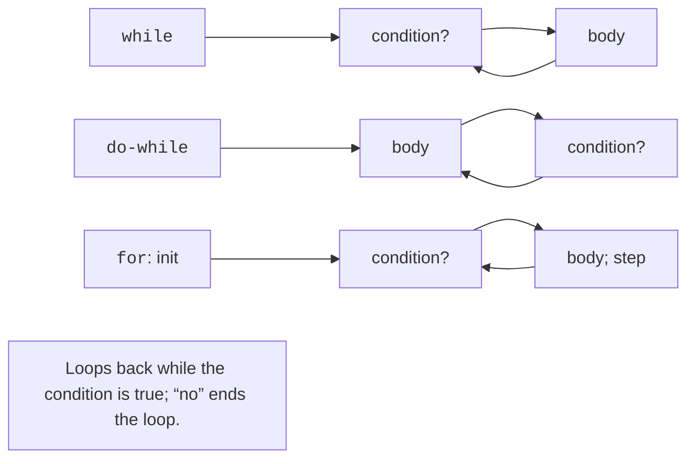

# Branches and loops

## Branching

`if` selects an action based on a logical condition. `else` specifies an alternative, and
a sequence of `else if` checks the following conditions only when the previous ones
are false. For grades, order the ranges so that every valid
value falls into exactly one category. A range membership check
is written as `0 <= value && value <= 100`, not as the mathematical
chain `0 <= value <= 100`: the latter compares an already computed `bool`.

The form `if (int value = expression; value > 0)` combines initialization and
a condition; the name is available in both branches. This helps narrow the
scope, but it isn’t needed for every simple comparison. Always
check which `if` an `else` belongs to; curly braces remove
the ambiguity of nested branches.

`switch` compares an integer value or an enumeration with `case` labels. Each
independent branch usually ends with `break`; without it, execution
falls through to the next branch. Intentional fallthrough is marked with
`[[fallthrough]];` to distinguish it from a forgotten `break`.
`default` handles an unexpected value. For a menu, this can be
an “unknown command” message rather than silently exiting.

An **enumeration** `enum class Signal { red, yellow, green };` defines named
states. You write `Signal::red`, not the magic number 0. The values of such
an enumeration are not converted to arbitrary integers automatically. An entered menu
number is validated first and only then associated with a state. Detailed
type design comes later; for now, an enumeration is needed to clearly
denote a small set of alternatives.

## Loops and random numbers

A **loop** repeats a block of actions. `while` checks the condition before each iteration
and may not execute even once. `do ... while` checks it after
the body and executes at least once. `for` conveniently combines initialization,
the continuation condition, and the step. The order of actions is shown in Fig. 2.6.
Before writing a loop, define the initial state, the termination condition,
and the action that brings the loop closer to termination.



Figure 2.6. Checking the condition in different loops {.caption}

`break` immediately ends the nearest loop, and `continue` moves to
the next iteration. In `for`, the step runs after `continue`; in `while`,
you need to make sure that a required update isn’t skipped. If
the counter is unsigned, the loop `i >= 0` never ends because of
a negative value. For reverse traversal, use the condition `i > 0`
and access `i - 1`, or a suitable signed type within known limits.

The `<random>` header separates the sequence **engine** from
the value **distribution**. `std::mt19937` is a deterministic engine, and
`std::uniform_int_distribution<int>` maps its results onto
an integer interval that includes both limits. A fixed initial seed
helps reproduce tests. How a distribution maps to specific
values may depend on the standard library, so different
implementations don’t promise the same sequence of distribution results.

### Example 3. Guess the number

The program picks a number from 1–10; entering 0 ends the game. For testing,
the seed is fixed. An invalid token ends the program with code 1.

```cpp
#include <print>
#include <iostream>
#include <random>

int main()
{
    std::mt19937 engine{42};
    std::uniform_int_distribution<int> pick{1, 10};
    const int secret = pick(engine);
    int guess{}, attempts{};
    do
    {
        std::println("Guess 1..10, or 0 to exit:");
        if (!(std::cin >> guess)) return 1;
        if (guess == 0) return 0;
        if (guess < 1 || guess > 10)
        {
            std::println("Out of range");
            continue;
        }
        ++attempts;
        if (guess < secret) std::println("Higher");
        else if (guess > secret) std::println("Lower");
        else std::println("Correct; attempts: {}", attempts);
    } while (guess != secret);
}
```

Out-of-range attempts don’t increase the counter. For a reproducible
check, you can enter all the numbers from 1 to 10: the program is guaranteed to
end the game on the correct value. Separately check 0, 11, and
a non-numeric token. Don’t re-create the engine in every iteration
with the same seed, or you will get the beginning of the sequence every time.

### Example 4. Multiplication table

A nested loop runs completely for each iteration of the outer one.
The program prints a 4×4 table; the total number of products is 16.

```cpp
#include <print>

int main()
{
    for (int row = 1; row <= 4; ++row)
    {
        for (int column = 1; column <= 4; ++column)
            std::print("{:4}", row * column);
        std::println();
    }
}
```

```text
   1   2   3   4
   2   4   6   8
   3   6   9  12
   4   8  12  16
```

The line break comes after the inner loop, so it ends
a table row rather than each cell. A width of 4 is enough for these products;
for larger limits, you need to reconsider it. If you read the number from the keyboard
instead of using a constant limit, restrict it so that the user doesn’t accidentally
create millions of output lines.
