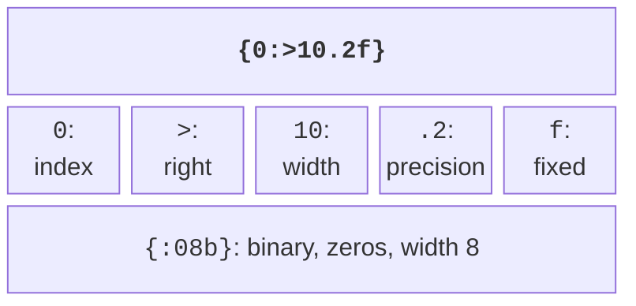
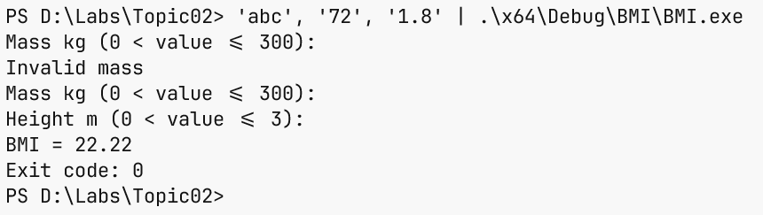

# Operators, output, and input

## Operators and numeric limits

The arithmetic operators `+`, `-`, `*`, `/` work on numeric values.
If both operands of a division are integers, the result is also an integer: `7 / 2` gives 3,
and `7.0 / 2` gives 3.5. `%` returns the remainder of integer division. For
nonnegative time, this gives a convenient pair of formulas: `hours = seconds / 3600`
and `rest = seconds % 3600`. For negative data, first define the rules of the
problem rather than expecting an automatic calendar carry.

The operators `==`, `!=`, `<`, `<=`, `>`, `>=` compare values and give
a `bool`. `=` performs assignment. The expression `if (x = 5)` changes `x`, while
`if (x == 5)` checks it. The logical `&&`, `||`, `!` combine conditions.
The first two use short-circuit evaluation: in `x != 0 && y / x > 2`,
the division is not performed when `x` is zero.

The bitwise `&`, `|`, `^`, `~`, `<<`, `>>` operate on the bits of integer values.
For classroom masks, use unsigned numbers and check
that a shift is smaller than the number of bits in the type. Don’t replace `&&` with `&` in
input validation: these are different operations. The three-way comparison `<=>`
returns an ordering category; it is useful for your own types and
will be covered in detail together with operator overloading.

The compound assignment `sum += value` adds to an accumulator; `++i` increments
a counter. The conditional expression `condition ? first : second` selects one of
two values. Don’t hide many state changes in one large expression:
several simple statements are easier to check in the debugger. When in doubt
about precedence, add parentheses. The precedence table:
<https://learn.microsoft.com/cpp/cpp/cpp-built-in-operators-precedence-and-associativity>.

### Conversions and overflow

`static_cast<double>(sum) / count` converts the first operand **before**
the division. The expression `static_cast<double>(sum / count)` only converts
the already truncated integer result. `static_cast` makes the intent explicit, but
it doesn’t prove that the value fits in the new type. Before converting,
check the range and the requirements for losing the fractional part.

Signed integer overflow during arithmetic is undefined behavior.
Unsigned arithmetic works modulo a power of two, but this can also
break the meaning of the problem. Before adding nonnegative `a` and `b`,
check `a <= max - b`; before multiplying nonzero values, check `a <= max / b`.
Computing an overflowed sum and then checking it is already too late.

For floating-point numbers, check the domain: the denominator must be
nonzero, and the argument of a square root must be nonnegative. The
`<cmath>` header provides `std::sqrt`, `std::pow`, `std::abs`, `std::isfinite`.
`<numbers>` provides `std::numbers::pi`. Don’t use an approximate `3.14`
if the library already has the constant you need. Comparing computed
floating-point values often requires a tolerance that is determined by the problem,
not an arbitrary constant copied from another program.

In C++26, saturation arithmetic includes `std::add_sat` from `<numeric>`:
instead of going out of range, it returns the nearest limit of the type. This is not
ordinary addition and not an automatic mode for all integer operations.
Before using it, check support in your standard library;
manual limit checks in the exercises are needed regardless of whether this function is available.
In the tested MSVC 19.51 library, `std::add_sat` is still missing, so
the runnable examples in this topic don’t use it.

## Formatted output

`std::print` and `std::println` from `<print>` take a format string and
arguments. The first function doesn’t add a new line; the second one does. The `{}` field
prints the next argument in its default representation. In `{0:>10.2f}`, the number 0
selects the first argument, `>` aligns to the right, 10 sets the minimum width,
`.2` is the precision, and `f` is the fixed-point format (Fig. 2.4).



Figure 2.4. Parts of a format specification {.caption}

The width doesn’t truncate text or limit values. For integers, `{:.2f}` is not
a valid way to add zeros after the decimal point: the specification must
match the argument type. `{:x}` prints hexadecimal notation,
`{:b}` prints binary, and `{:08b}` pads it with zeros to eight positions.
`{:08.3f}` formats a floating-point number with a total minimum width of 8.
A brace itself is written in the format text as <code v-pre></code>.

Errors in a constant format string are often detected at compile time.
Don’t “fix” the diagnostic by converting all the values to text:
first make the format and the type agree. Unlike the regional settings of
a spreadsheet, the default C++ format prints a decimal point.
Formatting doesn’t change the value of a variable and doesn’t remove calculation errors.

The alternative interface `std::cout << value` uses the stream insertion
operator. You need it to read other people’s code, but in this
course the main output facility is `std::println`. For error
messages, it is convenient to use `std::cerr` to separate them from
the useful result when streams are redirected.

## Input and stream state

`std::cin >> value` from `<iostream>` tries to read a value of the required
type. This operation can fail: the user can enter
letters, a number that is too large, or end the input. The check
`if (!(std::cin >> value))` detects an extraction error. It doesn’t check
the meaning in the problem domain: a negative mass is syntactically a number, but it is invalid.

After a failed read, `clear()` resets the error flags, and
`ignore(std::numeric_limits<std::streamsize>::max(), '\n')` discards
the rest of the line. Both actions are needed: resetting the state alone leaves the same
invalid characters for the next attempt. However, end of file `eof()`
shouldn’t be handled by repeating the prompt forever; the program exits.
Stream documentation: <https://learn.microsoft.com/cpp/standard-library/basic-istream-class>.

The `>>` operator reads a numeric prefix: after `12abc`, the number 12 may already
be read, and `abc` stays in the stream. If you need strict validation of
the whole line, use `std::getline` and parse the full text;
this will be covered in the topic on strings. In the example with retries here, the rest
of the line is explicitly discarded, so the input policy is one value per line.

### Example 2. Body mass index as a classroom formula

The program reads a positive mass in kilograms and a height in meters. It demonstrates
numeric input validation rather than giving a medical conclusion: the result
is just the value of the formula `mass / (height * height)`. The limits of 300 kg and 3 m
are restrictions of this classroom example.

```cpp
#include <print>
#include <iostream>
#include <limits>
#include <cmath>

int main()
{
    double mass{}, height{};
    while (true)
    {
        std::println("Mass kg (0 < value <= 300):");
        if (std::cin >> mass)
        {
            std::cin.ignore(
                std::numeric_limits<std::streamsize>::max(), '\n');
            if (std::isfinite(mass) && mass > 0 && mass <= 300)
                break;
        }
        else if (std::cin.eof()) return 1;
        else
        {
            std::cin.clear();
            std::cin.ignore(
                std::numeric_limits<std::streamsize>::max(), '\n');
        }
        std::println("Invalid mass");
    }
    std::println("Height m (0 < value <= 3):");
    if (!(std::cin >> height) || !std::isfinite(height)
        || height <= 0 || height > 3)
    {
        std::cerr << "Invalid height\n";
        return 1;
    }
    const double bmi = mass / (height * height);
    std::println("BMI = {:.2f}", bmi);
}
```

For the input sequence `abc`, `72`, `1.8`, the program reports an error,
repeats the first prompt, and prints `BMI = 22.22`. A zero height is rejected
before the division. The `std::isfinite` check doesn’t allow infinity or NaN.
Short English prompts make it easier to reproduce tests regardless of
the terminal encoding; Ukrainian strings are also acceptable with `/utf-8`.



Figure 2.5. Repeating input after an error {.caption}
