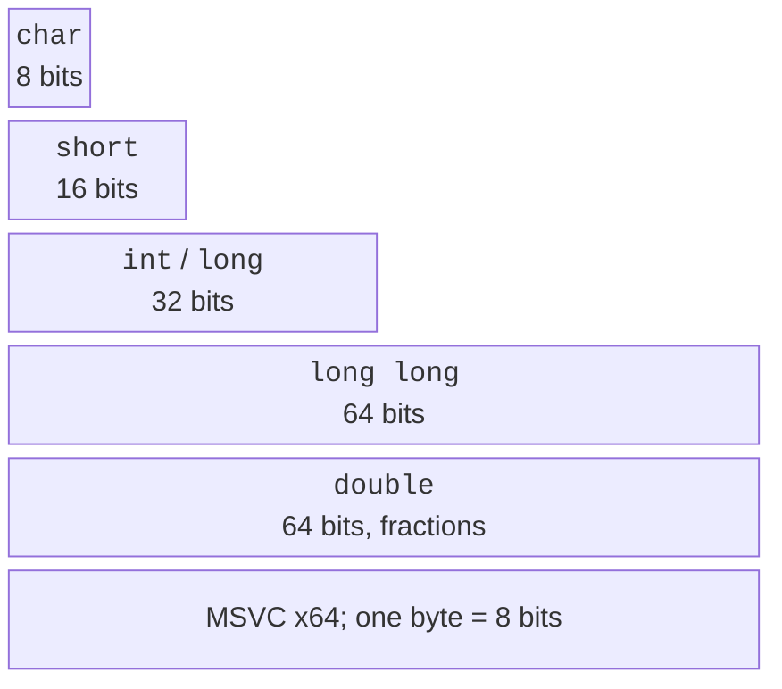
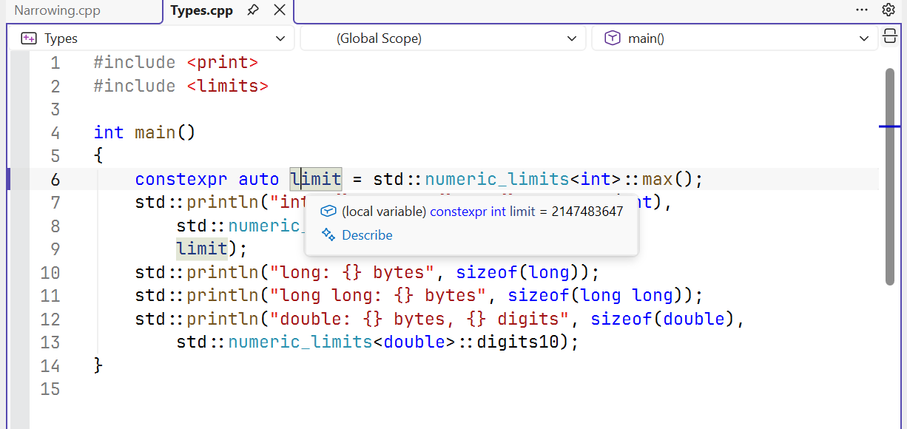
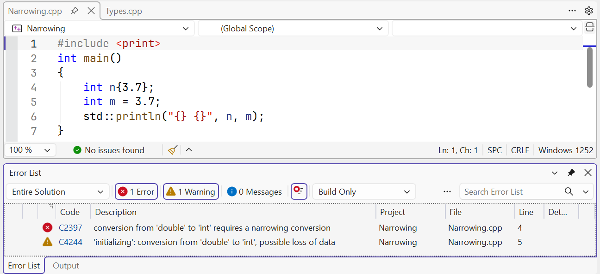

# Types, variables, and constants

## A type as a set of values and allowed operations

A **variable** binds a name to an object that stores a value.
A **type** defines the allowed values, their representation, and the operations on them.
For example, it makes sense to store the number of students as an integer, a temperature
as a number with a fractional part, and the answer to the question “Is the work finished?”
as a Boolean value. Choosing a type starts with the meaning of the data, not with the wish
to use the largest available type everywhere.

`bool` has the values `true` and `false`. `char` stores one code unit
of an ordinary string, not an arbitrary Unicode letter. `short`, `int`, `long`, and
`long long` are integer types with different minimum ranges. The word `unsigned`
selects an unsigned type; it is not a universal way to forbid negative
input. `float`, `double`, and `long double` are floating-point types.
Their values have finite precision, even if many digits are printed.

In MSVC x64, `int` and `long` are 4 bytes, `long long` is 8, and `long double`
has the same representation as `double`. These are properties of the implementation: don’t
carry the conclusion “long is always 8 bytes” over from Linux to Windows.
The standard sets minimum guarantees, and the actual sizes are checked with
the `sizeof` operator (Fig. 2.1). Documentation:
<https://learn.microsoft.com/cpp/cpp/fundamental-types-cpp>.



Figure 2.1. Typical type sizes in MSVC x64 {.caption}

The result of `sizeof` has the type `std::size_t`, an unsigned type for sizes.
It measures the number of C++ bytes, and `sizeof(char)` is always 1.
For a data format that needs exactly a 32-bit integer, the
`<cstdint>` header provides `std::int32_t` if the implementation has a suitable type.
For limits, use `<limits>` and `std::numeric_limits<T>`.
For integers, `min()` is the smallest value; for floating-point types, the lowest negative
finite value is returned by `lowest()`, and `min()` returns the smallest positive
normalized value. Confusing these functions breaks range checks.

### Example 1. Type characteristics

The program doesn’t read any data; it reports the properties of the implementation it
was built with. Compare the output for a specific platform.

```cpp
#include <print>
#include <limits>

int main()
{
    std::println("int: {} bytes, {} .. {}", sizeof(int),
        std::numeric_limits<int>::min(),
        std::numeric_limits<int>::max());
    std::println("long: {} bytes", sizeof(long));
    std::println("long long: {} bytes", sizeof(long long));
    std::println("double: {} bytes, {} digits", sizeof(double),
        std::numeric_limits<double>::digits10);
}
```

```text
int: 4 bytes, -2147483648 .. 2147483647
long: 4 bytes
long long: 8 bytes
double: 8 bytes, 15 digits
```

`digits10` describes the decimal precision of the type, not the number of digits that
you must show to the user. The size of a variable also isn’t
equal to the length of its printed value: the number `7` and the number `1000000`
of type `int` take up the same amount of memory.



Figure 2.2. Tooltip showing the type and value of a constant expression {.caption}

## Initialization, names, and constants

**Initialization** sets the initial value at the moment
an object is created. The declarations `int count = 3;`, `int count(3);`, and
`int count{3};` give the same value in the simple case, but curly
braces forbid dangerous **narrowing**. That’s why `int n{3.7};`
is an error: the fractional part would be lost. The declaration `int n = 3.7;` may
compile with a warning and give 3, which doesn’t make it correct.

A local `int count;` without initialization doesn’t automatically get zero.
Reading an indeterminate initial state doesn’t give a correct result.
The habit of writing `int count{};` creates a known initial value of 0.
Declare a variable close to its first use and name it by its meaning:
`minutes`, `attempts`, `massKg` explain the data better than `a`, `b`, `c`.

`auto value = 3.5;` asks the compiler to deduce the type from the initializer;
in this case, it is `double`. `auto` is not a dynamic type: after
the declaration, the type doesn’t change. `const` forbids subsequent assignment,
and `constexpr` requires the initial value to be computable
at compile time. For example, `constexpr int days = 7;` is a compile-time
constant; `const double mass` read from user input is not.



Figure 2.3. Narrowing conversion diagnostic {.caption}

**Scope** determines where a name is accessible. A local variable
inside `{ ... }` is not accessible after the closing brace. The same name in
an inner block can hide the outer one, but for a beginner this
makes errors harder to find. The counter in `for (int i = 0; ...)` belongs to the loop.
Don’t create global variables just to avoid thinking through how to
pass data: we’ll study functions and parameters in the next topic.

### Literals and their types

An integer literal can be written in decimal `42`, hexadecimal `0x2A`, or
binary `0b101010`. The digit separator in `1'000'000` makes it easier to read and doesn’t
change the value. The `LL` suffix gives the integer type `long long`; `3.0f` is
a `float`, while `3.0` is a `double`. Single quotes denote a character
literal `'A'`, and double quotes denote a string `"A"`, which also contains a terminating null.

`u8"text"` has `char8_t` code units, so it is not an ordinary `const char*`.
Don’t add the `u8` prefix to all `std::println` arguments mechanically.
For the course examples, ordinary strings compile with `/utf-8`.
A Cyrillic letter in UTF-8 usually takes several bytes; working with individual
bytes is not yet correct processing of individual letters.
