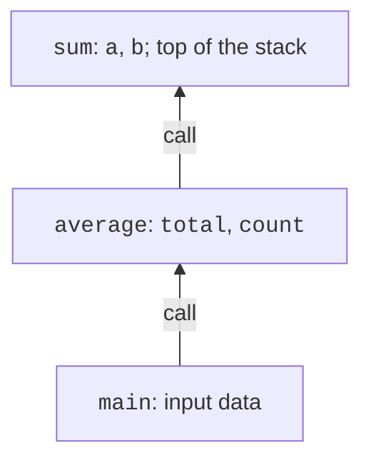
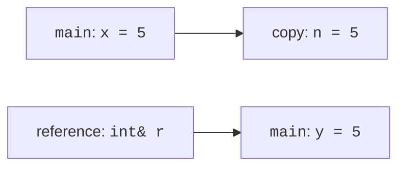

# Functions and parameter passing

## A function as a separate complete action

A **function** names an action that can be called with different data.
For example, you need to compute an area both for a room and for a plot of land.
Instead of copying the formula to several places, you create a function, pass
it the length and the width, and get the result. This way an error in the formula
is fixed in one place. However, a function should group a meaningful
action, not an arbitrary fragment of five adjacent lines.

**Parameters** are the names of the inputs in a function definition.
**Arguments** are the concrete expressions in a call. In
`area(5.0, 4.0)` the numbers are arguments; in
`double area(double length, double width)` the names `length` and `width`
are parameters. The order of arguments matters even when all of them
have the same type. The name and the documentation should explain the units.

The type before the name specifies the **return type**. The statement `return expression;`
ends the current call and returns a value. The result can be assigned to a
variable, used in a condition or passed to another function. `return` itself
does not print the value. A `void` function returns no value; in it you can
use `return;` for an early exit. Reaching the end of an ordinary
function that must return a value without a result is a design error.

Language documentation: <https://learn.microsoft.com/cpp/cpp/functions-cpp>.
A short function is often defined before `main`. For a large file this is
inconvenient, so you can provide a **declaration** before the use
and place the implementation below. The declaration
`double area(double length, double width);` states the types and the name
but has no body. A definition contains the body and does not end with
a semicolon after the outer closing brace.

The compiler uses the declaration to check the call; the linker
must find the matching definition. If you mix up a parameter type in the
declaration and the definition, you can accidentally create another function, and
the required definition will be missing. A useful habit is to include
in the implementation the same header that the function's clients use.

## Pass by value

The parameter `int value` creates a separate object from the passed value.
Changing the parameter does not change the variable at the call site. This is **pass
by value**. For small numeric types it is
natural: the function gets its own working data and cannot accidentally
overwrite the user's value. The result must be returned explicitly.

A call creates an execution context with the parameters,
local variables and the return address. Nested calls
form the **call stack** (Fig. 3.1).
When `main` calls `average`, and it calls `sum`, the inner
call is active. After it finishes, execution continues
in `average` rather than starting again from the beginning of `main`.



Figure 3.1. Nested calls and their local data {.caption}

Consider `void increase(int x) { ++x; }`. After `increase(count)`
the outer `count` stays unchanged. This is not a “broken increment
operator” but a consequence of the copy. To compute a new value, prefer
`int increased(int x) { return x + 1; }` and an explicit assignment of the result.
Pass by reference is appropriate when changing the outer
object really is part of the interface.

Do not rely on the evaluation order of different function arguments.
Expressions such as a call with several increments of the same
counter are harder to read and may have a non-obvious order.
First compute the individual values in separate statements, then
pass them to the function. A clear data flow matters more than brevity.

## References and const references

A **reference** is another name for an existing object.
The parameter `int& value` allows changing the original. The call
syntax stays ordinary, so the function name should
hint at the change: `normalize`, `swap_values`, `sort_three`.
A reference must be bound to an object immediately; assigning through
it changes the object rather than rebinding the reference itself.



Figure 3.2. A copy of an argument and a reference to the original {.caption}

`const T&` gives access without modification through this reference. For large
strings and containers this avoids a copy. For `int` or `double`
ordinary pass by value is often simpler. The word `const`
in a parameter is a promise of the interface, not a claim that the object
cannot change anywhere in the program through some other access.

An output parameter is a reference through which a function writes a result.
It is useful for normalizing several time components, but it complicates
the call: the reader has to know which arguments are inputs and which will change.
For independent computation of several results it is often better to
return a small structure with named fields.

If two reference parameters refer to the same object,
a change through the first one is visible through the second. For example,
`swap_values(x, x)` must leave `x` unchanged. Check such
cases for functions that modify data. Do not assume that different
parameter names automatically mean different objects.

### Example 1. Ordering three numbers

The program reads three integers, orders them with a small set of
comparisons and prints the result. The swap function explicitly changes two
objects, and `sort_three` groups three such steps into a separate action.

```cpp
#include <print>
#include <iostream>

void swap_values(int& a, int& b)
{
    const int temporary = a;
    a = b;
    b = temporary;
}

void sort_three(int& a, int& b, int& c)
{
    if (a > b) swap_values(a, b);
    if (b > c) swap_values(b, c);
    if (a > b) swap_values(a, b);
}

int main()
{
    int a{}, b{}, c{};
    if (!(std::cin >> a >> b >> c)) return 1;
    sort_three(a, b, c);
    std::println("{} {} {}", a, b, c);
}
```

The input `9 2 5` gives `2 5 9`; `3 3 3` stays unchanged.
After the first comparison `a <= b`. After the second, the largest of
the three numbers is in `c`, but the swap could have broken the order of `a,b`;
so a third step is needed. This explanation is a proof for three
numbers, not a general algorithm for sorting an arbitrary collection.
