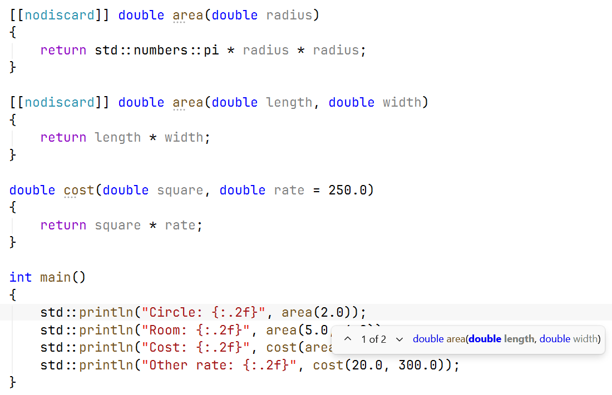

# Overloading and results

## Overloading and default arguments

**Overloading** allows several functions to have
the same name if their parameters differ. For example,
`area(double)` can compute the area of a circle, and
`area(double, double)` the area of a rectangle. The compiler selects
the matching function by the number and types of arguments, not by
the names of the variables in the call. The return type alone does not
make it possible to create another overload.

The declarations `double area(double);` and `int area(double);`
contradict each other. The pair `f(int)` and `f(int&)` can be
declared, but for an ordinary `int` variable the call may be
ambiguous: both candidates fit. Do not create such
sets without a strong reason. An exact type match is usually better
than a conversion, but read the detailed rules in
<https://learn.microsoft.com/cpp/cpp/function-overloading>.

A **default argument** is substituted when a call does not
contain the corresponding argument. Such parameters are placed
at the end of the list. The values are given in one visible declaration
and are not repeated in every definition. Do not combine
`f(int)` and `f(int,int=0)`: the call `f(1)` has no obvious
single candidate. A convenient interface must not create
ambiguity.



Figure 3.3. Parameter info for overloaded functions {.caption}

### Example 2. Shape geometry

Both `area` functions compute an area but take different
sets of dimensions. `cost` has a default rate. The data in this example
are constant and valid; in a program with input you must check that
the dimensions are positive and finite before the call.

```cpp
#include <print>
#include <numbers>

[[nodiscard]] double area(double radius)
{
    return std::numbers::pi * radius * radius;
}

[[nodiscard]] double area(double length, double width)
{
    return length * width;
}

double cost(double square, double rate = 250.0)
{
    return square * rate;
}

int main()
{
    std::println("Circle: {:.2f}", area(2.0));
    std::println("Room: {:.2f}", area(5.0, 4.0));
    std::println("Cost: {:.2f}", cost(area(5.0, 4.0)));
    std::println("Other rate: {:.2f}", cost(20.0, 300.0));
}
```

```text
Circle: 12.57
Room: 20.00
Cost: 5000.00
Other rate: 6000.00
```

The `[[nodiscard]]` attribute asks for a diagnostic when
the result is simply ignored. It does not force the user to
check the content of the value and does not replace testing. The nested
call `cost(area(...))` first gets the area and passes it to
another function; rounding to two digits happens only on
output, not between computations.

## Returning several values

`std::pair` combines two values, `std::tuple` any
finite number of them. Their headers are `<utility>` and `<tuple>`.
A **structured binding**
`auto [low, high] = result;` gives meaningful local names to the
components. However, a large number of unnamed components
makes maintenance harder: the reader has to remember the order.

A simple `struct` is an aggregate with fields, for example
`struct Summary { int minimum; int maximum; double mean; };`.
Returning `Summary` expresses the meaning through names. In this topic
a structure only groups data; constructors, encapsulation and
member functions will be covered in the topic on classes. The access `result.mean`
reads as “the mean field of the result object”.

### Example 3. Statistics of three observations

The function computes the minimum, the maximum and the mean without changing
the arguments. For a compact series we pass three values;
an array of arbitrary length will become the natural generalization in Topic 4.

```cpp
#include <print>
#include <algorithm>

struct Summary
{
    double minimum;
    double maximum;
    double mean;
};

Summary summarize(double a, double b, double c)
{
    return {std::min({a, b, c}), std::max({a, b, c}),
        a / 3.0 + b / 3.0 + c / 3.0};
}

int main()
{
    const auto [low, high, mean] = summarize(3.0, 7.0, 5.0);
    std::println("min={:.1f}; max={:.1f}; mean={:.1f}",
        low, high, mean);
}
```

```text
min=3.0; max=7.0; mean=5.0
```

Dividing each term before summation reduces the risk of
overflowing the intermediate sum of large positive values, but
it is not a universal numerically exact algorithm. For this
small, finite teaching data it is sufficient.
A structured binding without `&` creates its own value of the
result; borrowing an object requires another form
and control of its lifetime.

## Lifetime, static and constexpr

**Lifetime** determines when an object exists.
A local automatic variable disappears on exit from its block.
Therefore you must not return a reference to a local variable:
the caller would get a reference to an object whose life has already
ended. Returning a number or a small structure by
value is the natural safe solution.

A local `static` variable is preserved between calls, but its
name is accessible only in the scope of its declaration. The counter
`static int calls = 0;` in a function remembers previous calls.
This is useful for special tasks but creates hidden
state: two identical calls may depend on the previous
history. For a testable computation, it is better to pass the required
state explicitly. Global variables make this problem worse.

In modern C++, `inline` concerns primarily the rules of
definition in several translation units. It does not order
the compiler to insert the body instead of the call.
The optimizer may inline a function without this keyword or not
inline one marked with it. Defining a small `inline`
function in a header allows using it from several
`.cpp` files while following the rules of identical definitions.

A `constexpr` function can be evaluated at compile time
if the arguments and the context allow it; with ordinary
input arguments it is evaluated at run time.
`static_assert(condition)` checks a condition at
compile time and does not generate a prompt for the user. This is convenient
for known mathematical properties, but it does not check
future values from the keyboard. A function with the return type
`auto` allows deducing the type from `return`; for recursion
an explicit type is often more readable and avoids problems before type
deduction is complete.
