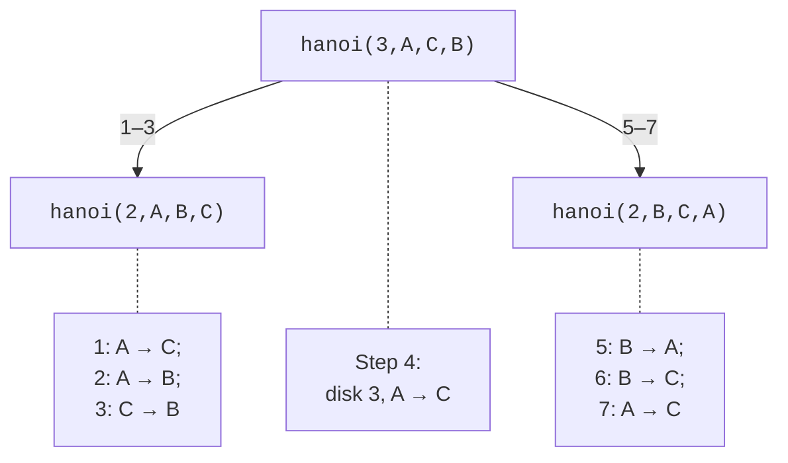

# Recursion and program organization

## Recursion and the call stack

**Recursion** occurs when a function calls itself
directly or through other functions. It is natural for
problems that reduce to smaller problems of the same kind.
Every correct recursive algorithm has a **base case**
and a step that moves toward it. For the factorial the base is
0!=1, and the step is n!=n·(n−1)! for positive n.

The base condition will not help if the recursive argument does not
decrease or the input is outside the valid domain.
For the factorial of a negative number, the call with n−1 moves away
from zero. You must check n before the first call.
Likewise, mathematical definedness does not guarantee that the result
fits into a machine type: 21! does not fit into a 64-bit
unsigned integer type.

Each active call has its own parameters and local
variables. The *Call Stack* window shows the sequence of these calls,
and selecting a frame lets you inspect its context.
Excessive depth can exhaust the stack. Converting tail
recursion into a loop is not guaranteed by the standard, so it
cannot be considered protection against stack overflow.


Figure 3.4. Stack of recursive calls {.caption}

### Example 4. Towers of Hanoi

There are three rods A,B,C and n disks of different sizes. You need to
move all disks from A to C, moving one at a time;
a larger disk cannot be placed on a smaller one. Moving
n disks reduces to moving n−1 to the auxiliary
rod, the single largest one to the target, and then
n−1 from the auxiliary rod to the target (Fig. 3.5).



Figure 3.5. Splitting the Towers of Hanoi problem for three disks {.caption}

```cpp
#include <print>
#include <iostream>

void hanoi(int n, char from, char to, char spare, int& steps)
{
    if (n == 0) return;
    hanoi(n - 1, from, spare, to, steps);
    std::println("{}: {} -> {}", ++steps, from, to);
    hanoi(n - 1, spare, to, from, steps);
}

int main()
{
    int n{};
    if (!(std::cin >> n) || n < 0 || n > 10)
    {
        std::cerr << "Expected disk count 0..10\n";
        return 1;
    }
    int steps{};
    hanoi(n, 'A', 'C', 'B', steps);
    std::println("Total: {}", steps);
}
```

```text
1: A -> C
2: A -> B
3: C -> B
4: A -> C
5: B -> A
6: B -> C
7: A -> C
Total: 7
```

This is the result for n=3. For n=0 there are no steps; for n=1
one is needed. The counter is passed by reference so that
all calls change a shared number, and `n`, `from`, `to`
and `spare` are passed by value so that each call has its own
description of the subproblem. The limit of 10 caps the output at 1023 steps.

The number of steps is T(n)=2T(n−1)+1, hence T(n)=2ⁿ−1.
The stack depth, in contrast, is linear in n. These two quantities
should not be confused: a small depth does not yet mean little
computation. The recursive factorial has a different tree shape:
each call produces only one next call.

## Organizing functions and program arguments

While a program is small, defining functions in a single `.cpp`
is enough. Later, declarations are moved to a `.h` file and
definitions to a `.cpp` file. The `#pragma once` directive in
an MSVC header prevents its contents from being included again
into one translation unit. It does not replace the
rules of definitions across different `.cpp` files. Do not include
an implementation `.cpp` file instead of adding it to the project.

For a function, it is useful to write down the preconditions, the result
and the side effects. For example: “takes three finite
positive sides; returns the area; does not change the arguments
and does not print”. Output is separated from computation
so that a test can compare a number without parsing console text.
Validation of the keyboard stream is usually left
at the program boundary, while a mathematical function works with already
parsed, typed values.

The form `int main(int argc, char* argv[])` receives
command-line arguments. `argc` is their count
including the service element `argv[0]`; the entered
arguments start at `argv[1]`. Each element
is text. Writing `12` in a command is not by itself
converted to `int`: parsing and validation are needed.
The pointer mechanism is explained in Topic 5; here
the rule “check the count before access” is enough.


Figure 3.6. Passing arguments in Visual Studio {.caption}

In Visual Studio, arguments are set via
*Project Properties → Configuration Properties → Debugging → Command Arguments*.
In a terminal they are written after the `.exe` name; spaces
separate arguments, and quotes join text with spaces.
The program should print a clear short description for
`--help` and report a wrong number of arguments
rather than access elements outside the `argv` array.

### Testing functions

A small function lets you check computations
without the program's full dialog. For `sort_three`
you need all six orderings of distinct numbers,
repeats and negative values. For recursion,
the base, the first nontrivial case and the largest
allowed argument. For `area`, known geometric
values and the rule for handling invalid dimensions.

Do not substitute an independent expected answer with the
same formula in the test. For three numbers the result
can be checked by the ordering condition and preservation of
the initial values. For Hanoi, check not only
the number of steps but also the legality of the moves in
a small example. Such a check finds
the error of mixed-up rods even when the counter
still equals 2ⁿ−1.
