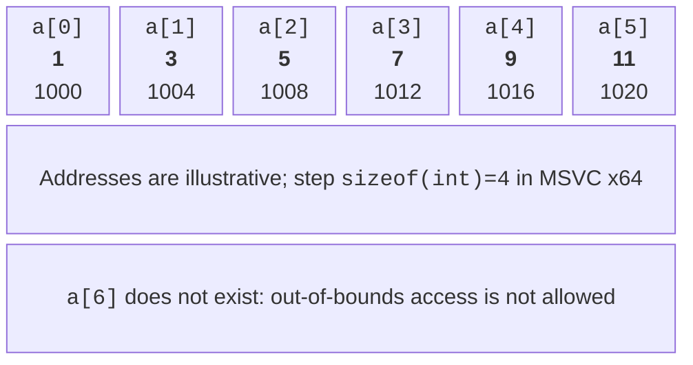
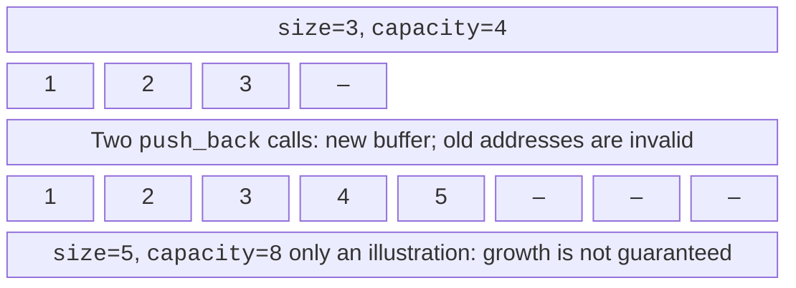
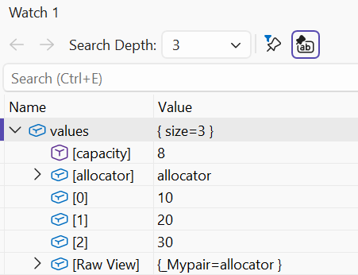

# std::array and std::vector

## When you need a collection

For three temperatures you can declare three variables,
but for a month this is inconvenient: the formula for the mean
would contain dozens of names, and the amount of data would be
hard-coded. A **collection** groups
values by a common rule. An **array**
stores elements of one type in consecutive
cells; an **index** specifies a position.
In C++, indexing starts at zero.

For six elements the valid indices are 0–5.
The number 6 is the count, not the last index.
This very difference causes the typical mistake
`i <= size` instead of `i < size`. Before
access, you need to prove that the index belongs to the
range, especially if the number was entered by the
user in the familiar form starting from 1.



Figure 4.1. Consecutive elements and the array bound {.caption}

The declaration `int values[6]{1,3,5,7,9,11};`
creates a built-in array. Writing `int values[6]{};`
zero-initializes all elements. The size of such a
local array must be known at
compile time; a variable-length array, which
some compilers accept as an extension,
is not portable standard C++.

`std::size(values)` from `<iterator>` returns
the number of elements of a real array.
However, in the parameter `void f(int a[])` the array
notation turns into a pointer parameter:
the length itself is not passed. This
**decay** (*array-to-pointer conversion*)
is why `sizeof(a)` inside
such a function does not recover the array length.
Pointers are covered in detail in the following topics.

## std::array and iterating over elements

`std::array<int,6>` from `<array>` also has
a fixed size, but it behaves like a full-fledged
object: it can be copied, assigned and
passed by reference without losing its length.
The `size()` member function returns 6, and `fill(value)`
fills all cells. Different lengths are
different types: `array<int,3>` cannot
be used in place of `array<int,4>`.

The `[]` operator does not perform mandatory
bounds checking. `at(index)` checks the index
and throws `std::out_of_range` on error.
The exception mechanism comes in Topic 6, but already
now it is important to understand: checked access
reports a defect rather than making any
index valid. Do not rely on
Debug always showing a dialog for every
bounds violation; undefined behavior does not
have a mandatory visible sign.

The loop `for (auto value : values)` creates
a copy of each element. `auto&` allows
modifying the elements, and `const auto&` reads
without copying. For small numbers a copy
is convenient; for strings and large structures
a const reference avoids extra work.
If you need the position number, use
an index loop and a type consistent with `size()`.

### Example 1. Temperatures of the week

The program reads exactly seven finite values
from −100 to 100 and computes statistics. The initial
minimum and maximum are taken from the first element,
so a week of negative values is processed correctly.

```cpp
#include <array>
#include <iostream>
#include <print>
#include <cmath>

int main()
{
    std::array<double, 7> days{};
    for (auto& value : days)
    {
        if (!(std::cin >> value) || !std::isfinite(value)
            || value < -100 || value > 100) return 1;
    }
    double low = days[0], high = days[0], sum{};
    for (double value : days)
    {
        if (value < low) low = value;
        if (value > high) high = value;
        sum += value;
    }
    std::println("min={:.1f}, max={:.1f}, mean={:.1f}",
        low, high, sum / days.size());
}
```

For `1 2 3 4 5 6 7` the result is
`min=1.0, max=7.0, mean=4.0`.
The first loop needs `auto&`, otherwise
input would change only a local copy.
In the second one a value is enough. The array always
has seven elements, so `days[0]` exists;
a dynamic empty collection would need
a separate check.

## std::vector: size and capacity

A **vector** `std::vector<T>` from `<vector>`
owns a dynamic array and manages
memory allocation and deallocation itself.
`vector<int> values;` is initially empty,
and `vector<int> values(5);` has five
zero elements. `vector<int>{5}`,
in contrast, contains one element with the value 5.
The brackets here express different intents.

`size()` is the number of existing elements;
`capacity()` is the capacity of the already allocated
buffer. `reserve(100)` requests room
for at least 100 elements but does not
create them. After `reserve` an empty
vector still has no element 0.
`resize(100)`, in contrast, changes
the number of existing elements.



Figure 4.2. Size, capacity and reallocation {.caption}

`push_back(value)` adds an element at the end.
`emplace_back(arguments...)` constructs
an element from the arguments directly in the
vector; this is not a promise to speed up
every operation. `pop_back()` removes
the last element but does not return its
value and requires a non-empty vector.
`clear()` removes all elements, usually
keeping the buffer. `shrink_to_fit()` is
a non-binding request to reduce the capacity,
not a guarantee of an exact buffer size.

If an addition exceeds the capacity,
the vector allocates a new buffer and moves
the elements. Previously saved addresses,
references and iterators to the old elements
become invalid. The exact growth
factor is not specified by the standard:
the diagram with doubling is an illustration,
not a rule for all implementations.
Documentation: <https://learn.microsoft.com/cpp/standard-library/vector-class>.



Figure 4.3. Vector elements in the debugger {.caption}

Insertion at position `i` can be written as
`values.insert(values.begin() + i, value)`,
and removal as `values.erase(values.begin() + i)`.
Here `begin()+i` is only a way to denote
a position; the full theory of iterators comes
later. For insertion i=size is allowed,
for removal `i < size` is required. Shifting
the following elements changes positions;
an index is not a permanent identifier of a record.
