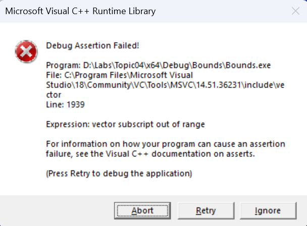

# Bounds, modifications and algorithm walkthroughs

## Bounds, modifications and state checking

A vector is a safe owner of
memory, but it does not fix
a faulty indexing algorithm.
In Debug the library may
detect out-of-bounds access,
but Release is not obliged
to repeat the same message.
In the lab, use
bounds checking before access;
run a deliberate violation
only as a separate diagnostic
experiment, not as a working solution.

Figure 4.6. Diagnosing an invalid index in Debug {.caption}

When removing elements during
an index-based traversal, the next
element moves into the
current place. If you immediately
increment the index, it will be
skipped. The options: do not
increment the index after
removal, traverse from the end,
or build a separate
vector of the elements that
must be kept. For a
beginner the third way
is often the clearest.

Writing `const auto& first = values[0]`
followed by `push_back` can
create a dangling reference
when the buffer changes. If
you need the value itself,
store a copy. If
you need to find an element
after structural changes,
use a stable key of the
record and search again.
Even an index can become
wrong after an insertion
before the corresponding element.

### Independent checks

For searching, prepare
an empty collection, a single
element, a match at the beginning,
in the middle, at the end and
a missing key. For
sorting, check
that the order is correct
and that none of the original elements
were lost and no extra ones
appeared. Duplicates are
especially useful for
checking this property.

For a string algorithm,
the important cases are an empty string,
only delimiters, a single
token and several consecutive
delimiters. Explicitly
decide whether empty
fields are counted. Splitting
“words by spaces” and
parsing CSV are different
problems: in CSV, quotes
can allow a delimiter
inside a field. Do not
call a simple split
a full-fledged CSV parser.

For matrices, also use
1×N and N×1. If
the algorithm takes the neighbors
of a cell, corners and edges
have fewer neighbors.
Checking each coordinate
must precede indexing,
not follow it.
These tests check
the data structure, not
just one expected
console text.

## Walking through algorithms on small data

An index-based algorithm is easier to understand on a short
sequence for which you can write out every
state. Take the values 7,2,5,2. In selection
sort, at the first step the smallest value 2 is
found at position 1. After swapping it with position 0
we get 2,7,5,2. At the second step the search
starts at position 1 and finds 2 at
position 3. The result 2,2,5,7 is already ordered,
but the algorithm still completes the planned
steps of checking the rest.

Table 4.1. The selection sort invariant {.caption}

| Step | Ordered prefix | Part not yet processed |
| --- | --- | --- |
| 0 | empty | 7, 2, 5, 2 |
| 1 | 2 | 7, 5, 2 |
| 2 | 2, 2 | 5, 7 |
| 3 | 2, 2, 5 | 7 |
| 4 | 2, 2, 5, 7 | empty |

The key statement: the processed prefix contains
the smallest elements in the correct order.
The inner loop does not change the data but only
remembers the position of the best candidate.
One swap is performed after the search
is complete. If you swap on every
comparison, it will be a different algorithm with
different properties; it can also be
written correctly, but the explanation
must match the actual code.

Sort stability means preserving
the relative order of records with the same
key. For plain numbers the difference
is not visible, but for students with
equal scores it matters.
Add a name to each number:
7 A,2 B,5 C,2 D. A swap can reorder
equal keys relative to other records.
If the problem requires alphabetical order for
equal scores, this is already an additional
comparison key, which should be explicitly
implemented and checked.

### Binary search without missed bounds

Let a sorted sequence have
the values 2,5,8,11,14,17. The initial
interval `[0,6)` contains all
six positions. When searching for 14,
the middle is 3, and the value 11
is less than the key. So the left bound
becomes 4, and the new interval is `[4,6)`.
The middle 5 contains 17, so the right
bound becomes 5. What remains is `[4,5)`,
where 14 is found.

If we were searching for 13, the last comparison
with 14 would reduce the right bound to 4.
The interval `[4,4)` is empty,
so the result is “not found”.
The continuation condition is `left < right`.
Each step either increases the left
bound or decreases the right one, so
the length of the interval decreases.
Assigning `left = middle`
instead of `middle + 1` can
leave the same interval
and create an infinite loop.

With repeated keys, an ordinary
search returns some match,
but not necessarily the first one.
If you need all records,
define a separate problem of finding
the left and right bounds of the group.
Do not keep reading neighbors
without checking the index: the group
may start at 0 or
end with the last element.

## Insertion and removal as a change of the model

In a shopping list, index 1 may
denote “tea”. After inserting
a new item at the beginning, tea
will have index 2. If the program
stored 1 as the “tea identifier”,
it will now modify another item.
This is a problem of the data model,
even if all indices
formally stayed within bounds.
For a stable reference to a
record, a separate id field is added.

Let us consider removing all
negative numbers from the vector
`{-2,-3,4}`. After removing
position 0 we get `{-3,4}`.
If you increment i to 1,
the number −3 will not be checked.
A correct index-based loop
leaves i unchanged after
erase and increments it only
when the current element
is kept. This preserves the
invariant “all positions
before i have already been checked”.

Another approach creates
an empty result and
adds to it only
non-negative values.
Its advantages are a simple
traversal and no
shifts while reading.
The drawback is additional memory.
For teaching data sizes
this is often a good price
for clarity. After
finishing, you can
replace the original
vector with the result.

Do not perform structural
removal from the same
vector inside an ordinary
range-based `for` without
understanding the iterator
validity rules. The hidden
traversal mechanism can
be broken by the change.
The ability to modify
values through `auto&`
does not mean the ability
to safely modify the
structure of the collection itself.
