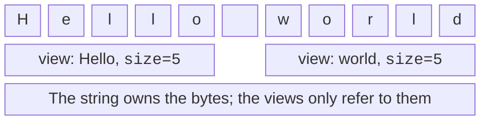

# Strings and string_view

## A string as a sequence of bytes

`std::string` from `<string>` owns
a sequence of `char`. It supports
concatenation `+`, appending `+=`,
comparison and resizing. The
`size()` member function counts code units, and
for UTF-8 these are bytes, not letters and
not visible characters. Therefore all exercises
with character indexing in this topic
use ASCII. Ukrainian
strings can be stored and printed
as a whole without character-by-character manipulation.

`std::getline(std::cin, text)`
reads a line together with spaces
up to the newline, which it discards.
After a previous `>>`, the stream
may still contain `\n`, and the first
`getline` will return an empty string.
You need to deliberately discard the rest
of the previous line or read all
data as lines. `std::ws` skips
all leading whitespace, so it is not
suitable if it is significant.

The `find` member function returns a position or
`std::string::npos`. Do not compare
the result only with zero: a match at
position 0 is a success. `substr(pos,count)`
creates a new string, while `replace`,
`insert`, `erase` modify the existing one.
After a modification, the positions of the remaining characters
may shift. When searching for
several matches, always define
how the position will move, especially
when the replacement again contains the searched text.

`starts_with`, `ends_with` and
`contains` read as specific
checks; the last one belongs
to C++23. String comparison
is lexicographic by code units,
not by the rules of Ukrainian
dictionary order. The string `"10"`
precedes `"2"` lexicographically,
although the number 10 is greater than 2.


Figure 4.4. Viewing a long string {.caption}

The `<cctype>` header has `std::isdigit`,
`std::toupper` and other classifiers.
Before passing an arbitrary `char`,
it is converted to `unsigned char`;
a negative value of a signed `char`
is not a valid ordinary argument.
These functions do not decode UTF-8.
Converting each byte of a Cyrillic
letter with `toupper` will not produce
a correct Unicode uppercase letter.

## Converting numbers and text

`std::to_string` creates a string from
a number; for controlled formatting
`std::format` from `<format>` is more useful.
Unlike `println`, it
returns the text and does not print it.
`std::stoi` and `std::stod` read
a number from a string, can throw exceptions
and, without checking the position, allow
an unused suffix. Therefore a successful
parse does not yet prove that the whole
string was a valid number.

`std::from_chars` from `<charconv>`
returns a pair: a pointer to the first
unprocessed character and an error code.
For a complete number you need to check both
`ec == std::errc{}` and
`ptr == end`. Invalid syntax
and an out-of-range value are different
reasons for failure. The function does not
skip leading whitespace and does not
depend on the current locale; this
is convenient for a machine format.

If the program expects an entered
whole line, first read
it, define the whitespace policy,
then parse. Do not use
`atoi` if you need to distinguish
a genuine zero from a failed parse.
Documentation: <https://learn.microsoft.com/cpp/standard-library/charconv-functions>.

## string_view and lifetime

`std::string_view` from `<string_view>`
is a non-owning view: it
remembers the start and the length
of already existing text. It does not
copy the characters and does not extend
the owner’s lifetime. This is convenient for a
parameter of a reading function or
for a part of a long unchanging
string (Fig. 4.5).



Figure 4.5. Two views of a shared buffer {.caption}

`string_view view = std::string{"temporary"};`
creates a dangling view after
the statement ends: the temporary
string is already destroyed. Similarly,
reallocation of the buffer of the owning
string can invalidate its old
views. The safe
principle: the owner lives longer than
all views and does not change the buffer
while they are in use.

`view.substr` returns another
view, whereas `string.substr`
returns a new owning string.
You need to remember this difference
when returning a result from
a function. In addition, a view
of a part of a string does not necessarily
end with a null byte.
Passing `view.data()` to an old
C API that expects a null-terminated
string without ensuring this
condition is dangerous.

### Example 4. ASCII text statistics

The program splits one line into
words by spaces and tabs,
counts them and finds the longest one.
Punctuation remains part of the
word. For equal lengths
the first word is chosen.

```cpp
#include <string>
#include <string_view>
#include <iostream>
#include <print>

int main()
{
    std::string line;
    if (!std::getline(std::cin, line)) return 1;
    for (unsigned char c : line)
        if (c > 127) return 1;
    const std::string_view text{line};
    std::string_view longest;
    std::size_t count{}, position{};
    while (position < text.size())
    {
        position = text.find_first_not_of(" \t", position);
        if (position == text.npos) break;
        auto end = text.find_first_of(" \t", position);
        if (end == text.npos) end = text.size();
        const auto word = text.substr(position, end - position);
        ++count;
        if (word.size() > longest.size()) longest = word;
        position = end;
    }
    std::println("words={}; longest={}", count, longest);
}
```

For `one three two` the answer is
`words=3; longest=three`. For
an empty line the count is 0 and
the longest word is empty. The owner
`line` exists until the end of `main`
and does not change after the views
are created, so the result is safe.
If a function returned a view
of its local string,
the same idea would become an error.
