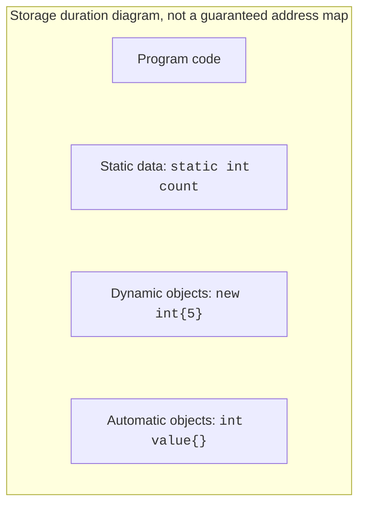
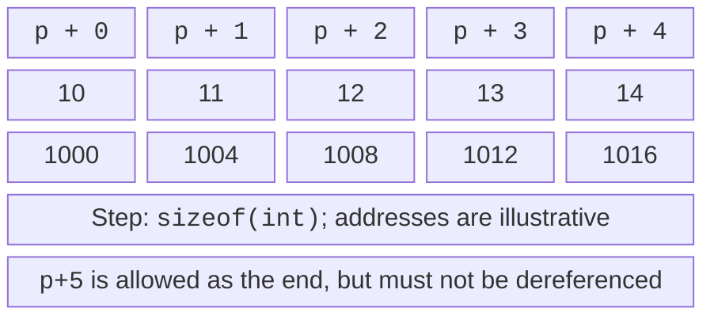

# Memory and pointers

## Memory, objects and storage duration

A program object occupies a region of memory and has a lifetime.
Value, address and owner are different characteristics. The value
of an integer object may be 5, its address is where it is located,
and its owner is the object or scope responsible for ending
its lifetime. A pointer stores an address, but the mere fact that it stores
an address doesn’t tell you who must release the resource.

Automatic local objects live within the corresponding
call or block. An implementation often places them on the stack,
but the standard describes storage duration, not the mandatory physical
location of each variable. Static objects exist
for a long period of the program’s execution. Dynamic
objects are created by a separate operation and need
a defined mechanism for releasing them (Fig. 5.1).



Figure 5.1. The main categories of program memory {.caption}

In popular diagrams the stack and the heap grow toward each other,
but the real virtual address space of a modern OS
is more complex. Don’t use such a diagram for
arithmetic comparison of addresses of independent objects.
The operating system and security mechanisms may change
addresses between runs. A test should check behavior,
not a specific hexadecimal address.

**Ownership** is responsibility for a resource.
The owner must end its lifetime exactly once
and no earlier than all permitted accesses have finished.
Modern C++ expresses this through owner objects:
vector owns a buffer, string owns text,
unique_ptr owns a single dynamic resource.
These objects are what usually replace manual new/delete.

## Pointers and access operations

A **pointer** of type `int*` can store
the address of an int or the null value `nullptr`.
The operation `&value` takes an address, and `*pointer`
**dereferences** the pointer, that is,
accesses the object at the address. The same
symbol `*` can mean different things in different contexts:
part of a type, dereferencing or multiplication.

A null pointer doesn’t designate an object. Check it
before access if the absence of an
object is an allowed part of the interface.
A non-null value by itself doesn’t prove
validity: the pointer may point to an already
destroyed object. Initialize pointers;
don’t rely on random bits of local memory.

`const int* p` lets you change the address itself,
but not the number through p. `int* const p = &x`
fixes the address but lets you modify x.
`const int* const p` restricts both actions.
When reading a type, ask separately: what can
be modified through the access, and can
the pointer itself be reassigned. For a structure, `p->field`
is shorthand for `(*p).field`.

### Example 1. Address and dereferencing

```cpp
#include <print>

int main()
{
    int value = 5;
    int* pointer = &value;
    int& reference = value;
    *pointer = 8;
    reference += 2;
    std::println("value={}, pointed={}", value, *pointer);
    std::println("same address: {}", pointer == &reference);
    pointer = nullptr;
    std::println("empty: {}", pointer == nullptr);
}
```

```text
value=10, pointed=10
same address: true
empty: true
```

There is one object; pointer and reference provide different
forms of access to it. Assigning nullptr
doesn’t destroy value: the pointer in this example
isn’t an owner. To print an address with println,
use `static_cast<void*>(pointer)`;
don’t confuse the address of a char pointer with
printing the text of a null-terminated string.

A reference to an ordinary object must be
bound to it when it is created and
cannot be reseated. A pointer is convenient
when the observed object may be absent or may
change. A reference is convenient
when the object is guaranteed to exist for the duration of the
call. Both forms can become
dangling if a lifetime is violated.

## Arrays and pointer arithmetic

For an array `int values[5]`, the value
`values` in many expressions is converted
to the address of the first element. If p
points to it, `p+1` designates the
next element, not the next byte.
The step equals `sizeof(int)`.
`p[i]` is equivalent to `*(p+i)` within
the bounds of a valid array (Fig. 5.2).



Figure 5.2. Pointer steps within a single array {.caption}

You may form the address immediately
after the last element as an end
marker. You must not dereference it.
Subtracting pointers is meaningful only
within the same array or
its end; the result has the signed
type `std::ptrdiff_t` from `<cstddef>`.
Arithmetic between independent allocations
is not a way to find the distance between
two arbitrary objects.

A C string is a sequence of char
terminated by a null byte `\0`.
`const char*` doesn’t carry a length.
A function must have a guarantee
that the terminating null is accessible,
or a separate buffer size.
Searching for the null beyond accessible
memory is an error. The argv
arguments provide null-terminated
strings from the launch environment;
this is not permission to arbitrarily
enlarge their buffers.


Figure 5.3. Viewing elements by address {.caption}
