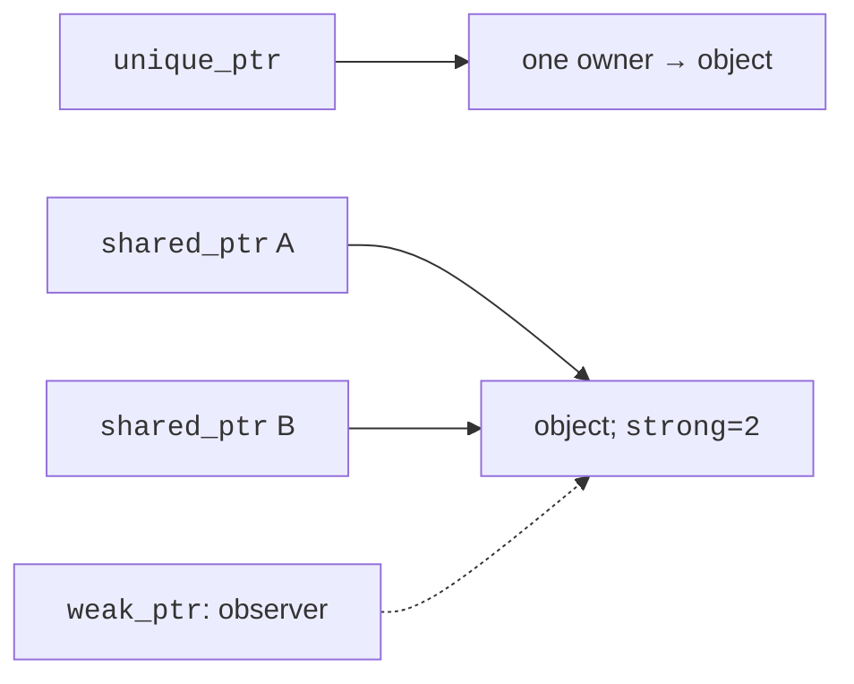
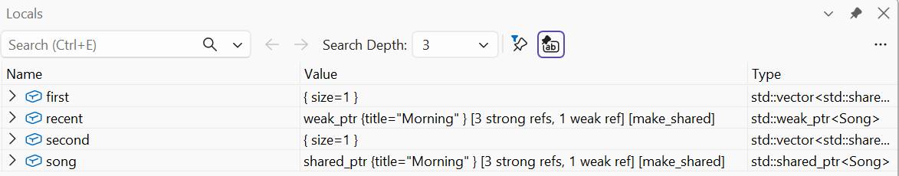
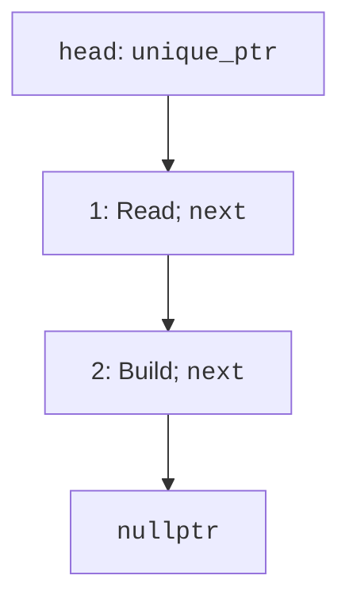

# Smart pointers

## unique_ptr: a single responsible owner

`std::unique_ptr<T>` from
`<memory>` expresses
exclusive ownership.
When the owner’s lifetime
ends, the resource is automatically
released. The call
`std::make_unique<T>(args)`
combines allocation and
transfer of ownership
without an exposed intermediate
raw pointer.
Copying a unique_ptr
is forbidden, because two
independent exclusive
owners of one resource
would contradict the model.

Transfer of ownership
is expressed with `std::move`.
For unique_ptr, after
such a move the
source is empty, and
the recipient manages the resource.
Here move expresses the
intent to transfer; we will study
move semantics in detail
in Topic 8.
Don’t dereference the old
source after the transfer.

`get()` gives a non-owning
address for short-term
use; you don’t
need to release it.
`reset()` releases the
current resource and
can accept another one.
`release()` hands over the
raw address and
stops owning it
**without releasing it**.
It is release that often
creates a leak in
code where it is
mistaken for delete.

The array form
`unique_ptr<T[]>`
uses delete[];
`make_unique<int[]>(n)`
creates zero-initialized elements.
However, it doesn’t provide the size or
convenient append operations,
so for a sequence
you usually need a vector.
A smart pointer is not
a replacement for all
containers.

## shared_ptr and weak_ptr

`std::shared_ptr<T>`
lets several
owners jointly
hold an object.
Copying increases the
number of strong owners;
the object is destroyed
after the last one goes away.
`make_shared` creates the
object and the control
data. `use_count()`
shows the current
number of owners,
but it is not a mechanism
for synchronizing business logic.



Figure 5.6. Exclusive ownership, shared ownership and observation {.caption}

Don’t create two
shared_ptr objects independently
from the same raw
address. They will have
separate control blocks
and will try to release
the resource twice.
For shared ownership,
copy an existing
shared_ptr. The counter
and the control block
have overhead,
so choose shared ownership
when it is needed,
not “just in case.”

If A holds B
via shared_ptr, and B
holds A, the strong
counters will not reach
zero even after
external access is lost.
`std::weak_ptr<T>`
expresses observation
without holding the object.
`lock()` returns a
temporary strong
owner or an empty
shared_ptr. Check
the result you get
and use exactly
that, not a separate
sequence of expired
and an assumption about
the future state.

### Example 3. A song in two playlists

```cpp
#include <memory>
#include <vector>
#include <string>
#include <print>

struct Song { std::string title; };

int main()
{
    auto song = std::make_shared<Song>(Song{"Morning"});
    std::weak_ptr<Song> recent = song;
    std::vector<std::shared_ptr<Song>> first{song};
    std::vector<std::shared_ptr<Song>> second{song};
    std::println("Owners: {}", song.use_count());
    song.reset();
    first.clear();
    if (auto active = recent.lock())
        std::println("Available: {}", active->title);
    second.clear();
    std::println("Expired: {}", recent.expired());
}
```

```text
Owners: 3
Available: Morning
Expired: true
```

The initial owner and
the two vectors explain the
count of 3. The temporary
`active` lives only
inside the if, so
after it, clearing
the second playlist
destroys the song.
The weak view remains,
but it can no longer
provide the object.



Figure 5.7. Shared owners in the debugger {.caption}

## A linked list with exclusive ownership

A list node contains
data and the owner
of the next node.
The head owns the first node,
the first owns the second, and so on.
The last next is empty.
This is an unambiguous chain
of responsibility without
a strong cycle
(Fig. 5.8).



Figure 5.8. The chain of node ownership {.caption}

### Example 4. A task list

```cpp
#include <memory>
#include <string>
#include <print>
#include <utility>

struct Node
{
    std::string task;
    std::unique_ptr<Node> next;
};

void push(std::unique_ptr<Node>& head, std::string task)
{
    auto node = std::make_unique<Node>();
    node->task = std::move(task);
    node->next = std::move(head);
    head = std::move(node);
}

int main()
{
    std::unique_ptr<Node> head;
    push(head, "Build");
    push(head, "Read");
    for (const Node* p = head.get(); p; p = p->next.get())
        std::println("{}", p->task);
    if (head)
    {
        auto removed = std::move(head);
        head = std::move(removed->next);
    }
    std::println("First now: {}", head->task);
}
```

```text
Read
Build
First now: Build
```

The raw p in the traversal
is not an owner.
It only reads
nodes while head
holds the chain.
Removal first
moves the head
to a separate owner,
then moves next
into its place.
After the block, removed
destroys only the removed
node, because the successor
already has a new owner.

For a very long
chain, recursive
destruction of nested
unique_ptr objects can
create a deep
stack. A production
container uses
iterative cleanup.
The teaching example
has only two
nodes, but it is important to know this
limitation before
scaling up.
