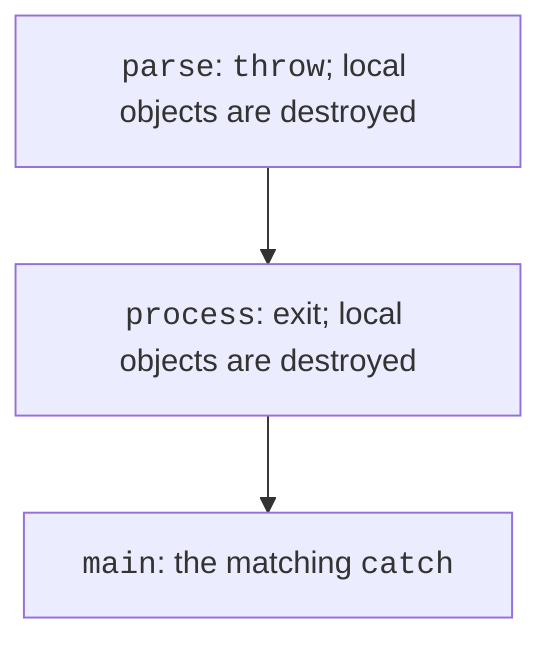
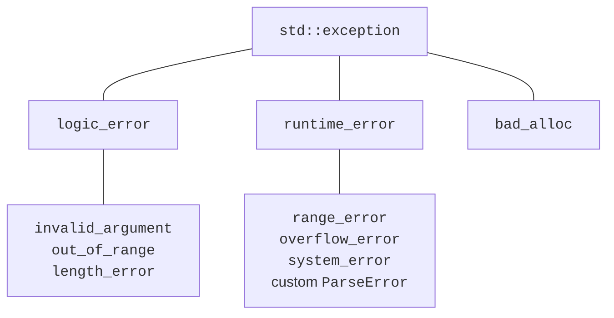
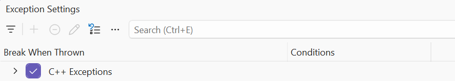

# assert and exceptions

## assert, static_assert and context

`assert(condition)` from `<cassert>`
checks an internal condition
in configurations where
`NDEBUG` is not defined.
If the condition is false, the program
terminates abnormally
with a diagnostic.
It is a tool for finding
violations of invariants,
not a replacement for validating
user input.
In Release, assert
is often disabled.

Don’t write `assert(++count > 0)`:
the side effect will disappear together
with the check. The operation
must be separate,
and the assertion should only
observe the state.
`static_assert` works
at compile time
and checks a constant
expression; an index entered from
the keyboard
cannot be checked this way.

`std::source_location` from
`<source_location>` lets you
pass the file name,
line and function to
a log. A default
argument with `current()`
stores the call site,
not just a single
line inside
the logging function.
`std::stacktrace` from
`<stacktrace>` in C++23
can provide the stack;
the details of symbolization
depend on the build
and the available symbols.
Addresses and text
are not constant
across all runs.

In the tested MSVC
toolset, the C++26 header
`<debugging>`
is missing.
That is why `std::breakpoint`
is not used
in the runnable
examples. The presence of
a similar IDE debugging
feature
doesn’t mean support for the
standard library
function.

## An exception as a way to pass on a failure

An **exception** passes
information about the impossibility
of performing an operation to
a suitable handler.
`throw value;` creates
a failure situation,
`try` delimits the code,
and `catch` describes
the reaction. After throw,
normal execution
of the current function doesn’t
continue from
the next line.

While a handler is being
searched for,
**stack unwinding** is performed:
fully constructed
automatic objects of the abandoned
scopes are destroyed. That is why
RAII owners of memory,
files and locks
are important for correct
cleanup (Fig. 6.5).
A raw pointer won’t
release a resource
automatically just
because a block is exited.



Figure 6.5. Exception propagation and destruction of local objects {.caption}

Standard exceptions
derive from
`std::exception`.
`what()` gives a
diagnostic message.
`std::invalid_argument`
is appropriate for
an invalid argument,
`std::out_of_range`
for going beyond
the allowed range,
and `std::runtime_error`
for a failure
at run time.
The hierarchy lets you
have specific
and general
handlers.



Figure 6.6. Part of the standard exception hierarchy {.caption}

Catch by
`const std::exception&`
so as not to copy
and not to slice
the derived part
of the object. Specific
catch clauses go
before general ones.
`catch (...)`
catches any
C++ exception, but
doesn’t provide its
typed data.
Don’t use
an empty catch
that silently
pretends to succeed.

### Example 2. Division with a check

```cpp
#include <print>
#include <iostream>
#include <stdexcept>
#include <cmath>

double divide(double a, double b)
{
    if (!std::isfinite(a) || !std::isfinite(b))
        throw std::invalid_argument("Finite operands required");
    if (b == 0) throw std::invalid_argument("Zero divisor");
    const double result = a / b;
    if (!std::isfinite(result))
        throw std::overflow_error("Result is not finite");
    return result;
}

int main()
{
    try
    {
        double a{}, b{};
        if (!(std::cin >> a >> b))
            throw std::invalid_argument("Two numbers required");
        std::println("{:.3f}", divide(a, b));
    }
    catch (const std::invalid_argument& error)
    {
        std::cerr << "Input: " << error.what() << '\n';
        return 1;
    }
    catch (const std::exception& error)
    {
        std::cerr << "Failure: " << error.what() << '\n';
        return 2;
    }
}
```

The input `7 2` gives `3.500`.
`7 0` gives the message
`Input: Zero divisor` and
exit code 1. An overflow
of the result goes
to the general catch
with code 2. The computation
function doesn’t print the
error itself: main makes the
decision about the user
interface.


Figure 6.7. Stopping on an unhandled exception {.caption}

Rethrowing with
`throw;` inside
a catch preserves
the current exception.
Writing `throw error;`
may create a copy
with the static type
of the variable and lose
the derived information.
A handler that only
adds context to
the log can
execute throw;
for the higher level.

In *Exception Settings*
you can break at
the moment a C++ exception is thrown,
even if it is
caught later.
This helps you see
the initial state.
The fact that the debugger
stopped doesn’t yet
mean
that the program
has no catch.



Figure 6.8. Break policy for C++ exceptions {.caption}
