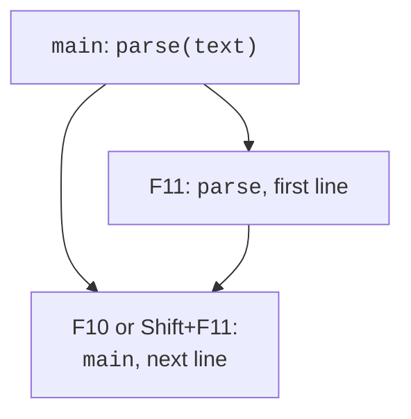
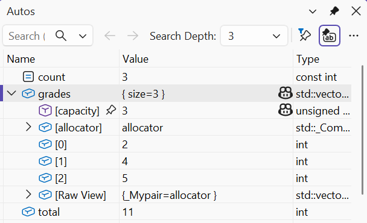
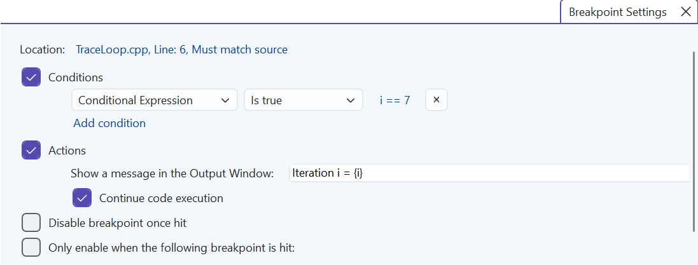
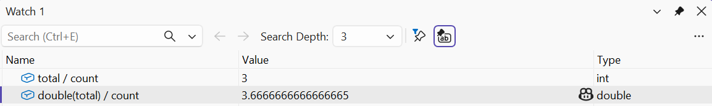

# Errors and the debugger

## An error as a violation of expected behavior

Debugging doesn’t start with a random change to the code,
but with a precise description of the discrepancy. Write down the input,
the expected result and the actual result.
A reproducible example lets you test a hypothesis
about the cause. If an error occurs only occasionally,
save the sequence of actions, the build version, the configuration
and the required external data. Without this, a fix
is hard to tell apart from a lucky successful run.

A syntax error prevents compilation,
and a linker error prevents the creation of a finished file.
A logic error lets the program run,
but the answer is wrong. A runtime error
may show up as an exception, termination of the process
or a sanitizer message. Undefined
behavior is not obliged to show up in any
of these ways: for example, an out-of-bounds access
to an array may corrupt other data without an immediate crash.

Not every failure is a defect in the program.
A missing file, an invalid string format
or an insufficient balance may be
expected situations that the interface
must describe. At the same time, an invalid
index produced by your own algorithm
may indicate a violation of an internal
invariant. These cases require
different ways of diagnosis and recovery.

### Example 1. An average grade and integer division

The program deliberately shows an incorrect and
a corrected expression. The value of sum is 11,
and count is 3. A conversion after the division
doesn’t restore the lost fractional part.

```cpp
#include <vector>
#include <print>

int main()
{
    const std::vector<int> grades{2, 4, 5};
    int total{};
    for (int grade : grades) total += grade;
    const int count = static_cast<int>(grades.size());
    const double wrong = total / count;
    const double correct = static_cast<double>(total) / count;
    std::println("Wrong: {:.2f}", wrong);
    std::println("Correct: {:.2f}", correct);
}
```

```text
Wrong: 3.00
Correct: 3.67
```

Set a breakpoint before computing
wrong. Check total and count, then
the type of the expression `total / count`. The input
is correct and the sum is correct; the first
discrepancy occurs exactly in the division.
The fix must change the type
of an operand before the operation, not the print
format. An empty vector would
also require a separate check of
count, which this fixed example doesn’t need.

## Working with the Visual Studio debugger

A **breakpoint** pauses
execution before the corresponding line.
In the editor you set it with **F9**,
and you start the program with **F5**. The
current instruction arrow doesn’t mean
that the statement has already executed. This
matters when you read values before
an assignment. You can open the windows
via *Debug → Windows* while
debugging is paused.

**F10** (*Step Over*) executes the current
line without stepping inside
an ordinary call. **F11** (*Step Into*)
goes into the function if
its code and debug information are available.
**Shift+F11** (*Step Out*) finishes
the current call and stops in
the caller. *Run to Cursor* lets you
get to the selected line. These actions
change the way you observe the program, not
its mathematical meaning.



Figure 6.1. Transitions during step-by-step execution {.caption}

*Autos* shows automatically selected
expressions near the current line,
*Locals* shows the local variables of the current
context, and *Watch* shows the expressions
you specify. *Call Stack* shows
the active calls; selecting another
frame changes the viewing context.
A DataTip appears when you hover
over a variable. Documentation:
<https://learn.microsoft.com/visualstudio/debugger/getting-started-with-the-debugger-cpp>.



Figure 6.2. A breakpoint and the computed values {.caption}

A conditional breakpoint lets you
break a loop only when
`i == 7` or another
required condition occurs. In the breakpoint’s
context menu, choose *Conditions…*.
A **tracepoint** performs an action such as
printing a message without
necessarily stopping. This is useful
for a long sequence, but
excessive logging changes the execution
time and creates noise.



Figure 6.3. A conditional breakpoint and a trace action {.caption}

*Immediate* lets you evaluate
expressions in the context of the break.
Don’t call functions with
side effects there without understanding them:
a debugger expression can
change the state and hide
the original cause of the defect.
A temporary change of a variable
is useful for an experiment,
but it is not a fix
of the source text.



Figure 6.4. Custom expressions in Watch and Immediate {.caption}

In Release, the optimizer may
eliminate a variable, reorder
instructions or inline a
function. That is why stepping
doesn’t always correspond
to every source line.
Debugging Release is
possible with the appropriate
symbols, but for an initial
analysis Debug is more convenient.
If a defect exists only
in Release, check for UB
and dependence on
uninitialized values.

*Diagnostic Tools* help you
observe resource metrics.
They don’t prove an algorithm
correct just because the memory
graph is flat. Hot Reload
and Edit and Continue can
apply some changes
during debugging, but
they don’t support every
change to a C++ program.
If an edit is not
supported, stop,
rebuild and repeat the
test. An ASan build has
separate limitations, described
in Topic 5.
