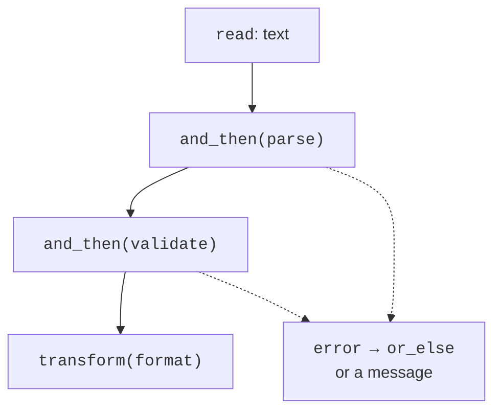

# noexcept, optional and expected

## noexcept and safety guarantees

`noexcept` promises that
no exception will leave
the function. If one
does leave it anyway,
`std::terminate`
is called
instead of normal
propagation to an
outer catch.
Don’t put noexcept
on a function only
to hide a
warning or
in the hope of speeding up
arbitrary code.

The **basic guarantee**
means that invariants
are preserved and
there are no leaks,
but the state may
change. The **strong
guarantee** means
that a failed operation
doesn’t change the observable
state. The **no-fail
guarantee**
means successful
execution without
an exception. Noexcept
by itself
doesn’t prove
logical success:
a function may
return an error
code.

For the strong guarantee,
it is convenient to work with
a temporary state
and then perform
a short, safe
swap. If you simply
modify the first of
two collections,
and the second operation
throws an exception,
the data may
diverge.

### Example 3. Consistent appending to two vectors

```cpp
#include <vector>
#include <print>
#include <stdexcept>

void append_pair(std::vector<int>& ids,
    std::vector<int>& scores, int id, int score)
{
    if (ids.size() != scores.size() || score < 0 || score > 100)
        throw std::invalid_argument("Invalid state or score");
    auto new_ids = ids;
    auto new_scores = scores;
    new_ids.push_back(id);
    new_scores.push_back(score);
    ids.swap(new_ids);
    scores.swap(new_scores);
}

int main()
{
    std::vector<int> ids{1}, scores{80};
    append_pair(ids, scores, 2, 95);
    try { append_pair(ids, scores, 3, 120); }
    catch (const std::invalid_argument&) {}
    std::println("sizes: {}, {}; last: {}, {}", ids.size(),
        scores.size(), ids.back(), scores.back());
}
```

```text
sizes: 2, 2; last: 2, 95
```

Until both
push_back calls complete, the original
vectors are unchanged.
For these vectors
with the standard
allocator, swap
doesn’t throw exceptions.
The empty catch here
is only a controlled
part of the demonstration
of a rejected test;
in a user-facing
program, you must
report the failure.
The price of the strong
guarantee is copies
of the two vectors.

## optional and expected

`std::optional<T>`
from `<optional>`
means a value
or its absence.
It is convenient for a
search where “not
found” is an
ordinary result.
It doesn’t explain
the reason for the absence.
When the reason
matters, C++23
has `std::expected<T,E>`
from `<expected>`:
either a successful T
or an error E.

`std::unexpected(error)`
creates an error
result. `has_value()`
or a boolean check
determines the state.
`value()` returns
the value or throws
bad_expected_access
if there is none.
`error()` requires
the error state.
`value_or(default)`
provides a fallback
value, but it can
hide an important
reason for the failure.

`and_then` calls
the next function,
which itself returns
expected, only
on success.
`transform` converts
a successful value
with an ordinary function.
`or_else` handles
an error and may
return a recovered
result. These are
**monadic operations**;
for practical
use it is enough
to understand the route
of the value and the error.



Figure 6.9. Propagation of success and error in a chain {.caption}

### Example 4. A date with an explicit failure reason

The input is one token in
the format YYYY-MM-DD.
Parsing is separated
from checking the
calendar bounds.
The leap-year rule
uses
the Gregorian calendar.

```cpp
#include <expected>
#include <string_view>
#include <string>
#include <iostream>
#include <print>

struct Date { int year, month, day; };
enum class Error { syntax, range };
using Result = std::expected<Date, Error>;

Result parse(std::string_view text)
{
    if (text.size() != 10 || text[4] != '-' || text[7] != '-')
        return std::unexpected(Error::syntax);
    for (std::size_t i = 0; i < text.size(); ++i)
        if (i != 4 && i != 7 && (text[i] < '0' || text[i] > '9'))
            return std::unexpected(Error::syntax);
    auto number = [&](std::size_t start, std::size_t count)
    {
        int value{};
        for (std::size_t i = start; i < start + count; ++i)
            value = value * 10 + text[i] - '0';
        return value;
    };
    return Date{number(0, 4), number(5, 2), number(8, 2)};
}

Result validate(Date date)
{
    if (date.year < 1 || date.month < 1 || date.month > 12)
        return std::unexpected(Error::range);
    const bool leap = date.year % 400 == 0
        || (date.year % 4 == 0 && date.year % 100 != 0);
    const int days[]{31, 28, 31, 30, 31, 30,
        31, 31, 30, 31, 30, 31};
    const int limit = days[date.month - 1]
        + (date.month == 2 && leap ? 1 : 0);
    if (date.day < 1 || date.day > limit)
        return std::unexpected(Error::range);
    return date;
}

int main()
{
    std::string text;
    if (!std::getline(std::cin, text)) return 1;
    const auto result = parse(text).and_then(validate);
    if (!result)
    {
        std::println("Error: {}", result.error() == Error::syntax
            ? "syntax" : "range");
        return 1;
    }
    std::println("Valid: {:04}-{:02}-{:02}", result->year,
        result->month, result->day);
}
```

`2024-02-29` gives
`Valid: 2024-02-29`,
`2023-02-29` gives
`Error: range`,
and `2024/02/29` gives
`Error: syntax`.
The lambda number is
a short local
function that reads
already validated
digits; the full
theory of lambdas
comes later.
