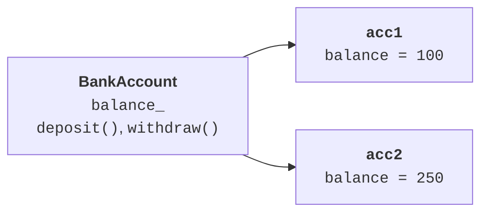
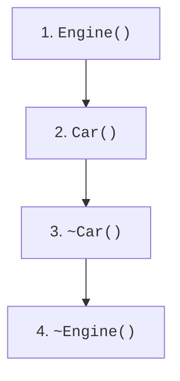

# Class, invariant, and constructors

## State, behavior, and the class invariant

A **class** describes a type of objects: the data they may hold and the
operations on it. An **object** is a concrete instance with its own state. Two
accounts have the same set of member functions but different balances.
Abstraction leaves out what does not matter: for a training account, the
balance and transfers matter, not the color of the card.

An **invariant** is a statement that holds after construction and after every
successful public operation. For our account, the balance lies between zero
and one million currency units. The upper bound is not only a domain rule: it
lets you check an addition before performing it and prevents integer overflow.

Private data members keep outside code from bypassing the rules. However, the
`private` access specifier alone does not create an invariant: a `setBalance`
member function that accepts any number would break the constraint just as
well. It is better to provide domain operations: deposit and withdrawal. A
rejected request must leave the previous balance intact. That is why all
checks run before the data member changes.

`class` and `struct` have the same language capabilities. The difference is
the default access: it is private in a `class` and public in a `struct`; the
same applies to the default kind of inheritance. A struct is convenient for a
simple pair of coordinates, and a class suits an account with behavior. This
is a convention about intent, not a restriction.

The structure is shown in Fig. 7.1.



Figure 7.1. A class and the independent states of its instances {.caption}

### Example 1. A bank account

**Problem.** Create an account with a non-negative balance, perform a deposit and a withdrawal, and check that a rejected operation leaves the balance unchanged.

```cpp
#include <cassert>
#include <print>
#include <stdexcept>

class BankAccount {
    int balance_;
public:
    static constexpr int limit = 1'000'000;

    explicit BankAccount(int value) : balance_(value) {
        if (value < 0 || value > limit)
            throw std::invalid_argument("balance");
    }

    int balance() const { return balance_; }

    void deposit(int value) {
        if (value <= 0 || value > limit - balance_)
            throw std::invalid_argument("deposit");
        balance_ += value;
    }

    void withdraw(int value) {
        if (value <= 0 || value > balance_)
            throw std::invalid_argument("withdraw");
        balance_ -= value;
    }
};

int main() {
    BankAccount account{100};
    account.deposit(50);
    account.withdraw(20);
    try { account.withdraw(131); }
    catch (const std::invalid_argument&) {
        std::println("Rejected");
    }
    assert(account.balance() == 130);
    account.withdraw(130);
    assert(account.balance() == 0);
    try { BankAccount bad{-1}; assert(false); }
    catch (const std::invalid_argument&) {}
    try { account.deposit(0); assert(false); }
    catch (const std::invalid_argument&) {}
    std::println("Balance: {}", account.balance());
}
```

Every rejection happens before the data member changes. The check `limit - balance_` avoids a potentially dangerous addition. The currency units here are integers and purely for training.

Output:

```text
Rejected
Balance: 0
```


Figure 7.2. Adding a class to a project {.caption}

## Constructors and the member initializer list

A **constructor** creates a valid initial state. Its name matches the class
name, and no return type is written. A constructor with parameters is not an
ordinary member function that you can call a second time to “restart” an
existing object. Reusing the state requires a separate operation with a
well-defined contract.

The list after the colon initializes the members before the constructor body
is entered. The entry `hour_(hour)` creates the required value right away.
Assignment in the body happens later; for a `const` data member or a reference,
it cannot replace initialization at all. Members are initialized in the order
they are declared in the class, not in the order they appear in the list. Keep
the two orders the same.

A **delegating constructor** calls another constructor of the same class. The
check then lives in one place. `explicit` forbids an unwanted implicit
conversion from an argument to an object; direct construction such as
`ClockTime{90}` remains available.

A default member initializer, for example `int value_ = 0`, sets a fallback
initial value. If a constructor explicitly initializes this data member, its
initializer list is used instead. `= default` asks the compiler to define the
special member function according to the language rules; it does not promise
that every possible set of data members allows a constructor without
arguments. A data member without an accessible default constructor can make
such a constructor deleted.

The structure is shown in Fig. 7.3.



Figure 7.3. The order of construction and destruction in a composition {.caption}

### Example 2. Time of day

**Problem.** Set the time as a number of minutes or as hours and minutes; normalize non-negative minutes to fit within one day.

```cpp
#include <cassert>
#include <print>
#include <stdexcept>

class ClockTime {
    int minutes_;
public:
    ClockTime() : ClockTime(0) {}

    explicit ClockTime(int total) : minutes_(total % 1440) {
        if (total < 0) throw std::invalid_argument("time");
    }

    ClockTime(int hour, int minute) : ClockTime(0) {
        if (hour < 0 || hour > 23 || minute < 0 || minute > 59)
            throw std::invalid_argument("clock fields");
        minutes_ = hour * 60 + minute;
    }

    int hour() const { return minutes_ / 60; }
    int minute() const { return minutes_ % 60; }
};

int main() {
    const ClockTime t{1501};
    std::println("{:02}:{:02}", t.hour(), t.minute());
    assert(t.hour() == 1 && t.minute() == 1);
    assert(ClockTime{}.hour() == 0);
    assert(ClockTime{1440}.minute() == 0);
    try { ClockTime bad{24, 0}; assert(false); }
    catch (const std::invalid_argument&) {}
    try { ClockTime bad{-1}; assert(false); }
    catch (const std::invalid_argument&) {}
}
```

The constructors have different contracts: a number of minutes may span several days, while a pair of hours and minutes already describes a valid time of day. A constant object is read through `const` member functions.

Output:

```text
01:01
```


Figure 7.4. Class members in Class View {.caption}
