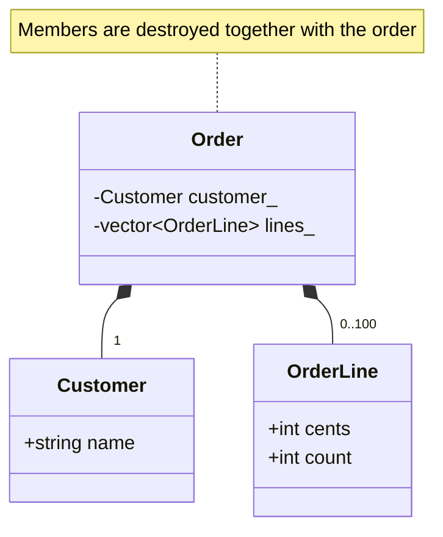

# Composition and object lifetime

## Composition and splitting code into files

**Composition** describes a “has-a” relationship. An order contains a customer
and line items. When the line items are stored by value in a `std::vector`,
the container itself manages their lifetime. Destroying the order destroys its
data members automatically; you do not need to write a loop with `delete`.

The header `Order.h` contains the interface that a user of the type needs.
`Order.cpp` contains the member function definitions; `main.cpp` uses the
interface. Each `.cpp` file is compiled separately, and the linker combines the
results. The command for this example is `cl /std:c++latest /EHsc /W4 /utf-8 main.cpp Order.cpp`.
If you forget `Order.cpp`, the declaration is visible, but the definition will
not be found at link time. This is a different stage from an error about
accessing a private data member.

In this course, `#pragma once` protects a header from being included twice in
the same translation unit; MSVC supports this directive. A header must itself
include the standard headers its declarations need. Do not rely on an
accidental order of `#include` directives in someone else’s file.

`inline static` defines a single data member shared by the whole class, not a
copy per object. In the example, it counts calls to the constructor with
parameters. It is neither a counter of live objects nor a source of uniqueness
for copied orders: copying has its own rules, which we will study in the next
topic.

The structure is shown in Fig. 7.5.



Figure 7.5. An order owns its customer and line items {.caption}

### Example 3. An order with a separate header

**Problem.** Compose an order from a customer and line items, compute the total, and count the originally created orders.

File `Order.h`:

```cpp
#pragma once
#include <string>
#include <vector>
struct Customer { std::string name; };
struct OrderLine { int cents; int count; };
class Order {
    Customer customer_;
    std::vector<OrderLine> lines_;
    inline static int created_ = 0;
public:
    Order(Customer customer, std::vector<OrderLine> lines);
    int total() const;
    static int created() { return created_; }
};
```

File `Order.cpp`:

```cpp
#include "Order.h"
#include <stdexcept>
#include <utility>
Order::Order(Customer customer, std::vector<OrderLine> lines)
    : customer_(std::move(customer)), lines_(std::move(lines)) {
    if (customer_.name.empty() || lines_.size() > 100)
        throw std::invalid_argument("order");
    for (const auto& line : lines_)
        if (line.cents < 0 || line.cents > 10'000 ||
            line.count < 1 || line.count > 100)
            throw std::invalid_argument("line");
    ++created_;
}
int Order::total() const {
    int sum = 0;
    for (const auto& line : lines_) sum += line.cents * line.count;
    return sum;
}
```

File `main.cpp`:

```cpp
#include "Order.h"
#include <cassert>
#include <print>
#include <stdexcept>
int main() {
    const Order a{{"Olena"}, {{2500, 2}, {700, 3}}};
    assert(a.total() == 7100);
    const Order empty{{"Test"}, {}};
    assert(empty.total() == 0);
    try { Order bad{{""}, {}}; assert(false); }
    catch (const std::invalid_argument&) {}
    assert(Order::created() == 2);
    std::println("Total: {} cents; created: {}",
        a.total(), Order::created());
}
```

The limits on the number of line items, the price, and the quantity keep the total within the range of `int`. An empty order is allowed; an empty customer name is not. The counter increases only after the checks.

Output:

```text
Total: 7100 cents; created: 2
```


Figure 7.6. Protection of a private data member {.caption}

## Object lifetime and the destructor

A **destructor** ends an object’s lifetime. For a local object, it is called
automatically when control leaves the scope, including when an exception causes
the exit. For an object managed by `unique_ptr`, it is called when the owner
releases the resource. It is the owner’s lifetime, not the word “heap,” that
determines the moment of cleanup.

In a composite object, the data members are constructed first, and then the
body of the outer class constructor runs. During destruction, the body of the
outer class destructor runs first, and then the data members are destroyed in
reverse order. That is why `Car` can use `engine_` in its destructor, but once
destruction has finished, the object must not be accessed.

If a constructor throws an exception, there is no complete outer object, so its
destructor is not called. However, the data members that were already fully
constructed are destroyed. This guarantee explains why composing classes from
containers and smart pointers is better than managing resources by hand.

Printing messages in the destructor below is tracing for training purposes. An
ordinary class with a `string` and a `vector` usually does not need a
user-defined destructor. A destructor must not let an exception escape: a
second exception during stack unwinding can terminate the program via
`std::terminate`.

### Example 4. Tracing object lifetime

**Problem.** Show the order of construction and destruction of a car with an engine in a nested scope.

```cpp
#include <memory>
#include <print>
struct Engine {
    Engine() { std::println("Engine()"); }
    ~Engine() { std::println("~Engine()"); }
};
class Car {
    Engine engine_;
public:
    Car() { std::println("Car()"); }
    ~Car() { std::println("~Car()"); }
};
int main() {
    std::println("Start");
    {
        auto car = std::make_unique<Car>();
        std::println("Inside");
    }
    std::println("End");
}
```

The dynamic object belongs to a local `unique_ptr`. Leaving the scope destroys the owner, the car, and its engine. There is no manual `delete`.

Output:

```text
Start
Engine()
Car()
Inside
~Car()
~Engine()
End
```
