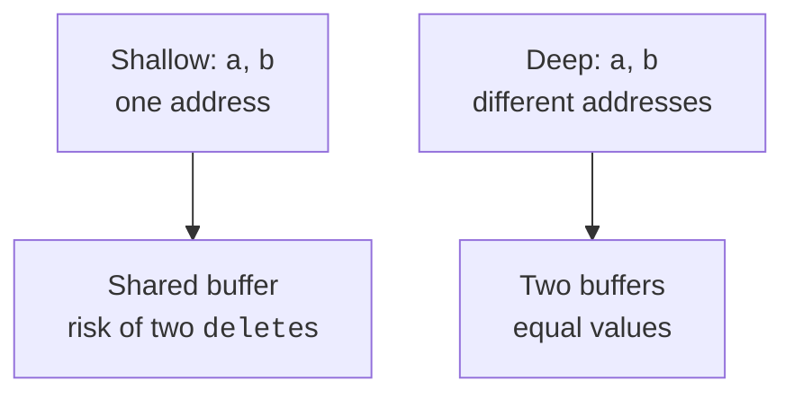
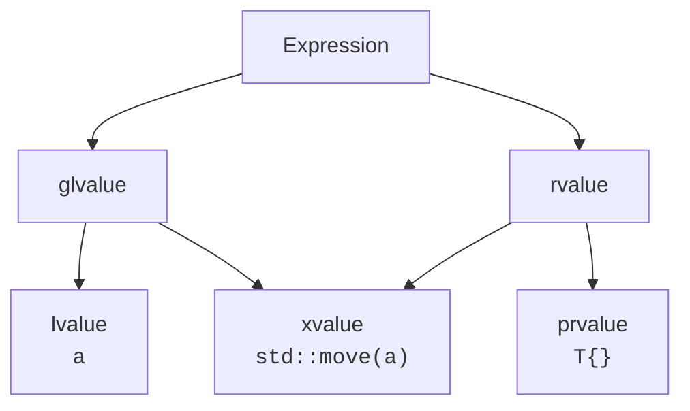

# Copy and move

## Copying a value and copying an address

By default, copying an object with an `int*` data member copies the address. It
does not create a second array. If both objects consider themselves owners,
destroying the first one frees the shared buffer, and the second is left with a
dangling address. Freeing it again has undefined behavior. This is a problem of
the ownership contract, not just of the `delete` syntax.

A **deep copy** creates an independent resource and transfers the values of the
elements. A **shallow copy** transfers only the data members, which may include
an address. It is perfectly correct for a non-owning observer if the external
resource lives long enough. That is why the presence of a pointer by itself does
not mean it must be deleted.

The copy constructor creates a new object from an existing one: `T b{a}`. Copy
assignment changes an already existing object: `b = a`. The second case must
correctly handle the resource that `b` already had, as well as self-assignment
`a = a`. These are different stages of the lifetime, so one correct
implementation does not automatically make the other correct.

For a training string, we represent the empty state as a pair of zero size and a
null address. The `text()` member function returns a standard string, so the
user does not get access to the owned buffer. Production code usually uses
`std::string` right away; the manual implementation is needed here to see the
responsibilities of a resource owner.

The structure is shown in Fig. 8.1.



Figure 8.1. An address copy and an independent copy of a buffer {.caption}

### Example 1. A custom string

**Problem.** Implement an independent copy, copy-and-swap, and buffer transfer; an empty source remains usable.

```cpp
#include <algorithm>
#include <cassert>
#include <print>
#include <string>
#include <string_view>
#include <utility>

class MyString {
    std::size_t size_ = 0;
    char* data_ = nullptr;
public:
    explicit MyString(std::string_view s = {}) : size_(s.size()),
        data_(size_ ? new char[size_] : nullptr) {
        if (size_) std::copy_n(s.data(), size_, data_);
    }

    ~MyString() { delete[] data_; }
    MyString(const MyString& x) : MyString(x.text()) {}
    MyString(MyString&& x) noexcept
        : size_(std::exchange(x.size_, 0)),
          data_(std::exchange(x.data_, nullptr)) {}
    void swap(MyString& x) noexcept {
        std::swap(size_, x.size_);
        std::swap(data_, x.data_);
    }

    MyString& operator=(const MyString& x) {
        MyString temp{x};
        swap(temp);
        return *this;
    }

    MyString& operator=(MyString&& x) noexcept {
        if (this != &x) {
            delete[] data_;
            data_ = std::exchange(x.data_, nullptr);
            size_ = std::exchange(x.size_, 0);
        }
        return *this;
    }

    std::string text() const {
        return size_ ? std::string(data_, size_) : std::string{};
    }
};

int main() {
    MyString a{"alpha"};
    MyString b{a};
    a = MyString{"beta"};
    assert(b.text() == "alpha");
    b = b;
    MyString c{std::move(b)};
    assert(b.text().empty());
    b = c;
    c = std::move(c);
    assert(c.text() == "alpha" && b.text() == "alpha");
    MyString empty;
    empty = std::move(b);
    assert(b.text().empty());
    std::println("{} {}", a.text(), empty.text());
}
```

Copying creates new storage. Moving transfers the address and nulls out the source. Self-move here deliberately keeps the value; this is an explicit contract of this class.

Output:

```text
beta alpha
```


Figure 8.2. Copies and moves during reserve {.caption}

## Move and noexcept

A **move** lets you transfer a resource when the previous value of the source is
no longer needed. `std::move` by itself transfers nothing: it changes the
category of the expression and allows an overload with `T&&` to be selected. The
resource is transferred by the move constructor or the move assignment operator.

For our own buffer, we agree that the source is empty after a move. For many
standard types, the guarantee is weaker: the state is valid, but its specific
value is unspecified unless the documentation promises otherwise. You can
destroy the object or assign a new value to it; perform operations with
additional preconditions carefully.

`noexcept` states that an operation will not let an exception escape. If it
happens anyway, the program terminates via `std::terminate`. For simply
transferring a pointer and a size, such a promise is natural; for an operation
that allocates memory or calls an unknown function, you must not add it just for
the sake of performance.

During reallocation, `vector` tries to preserve its guarantees in case of an
error. If a move can throw and copying is available, the implementation may
copy the old elements. The example compares two types with identical counters
but different move specifications. We deliberately call
`reserve(capacity()+1)` to guarantee that a new buffer is required.

The structure is shown in Fig. 8.3.



Figure 8.3. Expression categories with a shared xvalue {.caption}

### Example 2. A move tracer

**Problem.** Compare the transfer of a single vector element for a non-throwing and a potentially throwing move.

```cpp
#include <cassert>
#include <print>
#include <vector>

struct Safe {
    inline static int copies = 0, moves = 0;
    Safe() = default;
    Safe(const Safe&) { ++copies; }
    Safe(Safe&&) noexcept { ++moves; }
};

struct Risky {
    inline static int copies = 0, moves = 0;
    Risky() = default;
    Risky(const Risky&) { ++copies; }
    Risky(Risky&&) noexcept(false) { ++moves; }
};

int main() {
    std::vector<Safe> a(1);
    a.reserve(a.capacity() + 1);
    std::vector<Risky> b(1);
    b.reserve(b.capacity() + 1);
    assert(Safe::moves == 1 && Safe::copies == 0);
    assert(Risky::copies == 1 && Risky::moves == 0);
    std::println("Safe: copy {}, move {}",
        Safe::copies, Safe::moves);
    std::println("Risky: copy {}, move {}",
        Risky::copies, Risky::moves);
}
```

Creating the initial elements does not copy them. After the forced reserve, the counters show the reallocation choice on the tested implementation. The Risky type does not actually throw, but its signature allows it.

Output:

```text
Safe: copy 0, move 1
Risky: copy 1, move 0
```


Figure 8.4. Forbidden copying of a guard {.caption}
