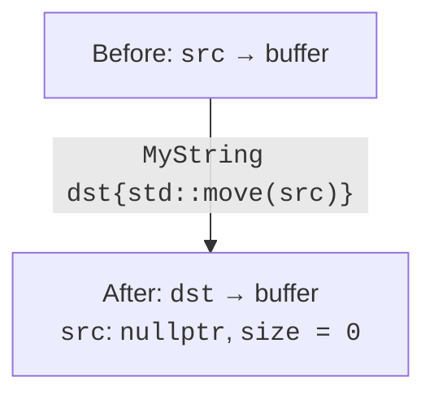
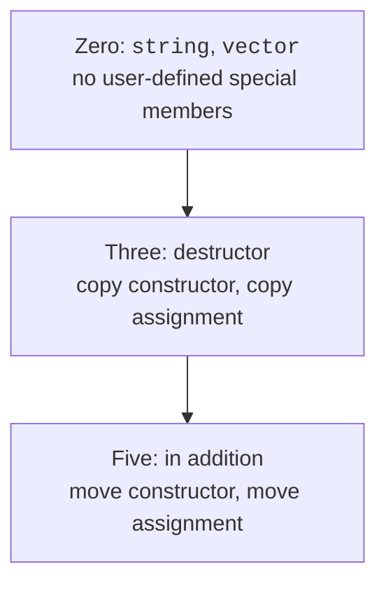

# RAII and the rules of zero, three, and five

## RAII and the scope boundary

**RAII** (*Resource Acquisition Is Initialization*) ties ownership of a resource
to the lifetime of an object. The constructor acquires the resource or reports a
failure, and the destructor releases it. A resource can be memory, a file, a
lock, a temporary stream state, or the right to use a piece of hardware. The key
principle is the same: every resource has a clear owner.

An early `return` or an exception should not require duplicating the cleanup by
hand in every branch. If the resource is held by a correctly implemented RAII
object, stack unwinding calls its destructor. This does not mean that cleanup
happens after the process is forcibly terminated or after a power failure: the
guarantee applies to the normal lifetime mechanism of C++ objects.

A scope timer does not own memory, but it uses the same principle: the moment of
creation is recorded, and the interval is computed on exit. In the example, the
result is written to an external reference; that reference must outlive the
timer. Copying is forbidden so as not to get two independent completions of the
same measurement.

The timer’s destructor does not write to a stream and does not allocate memory.
It only stores a number, so its contract is simpler. For logging, errors of the
write must be handled separately: relying on an exception from a destructor
while another exception is being handled is dangerous.

The structure is shown in Fig. 8.5.



Figure 8.5. Transferring a resource without duplicating the owner {.caption}

### Example 3. A scope timer

**Problem.** Record the duration of a code section even after an exception; forbid copying the timer.

```cpp
#include <cassert>
#include <chrono>
#include <print>
#include <stdexcept>

class ScopeTimer {
    using Clock = std::chrono::steady_clock;
    Clock::time_point start_ = Clock::now();
    double& result_;
public:
    explicit ScopeTimer(double& result) : result_(result) {}
    ScopeTimer(const ScopeTimer&) = delete;
    ScopeTimer& operator=(const ScopeTimer&) = delete;

    ~ScopeTimer() noexcept {
        result_ = std::chrono::duration<double>(
            Clock::now() - start_).count();
    }
};

int main() {
    double elapsed = -1;
    try {
        ScopeTimer timer{elapsed};
        throw std::runtime_error("test");
    } catch (const std::runtime_error&) {}
    assert(elapsed >= 0);
    std::println("Timer finished: {}", elapsed >= 0);
}
```

The numeric time depends on the run. A stable test checks that the destructor ran and stored a non-negative interval. The elapsed object is created before the timer.

Output:

```text
Timer finished: true
```

## The rules of zero, three, and five

The **rule of three** links the destructor, the copy constructor, and copy
assignment. If a class manages a resource by hand and needs one of these
functions, you must at least consider the others deliberately. The **rule of
five** adds the two move operations. These are guidelines for consistent
ownership, not a requirement to write five function bodies everywhere.

The **rule of zero** recommends building classes from types that already manage
resources correctly: `vector`, `string`, `unique_ptr`. Then a domain class does
not define its own special member functions. The compiler combines the semantics
of its data members. If a data member is a `unique_ptr`, copying the class may
automatically be unavailable, and this is often exactly the desired contract.

A user-declared destructor can prevent the implicit generation of move
operations. Declared move operations affect the availability of the implicit
copy operations. Do not memorize this as a rule that “the compiler always
generates everything”: check the specific set of functions and the properties of
all data members and base classes.

`= delete` explicitly forbids an operation, and `= default` asks for an
implementation according to the language rules. This topic uses the portable
form `= delete;`. The new C++26 diagnostic features are not needed for a
move-only contract. The reason for forbidding an operation can be explained
clearly in a comment and in the documentation.

The structure is shown in Fig. 8.6.



Figure 8.6. Choosing an ownership rule {.caption}

### Example 4. The rule of zero

**Problem.** Copy a document built on string/vector and change the copy without affecting the original.

```cpp
#include <cassert>
#include <print>
#include <string>
#include <utility>
#include <vector>

struct Document {
    std::string title;
    std::vector<int> pages;
};

Document makeDocument() {
    return Document{"Report", {10, 20}};
}

int main() {
    Document a = makeDocument();
    Document b = a;
    b.pages.at(0) = 99;
    assert(a.pages.at(0) == 10);
    Document c = std::move(b);
    assert(c.pages.at(0) == 99);
    b = Document{"New", {}};
    assert(b.pages.empty());
    std::println("{}: {}", a.title, a.pages.at(0));
    std::println("{}: {}", c.title, c.pages.at(0));
}
```

The class does not define any special member function. After the move, the test does not rely on an empty string or on the source’s capacity; it explicitly assigns a new valid state.

Output:

```text
Report: 10
Report: 99
```
