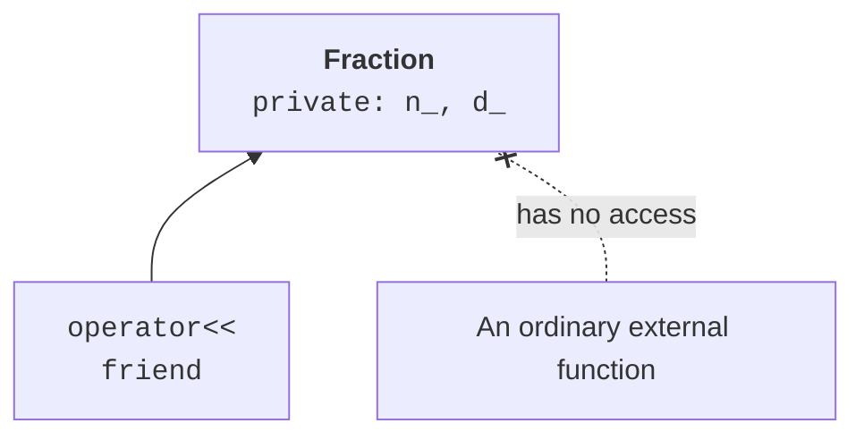

# Indexing, calls and increment

## Indexing and choosing semantics

`operator[]` should mean access to an element, not an arbitrary action.
The non-const overload returns a reference for modification, and the const overload returns
a value or a const reference for reading. Both must follow
the same index rule. In the vector example, only 0, 1 and 2 are allowed.

The standard doesn’t require every `operator[]` to check bounds.
Our teaching class delegates to `std::array::at`, so a wrong index
throws `out_of_range`. You have to read the contract of the specific type;
you can’t assume the behavior of `at` for the unchecked access of other containers.

The unary minus of a vector has a clear geometric meaning. For the dot
and cross products, using `*` for both may confuse
the user. In the example, we choose a named method `dot` so that the name
defines the result. Overloading is a tool, not a requirement
to replace all methods with symbols.

C++23 allows a multi-parameter `operator[]`. The matrix below uses
`m[row, column]`; support was tested on MSVC 19.51 in latest mode.
For an older compiler, you can keep the same contract with
`at(row, column)`. The `deducing this` syntax can reduce duplication,
but in a first implementation two explicit versions are easier to test and explain.

The construction is shown in Fig. 9.5.



Figure 9.5. Explicit access permission for a friend function {.caption}

### Example 3. A vector in space

**Problem.** Provide indexed access, unary minus and the dot product.

```cpp
#include <array>
#include <cassert>
#include <print>
#include <stdexcept>
class Vec3 {
    std::array<double, 3> data_;
public:
    Vec3(double x, double y, double z) : data_{x, y, z} {}
    double& operator[](std::size_t i) { return data_.at(i); }
    const double& operator[](std::size_t i) const {
        return data_.at(i);
    }
    Vec3 operator-() const {
        return {-data_[0], -data_[1], -data_[2]};
    }
    double dot(const Vec3& x) const {
        return data_[0] * x[0] + data_[1] * x[1] +
            data_[2] * x[2];
    }
};
int main() {
    Vec3 a{1, 2, 3};
    const Vec3 b{-1, 0, 2};
    assert(a.dot(b) == 5);
    assert((-a)[2] == -3);
    a[0] = 4;
    try { a[3] = 0; assert(false); }
    catch (const std::out_of_range&) {}
    std::println("Product: {}", a.dot(b));
}
```

The const version lets you read b, but not modify its component through the index. The small integer values used here are represented exactly in double; this test doesn’t claim arbitrary numerical stability.

Output:

```text
Product: 2
```

## Calling an object and increment

A class with `operator()` is called a **function object**,
or functor. Unlike a plain function, it can store state:
the next number, a rate or a call counter. The expression `counter()` calls
a method of the object, so two independent copies of a counter have independent states.

By convention, the prefix `++x` modifies the object and returns a reference
to the new state. The postfix `x++` has a dummy `int` parameter that
distinguishes the signatures, and it usually returns the previous value by value.
It’s convenient to implement it using a copy and the prefix form.

Before incrementing the maximum integer, you have to define the behavior:
throw an exception, saturate at the bound or use a different range.
Signed overflow in the language isn’t an acceptable way to “wrap to zero”.
In the generator example, an explicit refusal without a state change is chosen.

`explicit operator bool` lets you use an object in an `if` condition,
but it doesn’t encourage an unwanted conversion to an integer in arithmetic.
The meaning of true has to be defined in domain terms: a nonzero matrix, an open
resource or a present value. Don’t call true “validity” if all
constructed objects of the class are already required to be valid.

### Example 4. A counter functor

**Problem.** Show a call, prefix and postfix increment, and protection of the maximum bound.

```cpp
#include <cassert>
#include <limits>
#include <print>
#include <stdexcept>
class Counter {
    int value_;
public:
    explicit Counter(int n) : value_(n) {}
    int value() const { return value_; }
    Counter& operator++() {
        if (value_ == std::numeric_limits<int>::max())
            throw std::overflow_error("counter");
        ++value_; return *this;
    }
    Counter operator++(int) {
        Counter old = *this; ++*this; return old;
    }
    int operator()() { return (*this)++.value(); }
};
int main() {
    Counter c{10};
    assert(c() == 10);
    assert((c++).value() == 11);
    assert((++c).value() == 13);
    Counter max{std::numeric_limits<int>::max()};
    try { ++max; assert(false); }
    catch (const std::overflow_error&) {}
    assert(max.value() == std::numeric_limits<int>::max());
    std::println("Current: {}", c.value());
}
```

The postfix form returns a copy of the old state. The counter call uses exactly this form, so it returns the number and prepares the next one. At the maximum bound, the operation doesn’t modify the object.

Output:

```text
Current: 13
```
