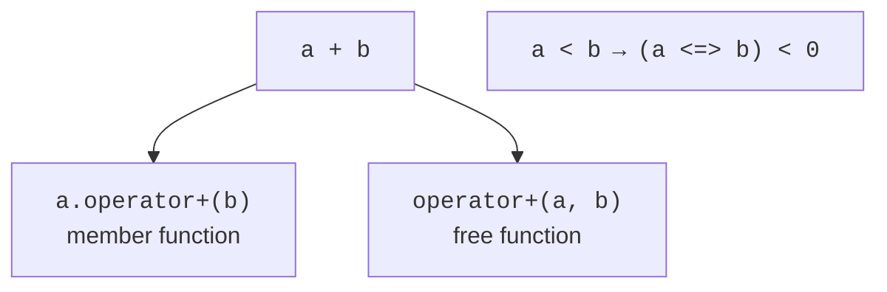
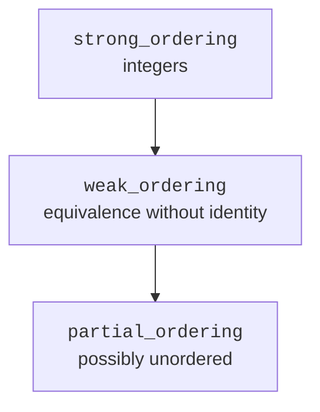
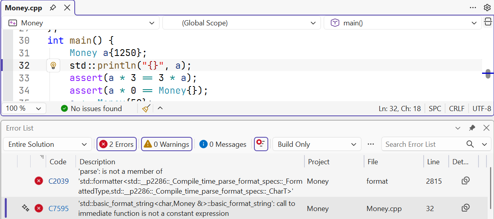

# Operators as an interface

## An operator as part of the interface

An overloaded operator is a function with a special name. The expression `a + b`
for a class type can call a member function or a free function.
This lets you write domain computations naturally: a sum of fractions,
a product of matrices, a comparison of versions. However, a convenient syntax doesn’t justify
unexpected semantics. Addition shouldn’t suddenly write a file.

You can’t create new operator symbols or change their precedence
or arity. In particular, `::`, `.`, `.*` and `?:` can’t be overloaded.
At least one operand of an ordinary overloaded operator must
have a class or enumeration type. Your own class doesn’t give you the right
to redefine what adding two built-in integers means.

A fraction needs an invariant first: the denominator is positive, the numerator
and the denominator are reduced, and zero has a single representation. Without normalization,
equality of the fields won’t match equality of the mathematical values.
The zero-denominator check is done before division or reduction.

The example deliberately limits the input numerators and denominators to one million.
This makes the intermediate products safe for `long long`; a result
that doesn’t satisfy the constructor’s contract is rejected. Full arbitrary
precision is a separate task, not a hidden property of a short class.

The construction is shown in Fig. 9.1.



Figure 9.1. An expression and its possible function forms {.caption}

### Example 1. A fraction

**Problem.** Reduce rational numbers, add them and compare them without floating point.

```cpp
#include <cassert>
#include <compare>
#include <iostream>
#include <numeric>
#include <stdexcept>
class Fraction {
    long long n_, d_;
public:
    Fraction(long long n, long long d) : n_(n), d_(d) {
        if (n < -1'000'000 || n > 1'000'000 ||
            d < -1'000'000 || d > 1'000'000 || d == 0)
            throw std::invalid_argument("fraction range");
        if (d_ < 0) { n_ = -n_; d_ = -d_; }
        const auto g = std::gcd(n_, d_);
        n_ /= g; d_ /= g;
    }
    friend Fraction operator+(const Fraction& a,
                              const Fraction& b) {
        return {a.n_ * b.d_ + b.n_ * a.d_, a.d_ * b.d_};
    }
    bool operator==(const Fraction&) const = default;
    std::strong_ordering operator<=>(const Fraction& x) const {
        return n_ * x.d_ <=> x.n_ * d_;
    }
    friend std::ostream& operator<<(std::ostream& out,
                                    const Fraction& x) {
        return out << x.n_ << '/' << x.d_;
    }
};
int main() {
    Fraction a{1, 2}, b{1, 3};
    assert((a + b == Fraction{5, 6}));
    assert((Fraction{-2, -4} == a));
    assert((Fraction{0, 3} == Fraction{0, 1}));
    assert(a > b);
    try { Fraction bad{1, 0}; assert(false); }
    catch (const std::invalid_argument&) {}
    std::cout << a << " + " << b << " = " << a + b << '\n';
}
```

Normalized fields allow a defaulted equality. The user-defined spaceship operator compares the cross products, not the numerators alone. The outer parentheses in assert are needed where an initializer list contains a comma.

Output:

```text
1/2 + 1/3 = 5/6
```


Figure 9.2. Going to an overloaded operator {.caption}

## Arithmetic, symmetry and compound operators

Usually `operator+=` modifies the left operand and returns a reference
to it. `operator+` can take the left operand by value,
apply `+=` to the copy and return the new value. This way one
implementation defines the arithmetic meaning of both notations.

A member function has an implicit left operand, `this`. For symmetric multiplication
`money * count` and `count * money`, two free functions are convenient: the second
delegates to the first. Don’t make the constructor of an amount implicit just
so that a number is accidentally converted into money in any expression.

Check for possible overflow before the arithmetic. In the money
example, the `limit / count` check is done before the multiplication;
a zero factor is handled without division by zero. `+=` checks
the remaining free range instead of computing an already overflowed sum.

Overloading `<<` works with streams, but it doesn’t automatically make a type
usable with `std::println`. The latter needs a specialization of
`std::formatter`, which uses templates. In this topic, the current
required interface is `operator<<`; we treat formatter as
a further extension after the topic on templates, not as a hidden prerequisite.

The construction is shown in Fig. 9.3.



Figure 9.3. Going from a stronger order to a weaker one {.caption}

### Example 2. Money

**Problem.** Store a non-negative number of cents and make +=, + and symmetric multiplication by an integer count consistent.

```cpp
#include <cassert>
#include <iostream>
#include <stdexcept>
class Money {
    long long cents_;
    static constexpr long long limit = 1'000'000'000;
public:
    explicit Money(long long n = 0) : cents_(n) {
        if (n < 0 || n > limit)
            throw std::invalid_argument("money");
    }
    Money& operator+=(Money b) {
        if (b.cents_ > limit - cents_)
            throw std::overflow_error("sum");
        cents_ += b.cents_; return *this;
    }
    friend Money operator+(Money a, Money b) { return a += b; }
    friend Money operator*(Money a, int n) {
        if (n < 0 || (n > 0 && a.cents_ > limit / n))
            throw std::invalid_argument("count");
        return Money{a.cents_ * n};
    }
    friend Money operator*(int n, Money a) { return a * n; }
    bool operator==(const Money&) const = default;
    friend std::ostream& operator<<(std::ostream& out, Money a) {
        return out << a.cents_ << " cents";
    }
};
int main() {
    Money a{1250};
    assert(a * 3 == 3 * a);
    assert(a * 0 == Money{});
    a += Money{50};
    assert(a == Money{1300});
    try { auto bad = a * -1; (void)bad; assert(false); }
    catch (const std::invalid_argument&) {}
    std::cout << a * 3 << '\n';
}
```

The cents are stored as integers, so the arithmetic doesn’t use approximate fractions. The output deliberately doesn’t change the format of someone else’s stream. Currency conversion isn’t part of this contract.

Output:

```text
3900 cents
```



Figure 9.4. A missing formatter for a user-defined type {.caption}
