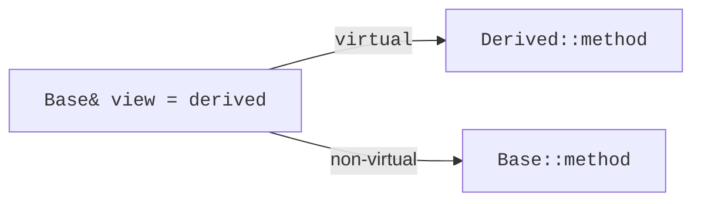
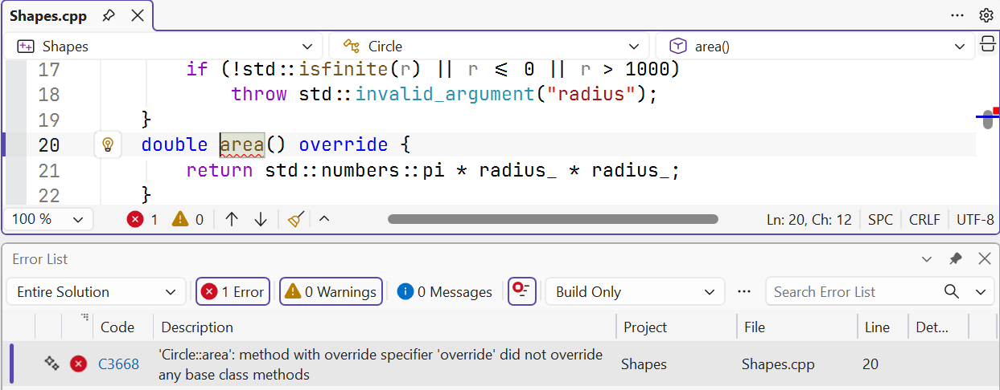
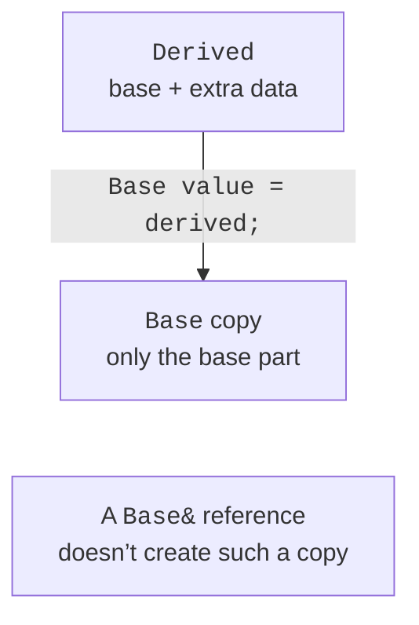

# protected and the exception hierarchy

## Access, protected and reuse

With public inheritance, the public members of the base stay public,
and the protected ones stay protected. The private members of the base exist in the subobject,
but the derived class doesn’t get direct access to them. It uses
the permitted interface just like other parties to the contract.

`protected` allows access to derived classes, but not to all users.
A protected method is often better than a protected field: the method keeps
the check, while the field lets derived code break the invariant at will.
In the employee example, a protected function returns the base pay;
the salary stays private.

With protected inheritance, the public and protected members of the base become
protected in the derived class; with private inheritance, they become private.
These forms don’t express an ordinary external “is-a”: a user can’t always
implicitly convert a derived object to a base reference.
For reusing an implementation, composition is often simpler.

The `final` keyword can end a single override or a whole class.
It documents that further changes to this polymorphic contract
aren’t intended. It isn’t a replacement for encapsulation and doesn’t guarantee
safety in general: private fields and argument checks are still
needed regardless of the ban on further inheritance.

The construction is shown in Fig. 10.5.



Figure 10.5. Static and dynamic choice of a function {.caption}

### Example 3. Employee pay

**Problem.** Add a bonus through a derived class without exposing the salary field.

```cpp
#include <cassert>
#include <print>
#include <stdexcept>
class Employee {
    int salary_;
protected:
    int basePay() const { return salary_; }
public:
    explicit Employee(int n) : salary_(n) {
        if (n < 0 || n > 1'000'000)
            throw std::invalid_argument("salary");
    }
    virtual ~Employee() = default;
    virtual int pay() const { return basePay(); }
};
class BonusEmployee final : public Employee {
    int bonus_;
public:
    BonusEmployee(int salary, int bonus)
        : Employee(salary), bonus_(bonus) {
        if (bonus < 0 || bonus > 100'000)
            throw std::invalid_argument("bonus");
    }
    int pay() const override { return Employee::pay() + bonus_; }
};
int main() {
    BonusEmployee worker{1000, 200};
    const Employee& view = worker;
    assert(view.pay() == 1200);
    Employee zero{0}; assert(zero.pay() == 0);
    try { BonusEmployee bad{10, -1}; assert(false); }
    catch (const std::invalid_argument&) {}
    std::println("Practice payment: {}", view.pay());
}
```

The derived class extends the base formula. The salary is private, and access to it is indirect. This is a teaching model in arbitrary units without real tax rules.

Output:

```text
Practice payment: 1200
```



Figure 10.6. A mismatched override signature {.caption}

## The exception hierarchy and catching

Exceptions also form a type hierarchy. The base `AppError` lets you
catch all application errors, while `ValidationError` and
`NotFoundError` separate the causes. The user decides at which
level they need a reaction: ask for input again or stop the scenario.

Catch polymorphic exceptions by const reference.
Catching by value creates a copy of the declared type and can
slice off the derived part. The order of handlers matters: specific
derived types must come before the general base, otherwise the general branch
catches them first.

Inheriting constructors with `using Base::Base` lets you
use the base constructors to create a derived object
according to the corresponding language rules. It doesn’t copy a ready object
and doesn’t guarantee checks of new fields added in the derived class.
If a new invariant appears, you often need your own constructor.

In a teaching example, the `what()` text only explains the error.
Program logic shouldn’t distinguish types by comparing this text:
the message may change or be localized. Distinguishing
by the exception type is more precise and is checked by the compiler.

The construction is shown in Fig. 10.7.



Figure 10.7. A copy of a base value loses the derived part {.caption}

### Example 4. Custom exceptions

**Problem.** Distinguish an invalid identifier from a missing record by the exception type.

```cpp
#include <cassert>
#include <print>
#include <stdexcept>
struct AppError : std::runtime_error {
    using std::runtime_error::runtime_error;
};
struct ValidationError : AppError { using AppError::AppError; };
struct NotFoundError : AppError { using AppError::AppError; };
void findRecord(int id) {
    if (id <= 0) throw ValidationError("positive id required");
    if (id != 7) throw NotFoundError("record missing");
}
int main() {
    int validation = 0, missing = 0;
    for (int id : {0, 3, 7}) {
        try { findRecord(id); std::println("Found: {}", id); }
        catch (const ValidationError&) { ++validation; }
        catch (const NotFoundError&) { ++missing; }
        catch (const AppError&) { assert(false); }
    }
    assert(validation == 1 && missing == 1);
    std::println("Validation: {}; missing: {}", validation, missing);
}
```

The specialized handlers come before the general one. Inheriting constructors carries over the ability to set a message, but the logic for choosing the cause is in findRecord.

Output:

```text
Found: 7
Validation: 1; missing: 1
```
