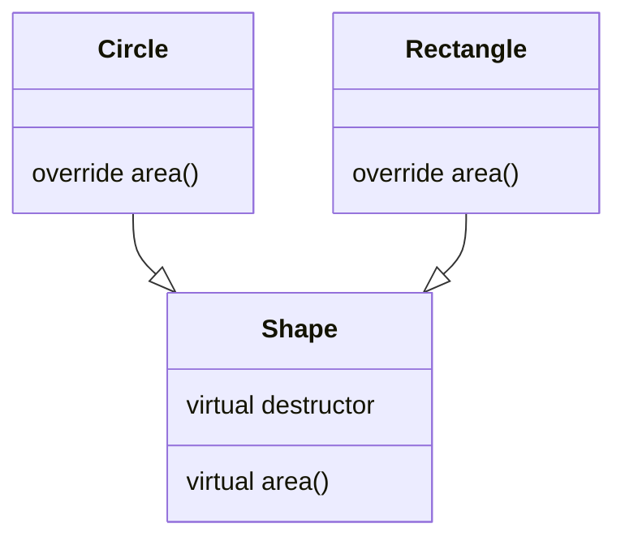
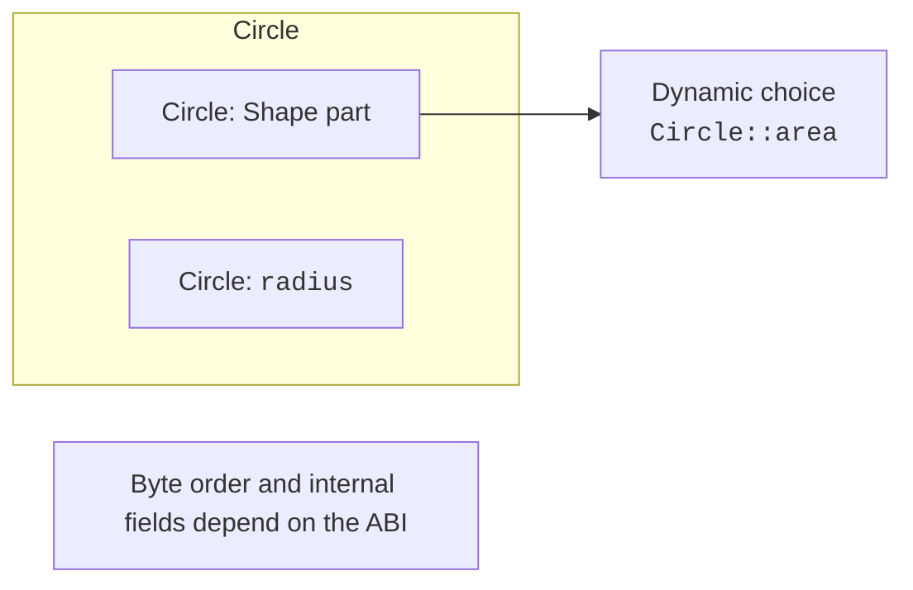

# The “is-a” relationship and a hierarchy

## The “is-a” relationship and the contract of a base type

**Inheritance** creates a derived class based on a base class.
Public inheritance expresses the “is a kind of” relationship: a circle is a shape,
and an hourly worker is an employee within the chosen model. Similar
fields alone aren’t enough. A derived object must be usable wherever
the user expects the contract of the base type.

If a base operation promises to accept any non-negative number
of hours, a derived implementation must not suddenly require exactly eight
without changing the contract. Such a strengthened precondition breaks
substitutability. Likewise, a user of the base type must get
the guaranteed result regardless of the specific kind.

For shapes, the common operation is `area() const`. A circle and a rectangle
compute the area differently, but both return a finite
non-negative area for validated dimensions. A user of the collection shouldn’t
have to ask manually “is this a circle or a rectangle?” to choose a formula.
That’s the practical benefit of dynamic polymorphism.

In the example, the base shape has a neutral area implementation that returns zero.
In the next topic, we’ll turn a similar contract into an abstract class,
which doesn’t allow creating a “shape without a specific kind” at all.
That’s a separate design decision; today it’s important to see behavior
being overridden through a common reference or pointer.

The construction is shown in Fig. 10.1.



Figure 10.1. A common area contract and different implementations {.caption}

### Example 1. Geometric shapes

**Problem.** Collect different shapes into a collection of unique owners and compute the sum of their areas.

```cpp
#include <cassert>
#include <cmath>
#include <memory>
#include <numbers>
#include <print>
#include <stdexcept>
#include <vector>

class Shape {
public:
    virtual ~Shape() = default;
    virtual double area() const { return 0; }
};

class Circle final : public Shape {
    double radius_;
public:
    explicit Circle(double r) : radius_(r) {
        if (!std::isfinite(r) || r <= 0 || r > 1000)
            throw std::invalid_argument("radius");
    }

    double area() const override {
        return std::numbers::pi * radius_ * radius_;
    }
};

class Rectangle final : public Shape {
    double width_, height_;
public:
    Rectangle(double w, double h) : width_(w), height_(h) {
        if (!std::isfinite(w) || !std::isfinite(h) ||
            w <= 0 || h <= 0 || w > 1000 || h > 1000)
            throw std::invalid_argument("sides");
    }

    double area() const override { return width_ * height_; }
};

int main() {
    std::vector<std::unique_ptr<Shape>> figures;
    figures.push_back(std::make_unique<Circle>(1));
    figures.push_back(std::make_unique<Rectangle>(2, 3));
    double sum = 0;
    for (const auto& figure : figures) sum += figure->area();
    assert(std::abs(sum - (6 + std::numbers::pi)) < 1e-12);
    try { Circle bad{0}; assert(false); }
    catch (const std::invalid_argument&) {}
    std::println("Total area: {:.3f}", sum);
}
```

The loop doesn’t distinguish between kinds of shapes. The unique_ptr owner destroys the derived object through the virtual destructor. The finiteness and upper-bound checks reject invalid dimensions.

Output:

```text
Total area: 9.142
```


Figure 10.2. A polymorphic object in Locals {.caption}

## Constructing and destroying a hierarchy

A derived object contains a base subobject. First the base
is constructed, then the fields of the derived class, and then the body of its
constructor runs. If the base needs arguments, the derived constructor
passes them in the member initializer list. Assigning the base in the body is already too late:
its lifetime began earlier.

Destruction goes in the reverse direction: the body of the derived class
destructor, its fields, the base subobject. For three levels A, B, C,
the constructor sequence A–B–C and the destructor sequence C–B–A don’t depend
on the text chosen for the messages. Tracing makes the rule
visible and helps you understand a partially constructed object.

While the base constructor runs, the derived part isn’t ready yet.
That’s why a virtual call from the base constructor doesn’t go to
the future derived implementation. Similarly, in the base destructor,
the derived part is being destroyed or has already been destroyed. Don’t use such
calls as a way to run the full behavior of the most derived class.

Calling a method after construction has finished is a different situation:
the dynamic type is already complete. If you need an action that depends on
the derived implementation, organize it as an explicit next step
or through a factory with a clear contract, not as a hidden
call from the base constructor.

The construction is shown in Fig. 10.3.



Figure 10.3. A conceptual model of a derived object {.caption}

### Example 2. Construction order

**Problem.** Show three levels and a virtual call inside the base constructor.

```cpp
#include <print>

struct A {
    A() { std::println("A()"); who(); }
    virtual ~A() { std::println("~A()"); }
    virtual void who() const { std::println("A::who"); }
};

struct B : A {
    B() { std::println("B()"); }
    ~B() override { std::println("~B()"); }
    void who() const override { std::println("B::who"); }
};

struct C final : B {
    C() { std::println("C()"); }
    ~C() override { std::println("~C()"); }
    void who() const override { std::println("C::who"); }
};

int main() {
    C value;
    const A& base = value;
    base.who();
}
```

The constructor of A calls A::who. After construction is complete, a call through A& reaches C::who. The trace demonstrates the rule, but in a real design it’s better to avoid behavioral virtual calls in constructors.

Output:

```text
A()
A::who
B()
C()
C::who
~C()
~B()
~A()
```


Figure 10.4. Base and derived classes {.caption}
