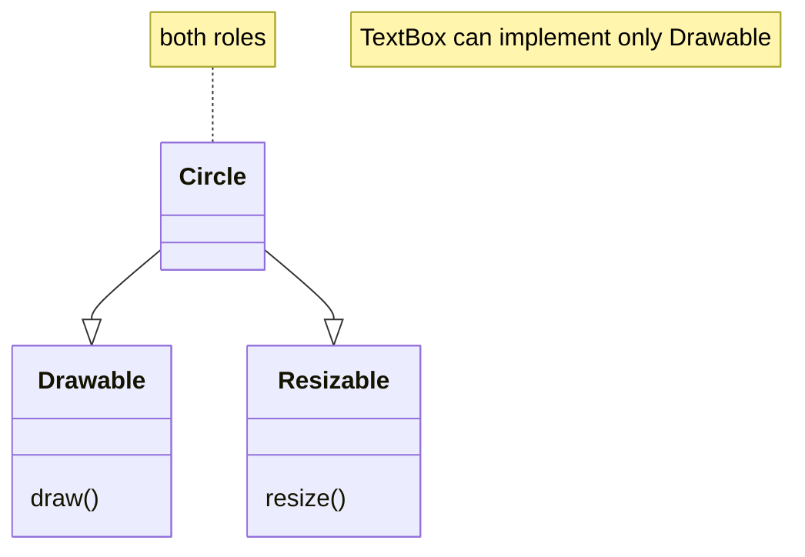
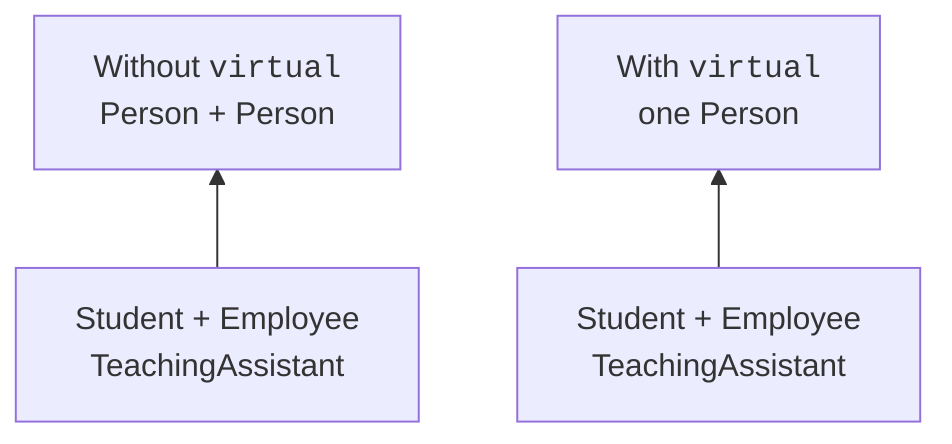

# Abstract classes and NVI

## An abstract class and a pure virtual operation

An **abstract class** has at least one pure virtual function that has no concrete final overrider in that class. The declaration `virtual void draw() const = 0` sets an obligation for derived implementations. You cannot create an object of such a class, but references and pointers to it are needed to work with the shared contract.

Being abstract does not forbid data members, a constructor or ready-made non-virtual methods. The base class can validate a name, store shared state and implement part of an algorithm. It differs from an ordinary class in its unfinished behavior, which a concrete derived type must define.

In C++, an interface is usually represented by an abstract class with a small set of operations. Standard C++ does not need a special `interface` keyword. The name Drawable describes the ability to draw, and Resizable describes the ability to change size. A class can support one ability without the other.

In the example, Shape combines Drawable with a shared area requirement, and Circle also implements Resizable. A client that only prints a drawing description accepts Drawable&, so it does not depend on the radius or on how scaling works. This narrow dependency also makes it usable for a text box or another kind of view.

The structure is shown in Fig. 11.1.



Figure 11.1. Separate roles for drawing and resizing {.caption}

### Example 1. Shapes on a canvas

**Problem.** Combine the drawing and scaling interfaces with an abstract area requirement.

```cpp
#include <cassert>
#include <cmath>
#include <numbers>
#include <print>
#include <stdexcept>
#include <string>

struct Drawable {
    virtual ~Drawable() = default;
    virtual std::string draw() const = 0;
};

struct Resizable {
    virtual ~Resizable() = default;
    virtual void resize(double factor) = 0;
};

struct Shape : Drawable {
    virtual double area() const = 0;
};

class Circle final : public Shape, public Resizable {
    double radius_;
public:
    explicit Circle(double r) : radius_(r) {
        if (!std::isfinite(r) || r <= 0 || r > 1000)
            throw std::invalid_argument("radius");
    }

    void resize(double k) override {
        if (!std::isfinite(k) || k <= 0 ||
            k > 1000 / radius_ || radius_ * k == 0)
            throw std::invalid_argument("factor");
        radius_ *= k;
    }

    double area() const override {
        return std::numbers::pi * radius_ * radius_;
    }

    std::string draw() const override { return "Circle"; }
};

int main() {
    Circle c{1};
    Resizable& sizing = c; sizing.resize(2);
    const Drawable& drawing = c;
    assert(std::abs(c.area() - 4 * std::numbers::pi) < 1e-12);
    try { sizing.resize(0); assert(false); }
    catch (const std::invalid_argument&) {}
    std::println("{}: {:.3f}", drawing.draw(), c.area());
}
```

Each client sees the role it needs. The factor is checked before the radius changes; the sizes are limited to a training range. Drawing here is a text description, not a GUI.

Output:

```text
Circle: 12.566
```


Figure 11.2. Creating an abstract object is forbidden {.caption}

## NVI: a stable wrapper and a variable step

The **NVI** (*Non-Virtual Interface*) idiom provides a public non-virtual method that organizes the algorithm and a private virtual step that can be changed. For example, generate validates the input, adds a header, calls body and adds a footer. A derived type changes only the format of the main part of the report.

The public method is the only entry point for the user. Thanks to this, the size check and the general rules run for every variety. If each derived class overrode the whole generate itself, it could accidentally forget the check or the shared part of the formatting.

A private virtual method can be overridden by a derived class: the right to call it directly and the right to override it are separate language questions. Outside code cannot bypass the wrapper by calling body. The derived class defines the step, but the base algorithm controls where it goes in the sequence.

This is an example of the Template Method pattern, not of C++ templates with `template`. The word “template” here means a recurring design structure. Generic functions and classes in C++ are covered separately in the next topic.

The structure is shown in Fig. 11.3.



Figure 11.3. The difference in the number of subobjects in a diamond {.caption}

### Example 2. A report through NVI

**Problem.** Keep the validation and the header shared, and allow replacing only the report body.

```cpp
#include <cassert>
#include <print>
#include <stdexcept>
#include <string>
#include <vector>

class Report {
    virtual std::string body(const std::vector<int>& x) const = 0;
public:
    virtual ~Report() = default;

    std::string generate(const std::vector<int>& values) const {
        if (values.size() > 100)
            throw std::invalid_argument("too many rows");
        return "Report\n" + body(values) + "End\n";
    }
};

struct ListReport final : Report {
private:
    std::string body(const std::vector<int>& x) const override {
        std::string result;
        for (int n : x) result += "- " + std::to_string(n) + "\n";
        return result;
    }
};

int main() {
    ListReport report;
    const Report& view = report;
    assert(view.generate({}) == "Report\nEnd\n");
    assert(view.generate({2}) == "Report\n- 2\nEnd\n");
    try { view.generate(std::vector<int>(101)); assert(false); }
    catch (const std::invalid_argument&) {}
    std::print("{}", view.generate({2, 5}));
}
```

The public generate is non-virtual. The derived class overrides the private body, but the user cannot call it to bypass the check. An empty report has a defined result.

Output:

```text
Report
- 2
- 5
End
```


Figure 11.4. One device and several base roles {.caption}
