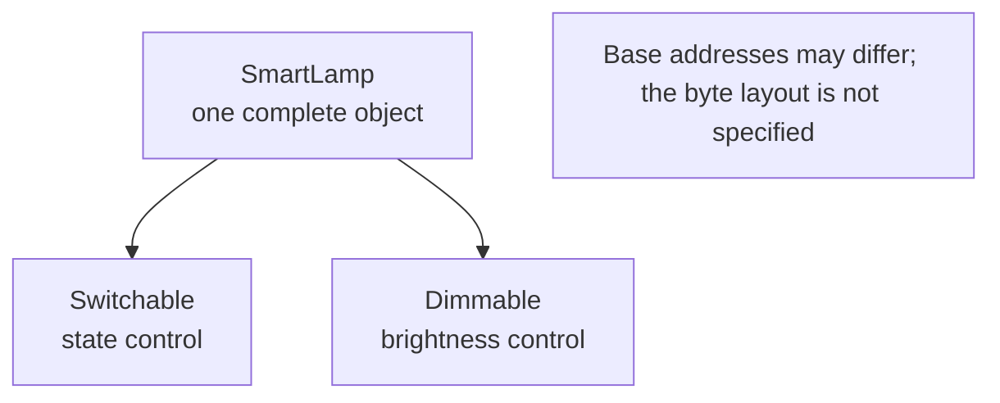
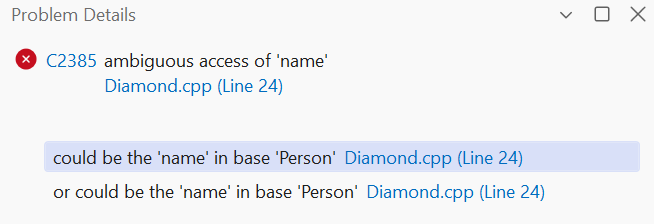
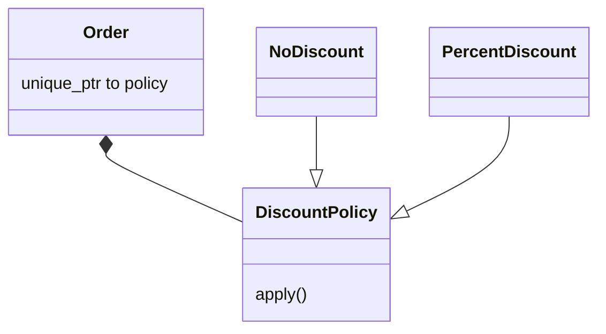

# Virtual base and Strategy

## The diamond and a virtual base

A diamond appears when Student and Employee derive from Person, and TeachingAssistant derives from both. With ordinary inheritance, the assistant contains two Person subobjects. They can have two different names. Accessing `name` without qualification is ambiguous, and this is not just a whim of the compiler.

The qualification `Student::name` selects one path, but it does not merge the two states. If the domain model says that an assistant is one person with two roles, you need a shared representation. Virtual inheritance on both paths to Person provides a single shared subobject of that base.

A virtual base is initialized by the most derived class. That is why TeachingAssistant itself passes the real name to Person when a complete assistant object is created. The Student and Employee constructors may also contain a Person initializer for the cases when they themselves are the most derived objects.

Virtual inheritance and a virtual function solve different problems. The first controls the number of shared base subobjects, the second controls which behavior is selected during a call. Having one does not automatically make the other necessary or sufficient.

The structure is shown in Fig. 11.5.



Figure 11.5. Role subobjects of a single device {.caption}

### Example 3. A teaching assistant

**Problem.** Check the single virtual base Person through both paths of the diamond.

```cpp
#include <cassert>
#include <print>
#include <string>
#include <utility>

struct Person {
    std::string name;
    explicit Person(std::string value) : name(std::move(value)) {}
};

struct Student : virtual Person {
    Student() : Person("student") {}
};

struct Employee : virtual Person {
    Employee() : Person("employee") {}
};

struct TeachingAssistant final : Student, Employee {
    explicit TeachingAssistant(std::string name)
        : Person(std::move(name)), Student(), Employee() {}
};

int main() {
    TeachingAssistant assistant{"Olena"};
    Person* viaStudent = static_cast<Student*>(&assistant);
    Person* viaEmployee = static_cast<Employee*>(&assistant);
    assert(viaStudent == viaEmployee);
    assert(assistant.name == "Olena");
    viaStudent->name = "Mariia";
    assert(viaEmployee->name == "Mariia");
    std::println("Shared person: {}", assistant.name);
}
```

Person is initialized by the most derived TeachingAssistant. The strings student and employee do not become the assistant’s name. Both valid conversions point to the same subobject.

Output:

```text
Shared person: Mariia
```



Figure 11.6. Ambiguity of a non-virtual diamond {.caption}

## Strategy through composition

The **Strategy** pattern separates a variable algorithm from the object that uses it. An order owns a DiscountPolicy, and a concrete policy computes the amount after the discount. To change the rule, you do not need to derive from the order itself for every percentage or campaign.

Owning the policy through unique_ptr means that one order controls its lifetime. The constructor rejects a null pointer because total always expects an available strategy. This is an invariant of the composition, not a check to repeat before every call.

The strategy receives an amount in cents and returns cents. The percentage policy explicitly rounds down for non-negative training amounts. The limits on the amount and the percentage keep the intermediate product from overflowing. Different policies share the same contract for the arguments and the result range.

If the policy changes during the lifetime of the order, you need a replacement operation that checks the new owner. If it is fixed, the constructor is enough. Do not add a setter without a use case: every extra transition enlarges the state space that you will have to test.

The structure is shown in Fig. 11.7.



Figure 11.7. The context owns the variable algorithm {.caption}

### Example 4. A discount policy

**Problem.** Pass a policy to an order through unique_ptr and compare no discount with a 10 percent discount.

```cpp
#include <cassert>
#include <memory>
#include <print>
#include <stdexcept>
#include <utility>

struct DiscountPolicy {
    virtual ~DiscountPolicy() = default;
    virtual long long apply(long long cents) const = 0;
};

struct NoDiscount final : DiscountPolicy {
    long long apply(long long cents) const override {
        return cents;
    }
};

class PercentDiscount final : public DiscountPolicy {
    int percent_;
public:
    explicit PercentDiscount(int n) : percent_(n) {
        if (n < 0 || n > 100) throw std::invalid_argument("rate");
    }

    long long apply(long long cents) const override {
        return cents * (100 - percent_) / 100;
    }
};

class Order {
    std::unique_ptr<DiscountPolicy> policy_;
public:
    explicit Order(std::unique_ptr<DiscountPolicy> policy)
        : policy_(std::move(policy)) {
        if (!policy_) throw std::invalid_argument("policy");
    }

    long long total(long long cents) const {
        if (cents < 0 || cents > 1'000'000'000)
            throw std::invalid_argument("sum");
        return policy_->apply(cents);
    }
};

int main() {
    Order plain{std::make_unique<NoDiscount>()};
    Order sale{std::make_unique<PercentDiscount>(10)};
    assert(plain.total(1000) == 1000);
    assert(sale.total(1000) == 900 && sale.total(0) == 0);
    try { Order bad{nullptr}; assert(false); }
    catch (const std::invalid_argument&) {}
    try { sale.total(-1); assert(false); }
    catch (const std::invalid_argument&) {}
    std::println("With discount: {} cents", sale.total(1000));
}
```

The client of the policy is Order, which checks the shared range precondition. A direct call to apply must also respect this documented precondition; it is not a general-purpose function for an arbitrary long long.

Output:

```text
With discount: 900 cents
```
