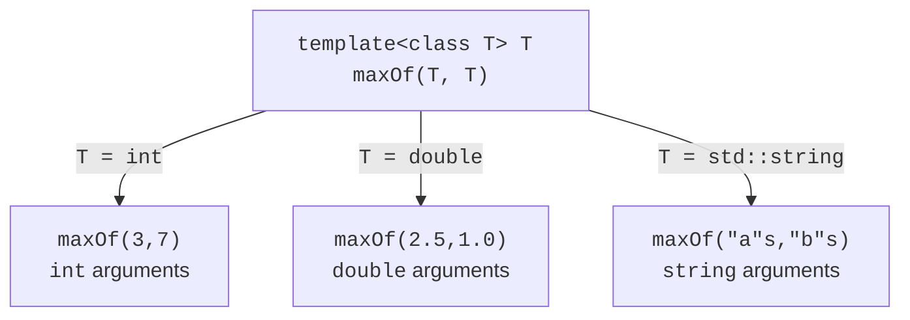

# Function templates and concepts

## Generalization as preserving rules

If computing the mean for `int` and `double` differs only in the element type, copying the function creates two places where the same bug has to be fixed. A template lets you describe the shared algorithm once. However, “works for all types” is not a useful requirement. A mean needs a numeric interpretation, a stack needs to store elements, and finding a minimum needs an ordering. First you define the operations and their semantics, and only then you write down the parameters.

A template does not look up a type while the program runs. The compiler receives the arguments and generates the required specializations. Calls for two types may have different machine code; the optimizer may also inline a call or merge identical code. That is why the training instantiation diagram shows typed functions and does not guarantee three separate blocks of bytes in the executable.

A solution based on `void*` discards the type information. To read the object, you need a correctly cast pointer, a size and an agreement about lifetime. This is appropriate in some low-level interfaces, but it does not improve an ordinary type-safe algorithm. A virtual method solves a different problem: it selects an implementation through a base interface at run time. A template does not need a shared base class, but the type of each particular call must be known at compile time. These approaches can be combined in the same project.



Figure 12.1. One template and three typed calls {.caption}

## Function parameters and type deduction

In `template<class T>`, the keywords `class` and `typename` are equivalent: `T` can denote a fundamental type, not only a class. Declaring a template parameter does not create an object. The ordinary function parameters `a` and `b` have values at run time; `T` sets the type of those values already during translation.

The fragment below returns a copy of the larger argument. This limits it to types that support comparison and the required copying. You must not return a reference to a local variable. A version with references needs a separate lifetime analysis, especially when one of the arguments is a temporary object.

```cpp
template<class T>
T maxOf(T a, T b)
{
    return a < b ? b : a;
}
```

The call `maxOf(3, 7)` deduces `T = int`. For `maxOf(3, 7.5)`, one position suggests `int` and the other `double`; the compiler does not automatically pick a convenient common type. The explicit call `maxOf<double>(3, 7.5)` fixes `T` first, after which the ordinary argument conversions allow the call. Another design uses two type parameters and an explicitly chosen result type. Such a change needs justification, because a hidden narrowing conversion can corrupt large integer values.

With pass by value, a top-level `const` does not become part of the deduced type. In many such calls, an array decays to a pointer. Passing `const T&` can preserve information about the array size, but then the function works with a borrowed object. The signature is part of the contract, not a cosmetic difference between two notations.

The C++20 abbreviated template `auto twice(auto value)` also forms a template. Each independent `auto` in the parameter list is a separate type parameter. That is why `void f(auto a, auto b)` allows different types, unlike `template<class T> void f(T a, T b)`. To tie the types together, use a named parameter or a `std::same_as` constraint.

## A numeric type concept and a complete example

A concept is a compile-time predicate over template arguments. Our `Numeric` accepts integer and floating-point fundamental types. In particular, `bool` satisfies `std::integral`: for statistics of Boolean flags, the mean can mean the proportion of true values, but for physical measurements you should forbid it separately. A concept does not check whether the number of observations is positive; that is a property of the values of a particular call, which we check at run time.

`std::span<const T>` borrows a contiguous sequence and does not own the memory. The arrays in `main` live for the duration of the call, so the references are valid. During type deduction, converting an array to a `span` does not help deduce the parameter inside `span<const T>`; that is exactly why the calls below contain explicit `<int>` and `<double>`. This detail shows the difference between template argument deduction and the ordinary conversion of arguments of an already known function.

### Statistics for any numbers

**Problem.** Compute the mean of two given samples and diagnose an empty one.

```cpp
#include <concepts>
#include <print>
#include <span>
#include <stdexcept>

template<class T>
concept Numeric = std::integral<T>
    || std::floating_point<T>;

template<Numeric T>
double mean(std::span<const T> values)
{
    if (values.empty())
        throw std::invalid_argument("empty sample");
    double sum = 0;
    for (T value : values)
        sum += static_cast<double>(value);
    return sum / static_cast<double>(values.size());
}

int main()
{
    const int counts[]{2, 4, 9};
    const double lengths[]{1.5, 2.0, 4.0};
    std::println("counts: {:.2f}", mean<int>(counts));
    std::println("lengths: {:.2f}", mean<double>(lengths));
    try { mean<int>({}); }
    catch (const std::invalid_argument& e) {
        std::println("error: {}", e.what());
    }
}
```

Output:

```text
counts: 5.00
lengths: 2.50
error: empty sample
```

We accumulate the sum in `double` to avoid integer division. This is a training precision policy: very large integers can lose precision when converted. Monetary values need a different policy. The handler catches exactly the expected empty-sample error; arbitrary errors are not hidden behind a message about a correct mean.

Test a sample with one element, negative numbers and an empty `span`. For `{2, 4, 9}`, the control sum is 15 and the count is 3. First check the numeric result, then the format with two decimal places. If you replace `int` with a class without numeric operations, the failure must occur at the concept boundary, not after the program starts.
