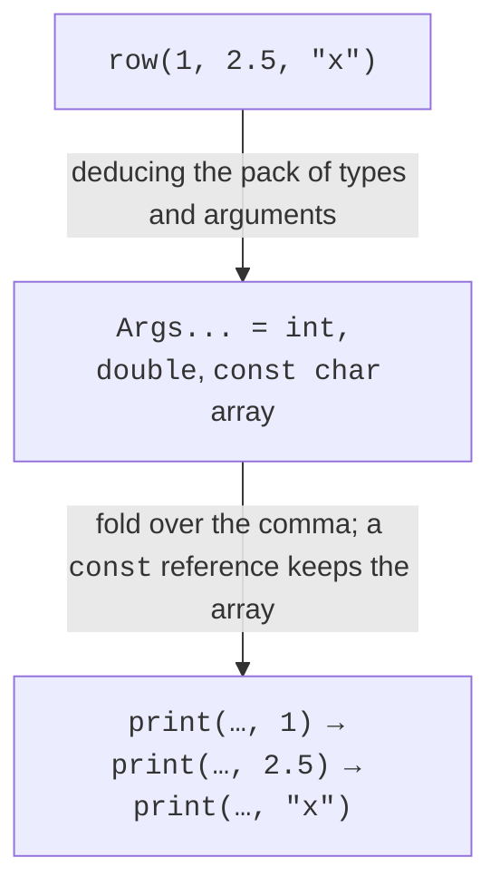
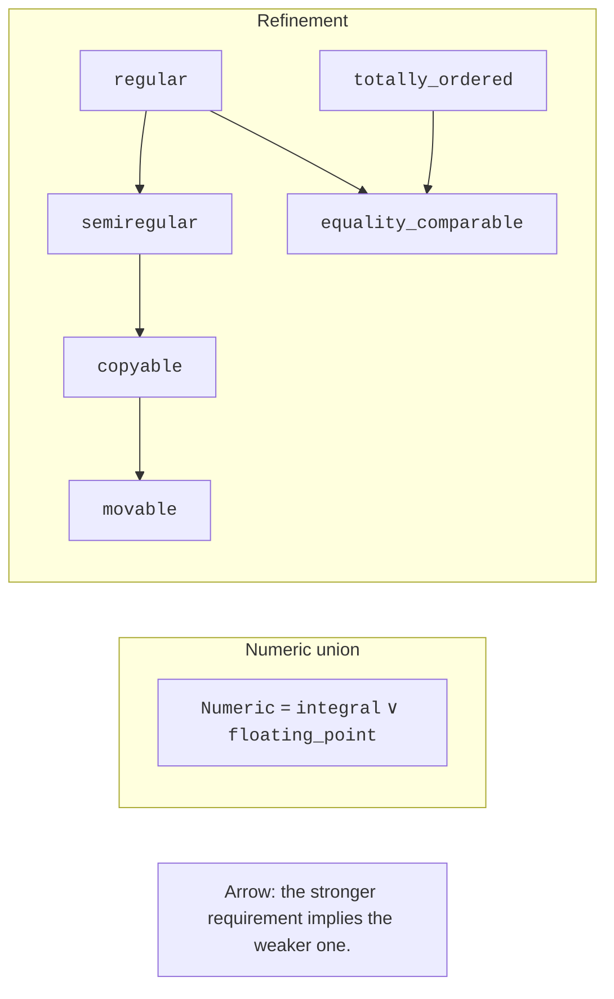
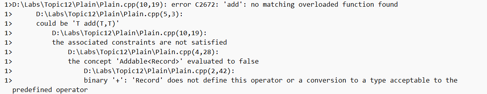
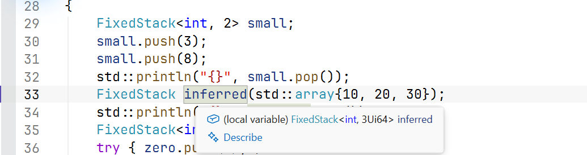

# Parameter packs and requires

## Parameter packs and fold expressions

The pack `Args...` denotes a sequence of types, and `args...` denotes the corresponding function parameters. A pack is not a run-time container: it can contain different types and has no `push_back` method. `sizeof...(Args)` gives the number of arguments as a constant value. Expanding a pack repeats a certain expression pattern for each element of the pack.

A fold expression with the comma operator performs the output operations in sequence. An empty pack is allowed for a unary fold over the comma; for adding with `+`, you must either forbid an empty pack or provide an initial value in a binary fold. The initial `0` also sets the initial accumulation type, and this can matter for mixed numeric arguments.



Figure 12.2. From an argument pack to sequential operations {.caption}

### A table row of arbitrary length

**Problem.** Print a header, a mixed row and a row without fields.

```cpp
#include <print>

template<class... Args>
void row(const Args&... args)
{
    std::print("|");
    ((std::print(" {:>8} |", args)), ...);
    std::println();
}

int main()
{
    row("item", "count", "price");
    row("pen", 3, 12.5);
    row();
}
```

Output:

```text
|     item |    count |    price |
|      pen |        3 |     12.5 |
|
```

All arguments are passed by `const&`; the function does not keep any references after it returns. Each type must support formatting. The minimum width of 8 does not truncate long text, so a row with a long name will widen the table. A guaranteed width needs a separate truncation or wrapping policy; it should not be quietly added to a general-purpose print.

Forwarding with `Args&&...` and `std::forward<Args>(args)...` preserves value categories in a template wrapper. But unconditionally moving from every argument would break calls with lvalues. A forwarding reference arises under specific type deduction rules; `const T&&` is not a forwarding reference. In a print function, forwarding gives no real advantage, so plain `const&` expresses the intent more precisely.

Pack indexing `Ts...[0]` is a C++26 feature and does not replace a run-time loop. Before using it, check `__cpp_pack_indexing` and compile a separate small example. It is not required in the training solution for this topic; ordinary pack expansion works without it.

## The requires clause, the requires expression and standard concepts

A `requires` clause attaches constraints to a template. A `requires` expression checks whether the listed requirements are valid in a dependent context and yields a Boolean result. Inside the list, you can check that an expression is valid, that a nested type exists, a property of the result and the absence of exceptions. The parameters of such an expression are hypothetical and do not create objects at run time.

```cpp
template<class T>
concept Addable = requires(T a, T b) {
    { a + b } -> std::same_as<T>;
};
template<Addable T>
T add(T a, T b) { return a + b; }
```

The `same_as<T>` check requires exactly this result type. For two `short` values, the result of addition usually has type `int`, so this concept rejects `short`. If the contract allows a conversion, you can use `convertible_to<T>`, but that does not guarantee the absence of narrowing or loss of value. Read a constraint as an exact condition, not as an approximate name.

`std::invocable<F, Args...>` checks that a call is possible; it does not promise that the function does not change state or always returns the same result. `std::totally_ordered` checks the syntax of comparisons and has semantic requirements that the compiler cannot prove for arbitrary code. NaN values in floating-point numbers are especially important here: the availability of operators does not make all possible values ordered in the sense the task requires.

Concepts are combined with `&&` and `||`. Our `Numeric` is a union of two groups, not a refinement of each of them. In the diagram, the refinement arrows point from the stronger requirement to the weaker one. `regular` includes `semiregular` and equality comparison; copyability alone does not guarantee meaningful equality.



Figure 12.3. Composing requirements and the direction of refinement {.caption}

## Diagnostics and negative tests

A concept moves the error message closer to the interface. Without a constraint, the compiler may go deep into the body and report a missing operator. With a constraint, it first rejects the candidate, and the details explain which requirement is not satisfied. This does not mean that every message involving a concept is short: a combination of many overloads also requires reading the full build log.


Figure 12.4. Failure during instantiation of an unconstrained template {.caption}



Figure 12.5. Failure because Addable is not satisfied {.caption}

`static_assert` is useful for properties that must hold unconditionally in the chosen specialization. A concept, in contrast, takes part in selecting a candidate. For example, overloads for integers and floating-point numbers are naturally separated by concepts; a call with an invalid capacity of an already selected class can be explained with your own `static_assert`. Traits from `<type_traits>` such as `is_trivially_copyable_v<T>` describe individual technical properties. Do not use them to replace the full contract of serialization or resource ownership.

A negative test must be a separate file that is expected not to compile. Do not leave an invalid call in the working `main`, and do not declare a check successful just because the line is commented out. Write down the kind of error, the required constraint and the command that reproduces the failure.

## Static polymorphism and the final choice

A function constrained by the `Shape` concept can call `area()` of different unrelated classes. This is static polymorphism: the choice is known at instantiation time. It does not automatically create a single container of heterogeneous shapes. For such a container, a virtual interface, `variant` or another explicitly chosen form of type erasure is appropriate.

CRTP passes a derived class as a parameter of the base, for example `Base<Derived>`. The base class can access the derived implementation without a virtual call. But this creates a stronger dependency between the classes and requires care during construction and destruction. In this topic, CRTP is an overview; a free function with a concept is often simpler. An optimization must be proven by measurement, not by the mere absence of `virtual`.



Figure 12.6. Template editor with concrete arguments {.caption}
