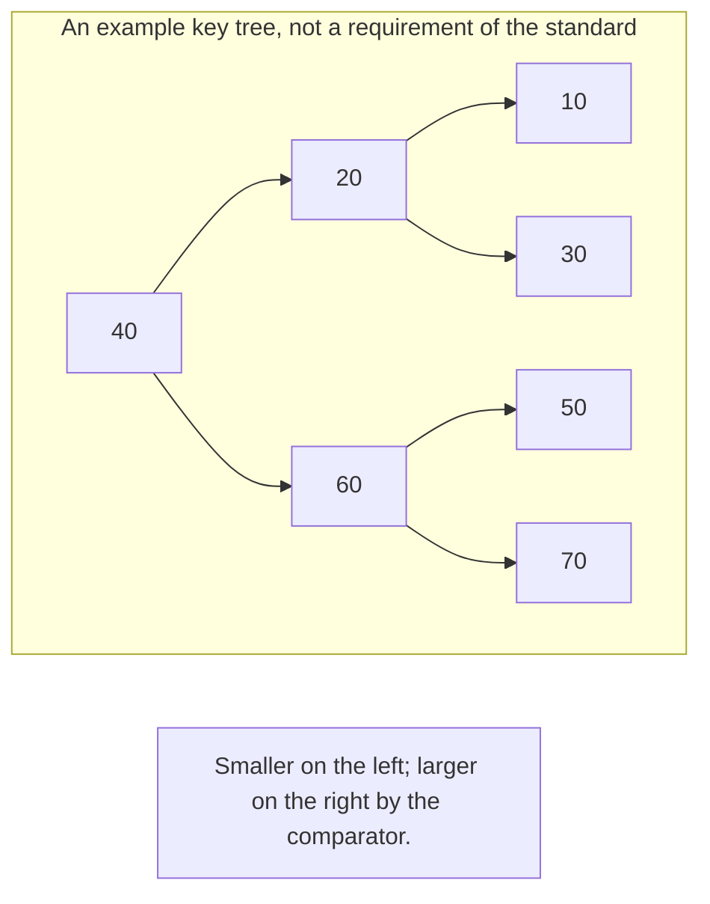
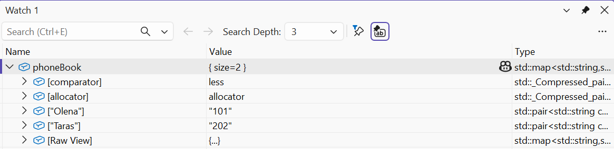
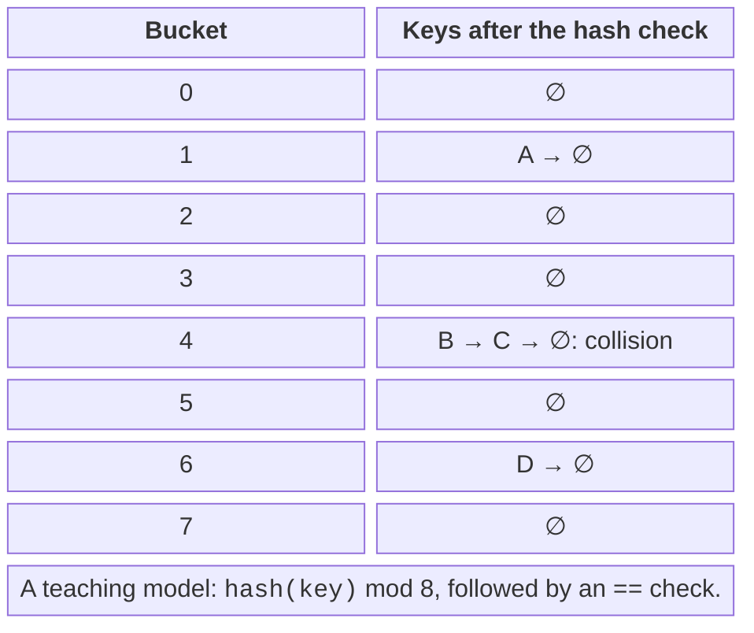
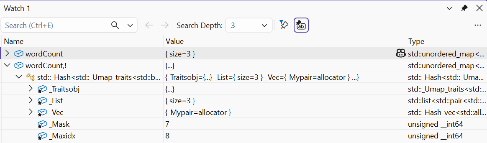

# Associative and hash containers

## set and map: uniqueness through ordering

`set` stores keys, and `map` stores key-value pairs. Uniqueness
is defined by the comparator’s equivalence: if neither `a < b` nor `b < a`,
the container considers the keys equivalent. This can differ from
operator ==, for example with a case-insensitive comparison.
The comparator must define a strict weak ordering; `<=` is not
suitable for this because it is true for equal values.

`multiset` and `multimap` allow equivalent keys.
`lower_bound(k)` finds the first element that is not less than k
according to the comparator. `equal_range(k)` gives a pair of bounds for the whole
group of equivalent keys. This is a half-open range: the right bound
does not belong to the result. Do not dereference end, even if the search
is the only operation before it.



Figure 13.4. An example of a balanced key tree {.caption}

The access member functions have different consequences. `map[key]` adds a missing key
with a default value. That is appropriate for a counter, but it changes the dictionary
during “reading.” `at(key)` does not insert; it throws `out_of_range`.
`find` returns an iterator or end, and `contains` returns just a bool.
A const map has no operator [] precisely because it may insert.

`insert` does not replace the value of an existing key. `insert_or_assign`
performs the replacement explicitly. `try_emplace` does not construct the mapped value
from the passed arguments inside the container if the key already exists;
however, the argument expressions of the call are still evaluated.
Do not put an expensive function in an argument on the assumption that it will not be called.

### A phone book

**Problem.** Add contacts, do not overwrite a number with a repeated insertion, and find and remove an entry.

```cpp
#include <map>
#include <print>
#include <string>

int main()
{
    std::map<std::string, std::string> phoneBook;
    phoneBook.try_emplace("Olena", "101");
    auto [it, added] = phoneBook.try_emplace("Olena", "999");
    std::println("added: {}, phone: {}", added, it->second);
    phoneBook.insert_or_assign("Taras", "202");
    if (auto found = phoneBook.find("Taras");
        found != phoneBook.end())
        std::println("found: {}", found->second);
    phoneBook.erase("Taras");
    for (const auto& [name, phone] : phoneBook)
        std::println("{}: {}", name, phone);
    std::println("missing: {}", phoneBook.contains("Ira"));
}
```

Output:

```text
added: false, phone: 101
found: 202
Olena: 101
missing: false
```

When an insertion fails, the returned iterator points to the existing entry. Names are printed in key order, not in insertion order. The sample numbers are strings: no arithmetic is needed on them, and leading zeros must be preserved.



Figure 13.5. An ordered dictionary in the Watch window {.caption}

## Unordered containers and hashing

A hash function turns a key into a number used to choose a bucket. Different
keys can have the same hash: this is a collision, not an equality error.
After choosing a bucket, the container uses an equality comparison.
Keys that are considered equal must have the same hash.
The converse is not required; otherwise the hash would have to be a unique
code for every possible object.



Figure 13.6. Hash, buckets, and the equality check {.caption}

`load_factor` is the ratio of the number of elements to the number of buckets.
`max_load_factor` sets the growth policy. `reserve(n)` plans
space for the expected number of elements according to that policy.
Rehashing rebuilds the placement in buckets and invalidates iterators,
but not references or pointers to elements that have not been removed.
The iteration order is not stable across implementations, runs, or rehashes.

A frequency dictionary naturally uses `++counts[word]`: a missing
int value is initialized to zero. To print a reproducible report,
we move the result into a vector and sort it separately. You do not always need to change
the container just to get the desired output order.

### Word frequency

**Problem.** Count the words in a given string and print an alphabetical report.

```cpp
#include <algorithm>
#include <print>
#include <sstream>
#include <string>
#include <unordered_map>
#include <utility>
#include <vector>

int main()
{
    std::istringstream input("red blue red green blue red");
    std::unordered_map<std::string, int> wordCount;
    for (std::string word; input >> word;)
        ++wordCount[word];
    std::vector<std::pair<std::string, int>> report;
    for (const auto& item : wordCount)
        report.push_back(item);
    std::sort(report.begin(), report.end());
    for (const auto& [word, count] : report)
        std::println("{}: {}", word, count);
}
```

Output:

```text
blue: 2
green: 1
red: 3
```

Here the separators are whitespace characters; case and punctuation are not normalized. For Ukrainian text, a byte-by-byte tolower does not provide Unicode normalization. Define the rules for a word before writing a more complex analyzer. Sorting pairs compares the first field first, which matches the key of the report.



Figure 13.7. Logical and raw views of a hash dictionary {.caption}

## A custom key and a consistent hash

In the custom Point type, equality compares both coordinates.
The hash also uses both, but its arithmetic is no proof
that there are no collisions. A test of the container should include a repeated
key, a missing key, and different keys. In a separate test it is useful
to deliberately use a constant hash: correctness is preserved, although
lookup becomes slower. This separates correctness from hash quality.

Instead of specializing `std::hash<Point>`, you can pass your own
functor as the second template argument of `unordered_set`, as in the example. That way the policy
is visible in the container type and does not require opening namespace std.
If a std::hash specialization is still needed, it must be for a
permitted user-defined type and meet the library requirements.
Do not add arbitrary new functions to namespace std.

### Points in a hash set

**Problem.** Store two different points, reject a repeated one, and test lookup.

```cpp
#include <cstddef>
#include <functional>
#include <print>
#include <unordered_set>

struct Point {
    int x, y;
    bool operator==(const Point&) const = default;
};
struct PointHash {
    std::size_t operator()(const Point& p) const noexcept {
        auto hx = std::hash<int>{}(p.x);
        auto hy = std::hash<int>{}(p.y);
        return hx ^ (hy + 0x9e3779b9u + (hx << 6)
            + (hx >> 2));
    }
};
int main()
{
    std::unordered_set<Point, PointHash> points;
    points.reserve(8);
    points.insert({1, 2}); points.insert({1, 2});
    points.insert({2, 1});
    std::println("size: {}", points.size());
    std::println("found: {}", points.contains({1, 2}));
    std::println("missing: {}", points.contains({9, 9}));
}
```

Output:

```text
size: 2
found: true
missing: false
```

The mixing operations are performed on unsigned `size_t`, where overflow has well-defined modular arithmetic. This is not a cryptographic hash and does not protect against deliberately crafted keys. The coordinates of a set element are not changed in place: you must remove the old key and insert a new one.
