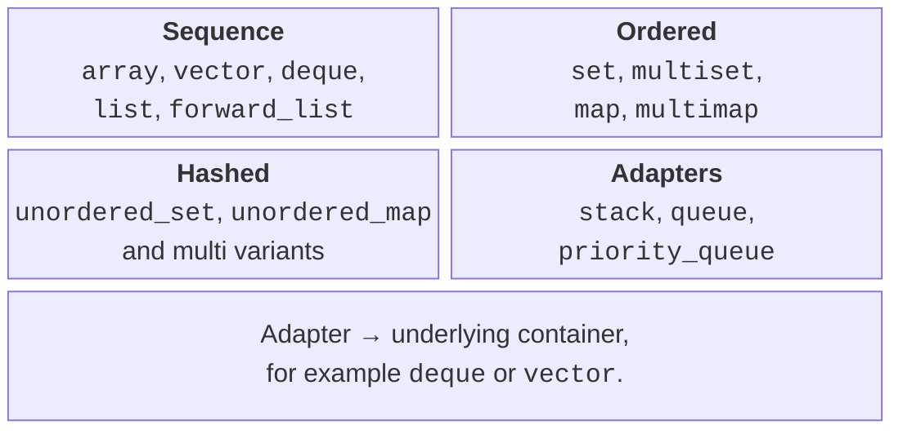
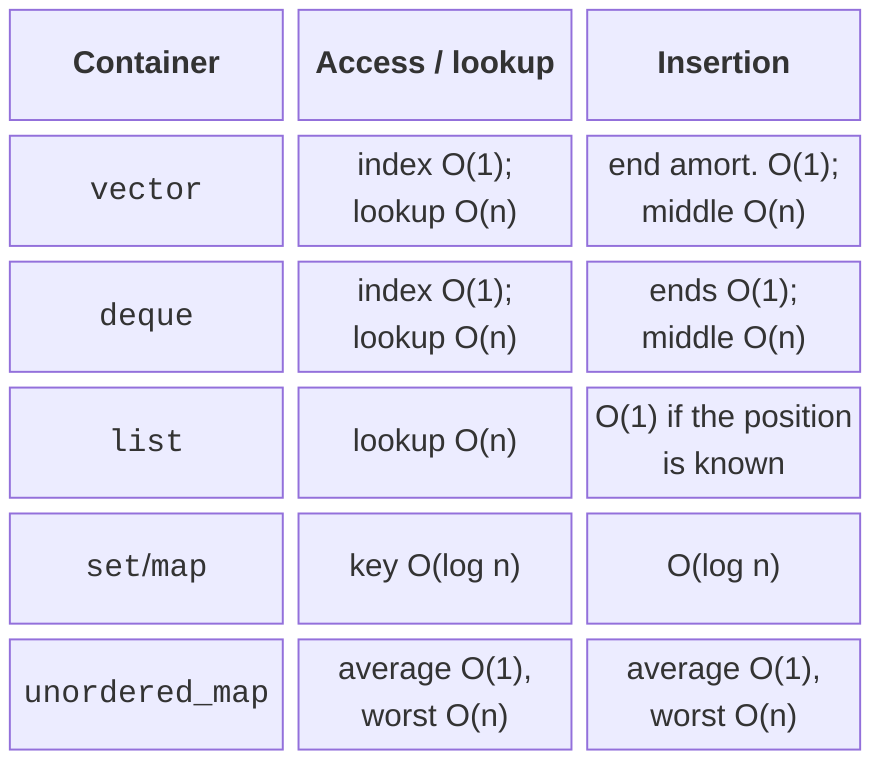
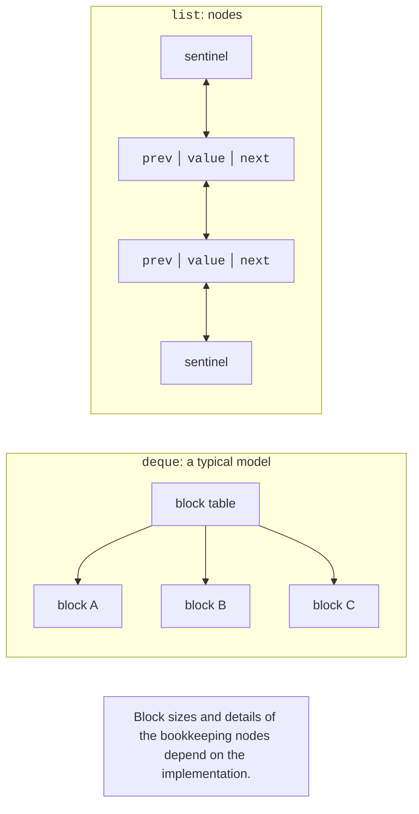

# Sequence containers

## A container as an access model

A container owns a set of elements and supports specific operations
on them. You choose it not by a familiar name but by the questions you ask about the data:
do you need indices, lookup by key, a preserved order, duplicates,
stable addresses, frequent insertions? The same set of students can be represented
as a vector, a dictionary by ID, or a set of ratings, but the cost of updates
and the uniqueness rules will differ.

The standard specifies observable behavior and complexity requirements,
not one mandatory internal implementation. Ordered associative
containers are often implemented as balanced trees, but the standard
does not require a red-black tree specifically. Likewise, the block layout of a deque
is a useful model, but the block size and the bookkeeping table depend
on the implementation. A program relies on the interface and the guarantees.

Figure 13.1. Groups of containers and adapters {.caption}

Most containers have `empty` and `size`, but not the whole interface
is the same: `forward_list` has no `size`, and `array` has no `clear`
for changing the number of elements. The `stack` and `queue` adapters deliberately
do not expose iterators. Generic code should require only
the operations it uses, not an imaginary “interface of any container.”

The loop `for (const auto& item : values)` does not copy each element.
Writing `auto item` copies it if the type allows that. For large strings
the difference can be significant, and for `unique_ptr` copying is forbidden.
Use a reference for reading, and a mutable reference only where
the algorithm is meant to change the element.

## Complexity and actual cost

The notation O(n) describes how the number of operations grows with the problem size.
It is not a time in milliseconds. A linear traversal of a contiguous vector
can be faster than the formally cheaper jumps between list nodes
on a small data set. Memory allocation, the CPU cache, and the cost
of copying an element do not disappear from a program just because a table
says O(1).

For `vector::push_back` the guarantee is amortized: most insertions are
cheap, and only occasionally do all elements have to be moved to new memory.
For a hash table, lookup is constant on average, but the worst case is
linear. For `list`, insertion is constant only when you already have an iterator
to the required position; finding that position by index is still linear.

Figure 13.2. Complexity with explicit preconditions {.caption}

Before you choose a measurement, write down the scenario: the number of elements,
the share of lookups and insertions, the key type, the distribution of values. Comparing
Debug with Release, or one container with reserved memory
and another without it, means comparing different conditions. A lab
study needs the same data, repetitions, and a separate check of the results.

## vector, array, and span

`vector` stores its elements contiguously. `size` is the number of live
elements, and `capacity` is the capacity of the allocated memory. `reserve(100)`
does not create a hundred elements, so accessing index 99 after only
a reserve is incorrect. `resize(100)` changes the number of elements
and may require default initialization.

`push_back` adds a ready-made value; `emplace_back` passes arguments
to the constructor in place. The latter is not an unconditional optimization:
reallocation can still move the existing elements.
In addition, direct construction through emplace can allow an explicit
constructor that would not be used in an implicit conversion.
Choose the form that expresses the required object more clearly.

`vector<unique_ptr<T>>` owns pointers, and each pointer owns
a separate object. When the vector grows, the `unique_ptr` objects themselves are moved;
the address of the T object usually stays the same until its owner is
destroyed. The address of the pointer element inside the vector, however, can change.
Do not confuse a pointer to T with a pointer to the `unique_ptr` slot.

`array<T,N>` has a fixed size, owns its elements, and does not
allocate a separate dynamic block by itself. `span<T>` is a non-owning
view of contiguous memory. After the array is destroyed or the vector
reallocates, a span does not automatically become empty: it becomes unsafe
to use. You must ensure the owner’s lifetime.

To remove elements from a vector by a condition, `std::erase_if` is convenient.
It does not make removal from the middle constant-time: elements are moved.
The next topic covers erase-remove and the exact rules for
iterators; for now, do not keep old references to elements across
a structural change of a vector without checking the guarantees.

## deque, list, and `forward_list`

`deque` supports fast insertion at both ends and access by
index. Its elements do not form a single guaranteed contiguous
array, so you cannot create a span over the whole contents of a deque
as you can with a vector. Insertion at the ends has special rules: references
to existing elements remain valid, but iterators can
become invalid. A reference and an iterator are not the same guarantee.

`list` is a doubly linked sequence. Inserting next to a known
position does not move all the other elements. The price is separate
nodes, bookkeeping pointers, and jumps through memory.
`forward_list` stores only the next link: the operations are called
`insert_after` and `erase_after`, and the position before the first element
is given by `before_begin`. There is no random access `list[i]`.

Figure 13.3. A block sequence and a node-based list {.caption}

The `list::splice` member function moves nodes between lists without copying
the values. You must meet the requirements on allocators and the validity of
the ranges. A list is sorted with its own `sort` member function,
not with `std::sort`, which needs random access. The `remove_if` member function
really removes nodes; it differs from the algorithm of the same name,
`std::remove_if`, which only rearranges values within a range.

A list is justified when a program keeps positions for a long time and moves
nodes around. If every operation first searches for the five-hundredth element from the start,
the theoretical advantage of insertion is lost. Start by describing the operations,
not by assuming that frequent insertions automatically mean a list.

## pair, tuple, and structured bindings

`pair<A,B>` combines two values, and `tuple` combines any fixed
number of them. They are convenient for technical groups of results, such as
an iterator and a flag indicating successful insertion. For a domain record with many
fields, a custom structure with names is often easier to read than `get<3>`.
The number of tuple components is determined at compile time.

`auto [it, inserted] = map.try_emplace(...)` unpacks the result pair.
When iterating over a dictionary, `const auto& [key,value]` borrows the pair,
while `auto [key,value]` copies it. The key in a map is stored as the const part
of the pair: changing the key arbitrarily would break the tree invariant. The value
for a key can be changed if the container itself is not const.

A structured binding does not create a new structure with an independent
lifetime. When it refers to a container element, removing
that element invalidates the corresponding references. When returning
data from a function, decide explicitly whether you return a copy or borrowed access.
