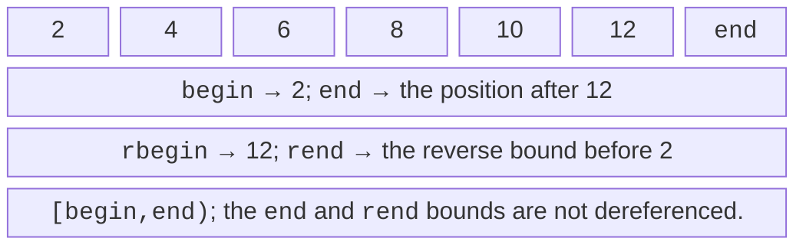
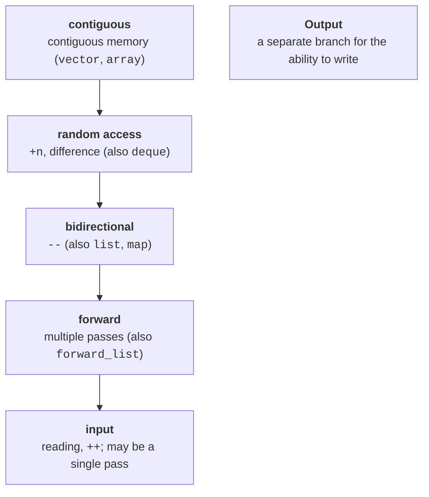
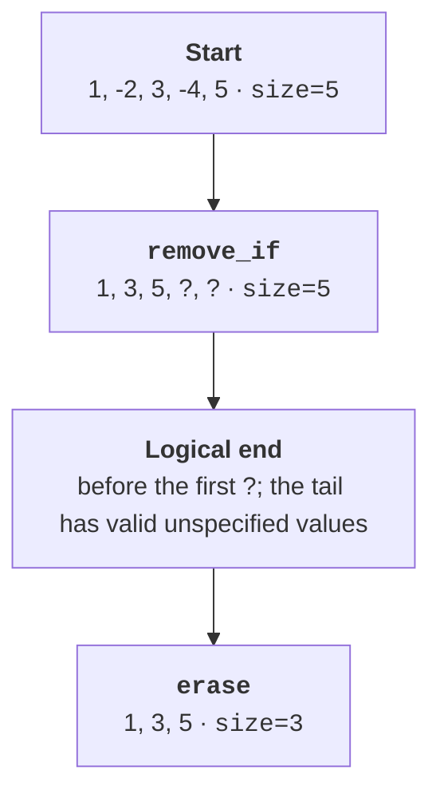

# Iterators and invalidation

## A position instead of a tie to the container

A search algorithm should not need separate knowledge of how vector and list are built.
An iterator provides a position interface: read the current value,
move to the next one, and compare with a bound. Moving to the next position
can be implemented as incrementing a pointer or as following a link between nodes.
The fact that an operation is available does not mean it has the same cost.

The range `[first,last)` includes first and excludes last. An empty
range has equal bounds. This notation lets you join subranges
one after another and does not need a special address for the last
element of an empty container. The end iterator serves as a bound,
not a value; dereferencing end does not become valid even
when the container is not empty.



Figure 14.1. Half-open bounds and reverse traversal {.caption}

`begin` and `end` of a mutable container usually give access
for changing the elements. `cbegin` and `cend` give const iterators.
A const iterator itself can be moved; const applies to the element
accessible through it. In contrast, a const variable holding an ordinary
iterator cannot be moved, although its element may remain
mutable. These are two different levels of immutability.

A reverse iterator represents a position through a base iterator
located after the corresponding element: `rbegin().base() == end()`.
That is why converting a position for erase requires care.
`rend` is not dereferenced either. For an ordinary reverse
traversal, prefer the ready-made rbegin/rend or views::reverse
rather than manually stepping before the start of an array.

## Categories and algorithm requirements

An input iterator reads a single-pass sequence, like
a stream. A copy of such an iterator does not promise an independent repeated
traversal. Forward adds multi-pass traversal, bidirectional adds moving
backward, and random access adds jumps by a distance and the difference between positions.
Contiguous additionally guarantees correspondence with the order in memory.
Output iterators form a separate group for writing, not a step
in the nested chain of reading.



Figure 14.2. Refinement of iterator categories {.caption}

`std::next(it,n)` does not change the original variable it; it returns
a moved copy. For a list, it performs n steps; for a vector,
it can use constant-time arithmetic. `std::distance(first,last)`
can likewise be linear. Calling distance from the start of a
list on every iteration is a way to accidentally get a quadratic
algorithm from a loop that looks simple.

`std::sort` requires random access. For a list, use the
list::sort member function rather than hoping that any begin/end pair is enough.
In ranges, these preconditions are expressed with concepts. A custom iterator
does not become random access just by declaring the corresponding tag:
it must implement the operations, the complexity, and the semantic laws.

A sentinel can have a different type than the iterator. It answers
the question “has the end been reached?” but is not required to be able to read
an element. This is convenient for generators and streams. For an algorithm
that requires bounds of the same type, you sometimes need a common view;
it is better to first check whether a suitable ranges algorithm exists.

## Invalidation: A structural change changes positions

Reallocation of a vector invalidates all iterators, references,
and pointers to its elements. Without reallocation, an insertion can still
invalidate positions at the insertion point and after it.
Removal shifts the tail; the old end should not be used either.
Reserve helps you control reallocation, but it does not cure
all forms of invalidation.

The nodes of list and map usually survive the insertion of other elements.
Removing a specific node invalidates references to it.
Deque has separate rules for the ends and the middle: insertion
at the ends does not break references to existing elements, but iterators
become invalid. Unordered containers lose their
iterators on a rehash, although references to elements that have not been removed are preserved.

The safest starting strategy is not to change the structure
during a range-for. If you need to remove elements, use
`erase_if` or an explicit loop with the iterator returned by erase.
Storing an index instead of an iterator does not solve the problem automatically:
after a removal, the index may refer to a different element.


Figure 14.3. Diagnosing a violated iterator guarantee in Debug {.caption}

The implementation’s Debug checks are useful, but they are not the portable
semantics of the standard. In Release, the error may not show up as a
message and still remain incorrect. Do not use
the absence of a crash as proof that an iterator is valid. Keep negative examples
separate from the runnable teaching programs.

## remove, erase, and output iterators

The `remove_if` algorithm moves the elements that remain to
the start of the given range and returns the new logical bound.
It does not know how to change the size of an arbitrary container. The tail
still holds live objects with valid but unspecified values
for this purpose. This is not uninitialized memory.



Figure 14.4. Logical filtering and physical shrinking of a vector {.caption}

```cpp
auto last = std::remove_if(values.begin(), values.end(),
    [](int x) { return x < 0; });
values.erase(last, values.end());
```

For the supported standard containers, C++20
`std::erase_if(values,predicate)` expresses this intent more concisely.
The list::`remove_if` member function removes the nodes itself, so you should not mechanically
apply the explanation of the `remove_if` algorithm to it.

Copying algorithms need enough room at the destination.
A `copy` to the begin of an empty vector does not create elements and
results in an invalid write. `std::back_inserter(target)`
turns writing into `push_back`. For a known size, you can
call resize first, but reserve by itself is not enough.
Stream iterators let you read or write sequentially,
but the single-pass nature of an input stream limits repeated passes.
