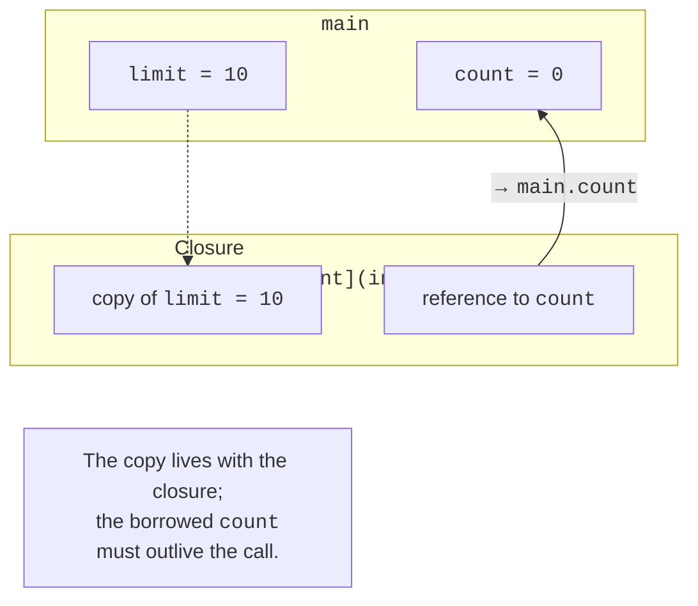

# Lambda expressions and functors

## A lambda as an object with state

A lambda expression creates a closure object with a call operator.
The parameters in parentheses arrive at call time, while the captures
in square brackets are formed when the object is created. A captured
copy is a snapshot of the value at that moment; a later change to the original
variable does not change the copy.

`[limit,&count]` copies limit and borrows count. For a borrowed
variable, you must guarantee its lifetime. `[=]` and `[&]` are default
policies, but explicit names make dependencies easier to review.
The capture `[this]` stores a pointer, not a copy of the whole object;
after the object is destroyed, it is dangerous. `[ *this ]` has different
semantics – it copies the object – and that also needs to be justified.



Figure 14.5. A copy and a borrowed reference in a closure {.caption}

`mutable` lets the call operator change the members captured by value.
It does not make the outer variable mutable
through its copy. An init-capture `[p=std::move(ptr)]`
transfers ownership to the lambda object; such a lambda can be move-only.
An ordinary std::function requires a copyable target,
so not every lambda can be stored in it.

A generic lambda with an `auto` parameter has a templated call
operator. It is convenient to pass to an algorithm if the contract
really is the same for several types. Returning a lambda from a function
is safe when the state it needs belongs to the lambda itself.
A local number captured by reference no longer exists after the function returns,
even if the lambda itself is stored in a std::function.

### A generator of independent counters

**Problem.** Return a counter with state, copy it, and compare three independent copies.

```cpp
#include <functional>
#include <print>

auto makeCounter(int start)
{
    return [value = start]() mutable { return value++; };
}

int main()
{
    auto count = makeCounter(10);
    int first = count();
    int second = count();
    auto copy = count;
    std::function<int()> erased = copy;
    std::println("{} {}", first, second);
    std::println("original: {}", count());
    std::println("copy: {}", copy());
    std::println("function: {}", erased());
}
```

Output:

```text
10 11
original: 12
copy: 12
function: 12
```

Copying a closure copies the current value of its member. The three subsequent calls do not share one counter. The calls are placed in separate expressions so that the evaluation order of the print function’s arguments does not determine the sequence of numbers. Shared state requires a different, explicitly described ownership model.

## Functors, invoke, and algorithm predicates

A named class with operator() is convenient for a reusable
policy with documentation and tests. A lambda is well suited for
a short local condition. std::function erases the concrete type of the
callable behind a fixed signature, but it can add an indirect call
and a memory allocation. If the type is known in a template, storing
that type directly is often simpler than adding type erasure without need.

`std::invoke` unifies ordinary calls and calls through
a pointer to member. The standard functors less, greater, and plus
can be passed instead of your own lambda with the same behavior.
A filtering predicate must return a value that can be interpreted as bool.
A sorting comparator must define a strict weak ordering;
a random result or a comparison with &lt;= breaks the contract.

Do not use a mutable external comparison counter to
determine the ordering itself. An algorithm can copy the function
object and perform comparisons in an unexpected sequence.
A counter for measurement is acceptable under certain conditions, but
the comparator’s result must stay consistent for the same
arguments throughout the sort.


Figure 14.6. A lambda in the algorithm’s call stack {.caption}
