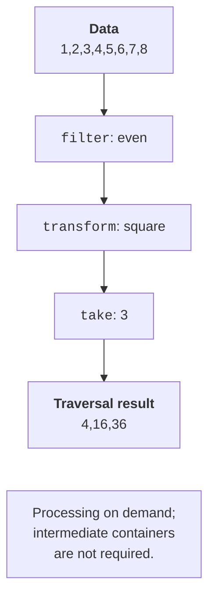

# Ranges and views

## Ranges algorithms and projections

A ranges algorithm can take a container without manually
passing begin/end, which reduces the risk of accidentally mixing
the bounds of different containers. It also supports concepts
and a projection: a way to get a key from the full element.
`&Student::grade` lets you sort whole records by grade
without creating a temporary vector of the grades alone.

A projection does not define an additional tie-break criterion. If
you need ordering by grade and then by name, use a
comparator on full records or a projection to a pair. Do not
rely on the arbitrary behavior of sort for equal grades.

### A student ranking

**Problem.** Sort the records by grade and show the first two with a grade of at least 85.

```cpp
#include <algorithm>
#include <functional>
#include <print>
#include <ranges>
#include <string>
#include <vector>

struct Student { std::string name; int grade; };

int main()
{
    std::vector<Student> students{
        {"Ira", 80}, {"Oleh", 95}, {"Anna", 90}, {"Max", 60}};
    std::ranges::sort(students, std::greater{},
        &Student::grade);
    auto best = students
        | std::views::filter([](const Student& s) {
            return s.grade >= 85;
        }) | std::views::take(2);
    for (const auto& s : best)
        std::println("{}: {}", s.name, s.grade);
}
```

Output:

```text
Oleh: 95
Anna: 90
```

The best view borrows students. The container outlives the loop; after the view is created, the structure does not change. The order of the operations matters: take before filter would mean checking only the first two of all students, not selecting the first two that qualify.

## Views, laziness, and materialization

A view describes a way of traversing. `filter` skips non-matching
elements, `transform` computes values on demand, `take`
limits the count, and `drop` skips the beginning. `reverse`
requires a sufficient traversal category. `iota` can create
a sequence without storing all the numbers. An infinite
range must be limited before an algorithm that needs an end.



Figure 14.7. Lazy selection of the squares of even numbers {.caption}

Laziness does not mean that each function is called exactly
once per element. Dereferencing a transform again
can repeat the computation, and filter can cache its beginning.
That is why pipeline functions should preferably be pure; side effects
turn the number of passes into a hidden dependency.
After structural changes to the owner, rebuild the view
rather than assuming its caches are automatically consistent.

`keys` and `values` select the components of pairs. `enumerate`
adds an index, and `zip` combines the positions of several ranges
and ends at the shortest one. If the domain problem
requires names and grades of equal length, check that
separately: silent truncation is not data validation.

`chunk(n)` forms consecutive groups, and the last one can be
shorter; n must be positive. `split` divides by a delimiter
and is not a full CSV parser with quotes and escaping.
`std::ranges::to` materializes the result into a container of its own
when you need to keep it independently of the original memory.

### Parsing a simple list of colors

**Problem.** Split a string on commas, keeping an empty field, and get independent strings.

```cpp
#include <print>
#include <ranges>
#include <string>
#include <vector>

int main()
{
    std::string source = "red,blue,,green";
    auto words = source | std::views::split(',')
        | std::views::transform([](auto part) {
            return std::string(part.begin(), part.end());
        }) | std::ranges::to<std::vector>();
    for (const auto& word : words)
        std::println("[{}] length={}", word, word.size());
    source.clear();
    std::println("owned words: {}", words.size());
}
```

Output:

```text
[red] length=3
[blue] length=4
[] length=0
[green] length=5
owned words: 4
```

Each subrange is converted to a std::string, so clearing source after materialization is safe. If `string_view` were stored instead, the words would depend on source. The program does not support commas inside quotes; its format is deliberately simple.

## Lifetime and a custom range

Not all views necessarily borrow. Some adapters
can take a temporary container through `owning_view`.
But returning a view of a local lvalue container from a function
is still an error. You need to read the specific ownership
type, not rely on the rule “any temporary is always bad.”

Ranges algorithms can return a special dangling type
instead of an unsafe iterator for a temporary non-owning
result. This helps in certain interfaces, but it does not
prove the safety of all captured references and nested views.
A `string_view` captured in a predicate also has its own
chain of lifetime dependencies.

A custom range must provide begin/end, and its iterator must provide
the required operations and associated types. In the lab’s
Fibonacci example, the values are computed rather than stored
in an array; the iterator returns a number by value. An honest
input category is enough for take. Declaring contiguous
for such a generator would be wrong.

New C++26 views, including concat, depend on implementation
support. In the tested MSVC, the required C++23 enumerate,
chunk, zip, and to are available; concat is not a required
part of this lab. Check the specific feature-test
macro, not just the general value of the C++ mode.
