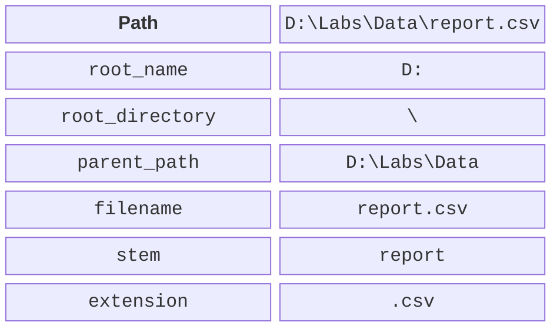
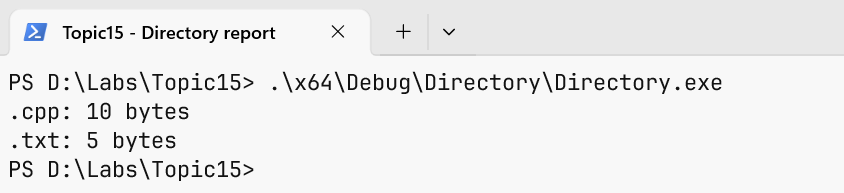

# std::filesystem

## A path is a structure, not a string with slashes

filesystem::path knows the parts of a path: the root, the directory,
the name, and the extension. The / operator joins components according to
the platform’s rules. If you pass an absolute
path on the right, the result may replace the previous base, so
this is not an automatic check for “staying inside the folder.”
Handling untrusted paths requires separate checks.



Figure 15.6. The parts of a Windows path {.caption}

A relative path is interpreted from the current working
directory of the process, not necessarily from the location of main.cpp
or the exe. Running from Visual Studio, a terminal, and a test
environment may have different `current_path` values. For diagnostics,
first print the absolute path the program actually works
with, and only after that look for the problem in the parser.


Figure 15.7. The working directory during debugging {.caption}

`filename` returns the last component, `stem` returns the name
without the last extension, and `extension` returns the extension with
the dot. A file may have no extension or contain several
dots. `exists` and `is_directory` answer different
questions; the existence of a path does not guarantee that it can be
opened as a regular file.

## UTF-8: contents and file names

The /utf-8 option sets the encoding of the source text and
of narrow literals in MSVC. It does not change an arbitrary file
that already exists on disk. A UTF-8 BOM may appear
at the beginning of a text file; a simple parser must
either support it explicitly or document that it is not supported.
Otherwise the first name or number will contain extra leading bytes.

On Windows, path uses the native representation
based on wide characters. `u8string()` returns
UTF-8 in `std::u8string`, that is, with `char8_t`, and this is not
the same type as std::string. Do not cast pointers
at random just to satisfy an output
overload. A consistent conversion must be explicit.

All the required examples use ASCII file names
to separate the stream logic from path conversions.
Cyrillic contents can be stored as UTF-8. Check an extension
to Cyrillic names with a separate Windows test
using path, not with the claim that string automatically
means UTF-8 in all file APIs.

## Traversing a tree and handling errors

`directory_iterator` traverses one directory, and `recursive_directory_iterator`
descends into subdirectories. The order is not defined as alphabetical.
For a reproducible report, collect the data and sort
it separately. During traversal, another process may change the directory;
checking existence before an operation does not make
the operation itself guaranteed to succeed.

Many functions have a form that throws `filesystem_error`
and a form with `error_code`. With the second one, you need to check ec
after every call. If several consecutive calls
overwrite the same ec, the cause of the first failure
may be lost. In a loop, you check not only `file_size`
but also the creation of the iterator and increment.

Symbolic links require a policy: whether to follow
them or not, and how to avoid cycles and double counting.
Skipping `permission_denied` means that the traversal is not complete.
An honest report lists the skipped entries or ends
with an error. The training fixture below contains no links
and stops on any file error.

### The size of a training directory

**Problem.** Create three files, traverse a subdirectory, and total the bytes by extension.

```cpp
#include <filesystem>
#include <fstream>
#include <map>
#include <print>
#include <string>
#include <system_error>

namespace fs = std::filesystem;
int main()
{
    const fs::path root = "directory-demo";
    fs::create_directories(root / "sub");
    for (const auto& [name, data] :
        std::map<std::string, std::string>{
        {"a.cpp", "abc"}, {"b.txt", "hello"},
        {"sub/c.cpp", "1234567"}}) {
        std::ofstream out(root / name, std::ios::binary);
        out << data;
        out.close();
        if (!out) return 1;
    }
    std::map<std::string, std::uintmax_t> totals;
    std::error_code ec;
    fs::recursive_directory_iterator it(root, ec), end;
    if (ec) { std::println("open: {}", ec.message()); return 1; }
    while (it != end) {
        bool regular = it->is_regular_file(ec);
        if (ec) { std::println("type: {}", ec.message()); return 1; }
        if (regular) {
            auto size = it->file_size(ec);
            if (ec) return 1;
            totals[it->path().extension().string()] += size;
        }
        it.increment(ec);
        if (ec) { std::println("next: {}", ec.message()); return 1; }
    }
    for (const auto& [ext, bytes] : totals)
        std::println("{}: {} bytes", ext, bytes);
}
```

Output:

```text
.cpp: 10 bytes
.txt: 5 bytes
```

To reproduce the result exactly, run the program in a clean training directory: the generator creates the three given files but does not delete other ones. Any additional files already in directory-demo will also be included in the total. This is the logical size of the data, not the number of occupied disk clusters. The output is sorted thanks to map.



Figure 15.8. The actual size totals by extension {.caption}

## Writing to a temporary file and publishing it

When you overwrite a result directly, a failure in the middle
of the operation can leave a truncated file. Another scheme is to
create a temporary file in the same directory,
write the complete contents, close it with a check, and only
after that rename it to the final name. However,
the details of replacing an existing file depend on the platform
and the file system, and flush does not guarantee physical
durability in case of a power loss.

The example below deliberately supports only creating a new
result in a private training directory. If the
final or the temporary path already exists, it refuses.
This is not a general concurrent atomic replacement algorithm:
between exists and opening, another process may create the
file. A shared directory requires platform
mechanisms for exclusive creation and a different threat model.

### Publishing a new report

**Problem.** Write a new report through a temporary file and refuse on a repeated run.

```cpp
#include <filesystem>
#include <fstream>
#include <print>
#include <system_error>

namespace fs = std::filesystem;
int main()
{
    const fs::path target = "published-demo.txt";
    const fs::path temporary = "published-demo.tmp";
    std::error_code ec;
    bool exists = fs::exists(target, ec);
    if (ec || exists) {
        std::println("refused: target exists or is inaccessible");
        return 1;
    }
    if (fs::exists(temporary, ec) || ec) {
        std::println("refused: temporary path unavailable");
        return 1;
    }
    std::ofstream out(temporary, std::ios::binary);
    out << "verified report\n";
    out.close();
    if (!out) { std::println("write failed"); return 1; }
    fs::rename(temporary, target, ec);
    if (ec) {
        std::println("rename failed: {}", ec.message());
        return 1;
    }
    std::println("published: {}", target.string());
}
```

Output:

```text
published: published-demo.txt
```

After the first successful run, the final file contains verified report and a newline. A repeated run returns code 1 and the refused message, as expected. The program does not delete the old result to fake success. After a failed rename, the temporary file remains for diagnostics; what to do with it is decided explicitly.

## Checking the format and failures

For text, create an empty file, a valid line,
a line without a delimiter, an extra field, an out-of-range number,
a line without a final newline, and an unexpected BOM.
Check a path that cannot be opened separately. A syntax error
and the inability to read a resource require different messages.

For a binary file, check the correct length,
a truncated last record, an out-of-range record number,
a wrong version, and an unrealistic number of elements
in the header. Do not allocate memory based on an unchecked
number from a file. If a record has fixed fields,
print an offset map and check it with individual bytes.

For directories, check an empty folder, a missing folder,
nested folders, a file without an extension, and the inability
to write the result. The remove/`remove_all` operations in this
topic are not necessary to demonstrate reading;
cleanup utilities start with a dry-run report and work
only in an explicitly specified training folder.

A std::expected wrapper can return either a result
or a structured error with the path and the cause.
It does not turn an error into a successful empty value.
An empty directory is a valid result, and an inaccessible
directory is a separate state. Do not reduce them to the same
empty table without an explanation.

Formatting a path in C++26 is checked separately; the
examples use `.string()` only for ASCII paths.
This is a deliberate limitation of the demonstration, not a universal
promise to correctly display any Windows name.
