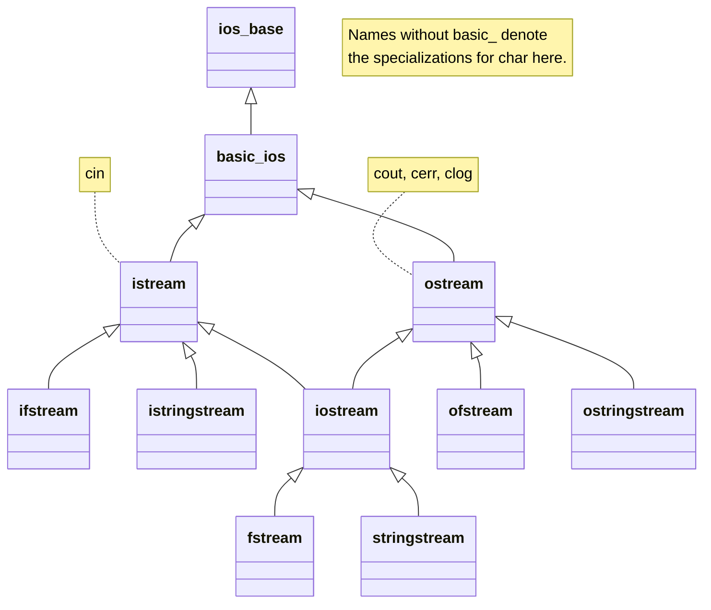

# Streams and their states

## A stream as a sequence of operations

A stream connects a source or a sink of bytes with read or write
operations, an error state, and formatting parameters. The console,
a file, and a string have different resources, but the same
principles apply to all of them. `istream` provides input, `ostream`
provides output, and `iostream` provides both directions. File classes
add a connection to a file, and string classes add a connection to the memory of a string.

The names ifstream and ostream are convenient specializations of templates
for char. A wide-character stream does not automatically become a universal
Unicode solution. For training files, we use UTF-8
and an explicitly defined format; for file names, we use filesystem::path.
The encoding of the contents and the representation of a path are separate questions.

Figure 15.1. The stream hierarchy and the standard objects {.caption}

`cin` reads standard input, `cout` writes standard output, and
`cerr` and `clog` use the standard error stream with
different default buffering properties. Redirecting
stdout to a file does not automatically redirect stderr.
Keep diagnostics separate from machine-readable output
so that an error message does not become a stray CSV line.

A stream owns a buffer or is associated with one. A successful
`<<` operator does not always mean that all bytes have already been written
to the storage device. The buffer may be flushed later; that is why checking
only that a file was opened is not a complete check of a write.

## States: good, eof, fail, and bad

`goodbit` means that no error flags are set.
`eofbit` reports that an operation reached the end of the source.
`failbit` means a failed logical read or operation, and
`badbit` means a more serious error when exchanging data with the resource. Several flags
can be set at the same time. Converting a stream to
bool checks that fail/bad are not set; it is not the same as calling good.

A correct loop reads in the condition: `while (std::getline(file,line))`.
The check `while (!file.eof())` is wrong because eof becomes known only
after a read attempt. It may repeat the previous
value or process a failed result. After the loop, you must
distinguish the normal end of the file from badbit or another failure.

Table 15.1. Stream states should not be treated as a single result code {.caption}

| State | Interpretation for the next step |
| --- | --- |
| good | The last operation did not report an error state. |
| eof | The end was reached; this is not a prediction of the next read. |
| fail | You need to react to a failed operation or an invalid format. |
| bad | A low-level read or write has failed. |
| clear() | Resets the flags but does not fix the data or restore the position. |

If you need a second pass after reading to the end,
call clear and seekg to the beginning, checking the result.
clear by itself does not remove an invalid character from the line and does not
bring back a lost file. For a format error, you must
consume or reject the invalid fragment; otherwise the next
attempt will run into the same data.

The exceptions method lets you turn selected flags
into `ios_base`::failure exceptions. This is a different reporting policy,
not an automatic fix. If you enable an exception on failbit,
an ordinary read to EOF may also need handling.
The examples use explicit checks so that every failure
is visible to a beginner.

## Opening, modes, and lifetime

ifstream usually opens a file for reading, and ofstream opens it for
writing and truncates the old contents. `app` forces writes
to the end, while `ate` only sets the initial position to the end
after opening. `trunc` explicitly truncates the file. Confusing app and
ate is dangerous for random-access updates of records.

RAII closes the file resource when the stream is destroyed, including
when the scope is left because of an exception. But a destructor is not a convenient place
to report an error of the final write. For an important
result, call close explicitly, then check the state, and only after
that report success. A manual close does not cancel RAII:
it gives you a point at which you can handle a failure.

All complete examples create their own demonstration
files in a separate training run directory. Do not run
them in a folder that contains important files with the same names: the generators of
grades-demo.csv and accounts-demo.dat deliberately recreate the
fixture and overwrite exactly these training names. You don’t need to look for
or download the input files separately.
