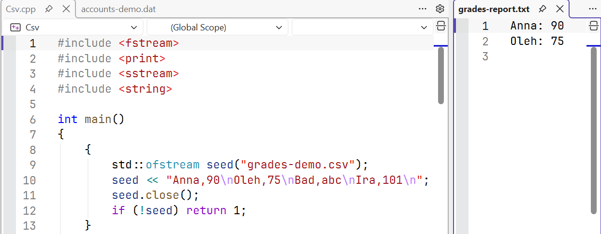
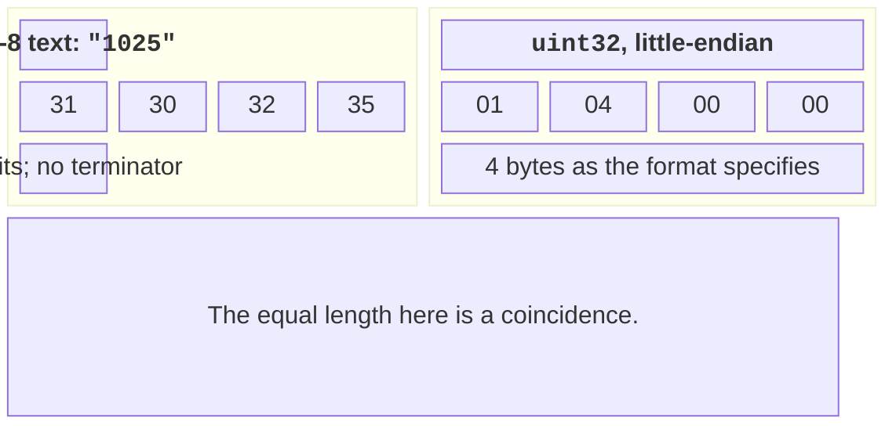
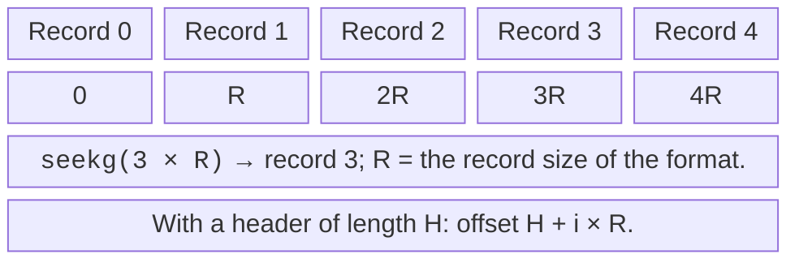
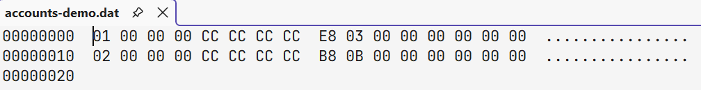

# Text and binary files

## A text format and parsing the whole line

A format defines not only the delimiter but also the allowed characters,
missing fields, whitespace, encoding, number ranges, and the
reaction to an invalid line. Splitting by commas is not
full CSV if quotes and commas inside a
field are not supported. In the example, a name contains no commas, and after the grade
only whitespace characters are allowed.

istringstream gives a separate parsing state for each line.
An error in one record does not make the main file stream
unusable for reading the next one. Checking for an extra token
after the number rejects `90abc` and `90,extra`. Without it,
a successful read of a number could accept an invalid record.

For numeric fields, `from_chars` is an alternative without
stream formatting; you should check the error code
and that the returned pointer equals the end of the field.
It is exactly the full consumption that distinguishes a valid number from
a valid prefix of an invalid line.

### A grade log in simple CSV

**Problem.** Generate four lines, accept only grades 0..100, write a report, and compute the mean.

```cpp
#include <fstream>
#include <print>
#include <sstream>
#include <string>

int main()
{
    {
        std::ofstream seed("grades-demo.csv");
        seed << "Anna,90\nOleh,75\nBad,abc\nIra,101\n";
        seed.close();
        if (!seed) return 1;
    }
    std::ifstream input("grades-demo.csv");
    std::ofstream report("grades-report.txt");
    if (!input || !report) return 1;
    int accepted = 0, rejected = 0, sum = 0;
    for (std::string line; std::getline(input, line);) {
        std::istringstream row(line);
        std::string name, tail;
        int grade = 0;
        if (!std::getline(row, name, ',') || name.empty()
            || !(row >> grade) || (row >> tail)
            || grade < 0 || grade > 100) {
            ++rejected;
            continue;
        }
        ++accepted; sum += grade;
        report << name << ": " << grade << '\n';
    }
    if (input.bad()) return 1;
    report.close();
    if (!report) return 1;
    std::println("accepted: {}, rejected: {}",
        accepted, rejected);
    if (accepted != 0)
        std::println("mean: {:.2f}",
            static_cast<double>(sum) / accepted);
}
```

Output:

```text
accepted: 2, rejected: 2
mean: 82.50
```

The file grades-report.txt contains the lines Anna: 90 and Oleh: 75. The sum is 165 and the count is 2, so the expected mean is 82.50. For a real grade log, you should also report the line number and the reason for rejection without printing unnecessary personal data. An empty data set must not cause division by zero.



Figure 15.2. The generated text report next to the code {.caption}

## Formatting does not change the value

setw sets the minimum width of the next field, whereas
fixed and setprecision are stored in the stream state for
subsequent operations. After fixed, the precision means the number of
digits after the decimal point; without it, the rules are different. If a helper
function changes the format of an outside stream, it should restore the
previous state or clearly document this change.

std::format creates a string that you can write to an ofstream.
std::print and std::println have overloads for ostream
in the corresponding header and for C FILE*; these types are not
interchangeable. Do not pass an ofstream where a FILE* is expected.
Choose one clear path — a formatted string into a stream
or a supported overload — and check for a write error.

For a data exchange file, the locale often needs to be fixed.
The number `12,5` and an unquoted comma as a delimiter conflict.
The simple-format examples use ASCII digits
and a period for the fractional part, and file names use Latin letters.
A Ukrainian user interface of a program does not require the machine
format to use the regional decimal separator.

## Text versus binary bytes

The text number 1025 contains the characters 1, 0, 2, 5. The binary
representation depends on the chosen type and byte order.
For an explicitly specified 32-bit unsigned little-endian,
these are the four bytes 01 04 00 00. The match in length with four
characters is a coincidence: the number 7 in text has one digit.



Figure 15.3. Explicitly specified text and 32-bit representations of 1025 {.caption}

The binary flag turns off the stream’s text conversions,
but it does not create a portable format automatically. A raw
write of a structure includes padding and depends on sizes,
alignment, and byte order. Being trivially copyable
is a technical prerequisite for such copying of the representation,
not a guarantee of exchange between compilers or versions.

A structure with a string, vector, or pointer cannot
be saved with a simple write(sizeof object): the written addresses
will not restore the characters or the allocated memory after a restart.
You need to serialize the logical fields: lengths, values,
string bytes, the format version, and size checks.

std::endian helps describe the native byte order, and byteswap
reverses the bytes of supported integer types. But adding
byteswap to a raw structure does not remove padding and does not
solve the string format. A reliable file describes each field
separately instead of repeating an accidental memory layout.

## Random access to training records

seekg changes the read position, and seekp changes the write position.
tellg and tellp return positions that can also indicate
an error. For a binary file of fixed-size records without a
header, the offset of record i equals `i * record_size`.
If there is a header, its length is added. Do not use
a record number directly as a byte offset.



Figure 15.4. The position of a record depends on the format’s size {.caption}

When switching between reading and writing in an fstream, we perform
explicit positioning and check the state. After EOF, we first
reset the necessary flags with clear. read expects
the given number of bytes; a short record at the end is
a sign of a truncated file if the format requires a complete record.
The gcount method lets you find out the number of bytes actually read.

### Training accounts in a local binary file

**Problem.** Write two accounts and increase the second balance by 500 minor units.

```cpp
#include <cstdint>
#include <fstream>
#include <print>
#include <type_traits>

struct Record { std::uint32_t id; std::int64_t cents; };
static_assert(std::is_trivially_copyable_v<Record>);
int main()
{
    Record rows[]{{1, 1000}, {2, 2500}};
    {
        std::ofstream out("accounts-demo.dat",
            std::ios::binary | std::ios::trunc);
        out.write(reinterpret_cast<const char*>(rows),
            sizeof rows);
        out.close();
        if (!out) return 1;
    }
    std::fstream file("accounts-demo.dat",
        std::ios::in | std::ios::out | std::ios::binary);
    if (!file) return 1;
    auto offset = static_cast<std::streamoff>(sizeof(Record));
    file.seekg(offset);
    Record item{};
    if (!file.read(reinterpret_cast<char*>(&item),
        sizeof item)) return 1;
    item.cents += 500;
    file.seekp(offset);
    file.write(reinterpret_cast<const char*>(&item),
        sizeof item);
    file.flush();
    if (!file) return 1;
    file.seekg(offset);
    if (!file.read(reinterpret_cast<char*>(&item),
        sizeof item)) return 1;
    std::println("id: {}, cents: {}", item.id, item.cents);
    file.close();
    return file ? 0 : 1;
}
```

Output:

```text
id: 2, cents: 3000
```

The format is intended only for reading back by this same build on this platform. sizeof(Record) may include padding; it is not the promised 12 bytes and not a format for data exchange. A production file needs explicit encodings of the ID and the amount, a length check, a header, and a version. What matters here is seekg/seekp and checking every operation.



Figure 15.5. The raw view of the generated file {.caption}
