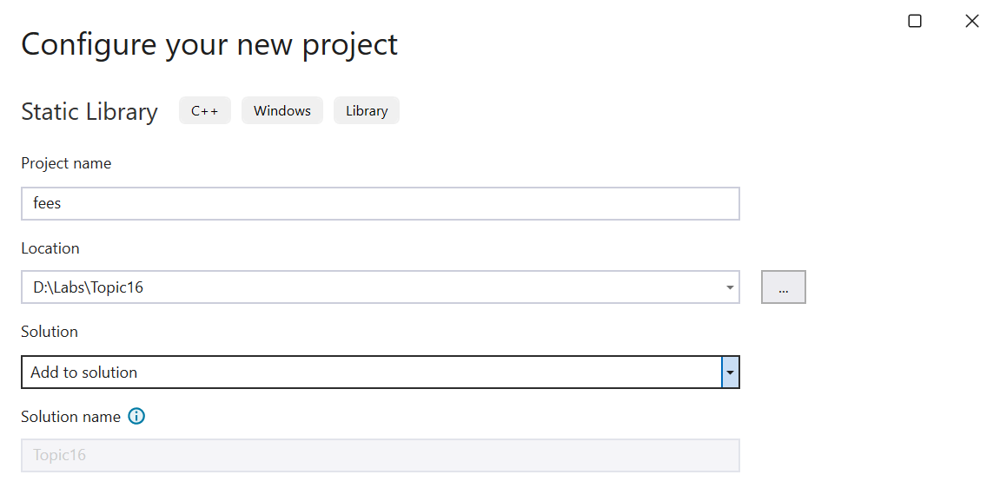
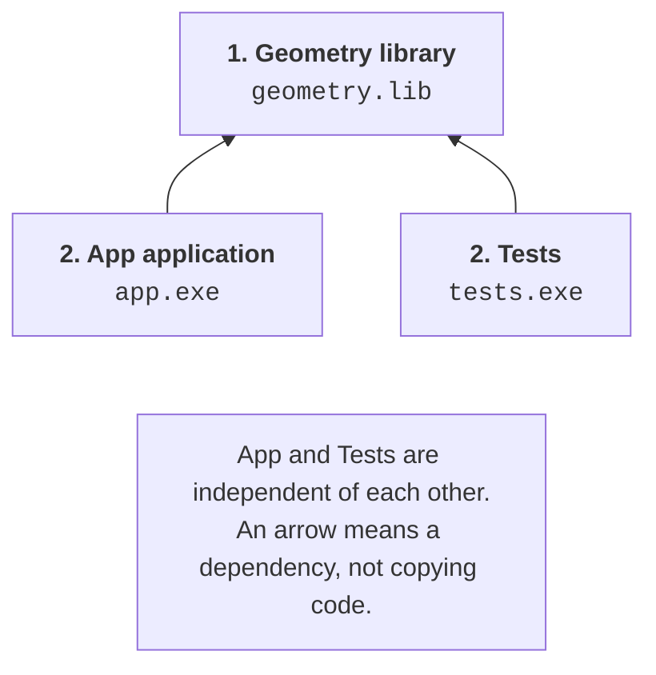
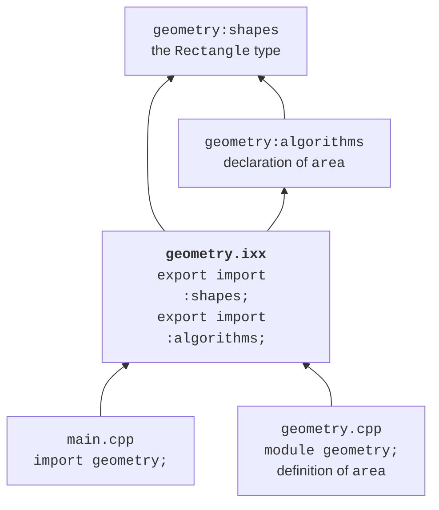

# Libraries and modules

## Static and dynamic libraries

A **static library** in MSVC is an archive of object files
with the `.lib` extension. The linker takes the needed definitions from it for
the executable. A header or a module interface is still required by the
client’s compiler: a library of machine code does not replace the description of the API.

For the first geometry example, run the following in the `headers` directory:

```powershell
cl /nologo /std:c++latest /EHsc /W4 /c geometry.cpp
lib /nologo /out:geometry.lib geometry.obj
cl /nologo /std:c++latest /EHsc /W4 main.cpp geometry.lib
.\main.exe
```

The `/c` option stops the process after compilation, without creating an `.exe`.
The `lib` command creates the archive. The last command compiles the client and links
it with the archive. The result is still `Area: 12.0`; the output does not depend
on whether the function reached the linker as an `.obj` or from a `.lib`.

In Visual Studio, create a solution with a **Geometry** project of the *Static Library* type
and an **App** project of the *Console App* type. Add the header and the implementation to Geometry,
and `main.cpp` to App. Set up the header path and the reference from App to Geometry.
Do not copy `geometry.cpp` into App as well: otherwise you can easily end up with two definitions.



Figure 16.4. Creating a static library project {.caption}


Figure 16.5. A reference from the application to the library project {.caption}

A project reference describes a build dependency and passing the library
to the linker. It does not always replace the header directory setting.
Check *C/C++ → General → Additional Include Directories* for the active
configuration. All projects must agree on the platform, the standard mode,
and the runtime library options. A ready-made `.lib` on disk
does not yet mean that it was built for the needed architecture.



Figure 16.6. A library and two independent clients in a solution {.caption}

A **dynamic-link library** (DLL) is loaded at
run time. For ordinary implicit linking, the client uses an import
`.lib`, and at startup it needs the `.dll`. In MSVC, `__declspec(dllexport)`
marks an export from a DLL, and `__declspec(dllimport)` marks the client’s use of an imported
entity. This is a platform extension, not a way of exporting from a C++ module.

A C++ module and a DLL solve different problems. A module organizes visibility
and dependencies at compile time. A DLL is a unit of deployment of machine code.
A module can be part of a static or a dynamic library. The `export` keyword
before a module declaration does not make a function a Windows DLL export.

Beyond a training example, you need to agree on the ABI, memory allocation and
deallocation, error handling, and runtime versions. Arbitrary C++ classes
do not become a stable binary contract just because of `dllexport`.
In this lab, DLLs are an overview topic; a static library is enough for the variants.
The official tutorial:
<https://learn.microsoft.com/cpp/build/walkthrough-creating-and-using-a-dynamic-link-library-cpp>.

## C++20 named modules

A module has a name, for example `geometry`, and determines which declarations are available
to clients. The **primary module interface unit** starts with `export module geometry;`.
A client writes `import geometry;`. A module name is not a path to a file:
its connection to files is determined by the build system.

The compiler creates a compiled representation of the interface. In MSVC, this is an `.ifc` file;
the general term is BMI (*built module interface*). Separately, an `.obj`
object file with code may be created. The IFC is needed when compiling the client,
and the object file is needed when linking. A forgotten `.obj` can cause
an unresolved symbol even when `import` succeeds.

Do not add `.ifc` files to Git as a replacement for the source code. Such artifacts
depend on the compiler, its version, and its options. They are rebuilt
from the interface files. After a toolset change, an old IFC may become
incompatible; the right action is a clean build in a separate directory.

Official materials: <https://learn.microsoft.com/cpp/cpp/modules-cpp>
and <https://learn.microsoft.com/cpp/cpp/tutorial-named-modules-cpp>.

### Example 3. A geometry module with partitions

Let’s move the geometry operation into a module. We place the rectangle type and the declaration
of the algorithm in separate **partitions**. This is a division of one
module, not independent libraries for arbitrary external import.
The client will import the primary interface `geometry`.

**`geometry-shapes.ixx`:**
```cpp
export module geometry:shapes;

export namespace geometry {
    struct Rectangle { double width; double height; };
}
```

**`geometry-algorithms.ixx`:**
```cpp
export module geometry:algorithms;
import :shapes;

export namespace geometry {
    double area(Rectangle value);
}
```

**`geometry.ixx`:**
```cpp
export module geometry;
export import :shapes;
export import :algorithms;
```

The interface re-exports both partitions with `export import`.
An ordinary `import` makes the declarations available to the current unit,
but by itself it does not re-export them to clients.

**`geometry.cpp`:**
```cpp
module;
#include <stdexcept>

module geometry;

double geometry::area(Rectangle value)
{
    if (value.width < 0 || value.height < 0) {
        throw std::invalid_argument("negative side");
    }
    return value.width * value.height;
}
```

The `module;` line starts the **global module fragment**. The traditional header
`<stdexcept>` is included in it, before `module geometry;`.
This way, its declarations are not accidentally attached to the named module.
Do not insert large system headers at random after the module declaration.

**`main.cpp`:**
```cpp
#include <print>
import geometry;

int main()
{
    std::println("Area: {:.1f}", geometry::area({3, 4}));
}
```



Figure 16.7. Dependencies of the interface, partitions, and implementation of a module {.caption}

For a manual check, open Developer PowerShell in the `modules` directory.
The options in the array are the same for all units. This is important: an IFC created
with one set of options should not be mixed with a client that has different ones.

```powershell
$opts = '/nologo','/std:c++latest','/EHsc','/utf-8','/W4'
cl @opts /c geometry-shapes.ixx
cl @opts /c geometry-algorithms.ixx `
  /reference geometry:shapes=geometry-shapes.ifc
cl @opts /c geometry.ixx `
  /reference geometry:shapes=geometry-shapes.ifc `
  /reference geometry:algorithms=geometry-algorithms.ifc
cl @opts /c geometry.cpp /Fo:geometry-impl.obj `
  /reference geometry=geometry.ifc
cl @opts main.cpp geometry.obj geometry-impl.obj `
  geometry-shapes.obj geometry-algorithms.obj `
  /reference geometry=geometry.ifc
.\main.exe
```

The result is `Area: 12.0`. The backtick at the end of a line is a
PowerShell line continuation; there must be no spaces after it.
The `/Fo:geometry-impl.obj` option keeps the implementation separate from
`geometry.obj`, which is created from the interface. Without different names, one result
could overwrite the other. That error would have nothing to do with the syntax of the module itself.

### Dependencies and IDE settings

The interface of a partition must be ready before its consumer is compiled.
Therefore, the order is determined by the `import` graph, not by the alphabetical order of files. Cyclic imports
between such units cannot be fixed by a random order of commands:
you need to change the structure, for example, move shared types to a lower-level module.

In Visual Studio, add a *C++ Module Interface Unit* item with the
`.ixx` extension. In the C/C++ properties, check module dependency scanning
(*Scan Sources for Module Dependencies*), the standard mode, and that
all implementation units are included in the project. The names of the categories may
differ between IDE releases; also search for the property by its English name.


Figure 16.8. Adding a module interface unit {.caption}


Figure 16.9. Dependency scanning and building a module {.caption}

A red IntelliSense squiggle and the compiler result are different signals.
First, open *Output → Build* and find the first real error.
If the project compiles but the editor does not see the import, check the active
configuration, indexing, and the version of extensions. Do not change a correct API
just to get rid of an outdated editor hint.

## The standard library as a module

Named modules are a C++20 language feature, and the standard module `std`
belongs to C++23. It exports the library declarations that
user code needs. `std.compat` additionally provides compatibility with the global
names of the C library. This does not mean that any old header or
macro can be mechanically replaced with an import.

Modules do not export preprocessor macros the way textual inclusion does.
To check library macros, include `<version>`.
`assert` requires the `<cassert>` header; a single `import std;` should not
be considered a way to obtain all macros.

The following complete program sorts three numbers. Build it in the
`stdmodule` directory, separately from the previous `main.cpp`.

```cpp
import std;

int main()
{
    std::vector values{4, 1, 3};
    std::ranges::sort(values);
    for (int value : values) std::print("{} ", value);
    std::println();
}
```

For a manual build, use the module from the **installed** MSVC toolset.
Do not copy someone else’s `std.ifc` from another machine.

```powershell
$opts = '/nologo','/std:c++latest','/EHsc','/utf-8','/W4'
$stdSource = "$env:VCToolsInstallDir/modules/std.ixx"
cl @opts /c $stdSource
cl @opts main.cpp std.obj /reference std=std.ifc
.\main.exe
```

The result is `1 3 4` with a space after the last number and a newline.
In an MSBuild project, the standard module can be prepared with the
*Build ISO C++23 Standard Library Modules* property. Instructions and limitations:
<https://learn.microsoft.com/cpp/cpp/tutorial-import-stl-named-module>.

Header units, for example a header import, are yet another mechanism.
They are not the same as the named module `std`. Preparing them depends on
the compiler and the build system; they are not needed in the lab.
Do not use a mix of the three mechanisms as a universal way
to fix the “module not found” message.
