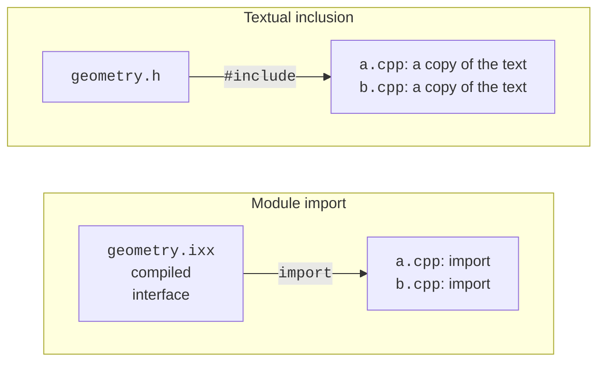
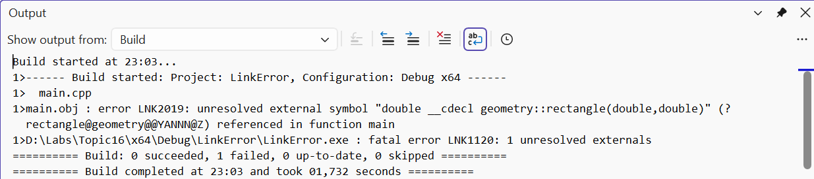
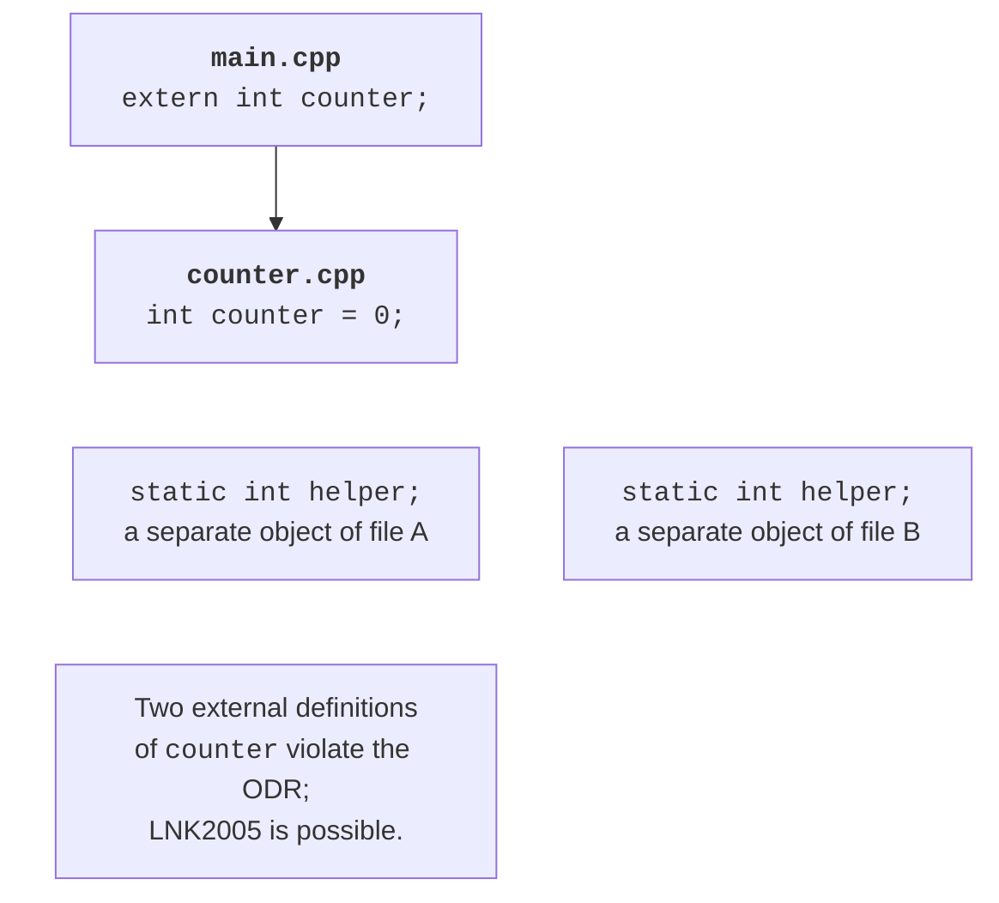

# Multi-file projects and the ODR

## From one program to a project

In the previous topics, a program was often contained in one file so that
the whole algorithm was visible. As the code grows, such a file mixes the data model, reading commands,
formatting a report, and working with storage. Changing one rule forces you to look for
related places among many unrelated details. Splitting code into files is needed
primarily for clear boundaries of responsibility.

An **interface** tells a client which operations it can call.
An **implementation** defines how these operations are performed.
For example, a client of a geometry library knows the name of a function, the types of its arguments,
the units of measurement, and the reaction to a negative length. It does not need to know
how the area is computed. However, the argument types alone do not describe the whole contract:
the conditions for valid data should be explained in text and checked with tests.

A file boundary is not the same as a class boundary. A small library may contain several
related classes, and the implementation of a large component may span several files.
Putting each function into a separate file does not make the architecture better.
A good criterion: files that have to be changed together represent one
responsibility; independent changes should not require rebuilding the whole application.

A compiler usually processes each **translation unit** separately. For a traditional
program, this is a `.cpp` file together with the text of the included headers after preprocessing.
The compiler does not look through arbitrary neighboring files in search of the needed definition.
Successful compilation of `main.cpp` does not yet guarantee successful linking.
The linker must receive the object code of all the operations used.

The Microsoft reference on translation units and linkage:
<https://learn.microsoft.com/cpp/cpp/program-and-linkage-cpp>.
Fig. 16.1 compares two ways of organizing an interface.



Figure 16.1. Textual inclusion of a header and import of a module interface {.caption}

## Example 1. A geometry library with a header

Let’s create a program that computes the area of a 3 by 4 rectangle. We treat negative sides
as an error and allow a zero side. We store all three files
in a separate `headers` directory. Keep the projects shown below with other versions
of the geometry library separately: they are not built together.

**The `geometry.h` file.** It contains the declaration of the function, that is, its name,
parameters, and return type. The client does not need the text of its body.

```cpp
#ifndef COURSE_GEOMETRY_H
#define COURSE_GEOMETRY_H
namespace geometry {
    double rectangle(double width, double height);
}
#endif
```

**The `geometry.cpp` file.** The implementation includes its own header first.
This lets the compiler detect a mismatch between the declaration and the definition.

```cpp
#include "geometry.h"
#include <stdexcept>

double geometry::rectangle(double width, double height)
{
    if (width < 0 || height < 0) {
        throw std::invalid_argument("negative side");
    }
    return width * height;
}
```

**The `main.cpp` file.** The client includes the header and uses the fully qualified name
`geometry::rectangle`. The numbers in the example are set in the code; there is no keyboard input.

```cpp
#include "geometry.h"
#include <print>

int main()
{
    std::println("Area: {:.1f}", geometry::rectangle(3, 4));
}
```

In Developer PowerShell opened in the directory of these files, run:

```powershell
cl /std:c++latest /EHsc /utf-8 /W4 main.cpp geometry.cpp
.\main.exe
```

The result is `Area: 12.0`. This command compiles two translation units
and then runs the linker. If you remove `geometry.cpp` from the command,
the call in `main.cpp` remains syntactically correct, but the definition of the function
will not be among the object files. This is a typical cause of LNK2019.



Figure 16.2. An unresolved external symbol during linking {.caption}

### Protection against repeated inclusion

The conditional directives `#ifndef`, `#define`, and `#endif` form an **include guard**.
After the first inclusion, the macro is defined, so a repeated
inclusion into the same translation unit skips the contents. The macro name must be
unique within the project. Do not use reserved names with two underscores.

MSVC also supports `#pragma once`: the file is included at most once
into a translation unit. This is a convenient implementation extension. An include guard
does not prevent including a header into different `.cpp` files; that is exactly what a header is for.
It also does not eliminate duplicate external definitions in different translation units.

A header must include what its own declarations need.
If it uses `std::string`, do not rely on the client
including `<string>` earlier. Checking self-sufficiency is simple: create an empty
`.cpp` file, include only this header in it, and compile it.
At the same time, do not add libraries needed only by the implementation to the header.

## The one definition rule and linkage

A **declaration** introduces a name and describes an entity.
A **definition** additionally provides its implementation or creates an object.
A function prototype with a semicolon is a declaration; the same function with a body
is a definition. The line `extern int counter;` declares a variable, and
`int counter = 0;` defines it. `extern` with an initializer is already a definition.

The **one definition rule** (**ODR**) has several parts.
Within one translation unit, you cannot define the same entity again.
An ordinary external function or variable that the program uses
needs exactly one definition in the program. Classes, templates, and `inline` entities
can have definitions in several units under conditions specified by the standard.
They do not permit arbitrarily different bodies of the same function.

In particular, identical definitions must agree not only visually:
the names in them must find the corresponding entities. An ODR violation is not always
diagnosed by the linker. Therefore, “the program built” does not prove
that all definitions are correct. In training projects, it is useful to keep shared
definitions in one header instead of copying them by hand.

**Linkage** describes whether declarations in different places can
denote the same entity. It is different from scope:
scope determines where a name can be found in the program text.
A namespace groups names, but by itself it does not hide the implementation from linking.



Figure 16.3. One external variable and independent internal objects {.caption}

### Example 2. A shared counter without duplication

This small example demonstrates the linkage mechanism; it does not recommend global
mutable state as the main design approach. The files are stored in the `odr` directory.

**`counter.h`:**
```cpp
#pragma once
namespace demo {
    extern int counter;
    void increment();
    inline constexpr int step = 2;
}
```

**`counter.cpp`:**
```cpp
#include "counter.h"

int demo::counter = 0;
void demo::increment() { counter += step; }
```

**`main.cpp`:**
```cpp
#include "counter.h"
#include <print>

int main()
{
    demo::increment();
    demo::increment();
    std::println("Counter: {}", demo::counter);
}
```

```powershell
cl /std:c++latest /EHsc /W4 main.cpp counter.cpp
.\main.exe
```

The result is `Counter: 4`. The header contains only the declaration of `counter`.
The definition is in `counter.cpp`, so both units refer
to the same object. The constant `step` is `inline constexpr`, so its definition
can be placed in a header and included into several units.

For a controlled experiment, in a copy of the project, replace the declaration
`extern int counter;` with `int counter = 0;`, and remove the definition from the `.cpp` file.
Now the header creates an external definition in both units. MSVC reports
LNK2005 and LNK1169. Restore the original files and check that the build succeeds.
Do not “fix” the duplication with a forced linking option.

### Internal linkage and inline

Namespace-scope functions and variables declared `static` have internal
linkage. An anonymous namespace in a `.cpp` file also lets you make helper
entities local to the translation unit. They are not details of the public API.
Do not confuse this with a static class member: it has a different context and different rules.

If you define `static int counter` in a header, each `.cpp` file gets its own
counter. The linker error disappears, but the behavior no longer meets
the requirement of shared state. This technique hides the problem instead of solving it.

The `inline` keyword does not instruct the optimizer to substitute the function body.
Its important language property is permitting consistent definitions in different units.
The compiler decides by itself whether to replace a call with the body. A small function size,
`constexpr`, and optimization are related to this decision but are not guarantees.
Functions defined inside a class in an ordinary header are usually implicitly `inline`;
you should not mechanically carry this rule over to named modules without checking.

## Namespaces and the library interface

Your own namespace, for example `course::geometry`, reduces the risk of a conflict
with the `area` function of another library. The nested form `namespace course::geometry`
lets you define it compactly. The alias `namespace geo = course::geometry;`
shortens references in a client `.cpp` file without creating a new library.

The directive `using namespace std;` in a header affects name lookup in all
clients that include it. Because of this, a change in a third-party header can
make a previously unambiguous call ambiguous. In public headers,
write qualified names. A local `using std::swap;` in a function body
can be a justified technique; it is not the same as opening the whole namespace.

The shape of an interface should support testing without a console. A function that computes
an area returns a number or reports an error; it does not read `std::cin` or print
a menu. Then a console application, a test, or another interface can use it.
The dependency points from the user interface to the domain logic.
