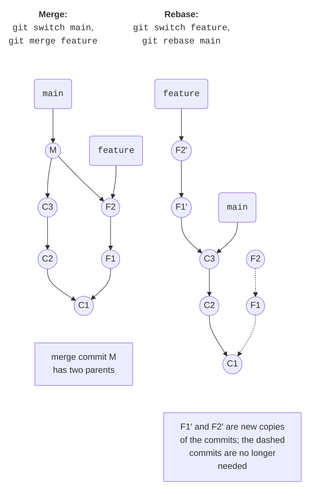
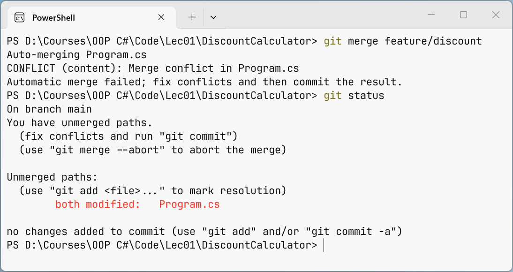

# Branches, merges, and conflicts

## Branches, merging, and rebasing

Branches let you develop a new feature separately from the working version. The typical workflow: create a **feature branch** from `main` with a name like `feature/miles`, make commits in it, and when the feature is finished and tested, merge the branch back into `main`.

Let's look at a "Distance converter" program (`D:\Courses\OOP C#\Code\Lec01\UnitConverter`) that converts kilometers to meters. Its history already contains two commits:

```cs
Console.OutputEncoding = System.Text.Encoding.UTF8;
Console.InputEncoding = System.Text.Encoding.UTF8;

Console.Write("Distance, km: ");
double km = double.Parse(Console.ReadLine() ?? "0");

Console.WriteLine($"{km} km = {km * 1000} m");
```

### Creating a branch and a fast-forward merge

The `git switch -c <name>` command creates a branch from the current commit and switches to it, `git switch <name>` switches to an existing branch, and `git branch` lists branches (an asterisk marks the current one) (<https://git-scm.com/docs/git-switch>). When switching, Git replaces the files in the working directory with the contents of the branch, so before switching you should commit or stash your changes.

In the `feature/miles` branch, we add the line `Console.WriteLine($"{km} km = {km / 1.609344:F3} miles");` and commit:

```
PS> git switch -c feature/miles
Switched to a new branch 'feature/miles'

PS> git commit -am "Add miles"
[feature/miles d7f9c46] Add miles
 1 file changed, 1 insertion(+)

PS> git switch main
Switched to branch 'main'
```

```
PS> git merge feature/miles
Updating 994e248..d7f9c46
Fast-forward
 Program.cs | 1 +
 1 file changed, 1 insertion(+)

PS> git branch -d feature/miles
Deleted branch feature/miles (was d7f9c46).
```

The `git merge <branch>` command merges the specified branch into the **current** one. While the branch existed, no new commits appeared in `main`, so Git simply moved the `main` pointer forward to commit `d7f9c46`. This kind of merge is called a **fast-forward**: no new commit is created. A merged branch is deleted with `git branch -d`; Git will not let you delete an unmerged branch—that requires the `-D` option.

### Three-way merge

A harder case is when both branches evolved in parallel. We create a `feature/feet` branch with a line for feet, and meanwhile in `main` we replace `double.Parse` with input validation using `double.TryParse` and an error message:

```
PS> git switch -c feature/feet
Switched to a new branch 'feature/feet'

PS> git commit -am "Add feet"
[feature/feet dfb633b] Add feet
 1 file changed, 1 insertion(+)

PS> git switch main
Switched to branch 'main'
```

```
PS> git commit -am "Validate distance"
[main adca857] Validate distance
 1 file changed, 5 insertions(+), 1 deletion(-)
```

The branches diverged after commit `d7f9c46`. A fast-forward is impossible here, so Git performs a **three-way merge**: it compares both latest versions with their common ancestor and creates a **merge commit** with two parents (Fig. 1.5, top). Git combines changes in different parts of the file automatically:

```
PS> git merge --no-edit feature/feet
Auto-merging Program.cs
Merge made by the 'ort' strategy.
 Program.cs | 1 +
 1 file changed, 1 insertion(+)
```

```
PS> git log --oneline --graph
*   9ae4f9a Merge branch 'feature/feet'
|\
| * dfb633b Add feet
* | adca857 Validate distance
|/
* d7f9c46 Add miles
* 994e248 Convert kilometres to metres
* 4826ae3 Create console project
```

```
PS> git branch -d feature/feet
Deleted branch feature/feet (was dfb633b).
```

Without `--no-edit`, Git opens an editor with the message `Merge branch 'feature/feet'`: you can change it or just save and close the file. `ort` is the name of the default merge strategy.



Figure 1.5. Merging and rebasing branches {.caption}

### Rebasing: `git rebase`

**Rebasing** is another way to get changes from `main`: Git takes the branch commits that are missing from `main` and **reapplies** them on top of the latest `main` commit (Fig. 1.5, bottom). The result is a linear history without a merge commit, but the branch commits get new hashes (<https://git-scm.com/docs/git-rebase>).

In the `feature/yards` branch, yards were added, and meanwhile a program title was added in `main`. Let's rebase the branch onto `main`; after that, `git switch main` and `git merge feature/yards` merge it with a fast-forward:

```
PS> git switch feature/yards
Switched to branch 'feature/yards'

PS> git rebase main
Successfully rebased and updated refs/heads/feature/yards.
```

```
PS> git log --oneline --graph --all -4
* b0a4ec3 Add yards
* 40d0f1c Show program title
*   9ae4f9a Merge branch 'feature/feet'
|\
```

Before the rebase, the `Add yards` commit had the hash `336b5ca`, and after it, `b0a4ec3`. That is why the rule from the previous section applies: **do not rebase branches that other team members already have**. For your own local branches, `rebase` makes the history easier to read. If a conflict occurs during a rebase, resolve it the same way as a merge conflict and then run `git rebase --continue` (or `git rebase --abort` to cancel the rebase).

### Moving individual commits: `git cherry-pick`

Sometimes you need just one commit from another branch, for example a fix made in an experimental branch. The `git cherry-pick <commit>` command copies the commit's changes into the current branch as a new commit (<https://git-scm.com/docs/git-cherry-pick>). The `experiment/table` branch has the commits `df794e9 Print table header` and `f22b758 Explain input format`; `main` needs only the second one:

```
PS> git switch main
Switched to branch 'main'

PS> git cherry-pick f22b758
Auto-merging Program.cs
[main e043f6d] Explain input format
 Date: Thu Sep 17 10:27:43 2026 +0300
 1 file changed, 1 insertion(+), 1 deletion(-)
```

Only the `Explain input format` commit went into `main` (with the new hash `e043f6d`), while the unsuccessful table attempt remained in the `experiment/table` branch, which is then deleted with `git branch -D experiment/table`.

## Merge conflicts

Git merges changes in different lines automatically. But if both branches changed **the same fragment** of a file, Git cannot decide which version is correct and reports a **merge conflict**.

Let's look at a "Discount calculator" program (`D:\Courses\OOP C#\Code\Lec01\DiscountCalculator`). In `main` it gives a 5% discount on purchases of 1000 UAH or more:

```cs
decimal discount = sum >= Threshold ? sum * 0.05m : 0;
```

In the `feature/discount` branch, this line was replaced by a tiered discount (10% from 5000 UAH), and meanwhile in `main` the discount was increased to 7%. The merge attempt stops:

```
PS> git merge feature/discount
Auto-merging Program.cs
CONFLICT (content): Merge conflict in Program.cs
Automatic merge failed; fix conflicts and then commit the result.
```

```
PS> git status
On branch main
You have unmerged paths.
  (fix conflicts and run "git commit")
  (use "git merge --abort" to abort the merge)

Unmerged paths:
  (use "git add <file>..." to mark resolution)
        both modified:   Program.cs

no changes added to commit (use "git add" and/or "git commit -a")
```

Fig. 1.6 shows these messages in the terminal. Git has already merged the files without conflicts, and it inserted **conflict markers** into `Program.cs`:



Figure 1.6. Merge conflict message {.caption}

```cs
<<<<<<< HEAD
decimal discount = sum >= Threshold ? sum * 0.07m : 0;
=======
decimal rate = sum switch
{
    >= 5000m => 0.10m,
    >= Threshold => 0.05m,
    _ => 0m
};
decimal discount = Math.Round(sum * rate, 2);
>>>>>>> feature/discount
Console.WriteLine($"Discount: {discount:N2} UAH");
```

- between `<<<<<<< HEAD` and `=======` is the version from the current branch (`main`);
- between `=======` and `>>>>>>> feature/discount` is the version from the branch being merged.

### Resolving a conflict

To resolve a conflict, open each file from the *Unmerged paths* list, keep the correct code (one of the versions or a combination of them), and **remove all markers**. Here both changes are needed: the tiered discount from the branch and the new 7% rate from `main`. Then build and test the program, mark the conflict as resolved with `git add`, and complete the merge with `git commit`.

After editing, the fragment looks like this:

```cs
decimal rate = sum switch
{
    >= 5000m => 0.10m,
    >= Threshold => 0.07m,
    _ => 0m
};
decimal discount = Math.Round(sum * rate, 2);
```

```
PS> git add Program.cs
PS> git status
On branch main
All conflicts fixed but you are still merging.
  (use "git commit" to conclude merge)

Changes to be committed:
        modified:   Program.cs
```

```
PS> git commit --no-edit
[main a73de7b] Merge branch 'feature/discount'
```

```
PS> git log --oneline --graph
*   a73de7b Merge branch 'feature/discount'
|\
| * 90bcc96 Add discount tiers
* | dcd4bda Increase discount to 7%
|/
* 3df4eb6 Calculate 5% discount
* ea033df Create console project
```

If now is not a good time to resolve the conflict, the `git merge --abort` command returns the repository to its state before the merge. The C# compiler finds markers forgotten in the code on its own: the build fails with error CS8300 *Merge conflict marker encountered*. Resolving a conflict in the Visual Studio merge editor is covered in the section "Git in Visual Studio 2026".

::: tip Tip
You get fewer conflicts if you make small commits, frequently merge `main` into your branch (or rebase it), and avoid reformatting other people's code unnecessarily.
:::
