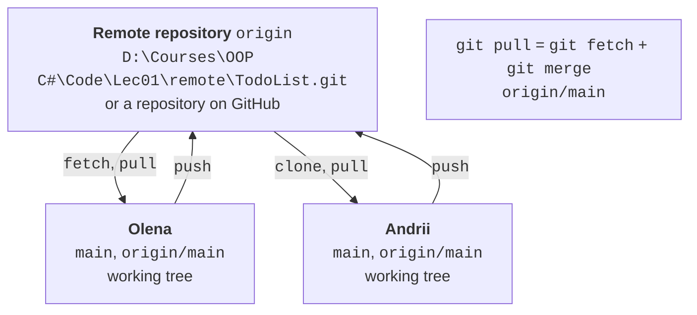
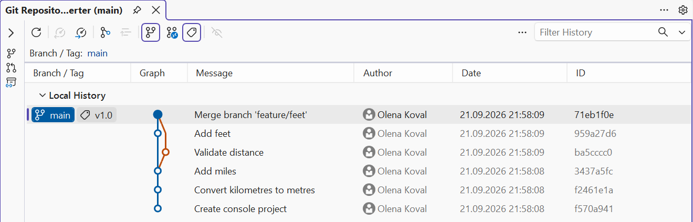

# History and teamwork

## Tags, history search, and hooks

### Tags

A **tag** is a permanent label for a commit, usually a version number. Unlike a branch, a tag does not move. An **annotated** tag (the `-a` option) stores the author, date, and description and is recommended for releases (<https://git-scm.com/docs/git-tag>):

```
PS> git tag -a v1.0 -m "Version 1.0: metres, miles, feet"
PS> git tag
v1.0
```

The `git show v1.0` command displays the tag's author and description and the commit it points to.

A tag can be used instead of a hash: `git diff --stat v1.0 v1.1` compares two versions, `git show v1.0:Program.cs` shows a file as of version 1.0, and `git switch --detach v1.0` temporarily switches the working directory to that version (return with `git switch main`). Version numbers usually follow **semantic versioning** `MAJOR.MINOR.PATCH` (<https://semver.org>): `v1.0.1` means bug fixes, `v1.1.0` new features, and `v2.0.0` incompatible changes. Along with tags, projects often keep a `CHANGELOG.md` file listing the changes in each version.

### Searching history

Git answers the question "when and by whom was this code changed":

- `git log -S "text"`—commits that added or removed the specified text;
- `git log --grep "word"`—commits whose message contains the word;
- `git log -- Program.cs`—commits that changed the file;
- `git blame <file>`—the last commit, author, and date for each line of the file (<https://git-scm.com/docs/git-blame>).

```
PS> git log --oneline -S "3280.84"
dfb633b Add feet

PS> git log --oneline --grep "feet"
9ae4f9a Merge branch 'feature/feet'
dfb633b Add feet
```

### Finding the commit that introduced a bug: `git bisect`

After several commits, the converter started calculating miles incorrectly: 1.609344 km should equal exactly one mile, but the program outputs 1.505. Version `v1.1` did not have the bug. The `git bisect` command finds the commit that introduced the bug using **binary search**: Git repeatedly switches the working directory to the commit in the middle of the range, and the developer tests the program and reports the result with `git bisect good` or `git bisect bad` (<https://git-scm.com/docs/git-bisect>):

```
PS> git bisect start
PS> git bisect bad
PS> git bisect good v1.1
Bisecting: 1 revision left to test after this (roughly 1 step)
[6c393a56b034d1918afdaac2bbf27fd860631a2e] Align output lines
```

After `dotnet run`, this commit outputs 1.505 miles, so we answer `git bisect bad`; the next one (`Add centimetres`) outputs 1.000 miles, so we answer `git bisect good`:

```
PS> git bisect good
6c393a56b034d1918afdaac2bbf27fd860631a2e is the first 'bad' commit
...
PS> git bisect reset
```

(The `start`, `bad`, and `reset` commands also print short status messages.) For 100 commits, about 7 checks are enough. The `git bisect reset` command returns you to the branch. Next, `git show 6c393a5` shows that the "alignment" commit accidentally changed the constant `1.609344` to `1.069344`; `git blame Program.cs` for that line also points to commit `6c393a56`. The bug is fixed with `git revert --no-edit 6c393a5`. If the check can be performed by a command that returns exit code 0 for a correct version, the search can be automated: `git bisect run <command>`.

### Git hooks

A **hook** is a script that Git runs automatically when a certain event occurs (<https://git-scm.com/docs/githooks>). Examples of hooks that run on the developer's computer: `pre-commit` (before a commit is created), `commit-msg` (message validation), and `pre-push` (before pushing). If a hook exits with a nonzero code, Git cancels the action. Server-side hooks (`pre-receive`, `update`) can reject pushed changes.

By default, hooks live in the `.git/hooks` folder (it contains examples with the `.sample` extension), but this folder is not included in commits. To give hooks to all team members, they are stored in a repository folder, for example `.githooks`, which is specified with the `core.hooksPath` setting. Git for Windows runs hooks with the built-in `sh` shell, so the script is written in the shell language, and the first line `#!/bin/sh` is required. The `.githooks/pre-commit` file (without an extension) prevents committing code that does not build:

```bash
#!/bin/sh
# Before committing, check that the project builds.
echo "pre-commit: dotnet build"
if ! dotnet build -v q -tl:off --nologo \
        -p:GenerateFullPaths=false -clp:ShowProjectFile=false; then
    echo "Build failed, commit canceled." >&2
    exit 1
fi
```

The `-v q` and `-tl:off` options make the build output short, and the last two parameters shorten paths in error messages. Let's test the hook on code with a missing semicolon:

```
PS> git config core.hooksPath .githooks
PS> git commit -am "Shorten output"
pre-commit: dotnet build
Program.cs(20,48): error CS1002: ; expected

Build FAILED.
...
Build failed, commit canceled.
```

The commit was not created. After the error is fixed, the hook lets the commit through (`Build succeeded.`), and the `git commit --no-verify` option skips the check. The `core.hooksPath` setting is stored in `.git/config`, so each team member sets it once after cloning.

## Remote repositories and teamwork

A **remote** repository is another copy of the repository with which you exchange commits. It is usually hosted on GitHub or another hosting service, but it can also be a folder on disk or on a local network. The following commands are used for the exchange (Fig. 1.7):

- `git clone <address>`—create a local copy of a remote repository;
- `git remote add origin <address>`—register a remote repository under the name `origin`;
- `git push`—send your commits;
- `git fetch`—get new commits without changing your working branches;
- `git pull`—get new commits and merge them into the current branch (`fetch` + `merge`).



Figure 1.7. Interaction between local and remote repositories {.caption}

### A local "server": a bare repository

You need neither an account nor a network to learn how to work with a remote repository. A **bare** repository—a folder with only the history and no working directory—plays the role of the server. You can push commits to it just like to GitHub. Let's create one for the "To-do list" and push the `main` branch:

```
PS> git init --bare "D:\Courses\OOP C#\Code\Lec01\remote\TodoList.git"
Initialized empty Git repository in D:/Courses/OOP C#/Code/Lec01/remote/TodoList.git/

PS> git remote add origin "D:\Courses\OOP C#\Code\Lec01\remote\TodoList.git"
PS> git remote -v
origin  D:\Courses\OOP C#\Code\Lec01\remote\TodoList.git (fetch)
origin  D:\Courses\OOP C#\Code\Lec01\remote\TodoList.git (push)
```

```
PS> git push -u origin main
To D:\Courses\OOP C#\Code\Lec01\remote\TodoList.git
 * [new branch]      main -> main
branch 'main' set up to track 'origin/main'.
```

The `-u` option links the local `main` branch to the remote `origin/main` (*upstream*), so from then on you can just type `git push` and `git pull` without parameters. `origin/main` is a **remote-tracking branch**: a local copy of the state of the `main` branch on the server as of the last `fetch`, `pull`, or `push`.

### Two team members

The second team member, Andrii, is simulated by another clone in the `D:\Courses\OOP C#\Code\Lec01\team` folder. In the clone, set his name without `--global` so that the commits have a different author: `git config user.name "Andrii Bondar"`.

```
PS> git clone "D:\Courses\OOP C#\Code\Lec01\remote\TodoList.git" TodoList
Cloning into 'TodoList'...
done.
```

Andrii adds a `README.md` file, commits it (`Add README`), and pushes the commit with `git push`. Meanwhile, Olena made the commit `Show task count` in her repository. The server rejects her push because it has a commit that Olena has not received yet:

```
PS> git push
To D:\Courses\OOP C#\Code\Lec01\remote\TodoList.git
 ! [rejected]        main -> main (fetch first)
error: failed to push some refs to 'D:\Courses\OOP C#\Code\Lec01\remote\TodoList.git'
hint: Updates were rejected because the remote contains work that you
hint: do not have locally. ...
```

First, let's fetch the other commits and look at the graph:

```
PS> git fetch
...
PS> git log --oneline --graph --all -4
* e41525f Show task count
| * 93dadd9 Add README
|/
* 6a861bd Sort tasks by name
* 0fec855 Add task from keyboard
```

The branches have diverged, so `git pull` performs a merge (the `pull.rebase false` setting), after which the push succeeds. Andrii then gets the result with `git pull` (as a fast-forward):

```
PS> git pull --no-edit
Merge made by the 'ort' strategy.
 README.md | 4 ++++
 1 file changed, 4 insertions(+)
 create mode 100644 README.md

PS> git push
To D:\Courses\OOP C#\Code\Lec01\remote\TodoList.git
   93dadd9..456ac5b  main -> main
```

### Reviewing a branch before merging

In teams, changes are usually not pushed directly to `main`; they are prepared in a branch that another team member reviews (*code review*) and only then merges. Andrii creates a `feature/summary` branch, commits to it, and pushes it with `git push -u origin feature/summary`. Olena fetches the branch and reviews it **without switching**: `main..origin/feature/summary` in `git log` means "the branch commits that are not in `main`", and `main...origin/feature/summary` (three dots) in `git diff` means "the branch changes since the point where it diverged from `main`":

```
PS> git fetch
From D:\Courses\OOP C#\Code\Lec01\remote\TodoList
 * [new branch]      feature/summary -> origin/feature/summary

PS> git log --oneline main..origin/feature/summary
b15fe6e Print tasks in one line
```

```
PS> git diff main...origin/feature/summary
...
 tasks.Sort();
+Console.WriteLine("Done: " + string.Join(", ", tasks));
...
```

If the changes are accepted, the branch is merged, `main` is pushed, the branch is deleted on the server, and the release is tagged. Tags are not pushed automatically, so they are pushed separately:

```powershell
git merge --no-edit origin/feature/summary
git push
git push origin --delete feature/summary
git tag -a v1.0 -m "Version 1.0"
git push origin v1.0
```

Team members clean up references to deleted branches with `git fetch --prune`. To protect `main` in a bare repository from being rewritten or deleted, enable the `receive.denyNonFastForwards` and `receive.denyDeletes` settings in it: the server will then reject `git push --force` and the deletion of `main`.

## GitHub (for self-study)

The lab assignments in this topic use local repositories, so this section is optional. However, most open-source projects and many companies use **GitHub** (<https://github.com>): it hosts remote repositories and adds collaboration tools. Documentation: <https://docs.github.com/en/get-started/using-git>.

### Publishing a repository and authentication

To publish a local repository, create a new repository on GitHub (*New repository*) without a README, `.gitignore`, or license, since they already exist locally, and run the commands GitHub shows on its page:

```powershell
git remote add origin https://github.com/<user>/TodoList.git
git push -u origin main
```

If `origin` already points to a local folder, change the address with `git remote set-url origin <address>`. GitHub does not accept your account password for Git operations. For `https://` addresses, use **Git Credential Manager**, which is included with Git for Windows: during the first `push`, a browser opens for sign-in, and the token is stored in Windows Credential Manager (<https://docs.github.com/en/get-started/git-basics/caching-your-github-credentials-in-git>). The alternative is an **SSH key** (`ssh-keygen -t ed25519`) and `git@github.com:<user>/TodoList.git` addresses; the public part of the key is added under *Settings → SSH and GPG keys* (<https://docs.github.com/en/authentication/connecting-to-github-with-ssh/generating-a-new-ssh-key-and-adding-it-to-the-ssh-agent>). Never share your private key or tokens with anyone or store them in a repository.

### Pull requests and GitHub Flow

A **pull request** (PR) is a proposal to merge one branch into another, which team members discuss and review in the web interface: they comment on lines of code, approve, or request changes. It is the same branch review as `git log main..feature` and `git diff main...feature`, but with a discussion history (<https://docs.github.com/en/pull-requests>). The **GitHub Flow** workflow (<https://docs.github.com/en/get-started/using-github/github-flow>): create a branch from `main`; make commits and push the branch; open a pull request; address review comments with new commits; merge the pull request into `main`; delete the branch.

For projects you cannot write to, you first create a **fork**—your own copy of the repository on GitHub—and open a pull request from it. GitHub also creates **releases** based on tags and lets you configure **branch protection**, for example to forbid changes to `main` without an approved pull request.

## Git in Visual Studio 2026

Visual Studio 2026 has built-in Git support: all the operations from the previous sections can be performed in IDE windows. Git commands are collected in the *Git* menu, and the current branch is shown in the status bar (<https://learn.microsoft.com/visualstudio/version-control/>). Visual Studio uses the same repositories and settings as the terminal, so you can combine both approaches.

### Creating a repository

For an open solution without a repository, choose *Git → Create Git Repository*. In the *Create a Git repository* dialog, under *Other*, select *Local only*, check the path and the `.gitignore` template, and click *Create and Push*. For a local repository nothing is pushed: Visual Studio runs `git init`, creates `.gitignore`, and makes the first commit. If the repository was already created in the terminal, Visual Studio recognizes it automatically.

### The *Git Changes* window

The *Git Changes* window (*View → Git Changes*) replaces the `status`, `add`, and `commit` commands (Fig. 1.8). The *Changes* list shows modified files; double-clicking opens a comparison with the previous version (`git diff`). The **+** button next to a file adds it to the index (the *Staged Changes* list), and the **−** button removes it. After you enter a message, *Commit Staged* creates a commit from the index, and *Commit All* creates one from all changes (`git commit -a`); the *Amend* check box replaces the last commit. The *Fetch*, *Pull*, *Push*, and *Sync* buttons exchange commits with the remote repository.


Figure 1.8. The *Git Changes* window {.caption}

### Branches and history

A new branch is created with *Git → New Branch*: in the *Create a new branch* dialog, enter the name, choose the branch it starts from in the *Based on* field, and the *Checkout branch* check box switches to the new branch immediately. It is convenient to switch between branches in the status bar or in the *Git Changes* window.

The *Git Repository* window (*View → Git Repository*, **Ctrl+0, Ctrl+R**) shows branches and tags (*Branches / Tags*) and the commit graph of the selected branch (Fig. 1.9). Double-clicking a commit opens its changes. The context menu of a branch other than the current one contains *Merge 'feature' into 'main'* (merge the selected `feature` branch into the current `main`) and *Rebase 'feature' onto 'main'* (rebase the current `feature` onto the selected `main`); the commit context menu contains *Cherry-Pick*, *Revert*, and *Reset → Delete Changes (--hard)*; you can create a tag in the commit details.



Figure 1.9. Commit history in the *Git Repository* window {.caption}

### Resolving conflicts in the merge editor

If a merge stops because of a conflict, the conflicting files appear in the *Git Changes* window in the *Unmerged Changes* list. Double-clicking a file (or the *Open Merge Editor* link in the open file) opens the **Merge Editor** (Fig. 1.10). It shows the *Incoming* (the branch being merged) and *Current* (the current branch) versions and a *Result* pane that you can edit manually. The check boxes next to fragments add the lines of the corresponding version to the result, and the *Take Incoming* (**F10**) and *Take Current* (**F11**) buttons accept all changes from one side. When the file's conflicts are resolved, click *Accept Merge* and complete the merge with a commit in the *Git Changes* window.


Figure 1.10. Resolving a conflict in the Visual Studio 2026 merge editor {.caption}

### Line author: *Blame (Annotate)*

The equivalent of `git blame` is the editor context menu command *Git → Blame (Annotate)*: the author, date, and commit of the last change appear to the left of each line. The history of an individual file is shown by the *Git → View History* command in the file's context menu in *Solution Explorer*. You can check the author name and email in the IDE under *Git → Settings*.
