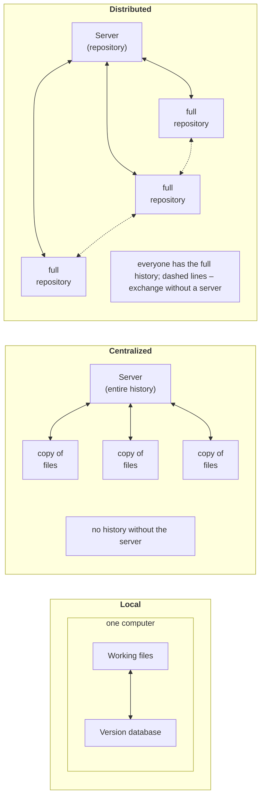
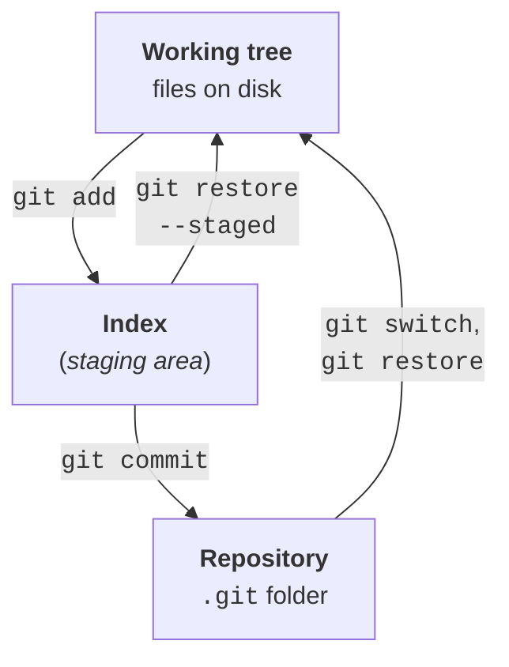
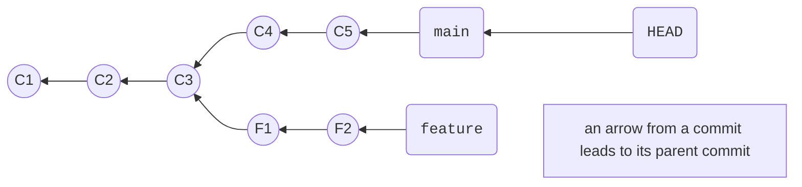

# Git and its configuration

## Version control systems

A program changes every day: features are added, bugs are fixed, and someone accidentally deletes code that was still needed. To be able to return to any previous state, find out who changed a line and why, and let several people work on a project at the same time, developers use a **version control system** (VCS). It stores the **history** of changes to project files: a sequence of snapshots together with the author, date, and explanation of each change.

There are three kinds of version control systems (Fig. 1.1):

- **local**—the version database is on the same computer as the files. The simplest variant (folder copies such as `Project_old`, `Project_new`) does not support collaboration and is easy to lose;
- **centralized** (Subversion, TFVC)—the history is stored on a single server, and developers have only working copies of the files. Without a connection to the server you cannot commit or view the history, and losing the server means losing the history;
- **distributed** (Git, Mercurial)—every developer has a **full copy of the repository** with the entire history. Most operations run locally and instantly, and the server is needed only to exchange changes. Any copy can restore a lost server.



Figure 1.1. Local, centralized, and distributed version control systems {.caption}

**Git** is a distributed version control system created in 2005 by Linus Torvalds for Linux kernel development. Today it is the industry standard: the code of Windows, .NET, Visual Studio Code, and most open-source projects is stored in Git. Git is free software that runs on Windows, Linux, and macOS (<https://git-scm.com>). The official "Pro Git" book is available online: <https://git-scm.com/book/uk/v2>.

Do not confuse Git with **GitHub**. Git is a program that runs on your computer. GitHub, Azure DevOps, and GitLab are **hosting services** that store copies of repositories on a server and add a web interface for collaboration: pull requests, discussions, and automated builds. Git works fully without a hosting service: for the lab assignments in this topic a local repository is enough, and an ordinary folder on disk plays the role of the server (see the section "Remote repositories and teamwork").

## Installing and configuring Git

On Windows, Git is distributed as **Git for Windows**: it includes Git itself, the Git Bash shell, and the Git Credential Manager. As of September 2026, the current version is 2.55.0 (download page: <https://git-scm.com/install/windows>). You can install Git with the installer or from PowerShell with the command:

```powershell
winget install --id Git.Git -e --source winget
```

The default values on the installer pages are suitable for this course. After installation, open a **new** terminal (Windows Terminal with PowerShell) and check the version.

In this lecture, commands are shown as they are entered in PowerShell: the `PS>` string denotes the terminal prompt (in a real terminal, the current folder appears before `>`, for example `PS D:\Courses\OOP C#\Code\Lec01\TodoList>`), and lines without it are the program's output.

### Initial configuration

Every commit is signed with the author's name and email, so you must set them before your first commit. Settings with the `--global` option are stored in the `.gitconfig` file in the user folder (`C:\Users\<name>\.gitconfig`) and apply to all repositories:

```
PS> git --version
git version 2.55.0.windows.5
```

```
PS> git config --global user.name "Olena Koval"
PS> git config --global user.email "olena.koval@example.com"
PS> git config --global init.defaultBranch main
PS> git config --global core.autocrlf true
PS> git config --global core.editor notepad
PS> git config --global pull.rebase false
PS> git config --global --list
user.name=Olena Koval
user.email=olena.koval@example.com
init.defaultbranch=main
core.autocrlf=true
core.editor=notepad
pull.rebase=false
```

The `user.name` and `user.email` settings specify the commit author (for GitHub, use your account email). `init.defaultBranch main` is the name of the first branch in new repositories, as on GitHub and in Visual Studio. `core.autocrlf true` stores lines in the repository with LF line endings and in Windows files with CRLF (see the section on `.gitattributes`). `core.editor notepad` is the editor for merge commit messages: after editing, save the file and **close** Notepad. `pull.rebase false` means that `git pull` combines divergent branches by merging; without this setting, Git 2.55 refuses to perform such a `pull` and asks you to choose a strategy. A setting for a single repository is set without `--global` (the `.git/config` file). Help is displayed by `git help <command>` or on the website <https://git-scm.com/docs>.

## How Git stores history

Git stores not the differences between file versions but **snapshots**: each commit contains a reference to the complete state of all project files. Unchanged files are not copied; they reference already stored content, so the repository stays compact.

Every Git object (file content, directory, commit) has a **hash**—a 40-character hexadecimal SHA-1 identifier computed from its content, for example `0fec8555b41061786652b6be58d41d306ef3df75`. The first 7 characters are usually enough: `0fec855`. The hash depends on the content, author, time, and parent commit, so **your hashes will differ** from those in the lecture examples. A stored commit cannot be changed unnoticed: its hash and the hashes of all subsequent commits would change.

Besides the snapshot, a commit contains the author, date, message, and a reference to its **parent** commit (the first commit has none, and a merge commit has two).

### The three areas of Git

Project files live in three areas (Fig. 1.2):

- the **working tree**—ordinary files on disk that you edit;
- the **index** (*staging area*)—a "draft" of the next commit: you add the changes that should go into the commit here with `git add`;
- the **repository**—the hidden `.git` folder with all commits. The `git commit` command creates a new commit from the contents of the index.



Figure 1.2. The working tree, the index, and the repository {.caption}

The index lets you make **logical** commits: if you fixed a bug and started a new feature at the same time, you can add only the fix to the index and commit it separately.

### Branches and the HEAD pointer

A **branch** in Git is just a movable pointer to a commit. When you commit, the current branch pointer moves to the new commit. The special **HEAD** pointer shows where you are right now: it usually points to the current branch (Fig. 1.3). Commits form a **graph**: each commit refers to its parent, and branches diverge from a common commit. `HEAD~1` means "the parent commit of HEAD", `HEAD~2` means "the grandparent", and so on.



Figure 1.3. The commit graph, branches, and the HEAD pointer {.caption}
