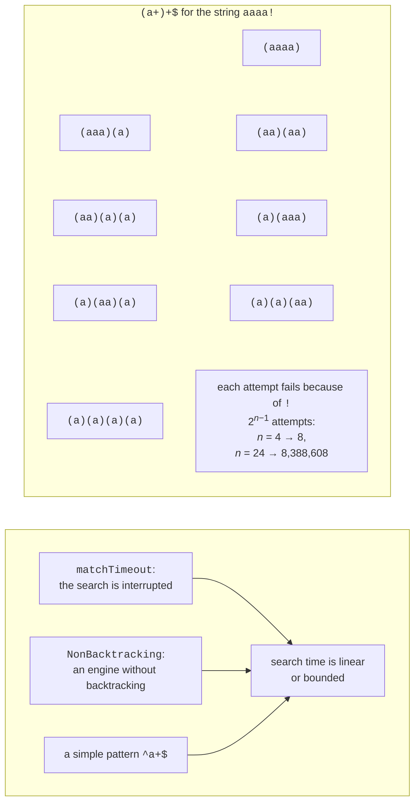

# Performance, generation, and testing

## Performance and security

### Backtracking and catastrophic backtracking

The standard .NET engine works with **backtracking**: if the rest of the pattern fails to match, the engine returns to the last place where it had a choice (how many characters a quantifier should capture, which alternation branch to take) and tries another option. This is usually fast. But if the pattern contains **nested quantifiers**, such as `(a+)+`, the number of ways to split the string grows exponentially (Fig. 2.7). For a string of *n* letters `a` followed by the `!` character, the engine tries 2<sup>*n*−1</sup> splits, and each one fails. This phenomenon is called **catastrophic backtracking** (<https://learn.microsoft.com/dotnet/standard/base-types/backtracking-in-regular-expressions>).



Figure 2.7. Catastrophic backtracking and ways to protect against it {.caption}

If such a pattern validates data from the network, an attacker can send a specially crafted string and overload the server. This attack is called **ReDoS** (*Regular expression Denial of Service*). There are three defenses:

- a **match timeout**: the `matchTimeout` parameter of a constructor or static method. If a single search takes longer, a `RegexMatchTimeoutException` is thrown with the `Pattern`, `Input`, and `MatchTimeout` properties. By default, the timeout is `Regex.InfiniteMatchTimeout`, meaning the search is not time-limited;
- the `RegexOptions.NonBacktracking` option (.NET 7+): an engine without backtracking guarantees time linear in the length of the text. It does not support lookahead and lookbehind, backreferences, or atomic groups (the constructor throws `NotSupportedException`), and it cannot be combined with the `RightToLeft` and `ECMAScript` options;
- a **simpler pattern** without nested quantifiers that is equivalent to the original: `^a+$` instead of `^(a+)+$`, `^\w+(\s\w+)*\s?$` instead of `^(\w+\s?)+$`.

### Measuring search time

The program measures the search time for the pattern `^(a+)+$` on strings of different lengths and then checks a 40-letter string using three defenses.

```cs
using System.Diagnostics;
using System.Text.RegularExpressions;

Console.OutputEncoding = System.Text.Encoding.UTF8;

const string Pattern = @"^(a+)+$";

// 1. Search time doubles with each new character.
for (int n = 18; n <= 24; n += 2)
{
    string input = new string('a', n) + "!";
    var watch = Stopwatch.StartNew();
    bool found = Regex.IsMatch(input, Pattern);
    Console.WriteLine(
        $"n = {n}: {found}, {watch.ElapsedMilliseconds} ms");
}

string attack = new string('a', 40) + "!";

// 2. A timeout limits the time of a single search.
var limited = new Regex(Pattern, RegexOptions.None,
    TimeSpan.FromMilliseconds(100));
var timer = Stopwatch.StartNew();
try
{
    limited.IsMatch(attack);
}
catch (RegexMatchTimeoutException ex)
{
    double limit = ex.MatchTimeout.TotalMilliseconds;
    Console.WriteLine($"Timeout {limit} ms for {ex.Pattern}, " +
        $"elapsed {timer.ElapsedMilliseconds} ms");
}

// 3. An engine without backtracking: linear time.
var linear = new Regex(Pattern, RegexOptions.NonBacktracking);
timer.Restart();
bool result = linear.IsMatch(attack);
Console.WriteLine($"NonBacktracking: {result}, " +
    $"{timer.ElapsedMilliseconds} ms");

// 4. An equivalent pattern without nested quantifiers.
timer.Restart();
result = Regex.IsMatch(attack, "^a+$");
Console.WriteLine($"^a+$: {result}, " +
    $"{timer.ElapsedMilliseconds} ms");
```

The result on the author's computer (the time depends on the processor). Every two new characters quadruple the time, so for a 40-letter string an unprotected search would take about 18 hours (2<sup>16</sup> seconds):

```
n = 18: False, 24 ms
n = 20: False, 65 ms
n = 22: False, 258 ms
n = 24: False, 990 ms
Timeout 100 ms for ^(a+)+$, elapsed 122 ms
NonBacktracking: False, 10 ms
^a+$: False, 0 ms
```

::: tip Tip
A timeout and `NonBacktracking` protect against "heavy" **text**, but not against a pattern supplied by an attacker. The .NET engine treats patterns as trusted, so do not build a pattern from user input without `Regex.Escape` (<https://learn.microsoft.com/dotnet/standard/base-types/best-practices-regex>).
:::

By default, a pattern is **interpreted**. The `RegexOptions.Compiled` option converts it to IL code at run time: searching becomes faster, but creating the object becomes much slower. In modern code, the source generator is used instead of `Compiled`.

## The `[GeneratedRegex]` source generator

Starting with .NET 7, the SDK includes a **source generator** for regular expressions. The `[GeneratedRegex]` attribute is applied to a `partial` method or (since .NET 9) a `partial` property of type `Regex` in a `partial` class. At **compile time**, the generator parses the pattern, creates C# code that performs the search, and caches a single `Regex` instance (<https://learn.microsoft.com/dotnet/standard/base-types/regular-expression-source-generators>). The third attribute parameter sets the timeout in milliseconds. Declarations of a method and a property with the attribute are shown in Example 4.

Benefits of the generator:

- an error in the pattern becomes a **compilation error** rather than a run-time exception;
- there is no cost for parsing and compiling the pattern at startup, and the search speed is no worse than with `Compiled`;
- the code can be viewed and debugged: in *Solution Explorer*, under the *Dependencies → Analyzers → System.Text.RegularExpressions.Generator* node, the `RegexGenerator.g.cs` file (Fig. 2.8). Above each method, the generator writes a comment explaining the pattern in English.

If a pattern is known at compile time, use the generator. Visual Studio itself offers to convert a `new Regex("…")` call to `[GeneratedRegex]` (diagnostic SYSLIB1045, <https://learn.microsoft.com/dotnet/fundamentals/syslib-diagnostics/syslib1040-1049>). The generator ignores the `Compiled` option.

![Code generated by the [GeneratedRegex] attribute](./images/04-vs-generated-regex-source.png)

Figure 2.8. Code generated by the `[GeneratedRegex]` attribute {.caption}

### Allocation-free search

Every `Match` object and every `Value` string is a heap allocation. For processing large amounts of text, .NET 7+ has the `EnumerateMatches` method: it takes a `ReadOnlySpan<char>` and returns `ValueMatch` structures with only the `Index` and `Length` properties. The part of the text itself is obtained with the slice `text.Slice(m.Index, m.Length)`. Likewise, `IsMatch` and `Count` accept a `ReadOnlySpan<char>`.

### Example 4. Message censor

The program hides offensive words in chat messages (keeping the first letter) and contacts that users try to use to get around moderation. Both patterns are created by the source generator, and `EnumerateMatches` finds word positions without creating strings.

```cs
using System.Text.RegularExpressions;

Console.OutputEncoding = System.Text.Encoding.UTF8;

string[] messages =
{
    "Are you a DUMBO or what? Write to ivan.petrenko@example.com",
    "Such morons... Call: +380 67 123 45 67",
    "Dumbbells! A regular message with no violations.",
};

foreach (string message in messages)
{
    Console.Write("Word positions:");
    var matches = Censor.BadWord().EnumerateMatches(message);
    foreach (ValueMatch m in matches)
        Console.Write($" {m.Index}+{m.Length}");
    Console.WriteLine();

    string clean = Censor.Clean(message, out int count);
    Console.WriteLine($"{clean} (replacements: {count})");
}

static partial class Censor
{
    // Word roots with any endings; case does not matter.
    [GeneratedRegex(@"\b(dumb(o|ass)|moron|dimwit)\p{L}*",
        RegexOptions.IgnoreCase | RegexOptions.CultureInvariant)]
    public static partial Regex BadWord();

    // An email or a phone number with spaces or hyphens.
    [GeneratedRegex(@"[\w.+-]+@[\w-]+(\.[\w-]+)+|\+?\d[\d -]{8,}\d")]
    private static partial Regex Contact { get; }

    public static string Clean(string text, out int count)
    {
        int replaced = 0;
        string result = BadWord().Replace(text, m =>
        {
            replaced++;
            return m.Value[0] + new string('*', m.Length - 1);
        });
        result = Contact.Replace(result, m =>
        {
            replaced++;
            return "[contact hidden]";
        });
        count = replaced;
        return result;
    }
}
```

The generator requires the `Censor` class to be `partial`. A lambda expression cannot modify an `out` parameter, so the counter is accumulated in the local variable `replaced`. The root `dumb` with the restricted endings `(o|ass)` does not affect the neutral word "dumbbells". The result:

```
Word positions: 10+5
Are you a D**** or what? Write to [contact hidden] (replacements: 2)
Word positions: 5+6
Such m*****... Call: [contact hidden] (replacements: 2)
Word positions:
Dumbbells! A regular message with no violations. (replacements: 0)
```

## Input validation and unit tests for patterns

### When a regular expression is not the right tool

Regular expressions are good at checking the **format** of a short string: a phone number, a postal code, a product code, a license plate. However, there are better tools for many tasks:

- **dates, numbers, IP addresses, URLs**—the `DateOnly.TryParseExact`, `decimal.TryParse`, `IPAddress.TryParse`, and `Uri.TryCreate` methods: they check both the **value** and the range;
- **email**—the full address standard is so complex that no reasonable pattern covers it. A simple shape check (or `MailAddress.TryCreate`) is enough, and the real check is an email with a confirmation link;
- **HTML, XML, JSON, CSV with quotes**—nested structures that regular expressions cannot parse correctly. Use parsers: `System.Text.Json`, `XDocument`, CSV libraries.

A practical rule: check the shape with a regular expression, and the value with `TryParse` methods or business rules, as in Example 3.

### Unit tests for patterns

A pattern is easy to break when adding a new format, so it is checked with **unit tests** on a set of valid and invalid strings. **Parameterized tests** are convenient for such tests: in the xUnit.net framework, this is the `[Theory]` attribute, and each data set is specified with the `[InlineData]` attribute (<https://learn.microsoft.com/dotnet/core/testing/unit-testing-csharp-with-xunit>).

The current version of the framework is xUnit.net v3 (<https://xunit.net/docs/getting-started/v3/getting-started>). The `dotnet new xunit` template built into .NET SDK 10.0.401 still creates a project on the previous xUnit v2, so the v3 templates are installed separately. The `xunit3` template targets .NET 8 by default, so the target framework is specified explicitly. Let's move the `ContactValidator` class from Example 1 into a class library and create a test project for it:

```powershell
dotnet new install xunit.v3.templates
dotnet new sln -n Contacts
dotnet new classlib -o Contacts.Core
dotnet new xunit3 -f net10.0 -o Contacts.Tests
dotnet sln add Contacts.Core Contacts.Tests
dotnet add Contacts.Tests reference Contacts.Core
```

The test project references the `xunit.v3.mtp-v2` package and runs tests through Microsoft Testing Platform: for this, the template creates a `global.json` file next to the solution. In the library, the phone pattern is declared through the source generator, and the class is made `public`:

```cs
using System.Text.RegularExpressions;

namespace Contacts.Core;

public static partial class ContactValidator
{
    [GeneratedRegex(@"^(\+38)?0\d{2}[ -]?\d{3}([ -]?\d{2}){2}$")]
    private static partial Regex Phone { get; }

    public static bool IsValidPhone(string text) =>
        Phone.IsMatch(text);
}
```

The tests check four valid and four invalid numbers. Each `[InlineData]` line becomes a separate test:

```cs
using Contacts.Core;

namespace Contacts.Tests;

public class ContactValidatorTests
{
    [Theory]
    [InlineData("+380671234567")]
    [InlineData("0671234567")]
    [InlineData("067 123 45 67")]
    [InlineData("+38050-123-45-67")]
    public void IsValidPhone_CorrectNumber_ReturnsTrue(string phone)
    {
        Assert.True(ContactValidator.IsValidPhone(phone));
    }

    [Theory]
    [InlineData("")]
    [InlineData("067123456")]
    [InlineData("+390671234567")]
    [InlineData("0671234567\n")]
    public void IsValidPhone_WrongNumber_ReturnsFalse(string phone)
    {
        Assert.False(ContactValidator.IsValidPhone(phone));
    }
}
```

The `dotnet test` command in the solution folder finds one failure (paths are shortened, and a long line is wrapped):

```
Running tests from …\Contacts.Tests.dll (net10.0|x64)
failed Contacts.Tests.ContactValidatorTests
  .IsValidPhone_WrongNumber_ReturnsFalse(phone: "0671234567\n") (1ms)
  from …\Contacts.Tests.dll (net10.0|x64)
  Assert.False() Failure
  Expected: False
  Actual:   True
…
Test run summary: Failed!
  total: 8
  failed: 1
  succeeded: 7
  skipped: 0
```

The test revealed the peculiarity of the `$` anchor described above: it allows a trailing `\n`. After replacing `$` with `\z` in the pattern, all tests pass: `Test run summary: Passed!`, `succeeded: 8`.

In Visual Studio, tests are run in the *Test → Test Explorer* window: a parameterized test expands into separate data rows, and for a failed one the message and call stack are shown (Fig. 2.9).


Figure 2.9. Regular expression test results in the *Test Explorer* window {.caption}
