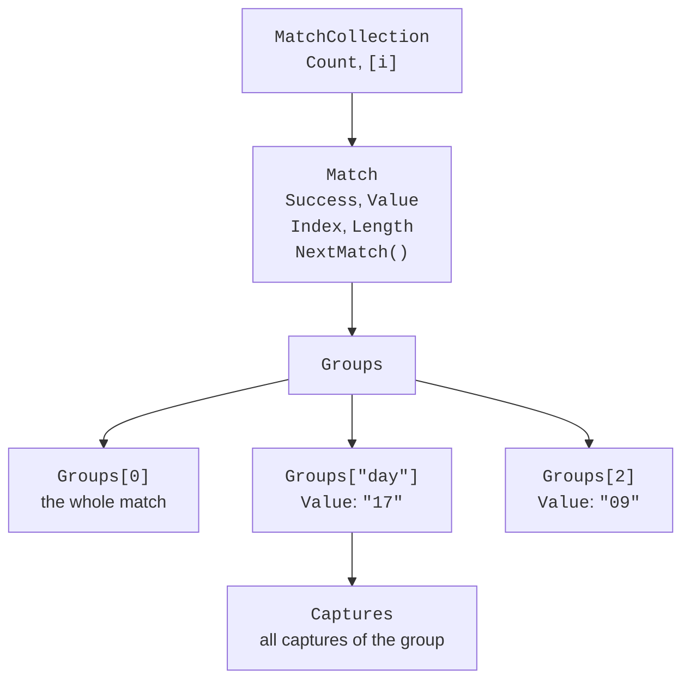

# The Regex class and groups

## The `Regex` class and match results

The `Regex` class has **static** methods, to which the pattern is passed as a parameter, and **instance** methods of an object created with the `new Regex(pattern)` constructor (Table 2.3). When the object is created, the pattern is parsed and validated. An error in the pattern causes a `RegexParseException` (a descendant of `ArgumentException`) with a description and the position of the error: for `"(abc"` it is `Invalid pattern '(abc' at offset 4. Not enough )'s.` (<https://learn.microsoft.com/dotnet/api/system.text.regularexpressions.regex>).

Table 2.3. Main methods of the `Regex` class {.caption}

| **Method** | **Result** |
| --- | --- |
| `IsMatch(input)` | `bool`: whether the text contains at least one match |
| `Match(input)` | the first match—a `Match` object |
| `Matches(input)` | all matches—a `MatchCollection` |
| `Count(input)` | the number of matches (.NET 7 and later) |
| `Replace(input, replacement)` | a new string in which the matches are replaced |
| `Split(input)` | an array of the parts into which the matches divide the text |
| `EnumerateMatches(span)` | matches without allocating objects (see below) |

Static methods are convenient for a one-time search. To avoid parsing the pattern every time, .NET keeps the last 15 patterns of static calls in a cache (the `Regex.CacheSize` property). If a pattern is used many times, you create a single `Regex` object and store it in a field, or use the source generator (the section "The `[GeneratedRegex]` source generator").

A search result is described by the `Match` class (Fig. 2.4):

- `Success`—whether a match was found;
- `Value`, `Index`, `Length`—the text of the match, its position, and its length;
- `NextMatch()`—the next match after the current one;
- `Groups`—the groups discussed in the next section.

The `Match` method never returns `null`: if there is no match, it returns an object with `Success == false` and an empty `Value`, so you must not skip the `Success` check.

```cs
string text = "Order 1045 of 12.09, 1046 of 15.09.";
var regex = new Regex(@"\b\d{4}\b");

Match m = regex.Match(text);
while (m.Success)
{
    Console.WriteLine($"{m.Value} [{m.Index}, {m.Length}]");
    m = m.NextMatch();
}
Console.WriteLine(regex.Count(text));   // 2
```

```
1045 [6, 4]
1046 [21, 4]
2
```

The same traversal is written more briefly with a `foreach (Match m in regex.Matches(text))` loop. A `MatchCollection` is filled lazily, during enumeration.



Figure 2.4. The structure of a search result {.caption}

### Example 1. Validating contacts

The program reads the `contacts.txt` file (or a file specified as a command-line argument) and determines for each line whether it is a Ukrainian phone number, an email address, or an error. The validation rules are collected in the static `ContactValidator` class.

```cs
using System.Text.RegularExpressions;

Console.OutputEncoding = System.Text.Encoding.UTF8;

string path = args.Length > 0 ? args[0] : "contacts.txt";
int phones = 0, emails = 0, errors = 0, number = 0;

foreach (string line in File.ReadLines(path))
{
    number++;
    string value = line.Trim();
    string kind;
    if (ContactValidator.IsValidPhone(value))
    {
        kind = "phone";
        phones++;
    }
    else if (ContactValidator.IsValidEmail(value))
    {
        kind = "email";
        emails++;
    }
    else
    {
        kind = "error";
        errors++;
    }
    Console.WriteLine($"{number,2}. {value,-26} {kind}");
}
Console.WriteLine($"Phones: {phones}, emails: {emails}, " +
    $"errors: {errors}");

static class ContactValidator
{
    // 0XX XXX XX XX, country code +38, spaces or hyphens.
    const string PhonePattern =
        @"^(\+38)?0\d{2}[ -]?\d{3}([ -]?\d{2}){2}$";

    // name@domain.zone, the zone is at least two letters.
    const string EmailPattern =
        @"^[\w.+-]+@[\w-]+(\.[\w-]+)*\.\p{L}{2,}$";

    public static bool IsValidPhone(string text) =>
        Regex.IsMatch(text, PhonePattern);

    public static bool IsValidEmail(string text) =>
        Regex.IsMatch(text, EmailPattern);
}
```

The phone pattern consists of an optional country code `(\+38)?`, an operator code `0\d{2}`, and groups of 3–2–2 digits, which may be separated by a single space or hyphen (`[ -]?`). The `^` and `$` anchors do not allow extra characters, so a 13-digit number is rejected. The email pattern requires name characters, `@`, a domain, and a zone of letters; since `\w` and `\p{L}` cover Unicode, an address with the Cyrillic domain `.укр` also passes. The result for a ten-line file:

```
 1. +380671234567              phone
 2. 067 123 45 67              phone
 3. +38050-123-45-67           phone
 4. 0671234567890              error
 5. +44 20 7946 0958           error
 6. olena.koval@example.com    email
 7. ivan+labs@example.org      email
 8. student@localhost          error
 9. петро@пошта.укр            email
10. mail@@example.com          error
Phones: 3, emails: 3, errors: 4
```

## Groups and backreferences

Parentheses combine part of a pattern into a **group**. A group lets you apply a quantifier to several characters (`(\d{2}\.){2}`) and **captures** the text that matches it. The captured values are available through the `Match.Groups` collection (<https://learn.microsoft.com/dotnet/standard/base-types/grouping-constructs-in-regular-expressions>):

- **numbered groups** `( … )` are numbered in the order of their opening parentheses starting from 1, and `Groups[0]` is the whole match;
- **named groups** `(?<name> … )` are accessible by name: `Groups["name"]`; code that uses them is clearer and does not break when a new group is added to the pattern;
- **noncapturing groups** `(?: … )` only group without storing anything.

```cs
var date = new Regex(
    @"^(?<day>\d{2})\.(?<month>\d{2})\.(?<year>\d{4})$");
Match m = date.Match("17.09.2026");
Console.WriteLine(m.Groups["year"].Value);   // 2026
Console.WriteLine(m.Groups[1].Value);        // 17 – the first group
Console.WriteLine(m.Groups.Count);           // 4 – including Groups[0]
int year = int.Parse(m.Groups["year"].ValueSpan);   // 2026
```

The `ValueSpan` property returns the group value as a `ReadOnlySpan<char>` without creating a new string. If an optional group did not participate in the match, its `Success` is `false` and its `Value` is an empty string. Groups are convenient to inspect in the debugger's *Locals* window (Fig. 2.5).


Figure 2.5. Match groups in the debugger's *Locals* window {.caption}

### Backreferences

A **backreference** `\1` or `\k<name>` requires the text **already captured** by a group to repeat at this point. This is how you find repeated words or paired tags:

```cs
string text = "This this is very very important, yes yes.";
foreach (Match m in Regex.Matches(text, @"\b(\w+)\s+\1\b",
             RegexOptions.IgnoreCase))
    Console.WriteLine(m.Value);    // This this, very very, yes yes

Regex.IsMatch("<b>text</b>", @"<(?<tag>\w+)>.*</\k<tag>>");  // True
Regex.IsMatch("<b>text</i>", @"<(?<tag>\w+)>.*</\k<tag>>");  // False
```

### The `Captures` collection

If a group is under a quantifier, it captures text several times. `Group.Value` stores only the **last** capture, and all captures are available in the `Group.Captures` collection:

```cs
Match list = Regex.Match("10,20,30", @"^(?:(?<n>\d+),?)+$");
Console.WriteLine(list.Groups["n"].Value);          // 30
foreach (Capture c in list.Groups["n"].Captures)
    Console.Write(c.Value + " ");                   // 10 20 30
```

### Example 2. Analyzing a web server log

Web servers write every request to a log in the widely used *Common Log Format*: the client IP address, date and time, request line, response code, and response size in bytes. The `access.log` file (Windows line endings `\r\n`) contains one corrupted line:

```
10.0.0.5 - - [17/Sep/2026:10:15:32 +0300] "GET / HTTP/2" 200 5120
10.0.0.7 - - [17/Sep/2026:10:15:40 +0300] "GET /news HTTP/2" 200 812
10.0.0.5 - - [17/Sep/2026:10:16:02 +0300] "POST /login HTTP/2" 302 -
10.0.0.9 - - [17/Sep/2026:10:16:11 +0300] "GET /admin HTTP/2" 403 199
10.0.0.5 - - [17/Sep/2026:10:17:45 +0300] "GET /logo HTTP/2" 200 9480
10.0.0.9 - - [17/Sep/2026:10:18:03 +0300] "GET /.env HTTP/2" 404 153
corrupted log line
10.0.0.7 - - [17/Sep/2026:10:19:27 +0300] "GET /api/v1 HTTP/2" 500 97
```

The program finds all records with a single `Matches` call and displays the failed requests (codes 4xx and 5xx), the number of records by response code, the amount of data transferred, and the most active IP address.

```cs
using System.Text.RegularExpressions;

Console.OutputEncoding = System.Text.Encoding.UTF8;

// IP - - [time] "method path protocol" code size
var regex = new Regex("""
    ^(?<ip>\S+)\s\S+\s\S+\s
    \[(?<time>[^\]]+)\]\s
    "(?<method>[A-Z]+)\s(?<path>\S+)\s[^"]*"\s
    (?<status>\d{3})\s(?<size>\d+|-)\r?$
    """,
    RegexOptions.Multiline | RegexOptions.IgnorePatternWhitespace);

string log = File.ReadAllText("access.log");
MatchCollection records = regex.Matches(log);
int lines = log.Split('\n',
    StringSplitOptions.RemoveEmptyEntries).Length;

var byStatus = new SortedDictionary<string, int>();
var byIp = new Dictionary<string, int>();
long bytes = 0;

foreach (Match m in records)
{
    string status = m.Groups["status"].Value;
    byStatus[status] = byStatus.GetValueOrDefault(status) + 1;
    string ip = m.Groups["ip"].Value;
    byIp[ip] = byIp.GetValueOrDefault(ip) + 1;
    if (long.TryParse(m.Groups["size"].ValueSpan, out long size))
        bytes += size;
    if (status[0] is '4' or '5')
    {
        Console.WriteLine($"{m.Groups["time"].Value[12..20]} " +
            $"{status} {m.Groups["method"].Value} " +
            $"{m.Groups["path"].Value}");
    }
}

Console.WriteLine($"Records: {records.Count} of {lines}, " +
    $"transferred {bytes:N0} bytes");
foreach (var (status, count) in byStatus)
    Console.WriteLine($"  {status}: {count}");
var top = byIp.MaxBy(pair => pair.Value);
Console.WriteLine($"Most active IP: {top.Key} ({top.Value})");
```

The long pattern is written in a raw string literal across several lines. This is possible thanks to the `IgnorePatternWhitespace` option: spaces and line breaks in the pattern are ignored, and real spaces in the text are denoted by `\s`. The `Multiline` option makes `^` and `$` work for each line of the file, and `\r?` before `$` skips the `\r` character of the Windows line ending. The size `-` (a response without a body) is not a number, so `TryParse` skips it. The result:

```
10:16:11 403 GET /admin
10:18:03 404 GET /.env
10:19:27 500 GET /api/v1
Records: 7 of 8, transferred 15,861 bytes
  200: 3
  302: 1
  403: 1
  404: 1
  500: 1
Most active IP: 10.0.0.5 (3)
```
