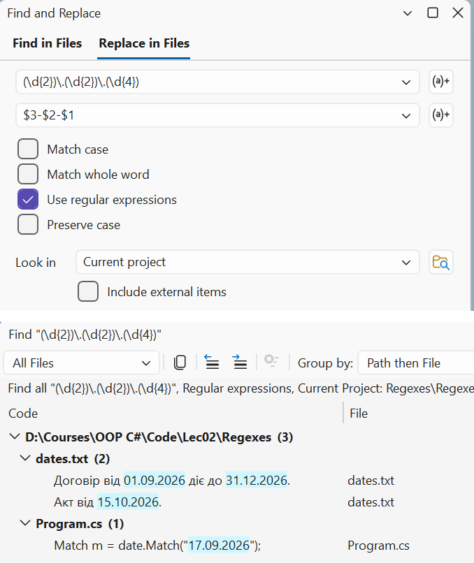

# Replacement, options, and lookarounds

## Replacing and splitting text

### The `Replace` method

The `Replace` method returns a new string in which each match is replaced with a **replacement string**. The replacement string can refer to groups (Table 2.4, <https://learn.microsoft.com/dotnet/standard/base-types/substitutions-in-regular-expressions>).

Table 2.4. Substitutions in a replacement string {.caption}

| **Substitution** | **What is inserted** |
| --- | --- |
| `$1`, `$2` | the text of a numbered group |
| `${name}` | the text of a named group |
| `${1}0` | group 1 followed by the character 0 (`$10` would mean group 10) |
| `$0` | the whole match |
| `$$` | the `$` character |

```cs
Regex.Replace("  Too    many   spaces ", @"\s+", " ").Trim();
// "Too many spaces"
Regex.Replace("17.09.2026 and 01.10.2026",
    @"(\d{2})\.(\d{2})\.(\d{4})", "$3-$2-$1");
// "2026-09-17 and 2026-10-01"
Regex.Replace("Price 250", @"\d+", "$0 UAH");   // "Price 250 UAH"
```

The *Replace in Files* window in Visual Studio performs the same replacements: find and replace in the editor use .NET regular expressions (<https://learn.microsoft.com/visualstudio/ide/using-regular-expressions-in-visual-studio>). Just turn on the *Use Regular Expressions* button (**Alt+E**) (Fig. 2.6).



Figure 2.6. Find and replace with regular expressions in Visual Studio {.caption}

### Replacing with a `MatchEvaluator`

If the replacement depends on processing the match (calculation, validation, formatting), instead of a string you pass a method or lambda expression of type `MatchEvaluator`: it receives a `Match` and returns the replacement string (<https://learn.microsoft.com/dotnet/api/system.text.regularexpressions.matchevaluator>):

```cs
string masked = Regex.Replace("Olena Petrenko, Ihor Koval",
    @"\b(\p{Lu})\p{Ll}+\b", m => m.Groups[1].Value + ".");
// "O. P., I. K."
string doubled = Regex.Replace("price 12.5 and 7.25", @"\d+\.\d+",
    m => (decimal.Parse(m.Value) * 2).ToString());
// "price 25.0 and 14.50"
```

### The `Split` method and `Regex.Escape`

`Regex.Split` splits a string at the matches. Unlike `string.Split`, the separator can be any pattern, for example "a comma, semicolon, or vertical bar together with the surrounding spaces". If the pattern contains a group, the captured separators are also included in the result:

```cs
Regex.Split("apples, pears;plums |  cherries", @"\s*[,;|]\s*");
// apples / pears / plums / cherries
Regex.Split("2+3*4-1", @"([+*-])");
// 2 / + / 3 / * / 4 / - / 1
```

When part of a pattern is entered by the user (for example, a search string), it must be passed through `Regex.Escape`. The method escapes metacharacters and spaces, so the text is searched literally. Without escaping, the string `C++` causes a `RegexParseException` (`Nested quantifier '+'`):

```cs
string find = "C++";
Regex.Escape("price (UAH): 12.50?");   // price\ \(UAH\):\ 12\.50\?
Regex.Count("C++ and C++/CLI, but not C", Regex.Escape(find));   // 2
```

### Example 3. Normalizing dates

The program converts dates from the `dd.mm.yyyy` format used in Ukraine to the international ISO 8601 format `yyyy-mm-dd`. First, a simple group substitution is performed, and then a replacement with a `MatchEvaluator` that checks whether the date exists in the calendar.

```cs
using System.Globalization;
using System.Text.RegularExpressions;

Console.OutputEncoding = System.Text.Encoding.UTF8;

string text = """
    Contract No. 17/2026 of 01.09.2026 is valid until 31.12.2026.
    Certificate of 31.02.2026 signed 3.10.2026, version 2.14.2026.1.
    """;

var date = new Regex(
    @"\b(?<day>\d{1,2})\.(?<month>\d{1,2})\.(?<year>\d{4})\b");

// 1. Group substitution: only rearranging the parts.
Console.WriteLine(date.Replace(text, "${year}-${month}-${day}"));

// 2. MatchEvaluator: validating the date and padding with zeros.
int fixedCount = 0, invalid = 0;
string result = date.Replace(text, match =>
{
    string value = match.Value;
    if (DateOnly.TryParseExact(value, "d.M.yyyy",
            CultureInfo.InvariantCulture, DateTimeStyles.None,
            out DateOnly parsed))
    {
        fixedCount++;
        return parsed.ToString("yyyy-MM-dd");
    }
    invalid++;
    return $"[{value}?]";
});

Console.WriteLine();
Console.WriteLine(result);
Console.WriteLine($"Dates: {fixedCount}, invalid: {invalid}");
```

A regular expression checks only the **shape** of the text: it does not know that February has no 31st day or that `2.14.2026.1` is a version number rather than a date. So the first replacement produces the nonexistent dates `2026-02-31` and `2026-14-2` and does not pad the day with a zero. The second replacement checks each match with the `DateOnly.TryParseExact` method, formats the valid dates, and marks the invalid ones:

```
Contract No. 17/2026 of 2026-09-01 is valid until 2026-12-31.
Certificate of 2026-02-31 signed 2026-10-3, version 2026-14-2.1.

Contract No. 17/2026 of 2026-09-01 is valid until 2026-12-31.
Certificate of [31.02.2026?] signed 2026-10-03, version [2.14.2026?].1.
Dates: 3, invalid: 2
```

## `RegexOptions`

The engine's behavior is changed by the **options** of the `RegexOptions` enumeration, which are passed to a constructor or static method and combined with the `|` operator (Table 2.5). Some options can be set as an **inline option** directly in the pattern: `(?i)` at the beginning or `(?i:…)` for part of the pattern (<https://learn.microsoft.com/dotnet/standard/base-types/regular-expression-options>).

Table 2.5. `RegexOptions` {.caption}

| **Option** | **In the pattern** | **Effect** |
| --- | --- | --- |
| `IgnoreCase` | `(?i)` | case-insensitive matching |
| `Multiline` | `(?m)` | `^` and `$` match the start and end of each line of text |
| `Singleline` | `(?s)` | `.` also matches `\n` |
| `IgnorePatternWhitespace` | `(?x)` | ignore whitespace in the pattern, comments after `#` |
| `ExplicitCapture` | `(?n)` | capture only named groups |
| `CultureInvariant` | – | compare case regardless of culture |
| `Compiled` | – | compile the pattern to IL code at run time |
| `NonBacktracking` | – | a backtracking-free engine with linear time (.NET 7+) |
| `ECMAScript` | – | JavaScript behavior: `\d` and `\w` are ASCII only |
| `RightToLeft` | – | search from right to left |

```cs
string text = "1. Introduction\n2. Syntax\ntext\n3. Classes";
Regex.Count(text, @"^\d+\.");                          // 1
Regex.Count(text, @"^\d+\.", RegexOptions.Multiline);  // 3
Regex.Count(text, @"(?m)^\d+\.");                      // 3

string comment = "/* line 1\nline 2 */";
Regex.IsMatch(comment, @"/\*.*\*/");                          // False
Regex.IsMatch(comment, @"/\*.*\*/", RegexOptions.Singleline);  // True

Regex.IsMatch("HEDGEHOG", "(?i)hedgehog");        // True
Regex.IsMatch("Kyiv CITY", "Kyiv (?i:city)");     // True
```

The names of the `Multiline` and `Singleline` options are not opposites, as they may seem: the first changes how `^`/`$` work, the second changes the period, and they can be enabled together. `IgnorePatternWhitespace` lets you split a complex pattern into lines with comments after `#`, as in Example 2.

::: tip Important
In .NET 10, the `$` character in `Multiline` mode matches only the position before `\n`. For text with Windows line endings `\r\n`, the pattern `^.+$` also captures the `\r` character, and `^\w+$` finds no lines at all. Write `\r?$` or replace `\r\n` with `\n` beforehand. The `RegexOptions.AnyNewLine` option, which recognizes all kinds of line endings, appears only in .NET 11.
:::

The `CultureInvariant` option is needed together with `IgnoreCase` if the pattern compares keywords and the program may run under any culture. In the Turkish culture, the lowercase "i" corresponds to the uppercase dotted "İ", so with `IgnoreCase` the string `FILE` does not match the pattern `file`, but with `IgnoreCase | CultureInvariant` it does.

## Lookahead and lookbehind

A **lookaround** is a condition that checks the text to the right or left of the current position **without including** it in the match. Like anchors, a lookaround has zero width (Table 2.6).

Table 2.6. Lookahead and lookbehind {.caption}

| **Notation** | **Name** | **Example** |
| --- | --- | --- |
| `X(?=Y)` | lookahead: `Y` follows | `\d+(?=\s?UAH)`—a number before "UAH" |
| `X(?!Y)` | negative lookahead: `Y` does not follow | `\b\d+\b(?!%)`—a number that is not a percentage |
| `(?<=Y)X` | lookbehind: `Y` precedes `X` | `(?<=№\s?)\d+`—a number after "№" |
| `(?<!Y)X` | negative lookbehind: `Y` does not precede `X` | `(?<!\d)\d{4}(?!\d)`—exactly 4 digits |

```cs
string price = "Price 250 UAH, discount 15 %, delivery 1250UAH";
Regex.Matches(price, @"\d+(?=\s?UAH)");                  // 250, 1250
Regex.Matches("Invoices №42 and № 107", @"(?<=№\s?)\d+"); // 42, 107
Regex.Matches("discount 15%, 20 pcs.", @"\d+(?!%)");      // 1, 20 (!)
Regex.Matches("discount 15%, 20 pcs.", @"\b\d+\b(?!%)");  // 20
Regex.Replace("1234567", @"(?<=\d)(?=(?:\d{3})+\b)", ",");
// "1,234,567"
```

The third line shows a trap: for `15%`, the pattern `\d+(?!%)` does not find `15`, but the engine backtracks one digit and finds `1`, which is followed not by `%` but by `5`. Word boundaries `\b` forbid such "truncated" matches. The last example inserts a comma at each position that is preceded by a digit and followed by a number of digits to the end of the number that is a multiple of three.

Several lookaheads at the start of a pattern check **several independent conditions** for one string. This is how a password policy is written: at least 8 characters, including a digit, a lowercase letter, and an uppercase letter:

```cs
var password = new Regex(@"^(?=.*\d)(?=.*\p{Ll})(?=.*\p{Lu}).{8,}$");
password.IsMatch("Kyiv2026");   // True
password.IsMatch("kyiv2026");   // False – no uppercase letter
```

Each lookahead `(?=.*…)` scans the string from the beginning and "consumes" nothing, so the next condition is again checked from position 0. To tell the user **which** condition was violated, each rule is checked with a separate pattern.
