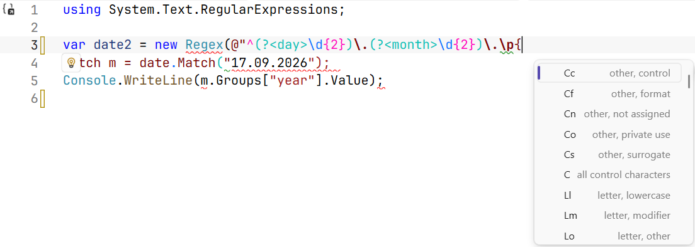
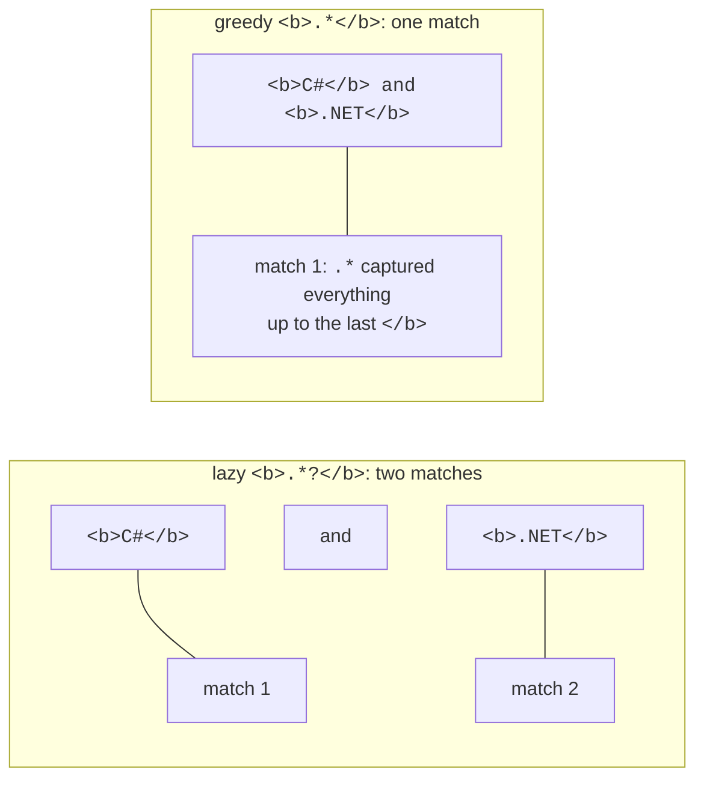
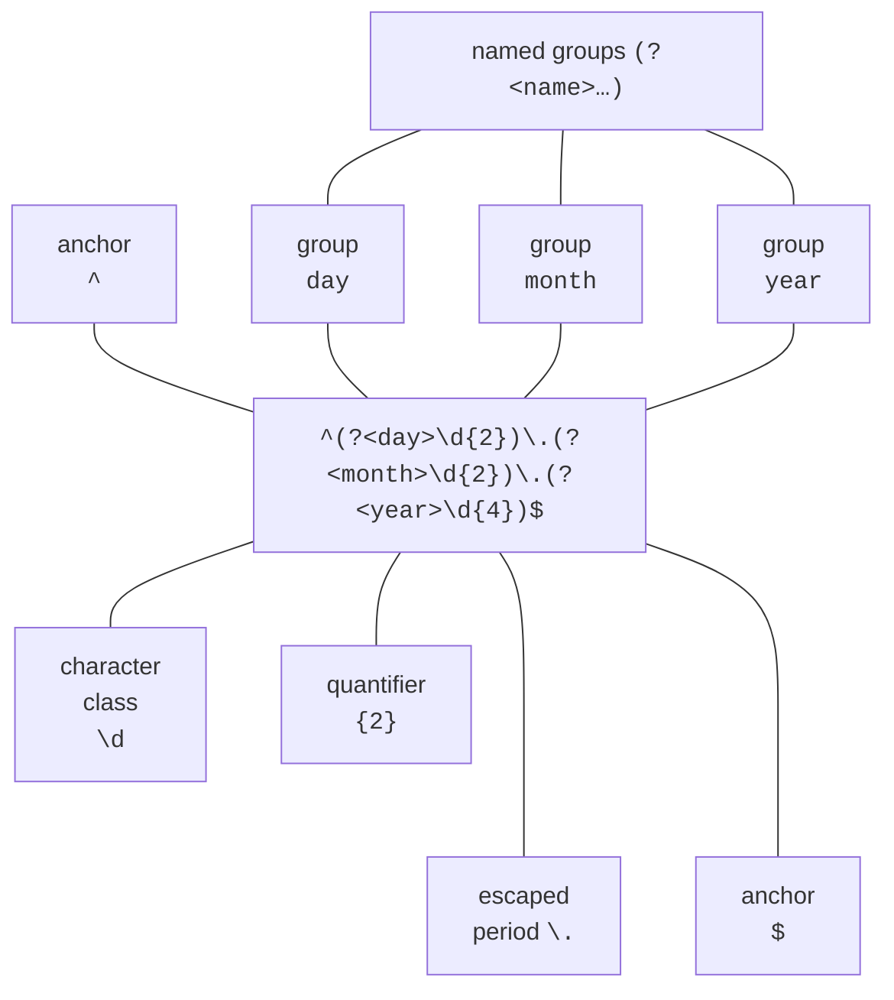

# Regular expression syntax

## Regular expressions in .NET

Programs process text all the time: they validate phone numbers and email addresses, look for errors in logs, extract amounts from receipts, and convert dates from one format to another. The methods of the `string` class solve only the simplest of these problems. `Contains` and `IndexOf` look for a **specific** fragment, and `Split` divides a string at **specific** characters. But how do you find "all phone numbers" in a text if each one is written differently: `+380671234567`, `050-123-45-67`?

A **regular expression** (*regex* for short) is a **pattern** that describes a set of strings: "a plus sign, then digits and hyphens, at least ten characters". The regex engine searches the text for fragments that match the pattern—**matches**. In .NET, all types for working with regular expressions are in the `System.Text.RegularExpressions` namespace, the main one being the `Regex` class (<https://learn.microsoft.com/dotnet/standard/base-types/regular-expressions>).

```cs
using System.Text.RegularExpressions;

string text = "Phones: +380671234567, 050-123-45-67; year 2026.";
foreach (Match m in Regex.Matches(text, @"\+?\d[\d-]{8,}\d"))
    Console.WriteLine(m.Value);
```

The pattern `\+?\d[\d-]{8,}\d` reads as follows: an optional plus sign, a digit, at least eight digits or hyphens, and a digit. The number 2026 has only four digits, so it does not match:

```
+380671234567
050-123-45-67
```

Regular expressions are a small language of their own with their own syntax. Its dialects in different programming languages are very similar, so the patterns in this lecture work with minor changes in Java, Python, or JavaScript as well. Below we cover the .NET dialect; the complete reference of language elements is at <https://learn.microsoft.com/dotnet/standard/base-types/regular-expression-language-quick-reference>.

### Writing patterns in C# code

Patterns contain many backslashes `\`, and in a regular C# string this character starts an escape sequence (`\n`, `\t`). So the pattern `\d+\.\d+` would have to be written as `"\\d+\\.\\d+"` in a regular string. It is more convenient to use two other kinds of string literals:

- a **verbatim string** `@"\d+\.\d+"`—the backslash in it is an ordinary character, and a quotation mark is written twice: `@"<a href=""x"">"`;
- a **raw string literal** in triple quotes—convenient when a pattern contains quotation marks or spans several lines (<https://learn.microsoft.com/dotnet/csharp/language-reference/tokens/raw-string>).

```cs
string a = "\\d+\\.\\d+";         // regular string
string b = @"\d+\.\d+";           // verbatim string, a == b
string link = """<a href="(?<url>[^"]+)">""";   // raw string
```

Visual Studio recognizes a pattern string passed to `Regex` methods, colors its elements, and offers completion for constructs such as `\p{` or `(?<` (Fig. 2.1).



Figure 2.1. Regular expression highlighting and completion in the Visual Studio editor {.caption}

## Characters and character classes

Most pattern characters stand for themselves: the pattern `UAH` finds the word "UAH". Only the **metacharacters** `\ ^ $ . | ? * + ( ) [ ] { }` have a special meaning. To find a metacharacter as an ordinary character, you **escape** it with a backslash: `\.` is a period, `\+` is a plus sign, and `\(` is a parenthesis.

A **character class** matches **one** character from a set (Table 2.1). The set is written in square brackets: `[aeiou]` is one of the vowels, `[0-9]` is a digit, and `[A-Za-z]` is a Latin letter. A `^` right after `[` negates the class: `[^0-9]` is any character except a digit. Inside square brackets, most metacharacters lose their special meaning: `[.+]` is a period or a plus sign (<https://learn.microsoft.com/dotnet/standard/base-types/character-classes-in-regular-expressions>).

Table 2.1. Main character classes {.caption}

| **Notation** | **Matches one character** |
| --- | --- |
| `[abc]`, `[a-z]` | from the list or range |
| `[^abc]` | any except those listed |
| `.` | any except `\n` (end of line) |
| `\d`, `\D` | a digit (Unicode category `Nd`) / a non-digit |
| `\w`, `\W` | a word character: letter, digit, `_` / any other character |
| `\s`, `\S` | a whitespace character (space, `\t`, `\n`, `\r`) / any other character |
| `\p{L}`, `\p{Lu}`, `\p{Ll}` | a letter / an uppercase letter / a lowercase letter in any language |
| `\p{P}`, `\P{L}` | a punctuation mark / any character except a letter |
| `\p{IsCyrillic}` | a character from the Unicode "Cyrillic" block (U+0400–U+04FF) |
| `\t`, `\n`, `і` | a tab, a newline, a character by code (і) |

### Unicode and Ukrainian

In .NET, the `\d` and `\w` classes work with all of Unicode, not just Latin characters. This is convenient: `\w+` finds words in Ukrainian. But there are two consequences to keep in mind:

```cs
string s = "Garden 2026, café ٣";
Console.WriteLine(Regex.Count(s, @"\d"));    // 5 – including the Arabic-Indic digit ٣
Console.WriteLine(Regex.Count(s, "[0-9]"));  // 4
Console.WriteLine(Regex.IsMatch("п’ять", @"^\w+$"));          // False
Console.WriteLine(Regex.IsMatch("п’ять", @"^[\p{L}’']+$"));   // True
```

- `\d` matches digits of any script. If the input is later converted to a number, check for `[0-9]` specifically (or enable the `RegexOptions.ECMAScript` option).
- The apostrophes ’ (U+2019) and ' do not belong to `\w`, so Ukrainian words such as "п’ять" and "м’яч" split into two parts for `\w+`. For Ukrainian words, the class `[\p{L}’'-]` is used, which adds the apostrophe and the hyphen ("Прем’єр-ліга").

The class `[А-Яа-я]`, familiar from textbooks, is **not suitable** for Ukrainian: it does not contain the letters Ґ, Є, І, Ї (their codes lie outside the range), but it does contain the Russian Ы, Э, Ъ. The correct options:

```cs
Regex.IsMatch("Їжак", "^[А-Яа-я]+$");                   // False
Regex.IsMatch("Їжак", "^[А-ЩЬЮЯҐЄІЇа-щьюяґєії]+$");     // True
Regex.IsMatch("Їжак", @"^\p{IsCyrillic}+$");            // True
```

The `\p{IsCyrillic}` class covers all of Cyrillic, while the list `[А-ЩЬЮЯҐЄІЇа-щьюяґєії]` covers only the 33 letters of the Ukrainian alphabet. .NET also supports **character class subtraction**: `[а-яґєії-[ыэъ]]` is lowercase Cyrillic letters with the Ukrainian letters added and the three Russian ones removed.

## Quantifiers, anchors, and alternation

### Quantifiers

A **quantifier** specifies how many times the preceding element can repeat: a character, a class, or a group in parentheses (Table 2.2). The pattern `colou?r` matches the words "color" and "colour", and `\d{3,4}` matches three or four digits.

Table 2.2. Quantifiers {.caption}

| **Greedy** | **Lazy** | **Number of repetitions** |
| --- | --- | --- |
| `*` | `*?` | 0 or more |
| `+` | `+?` | 1 or more |
| `?` | `??` | 0 or 1 (optional element) |
| `{n}` | `{n}?` | exactly *n* |
| `{n,}` | `{n,}?` | at least *n* |
| `{n,m}` | `{n,m}?` | from *n* to *m* |

Quantifiers are **greedy** by default: they capture as many characters as possible and then "give them back" if necessary. A `?` after a quantifier makes it **lazy**: it captures as few characters as possible (Fig. 2.2):

```cs
string html = "<b>C#</b> and <b>.NET</b>";
Console.WriteLine(Regex.Match(html, "<b>.*</b>").Value);
// <b>C#</b> and <b>.NET</b>
foreach (Match m in Regex.Matches(html, "<b>.*?</b>"))
    Console.WriteLine(m.Value);    // <b>C#</b>, then <b>.NET</b>
```



Figure 2.2. Greedy and lazy quantifiers {.caption}

Instead of a lazy quantifier, it is often more precise to write a negated class: `<b>[^<]*</b>` ("any characters except `<`"). Such a pattern cannot go beyond the tag and runs faster.

### Anchors

**Anchors** do not match any character; they check a **position** in the text (<https://learn.microsoft.com/dotnet/standard/base-types/anchors-in-regular-expressions>):

- `^`—the start of the string; `$`—the end of the string **or the position before a trailing** `\n`;
- `\A`—only the start of the string; `\z`—only the end of the string;
- `\b`—a word boundary: a `\w` character on one side and a non-`\w` character or the edge of the text on the other; `\B`—not a word boundary.

Without anchors, the `IsMatch` method looks for a match **anywhere** in the text: `\d+` finds the digits in the string `abc12345`. To validate an input format, a pattern must be "anchored" on both sides:

```cs
Regex.IsMatch("abc12345", @"\d+");        // True – there are digits
Regex.IsMatch("abc12345", @"^\d+$");      // False – not only digits
Regex.IsMatch("12345\n", @"^\d+$");       // True – $ before \n!
Regex.IsMatch("12345\n", @"^\d+\z");      // False
Regex.Count("cat, catalog, cat.", "cat");       // 3
Regex.Count("cat, catalog, cat.", @"\bcat\b");  // 2
```

The pattern `^\d+$` accepts a string with a trailing `\n`. To validate data that did not go through `Console.ReadLine` (files, network, APIs), it is more reliable to end the pattern with `\z`.

### Alternation

The vertical bar `|` means "or": `jpg|png|gif`. Alternation has the **lowest** precedence and splits the whole pattern in two, so `^jpg|png$` means "`jpg` at the start **or** `png` at the end" and accepts the string `jpgX`. Put the alternatives in parentheses: `^(jpg|png)$`.

Fig. 2.3 shows the elements that make up the `dd.mm.yyyy` date pattern, to which we will return later.



Figure 2.3. The components of a regular expression {.caption}
