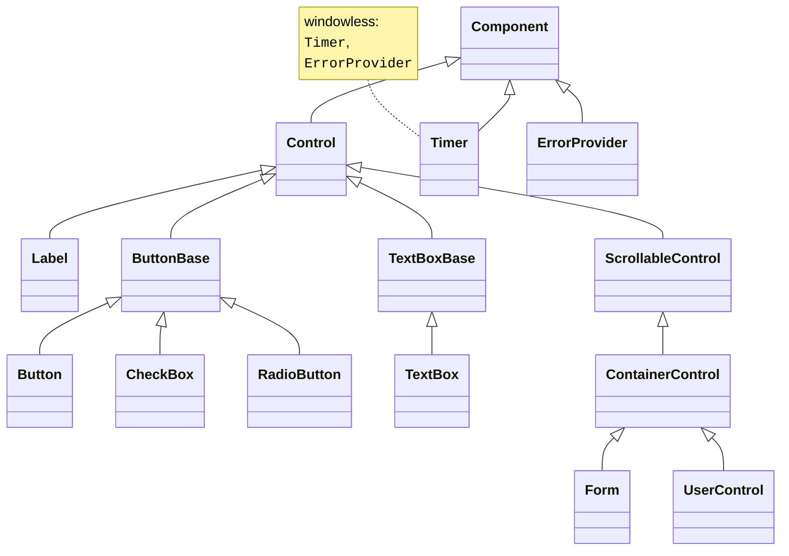
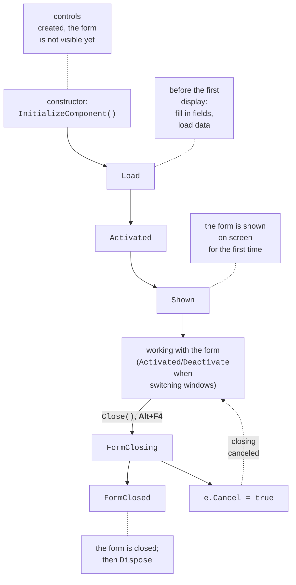
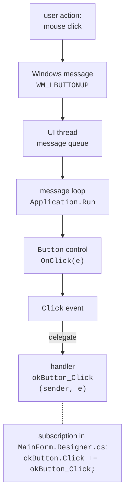
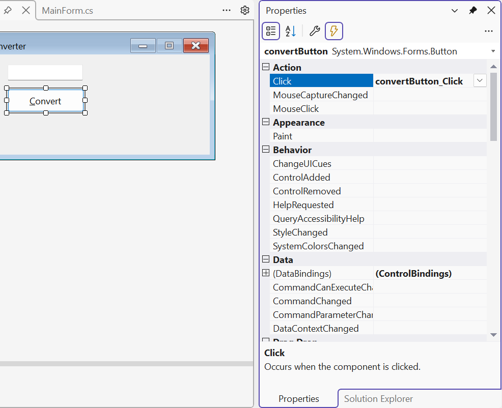

# Forms, controls, and events

## The `Control` and `Form` classes

### The control hierarchy

All controls derive from the `Control` class (Fig. 3.4). It defines common properties (location, size, text, colors, font), methods (`Show`, `Hide`, `Focus`, `Invalidate`), and events (`Click`, `MouseMove`, `KeyDown`, `Paint`). Each control is a separate Windows window and has a **window handle**, available through the `Handle` property. Windowless components (`Timer`, `ErrorProvider`, dialogs) derive only from `Component`. A form (`Form`) is also a control: it derives from `ContainerControl`, so it can contain other controls (the `Controls` collection) and manages input focus among them. The `Location` coordinates of a child control are specified in pixels relative to its parent (`Parent`), and the *Y* axis points down.



Figure 3.4. The control class hierarchy (the arrow points to the base class) {.caption}

### Common properties

The most frequently used properties of the `Control` class are listed in Table 3.2 (<https://learn.microsoft.com/dotnet/api/system.windows.forms.control>).

Table 3.2. Common control properties {.caption}

| **Property** | **Purpose** |
| --- | --- |
| `Name` | the name of the control (and of the form class field) |
| `Text` | the control's text: a button caption, a field's content, a form title |
| `Location`, `Left`, `Top` | position relative to the parent control |
| `Size`, `Width`, `Height` | size in pixels |
| `BackColor`, `ForeColor` | background and text color: `Color.LightGreen` |
| `Font` | font: `new Font("Segoe UI", 12F, FontStyle.Bold)` |
| `Enabled` | `false`—the control is visible but does not respond to the user |
| `Visible` | `false`—the control is hidden |
| `TabIndex`, `TabStop` | the **Tab** key order and participation in it |
| `Anchor`, `Dock` | attachment to the edges of the parent control |
| `Tag` | an arbitrary object associated with the control |

The tab order between fields is easy to check and change with the *View → Tab Order* command: the designer shows the `TabIndex` numbers on the controls, and you set them by clicking in sequence (<https://learn.microsoft.com/dotnet/desktop/winforms/controls/how-to-set-the-tab-order-on-windows-forms>).

Form properties determine the window's appearance and behavior: `Text` is the title, `StartPosition` is the initial position (`CenterScreen`, `CenterParent`), `FormBorderStyle` is the border (`Sizable`, `FixedDialog`), `MinimizeBox` and `MaximizeBox` are the minimize and maximize buttons, `MinimumSize` is the smallest size, `AcceptButton` and `CancelButton` are the buttons pressed by the **Enter** and **Esc** keys, and `KeyPreview` lets the form receive keys before its controls.

### The form lifecycle

When a form is created, shown, and closed, it raises events in a strict order (Fig. 3.5) (<https://learn.microsoft.com/dotnet/desktop/winforms/order-of-events-in-windows-forms>). In the `Load` handler, you fill in fields and load data. In the `FormClosing` handler, setting `e.Cancel = true` cancels closing, and `e.CloseReason` reports the reason (the user, Windows shutdown, an `Application.Exit` call). After the main form's `FormClosed`, the application exits.



Figure 3.5. The form lifecycle {.caption}

The order of events is easy to see if you subscribe to them in the form constructor and write messages to the debugger's *Output* window with the `Debug.WriteLine` method (the `System.Diagnostics` namespace):

```cs
public MainForm()
{
    InitializeComponent();
    Load += (sender, e) => Trace("Load");
    Activated += (sender, e) => Trace("Activated");
    Shown += (sender, e) => Trace("Shown");
    FormClosing += (sender, e) =>
        Trace($"FormClosing, reason: {e.CloseReason}");
    FormClosed += (sender, e) => Trace("FormClosed");
}

private static void Trace(string text) =>
    Debug.WriteLine($"{DateTime.Now:HH:mm:ss.fff} {text}");
```

After starting (**F5**) and closing the form, the *Output* window contains the lines `Load`, `Activated`, `Shown`, `FormClosing, reason: UserClosing`, and `FormClosed`. The obsolete `Closing` and `Closed` events are marked with the `Obsolete` attribute in .NET 10 (warning WFDEV004): use `FormClosing` and `FormClosed`.

## The event model

A console program determines the order of actions itself: it asks for data, calculates, and outputs the result. A GUI application is **event-driven**: after starting, it waits for user actions, and each action (a click, a key press, a text change) raises an **event**, to which an **event handler** responds (<https://learn.microsoft.com/dotnet/desktop/winforms/forms/events>).

Fig. 3.6 shows the path from a mouse click to a handler. Windows sends messages (`WM_LBUTTONDOWN`, `WM_LBUTTONUP`) to the UI thread's queue. The message loop started by the `Application.Run` method takes messages from the queue and passes them to the button's window. The button turns the message into a call to the `OnClick` method, which raises the `Click` event, and the event invokes all subscribed handlers through a delegate.



Figure 3.6. The Windows Forms event model {.caption}

All handlers run on the **UI thread** one at a time. While a handler is running, the message loop is stalled: the window is not repainted and does not respond to clicks. So a handler must finish quickly, and long-running operations (downloading from the network, heavy calculations) are performed asynchronously (Topic 5).

### Event handlers

An event in C# is a class member declared with the `event` keyword and a delegate type. Most Windows Forms events have the type `EventHandler` or `EventHandler<TEventArgs>`, so a handler has two parameters:

- `sender`—the object that raised the event (a button, a field, a menu item);
- `e`—the event data: `EventArgs` (no data), `MouseEventArgs` (the mouse button and the `e.X`, `e.Y` coordinates), `KeyEventArgs` (the `e.KeyCode` key, the `e.Control`, `e.Shift`, `e.Alt` modifiers), `FormClosingEventArgs`, `CancelEventArgs`, and so on.

The easiest way to create a handler is in the designer. Double-clicking a control creates a handler for the **default event**: `Click` for a button, `TextChanged` for an input field, `Load` for a form. For other events, select the control, click the *Events* button in the *Properties* window, and double-click the event name (Fig. 3.7). The drop-down list next to the event name lets you choose an existing method with a compatible signature (<https://learn.microsoft.com/dotnet/desktop/winforms/controls/how-to-add-an-event-handler>).



Figure 3.7. Button events in the *Properties* window {.caption}

The designer adds a subscription to `Designer.cs` and an empty `convertButton_Click` method to `MainForm.cs`. To remove a handler, deleting the method is not enough: the subscription line remains in `Designer.cs`, and the project will not compile. Clear the event in the *Properties* window (the event name's context menu → *Reset*) or remove the subscription first.

### Subscribing to events in code

Handlers can also be subscribed in code with the `+=` operator (unsubscribe with `-=`). This is convenient for connecting one handler to several controls, using a lambda expression, or creating a control at run time.

The `EventHandler` delegate declares an `object? sender` parameter. Handlers created by the designer have an `object sender` parameter: they are subscribed in `Designer.cs`, where nullability checking is disabled for generated code. If you subscribe such a method in your own code, the compiler issues warning CS8622, so declare the handlers you subscribe yourself with `object? sender`.

An example of subscriptions in the form constructor:

```cs
public MainForm()
{
    InitializeComponent();
    // One handler for three buttons.
    Button[] addButtons = [add1Button, add5Button, add10Button];
    foreach (Button b in addButtons)
    {
        b.Click += AddButton_Click;
    }
    // A lambda expression as a handler.
    resetButton.Click += (sender, e) => totalLabel.Text = "0";
    // Mouse coordinates are passed in MouseEventArgs.
    drawPanel.MouseMove += (sender, e) =>
        Text = $"X = {e.X}, Y = {e.Y}";
}

private void AddButton_Click(object? sender, EventArgs e)
{
    var button = (Button)sender!;  // the button that was clicked
    int step = int.Parse(button.Text);        // "+5" → 5
    int total = int.Parse(totalLabel.Text);
    totalLabel.Text = (total + step).ToString();
}
```

The buttons have the captions `+1`, `+5`, `+10`, and the shared handler determines the step from the caption of the `sender` button. After clicking "+5", "+10", "+1", the `totalLabel` label shows 16, and the *Reset* button resets it to 0. While the mouse moves over the `drawPanel` panel, the form title shows the cursor coordinates. The keyboard is handled with the `KeyDown` and `KeyUp` events (`KeyEventArgs`); if the form's `KeyPreview` property is `true`, the form receives keys before the control with focus.

## Basic controls

The most frequently used controls from the *Common Controls* group of the *Toolbox* are listed in Table 3.3. The full list is in the documentation <https://learn.microsoft.com/dotnet/desktop/winforms/controls/overview>.

Table 3.3. Basic controls {.caption}

| **Control** | **Purpose and main properties** | **Main event** |
| --- | --- | --- |
| `Label` | a label: `Text`, `AutoSize`, `TextAlign` | – |
| `TextBox` | an input field: `Text`, `Multiline`, `ReadOnly`, `MaxLength`, `PlaceholderText`, `UseSystemPasswordChar` | `TextChanged` |
| `Button` | a button: `Text`, `DialogResult`, `Image` | `Click` |
| `CheckBox` | a check box: `Checked`, `CheckState`, `ThreeState` | `CheckedChanged` |
| `RadioButton` | a radio button; radio buttons in one container form a group: `Checked` | `CheckedChanged` |
| `GroupBox`, `Panel` | containers with or without a border and title | – |
| `ComboBox` | a drop-down list: `Items`, `SelectedIndex`, `SelectedItem`, `DropDownStyle` | `SelectedIndexChanged` |
| `ListBox` | a list: `Items`, `SelectedItem`, `SelectionMode` | `SelectedIndexChanged` |
| `NumericUpDown` | a number with buttons: `Value` (`decimal`), `Minimum`, `Maximum`, `DecimalPlaces`, `Increment` | `ValueChanged` |
| `DateTimePicker` | date and time: `Value`, `MinDate`, `MaxDate`, `Format` | `ValueChanged` |
| `PictureBox` | an image: `Image`, `ImageLocation`, `SizeMode` | `Click` |

Controls with lists (`ComboBox`, `ListBox`) store any objects in the `Items` collection and display the result of the `ToString()` method for each. The `DropDownStyle` property set to `DropDownList` forbids entering text that is not in the list. An example of configuring controls in the form constructor:

```cs
cityComboBox.DropDownStyle = ComboBoxStyle.DropDownList;
cityComboBox.Items.AddRange("London", "Madrid", "Brussels");
cityComboBox.SelectedIndex = 0;
cityComboBox.SelectedIndexChanged += (sender, e) =>
    visitedListBox.Items.Add(cityComboBox.SelectedItem!);

submitButton.Enabled = false;          // available only with consent
agreeCheckBox.CheckedChanged += (sender, e) =>
    submitButton.Enabled = agreeCheckBox.Checked;
```

The `Text` property of an input field is always of type `string`, so a number is obtained from it with the `TryParse` method and validation. If you need a number from a known range, `NumericUpDown` is more convenient: its `Value` property is already of type `decimal` and does not go beyond `Minimum`–`Maximum`.

The static `MessageBox.Show(text, caption, buttons, icon)` method shows a modal window with a message, buttons (`MessageBoxButtons.OK`, `YesNo`, `YesNoCancel`), and an icon (`MessageBoxIcon.Warning`, `Question`, `Error`), and returns a `DialogResult`—the button the user clicked (see the text editor example below) (<https://learn.microsoft.com/dotnet/api/system.windows.forms.messagebox>).

An **access key** is the `&` character in the `Text` property: the caption `&Convert` shows an underlined letter *C* (after pressing **Alt**), and the **Alt+C** combination clicks the button. The access key of a `Label` passes focus to the next field by `TabIndex`, so the label `&Name:` before an input field lets you move to the field with **Alt+N** (<https://learn.microsoft.com/dotnet/desktop/winforms/controls/how-to-create-access-keys-for-windows-forms-controls>). To display the `&` character itself, double it: `Save && Exit`.
