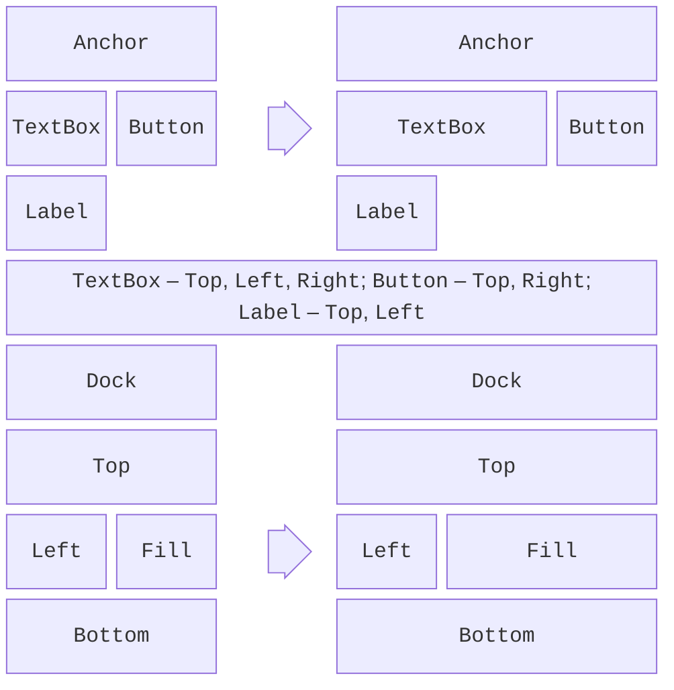
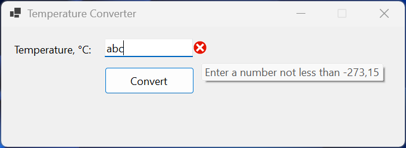

# Layout and input validation

## Laying out controls

Placing controls at fixed coordinates is simple, but after the window is maximized the controls stay in the upper-left corner, and a large font or another interface language truncates the labels. Windows Forms has several **layout** tools (<https://learn.microsoft.com/dotnet/desktop/winforms/controls/layout>).

### `Anchor` and `Dock`

The `Anchor` property attaches a control to the edges of its parent: when the form is resized, the distance to the anchored edges does not change (Fig. 3.8). By default, `Anchor = Top, Left`: the control stays in place. Anchoring to `Top, Right` moves a button together with the right edge, and `Top, Left, Right` stretches an input field across the full width.

The `Dock` property docks a control to an edge (`Top`, `Bottom`, `Left`, `Right`) or fills all the remaining space (`Fill`). This is how the menu, toolbar, and status bar (`Top`, `Bottom`) and the main content of the window (`Fill`) are placed. Docked controls take up space in the reverse order of the `Controls` collection (*Z-order*), so the control with `Fill` must be first in the collection; if it covers a panel, run the *Bring to Front* command on it.



Figure 3.8. `Anchor` and `Dock` before and after resizing the form {.caption}

The `Margin` property sets a control's outer spacing from its neighbors, and `Padding` sets the inner spacing between the border and the content. The `MinimumSize` and `MaximumSize` properties limit the size, and `AutoSize = true` fits the size of a label or button to its text.

### Layout panels

**Layout panels** position their child controls themselves:

- `FlowLayoutPanel`—places controls one after another in a row or column (`FlowDirection`) and wraps them when there is not enough room;
- `TableLayoutPanel`—a table with rows and columns; the size of a row or column is set in absolute units (*Absolute*), as a percentage (*Percent*), or by content (*AutoSize*). A control can span several cells (`ColumnSpan`, `RowSpan`);
- `SplitContainer`—two panels with a splitter that the user drags with the mouse.

In the designer, the rows and columns of a `TableLayoutPanel` are configured through the smart tag menu (the triangle in the upper-right corner of the panel) → *Edit Rows and Columns…* (Fig. 3.9). The same "label – field" form is easy to create in code as well: the first column fits the longest label (`SizeType.AutoSize`), the second takes the rest of the width (`SizeType.Percent`, 100%), and controls without explicitly specified rows fill the cells left to right and top to bottom:

```cs
public LayoutForm()
{
    var table = new TableLayoutPanel
    {
        Dock = DockStyle.Fill,
        ColumnCount = 2,
        Padding = new Padding(10)
    };
    table.ColumnStyles.Add(new ColumnStyle(SizeType.AutoSize));
    table.ColumnStyles.Add(new ColumnStyle(SizeType.Percent, 100));
    AddRow("&Name:", new TextBox { Dock = DockStyle.Fill });
    AddRow("&Email:", new TextBox { Dock = DockStyle.Fill });
    AddRow("&Track:", new ComboBox { Dock = DockStyle.Fill });
    Controls.Add(table);

    void AddRow(string caption, Control control)
    {
        table.Controls.Add(new Label
        {
            Text = caption,
            AutoSize = true,
            Anchor = AnchorStyles.Left   // vertically centered in the row
        });
        table.Controls.Add(control);
    }
}
```

If the form's client area is 300 pixels wide, the fields are 226 pixels wide, and after the window is widened to 520 pixels, they are 430: the labels stay in place, and the fields stretch.


Figure 3.9. Configuring the rows and columns of a `TableLayoutPanel` {.caption}

### Scaling and high DPI

Modern monitors use 125–200% scaling. The form property `AutoScaleMode = Font` (the designer's default) scales the form and controls in proportion to the size of the system font, and `AutoScaleDimensions` stores the font size with which the form was created (for 100% scaling—`new SizeF(7F, 15F)`). The application's high-DPI mode is set by the `ApplicationHighDpiMode` project property (`SystemAware` by default); the `PerMonitorV2` value recalculates sizes when the window is moved to a monitor with a different scale (<https://learn.microsoft.com/dotnet/desktop/winforms/whats-new/net60#project-level-application-settings>). Layout panels and `AutoSize` make a form resilient to scaling changes, so for forms with many fields they are better than fixed coordinates.

## Validating input

A user can type anything into a field, so data is validated before use. Windows Forms provides validation events and the `ErrorProvider` component for this (<https://learn.microsoft.com/dotnet/desktop/winforms/input-keyboard/validation>).

### The `Validating` and `Validated` events

When focus leaves a control (the **Tab** key or a click on another control), the `Leave`, `Validating`, and `Validated` events are raised. In the `Validating` handler, you check the value and, if it is invalid, set `e.Cancel = true`: focus stays in the field, and the `Validated` event is not raised.

The `Validating` event is raised only when moving to a control whose `CausesValidation = true` (the default). For a *Cancel* or *Help* button, set `CausesValidation = false` so the user can close the form without fixing the field. The form's `ValidateChildren()` method validates all controls at once and returns `false` if at least one failed validation: call it before saving or calculating.

### The `ErrorProvider` component

`ErrorProvider` shows an error icon next to a control, and the error text in a tooltip when you hover over it. The `SetError(control, message)` method sets an error, and an empty string clears it. A single component serves all fields of the form (<https://learn.microsoft.com/dotnet/api/system.windows.forms.errorprovider>).

### Example: temperature converter

The form contains the label `celsiusLabel` (*Temperature, °C:*), the field `celsiusTextBox`, the button `convertButton` (*Convert*, which is also the form's `AcceptButton`), the result label `resultLabel`, and the `errorProvider` component in the component tray. The field's `Validating` event and the button's `Click` event are subscribed in the *Properties* window. The form code:

```cs
using System.ComponentModel;

namespace TemperatureConverter;

public partial class MainForm : Form
{
    private const double AbsoluteZero = -273.15;

    public MainForm()
    {
        InitializeComponent();
    }

    private void celsiusTextBox_Validating(object sender,
        CancelEventArgs e)
    {
        if (double.TryParse(celsiusTextBox.Text, out double c)
            && c >= AbsoluteZero)
        {
            errorProvider.SetError(celsiusTextBox, "");
        }
        else
        {
            errorProvider.SetError(celsiusTextBox,
                $"Enter a number not less than {AbsoluteZero}");
            e.Cancel = true;        // focus stays in the field
        }
    }

    private void convertButton_Click(object sender, EventArgs e)
    {
        if (!ValidateChildren())    // validate all fields of the form
        {
            return;
        }
        double celsius = double.Parse(celsiusTextBox.Text);
        double fahrenheit = celsius * 9 / 5 + 32;
        double kelvin = celsius - AbsoluteZero;
        resultLabel.Text = $"{fahrenheit:F1} °F    {kelvin:F2} K";
    }
}
```

The `CancelEventArgs` type is declared in the `System.ComponentModel` namespace. The button handler first calls `ValidateChildren()`: this way, the field is validated even when the user presses **Enter** without leaving the field.

With Ukrainian regional settings, for the input `25` the label shows 77,0 °F and 298,15 K, for `36,6`—97,9 °F and 309,75 K, and for `-273,15`—−459,7 °F and 0,00 K. For `abc`, `-300`, and `36.6`, an error icon with the tooltip `Enter a number not less than -273,15` appears next to the field (Fig. 3.10): the `double.TryParse` method takes the regional settings into account, and a number with a period is invalid for them. With English (United States) settings, it is the other way around: the decimal separator is a period.



Figure 3.10. An input error in the temperature converter {.caption}
