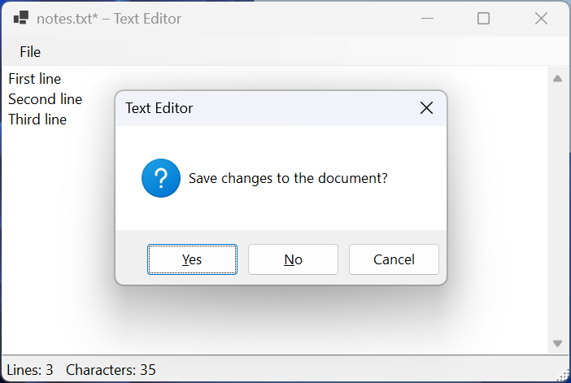
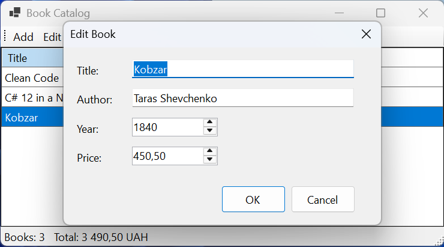

# Menus, dialogs, and tables

## Menus, toolbars, and standard dialogs

### Menus and strips

Application commands are placed in menus and on the strips from the *Menus & Toolbars* group of the *Toolbox* (<https://learn.microsoft.com/dotnet/desktop/winforms/controls/menustrip-control-overview-windows-forms>):

- `MenuStrip`—the main menu at the top of the form; its items are of type `ToolStripMenuItem` and can contain nested items (`DropDownItems`) and `ToolStripSeparator` separators;
- `ContextMenuStrip`—a context menu that appears after a right-click on a control; it is assigned with that control's `ContextMenuStrip` property;
- `ToolStrip`—a toolbar with `ToolStripButton` buttons, lists, and input fields;
- `StatusStrip`—a status bar at the bottom of the form with `ToolStripStatusLabel` labels.

Menus are created in the designer: after placing a `MenuStrip` on the form, you type item names in the *Type Here* box (Fig. 3.11). An item's `ShortcutKeys` property sets **shortcut keys** (**Ctrl+O**, **Ctrl+S**) that work without opening the menu, and `&` in the name sets an access key for keyboard navigation (*&File* opens with **Alt+F**). Menu items and toolbar buttons have a `Click` event, just like ordinary buttons, so one handler can be subscribed to both.


Figure 3.11. Creating the main menu in the designer {.caption}

### Standard dialogs

For common tasks, Windows has **standard dialog boxes**, which Windows Forms provides as components (Table 3.4). The `ShowDialog()` method shows a dialog modally and returns `DialogResult.OK` if the user confirmed the choice (<https://learn.microsoft.com/dotnet/desktop/winforms/controls/dialog-box-controls-and-components-windows-forms>).

Table 3.4. Standard dialog boxes {.caption}

| **Component** | **Purpose and result** |
| --- | --- |
| `OpenFileDialog` | choosing a file to open: `FileName`, `FileNames` (`Multiselect`), `Filter` |
| `SaveFileDialog` | choosing a file name to save to: `FileName`, `DefaultExt`, `OverwritePrompt` |
| `FolderBrowserDialog` | choosing a folder: `SelectedPath` |
| `ColorDialog` | choosing a color: `Color` |
| `FontDialog` | choosing a font: `Font` |

The `Filter` property specifies "description|pattern" pairs separated by the `|` character: `"Text files (*.txt)|*.txt|All files (*.*)|*.*"`.

### Example: a simple text editor

The `MainForm` form contains a `MenuStrip` with a *File* menu (the items *Open…* with **Ctrl+O**, *Save* with **Ctrl+S**, a separator, and *Exit*), the `editorTextBox` field (`Multiline = true`, `Dock = Fill`, `ScrollBars = Vertical`), a `StatusStrip` with the `statusLabel` label, and the `openFileDialog` and `saveFileDialog` components with a text file filter. The editor remembers the file path and whether there are unsaved changes, shows them in the window title, and shows the number of lines and characters in the status bar. For brevity, the example does not catch file read and write exceptions (`IOException`, `UnauthorizedAccessException`), which a real application shows in a `MessageBox`:

```cs
namespace TextEditor;

public partial class MainForm : Form
{
    private string? filePath;     // null – the file has not been saved yet
    private bool isModified;

    public MainForm()
    {
        InitializeComponent();
        UpdateStatus();
    }

    private void openMenuItem_Click(object sender, EventArgs e)
    {
        if (!ConfirmDiscard()
            || openFileDialog.ShowDialog(this) != DialogResult.OK)
        {
            return;
        }
        string path = openFileDialog.FileName;
        editorTextBox.Text = File.ReadAllText(path);
        filePath = path;
        isModified = false;
        UpdateStatus();
    }

    private void saveMenuItem_Click(object sender, EventArgs e) =>
        Save();

    private void exitMenuItem_Click(object sender, EventArgs e) =>
        Close();                  // FormClosing fires next

    private void editorTextBox_TextChanged(object sender, EventArgs e)
    {
        isModified = true;
        UpdateStatus();
    }

    private void MainForm_FormClosing(object sender,
        FormClosingEventArgs e)
    {
        e.Cancel = !ConfirmDiscard();
    }

    // true – we can continue: there are no changes, they were saved,
    // or the user discarded them.
    private bool ConfirmDiscard()
    {
        if (!isModified)
        {
            return true;
        }
        DialogResult answer = MessageBox.Show(
            "Save changes to the document?", "Text Editor",
            MessageBoxButtons.YesNoCancel, MessageBoxIcon.Question);
        return answer == DialogResult.No
            || answer == DialogResult.Yes && Save();
    }

    private bool Save()
    {
        if (filePath is null)
        {
            if (saveFileDialog.ShowDialog(this) != DialogResult.OK)
            {
                return false;
            }
            filePath = saveFileDialog.FileName;
        }
        File.WriteAllText(filePath, editorTextBox.Text);
        isModified = false;
        UpdateStatus();
        return true;
    }

    private void UpdateStatus()
    {
        string name = Path.GetFileName(filePath) ?? "Untitled";
        Text = $"{name}{(isModified ? "*" : "")} – Text Editor";
        statusLabel.Text = $"Lines: {editorTextBox.Lines.Length}"
            + $"   Characters: {editorTextBox.TextLength}";
    }
}
```

Assigning `editorTextBox.Text` raises the `TextChanged` event, which marks the document as modified, so the `isModified` flag is reset after the text is loaded. The *Exit* item only closes the form, and the question about saving changes is asked by the `FormClosing` handler, so it also appears after clicking the window's close button or pressing **Alt+F4**. The `Save` method asks for a file name only for a new document.

After opening a `notes.txt` file with two lines, the title reads `notes.txt – Text Editor`, and the status bar shows `Lines: 2` and `Characters: 23` (newline characters are counted too). After a third line is added, the title changes to `notes.txt* – Text Editor`. An attempt to close the window shows the question *Save changes to the document?* (Fig. 3.12): *Cancel* keeps the window open, *Yes* saves the file and closes the window, and *No* closes it without saving.



Figure 3.12. The question about saving changes in the text editor {.caption}

## Custom dialog boxes, data tables, and the timer

### Modal and modeless forms

An application can have several forms. A new form is added with the *Project → Add Form (Windows Forms)…* command and shown in one of two ways:

- `form.Show()`—**modeless**: the user can work with both windows at the same time, and the method returns control immediately;
- `form.ShowDialog(this)`—**modal**: the owner window is unavailable until the dialog is closed, and the method returns a `DialogResult`.

A modal form is closed by assigning any value except `None` to its `DialogResult` property. You can set a button's `DialogResult` property in the designer: then clicking it closes the form with this result without any code. The form's `AcceptButton` and `CancelButton` properties link buttons to the **Enter** and **Esc** keys. A form shown with the `ShowDialog` method is not disposed after closing, so it is created in a `using` statement.

Data is passed into a form through constructor parameters or properties, and back through properties or a modified object after `DialogResult.OK`. A dialog should not access the main form's controls directly: this keeps the forms independent.

### The `DataGridView` table and data binding

`DataGridView` displays data as a table. The simplest approach is to bind it to a list of objects: the table creates columns from the class's public properties itself. To update the table after the list changes, use `BindingList<T>` (the `System.ComponentModel` namespace): unlike `List<T>`, it notifies the table when items are added and removed. The intermediate `BindingSource` component tracks the current (selected) row: the `Current` and `Position` properties (<https://learn.microsoft.com/dotnet/desktop/winforms/controls/bindingsource-component-overview>).

### The timer

The `System.Windows.Forms.Timer` component raises the `Tick` event every `Interval` (in milliseconds) while its `Enabled` property is `true` (the `Start` and `Stop` methods). The `Tick` handler runs on the UI thread, so it can change the form's controls. The timer does not guarantee accuracy: if the thread is busy, the event is delayed, so time is measured with `Stopwatch` or `DateTime.Now`, and the timer only updates the display (<https://learn.microsoft.com/dotnet/api/system.windows.forms.timer>). .NET also has other `Timer` classes (`System.Timers.Timer`, `System.Threading.Timer`) that invoke the handler on another thread, so in a Windows Forms application the full name `System.Windows.Forms.Timer` avoids confusion.

### Example: a book catalog

The main form contains a `ToolStrip` with *Add* and *Edit* buttons, the `bookGrid` table (`Dock = Fill`, `ReadOnly = true`, `SelectionMode = FullRowSelect`), the `bookBindingSource` component, and a status bar with the `countLabel` label. The `BookForm` edit form has the fields `titleTextBox`, `authorTextBox`, `yearNumeric` (1450–2100), `priceNumeric` (two decimal places), the buttons `okButton` and `cancelButton` (`DialogResult = Cancel`), and an `ErrorProvider`; `AcceptButton = okButton`, `CancelButton = cancelButton`, `FormBorderStyle = FixedDialog`. The `Book` class (the `Book.cs` file) describes the data, and `BookForm` receives a book in its constructor and changes it only after *OK* is clicked:

```cs
namespace BookCatalog;

public class Book
{
    public string Title { get; set; } = "";
    public string Author { get; set; } = "";
    public int Year { get; set; }
    public decimal Price { get; set; }
}

public partial class BookForm : Form
{
    private readonly Book book;

    public BookForm(Book book)
    {
        InitializeComponent();
        this.book = book;
        Text = book.Title.Length == 0 ? "New Book" : "Edit Book";
        titleTextBox.Text = book.Title;
        authorTextBox.Text = book.Author;
        yearNumeric.Value = book.Year;
        priceNumeric.Value = book.Price;
    }

    private void okButton_Click(object sender, EventArgs e)
    {
        string title = titleTextBox.Text.Trim();
        if (title.Length == 0)
        {
            errorProvider.SetError(titleTextBox, "Enter the title");
            titleTextBox.Focus();
            return;           // the form stays open
        }
        book.Title = title;
        book.Author = authorTextBox.Text.Trim();
        book.Year = (int)yearNumeric.Value;
        book.Price = priceNumeric.Value;
        DialogResult = DialogResult.OK;  // close the modal form
    }
}
```

The main form stores books in a `BindingList<Book>` and binds the table through a `BindingSource`. The `editButton_Click` handler is subscribed both to the *Edit* button and to the table's `CellDoubleClick` event: the `DataGridViewCellEventArgs` type is a descendant of `EventArgs`, so a method with an `EventArgs` parameter works for both events. `BindingList<T>` does not know about property changes of an existing object, so after editing the table is refreshed by calling `ResetCurrentItem()`:

```cs
using System.ComponentModel;

namespace BookCatalog;

public partial class MainForm : Form
{
    private readonly BindingList<Book> books = new()
    {
        new() { Title = "Clean Code", Author = "Robert C. Martin",
                Year = 2008, Price = 890m },
        new() { Title = "C# 12 in a Nutshell",
                Author = "Joseph Albahari",
                Year = 2023, Price = 2150m }
    };

    public MainForm()
    {
        InitializeComponent();
        bookBindingSource.DataSource = books;
        bookGrid.DataSource = bookBindingSource;
        bookGrid.Columns["Price"]!.DefaultCellStyle.Format = "N2";
        books.ListChanged += (s, e) => UpdateStatus();
        UpdateStatus();
    }

    private void addButton_Click(object sender, EventArgs e)
    {
        var book = new Book { Year = DateTime.Today.Year };
        using var dialog = new BookForm(book);
        if (dialog.ShowDialog(this) == DialogResult.OK)
        {
            books.Add(book);
            bookBindingSource.Position = books.Count - 1;
        }
    }

    private void editButton_Click(object sender, EventArgs e)
    {
        if (bookBindingSource.Current is not Book book)
        {
            return;
        }
        using var dialog = new BookForm(book);
        if (dialog.ShowDialog(this) == DialogResult.OK)
        {
            bookBindingSource.ResetCurrentItem();
            UpdateStatus();
        }
    }

    private void UpdateStatus() =>
        countLabel.Text = $"Books: {books.Count}   "
            + $"Total: {books.Sum(b => b.Price):N2} UAH";
}
```

The table gets the columns *Title*, *Author*, *Year*, *Price*, and the status bar initially shows `Books: 2` and `Total: 3,040.00 UAH`. Clicking *OK* in the new book form with an empty title keeps the form open and shows an error icon. After adding the book Kobzar (Taras Shevchenko, 1840, 450.50), the status bar shows `Books: 3` and `Total: 3,490.50 UAH`; if you change the price to 520 and click *Cancel*, the data does not change, and after *OK* the table and the total are updated (`Total: 3,560.00 UAH`) (Fig. 3.13). Deleting a book is a call to `books.Remove(book)` after confirmation in a `MessageBox`.



Figure 3.13. The book catalog and the modal edit form {.caption}

## New features in .NET 9–10 and publishing

**Dark mode.** In .NET 9, Windows Forms received preview support for dark mode, and in .NET 10 the `Application.SetColorMode` method is no longer experimental. It is called in `Main` after `ApplicationConfiguration.Initialize()`. The `SystemColorMode.System` argument enables the theme chosen in Windows settings, `Dark` always uses the dark theme, and `Classic` (the default) uses the light one (<https://learn.microsoft.com/dotnet/desktop/winforms/whats-new/net100>).

**Asynchronous methods.** .NET 9 introduced the `Control.InvokeAsync`, `Form.ShowAsync`, `Form.ShowDialogAsync`, and `TaskDialog.ShowDialogAsync` methods, and in .NET 10 the methods for showing forms and dialogs are no longer experimental. They are needed when a handler performs long-running operations with `async` and `await`; they are covered in detail in Topic 5 (<https://learn.microsoft.com/dotnet/desktop/winforms/whats-new/net90>).

**Publishing.** The `dotnet publish` command prepares an application for delivery to users. A **framework-dependent** application consists of a few files but requires the *.NET Desktop Runtime* 10 to be installed. A **self-contained** application includes the runtime, so it works without installing .NET; the `PublishSingleFile` parameter bundles it into a single `.exe` file (about 110 MB for the temperature converter example) (<https://learn.microsoft.com/dotnet/core/deploying/>):

```powershell
dotnet publish -c Release
dotnet publish -c Release -r win-x64 --self-contained `
    -p:PublishSingleFile=true
```
